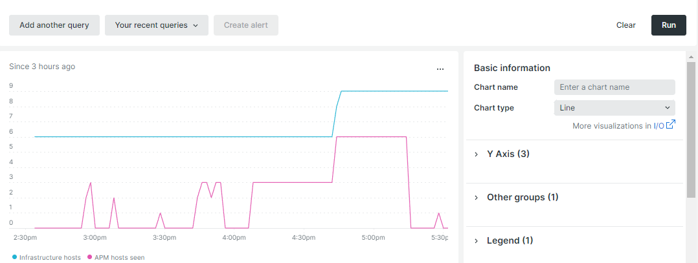

# 自動スケーリング

自動スケーリングは、最適なパフォーマンスと合理的なコストを維持するために、クラウドインフラストラクチャにリソースを自動的に追加または削除します。 Adobeでは、[!DNL Adobe Commerce on cloud infrastructure]件のプロジェクトに対して2種類の自動スケーリングを提供しています。

- [水平方向の自動スケーリング &#x200B;](#horizontal-auto-scaling) （スケーリングされたアーキテクチャでのみ使用可能） – スケーリングされたアーキテクチャプロジェクトのweb サーバーノードを追加または削除します。
- [垂直方向の自動スケーリング &#x200B;](#vertical-auto-scaling) （標準のPro アーキテクチャまたはスケーリングされたアーキテクチャで使用可能） – 既存のノードのCPU キャパシティを調整して、需要の変化に対応します。


## 自動スケーリングを有効にする

[!DNL Adobe Commerce on cloud infrastructure] プロジェクトの水平方向または垂直方向の自動スケーリングを有効または無効にするには、[Adobe Commerce サポートチケットを送信](https://experienceleague.adobe.com/en/docs/support-resources/adobe-support-tools-guide/adobe-commerce-support/adobe-commerce-help-center-user-guide#submit-ticket)。 チケットで次の理由を選択します。

- **連絡先の理由**: インフラストラクチャの変更リクエスト
- **Adobe Commerce インフラストラクチャの連絡先の理由**：その他のインフラストラクチャの変更リクエスト

>[!IMPORTANT]
>
>自動スケーリング機能は、予期せぬイベントをキャプチャします。 自動スケーリングが有効になっている場合でも、今後のイベントが予想される場合は、[Adobe Commerce サポートチケットを送信](https://experienceleague.adobe.com/en/docs/support-resources/adobe-support-tools-guide/adobe-commerce-support/adobe-commerce-help-center-user-guide#submit-ticket)に進むことをお勧めします。

### 負荷テスト

Adobeでは、最初にCloud プロジェクト _ステージング_ クラスターで自動スケーリングが有効になります。 環境で負荷テストを実行して完了すると、Adobeは実稼動クラスターで自動スケーリングを有効にします。 負荷テストに関するガイダンスについては、[&#x200B; パフォーマンステスト &#x200B;](../launch/checklist.md#performance-testing)を参照してください。

## 水平方向の自動スケーリング

現在、この機能は、[拡張アーキテクチャ &#x200B;](scaled-architecture.md)で構成されたプロジェクトでのみ使用できます。

水平方向の自動スケーリングは、スケーリングされたアーキテクチャプロジェクトのweb サーバーノードを追加または削除します。 または、[垂直自動スケーリング &#x200B;](#vertical-auto-scaling)は、需要の変化に対応するために、既存のノードのCPU キャパシティを変更します。

### Web サーバーノード

[Web層](scaled-architecture.md#web-tier)は、プロセス要求の増加と高いトラフィック要件に対応するように拡張します。 現在、自動スケーリング機能は、web サーバーノードの追加または削除によって水平方向にのみスケーリングします。

自動スケーリングイベントは、CPUの使用状況とトラフィックがあらかじめ定義されたしきい値に達したときに発生します。

- **ノードが追加されました** – すべてのアクティブなweb ノードのCPU/コアは、1分間は75%の容量で、5分間はトラフィックが20%増加しています。
- **ノードが削除されました** – すべてのアクティブなweb ノードのCPU/コアは、20分間60%で読み込まれます。 ノードは、追加された順序で削除されます。

最小値と最大値のしきい値は、各加盟店が契約しているリソース制限にもとづいて決定および設定されるので、無限に拡張できるリスクが軽減されます。

### New Relicのしきい値の監視

[New Relic サービス &#x200B;](../monitor/new-relic-service.md)を使用して、ホスト数やCPUの使用状況など、特定のしきい値を監視できます。 次のNew Relic クエリでは、例えば`cluster-id`に対してのみ変数表記を使用しています。

>[!TIP]
>
>クエリの作成に関する詳細は、_New Relic_ ドキュメントの[NRQL構文、句、関数](https://docs.newrelic.com/docs/query-your-data/nrql-new-relic-query-language/get-started/nrql-syntax-clauses-functions/)を参照してください。
>クエリを使用して、[New Relic ダッシュボード &#x200B;](https://docs.newrelic.com/docs/query-your-data/explore-query-data/dashboards/introduction-dashboards/)を作成します。

#### ホスト数

次のNew Relic クエリの例は、環境内のホスト数を示しています。

```sql
SELECT uniqueCount(SystemSample.entityId) AS 'Infrastructure hosts', uniqueCount(Transaction.host) AS 'APM hosts seen' FROM SystemSample, Transaction where (Transaction.appName = 'cluster-id_stg' AND Transaction.transactionType = 'Web') OR SystemSample.apmApplicationNames LIKE '%|cluster-id_stg|%' TIMESERIES SINCE 3 HOURS AGO
```

次のスクリーンショットでは、**APM hosts seen**&#x200B;は、選択した期間中にログに記録されたトランザクションを持つホストの数を指します。



#### CPUの利用状況

次のNew Relic クエリの例は、web ノードに対するCPUの使用状況を示しています。

```sql
SELECT average(cpuPercent) FROM SystemSample FACET hostname, apmApplicationNames WHERE instanceType LIKE 'c%' TIMESERIES SINCE 3 HOURS AGO
```


### IP許可リストに加える

自動スケーリングを有効にすると、アウトバウンド web ノードトラフィックはサービスノードのIP アドレスから送信されます。 Adobe Commerce on cloud infrastructure プロジェクトにバンドルされていないサードパーティのサービスで許可リストに加える許可リストを使用する場合は、サードパーティのサービスのIP アドレスを確認します。

例：

- 許可リストにサービスノード（1、2、3）のIP アドレスが含まれている場合、操作は必要ありません。
- 許可リストにサービスノード（1、2、3）とweb ノード（4、5、6）のIP アドレスが含まれている場合（この場合は6つのノードすべて）、アクションは必要ありません。
- Web ノード（4、5、6）のIP アドレス _only_&#x200B;が許可リストに含まれている場合は、サービスノードのIP アドレスを含めるように許可リストを更新する必要があります。

## 垂直方向の自動スケーリング

従来の[水平方向の自動スケーリング &#x200B;](#auto-scaling)に加えて、[!DNL Adobe Commerce on cloud infrastructure]では、標準のプロアーキテクチャと拡張されたアーキテクチャプロジェクトの両方に対して垂直方向の自動スケーリングも提供しています。

ノードを追加または削除する代わりに、垂直方向の自動スケーリングによって、既存のノードのCPU キャパシティがサイズ変更され、需要の変化に対応します。 これにより、水平方向の自動スケーリングが補完され、スケーラドアーキテクチャプロジェクトのweb サーバーノードが追加または削除されます。

- **ノードが追加されました**：該当しません。 垂直方向の自動スケーリングでは、新しいノードを追加するのではなく、既存のノードのサイズが変更されます。
- **ノードのアップサイズ**: メモリの負荷が定義されたしきい値を超えると、ノードは次の大きなインスタンス サイズにサイズ変更されます。 拡大/縮小イベントごとに1つのサイズの増加のみが適用されます。
- **ノードのダウンサイズ**：要求が終了すると、ノードが自動的にダウンサイズされます。 各プロジェクトの使用パターンと契約されたリソース制限にもとづいて最小と最大のサイズを設定し、不必要な拡張のリスクを低減します。

### 自動スケーリングのしきい値

垂直方向の自動スケーリングイベントは、Linux上のメモリに対する圧力停止情報（PSI）を使用してトリガーされます。この情報は、システムがメモリの圧力のために停止した時間を測定します。 Adobeでは、プロジェクトで契約されているリソース制限と使用パターンに基づいてしきい値を設定します。現在、マーチャントはしきい値を設定できません。

### New Relicのしきい値の監視

[!DNL New Relic] サービスを使用して、インスタンスのサイズとタイプを含むインフラストラクチャ インスタンスの詳細を監視できます。 垂直方向の自動スケーリングイベントがインスタンスのサイズまたはタイプを変更するたびに通知されるように、New Relicでアラートを設定します。

### 環境への影響

垂直方向の自動スケーリングは、環境に次の影響を与えます。

- **ダウンタイム**: ノードのサイズを変更しても、ダウンタイムは予測されません。
- **タイミング**：通常、ノードのサイズ変更には20 ～ 30分かかります。 サイズ変更の処理中に、ノードが一時的にロードバランサーから取り出されます。
