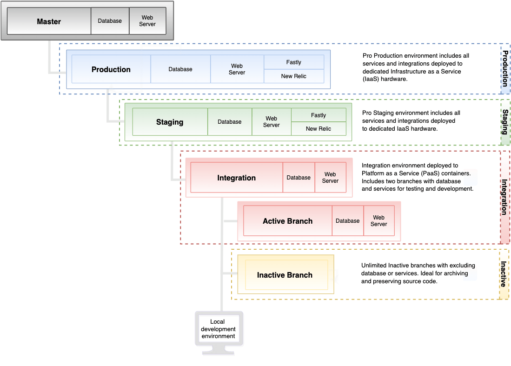
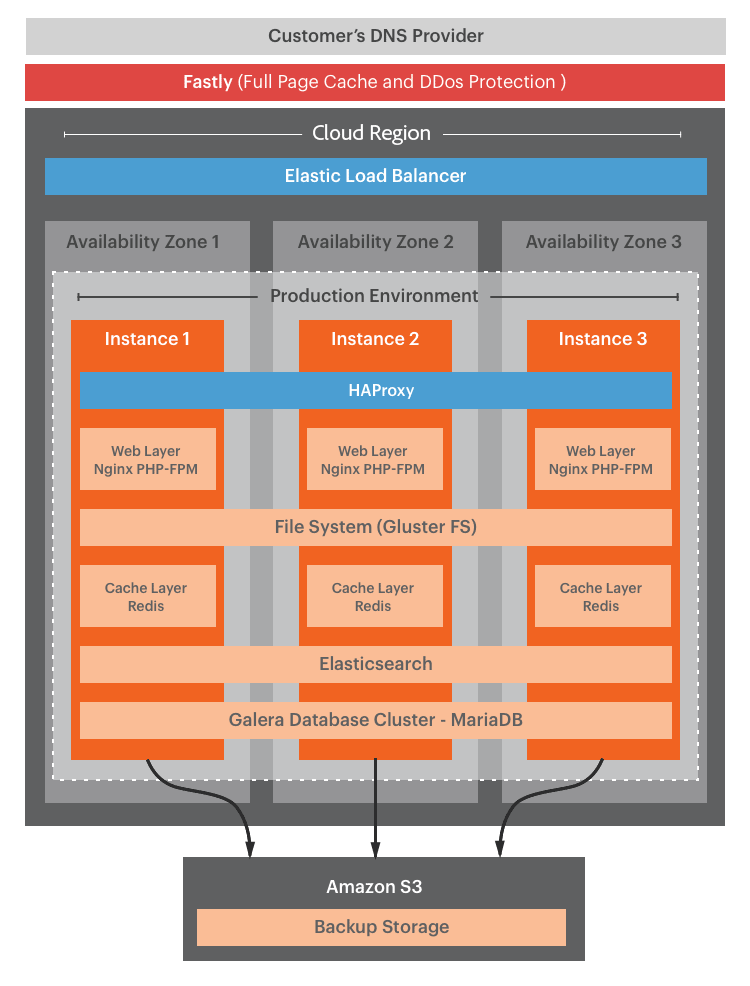

# プロアーキテクチャ

Adobe Commerce on cloud infrastructure Proのアーキテクチャは、ストアの開発、テスト、立ち上げに使用できる複数の環境をサポートしています。

- **マスター** - Platform as a Service （PaaS） コンテナにデプロイされた`master` ブランチを提供します。
- **統合** – 開発用に1つの`integration` ブランチを提供しますが、さらに1つのブランチを作成できます。 これにより、Platform as a Service （PaaS）コンテナにデプロイされる最大2つの&#x200B;_active_&#x200B;分岐が可能になります。
- **ステージング** – 専用のInfrastructure as a Service （IaaS） コンテナにデプロイされた1つの`staging` ブランチを提供します。
- **実稼動** – 専用のInfrastructure as a Service （IaaS） コンテナにデプロイされた単一の`production` ブランチを提供します。

次の表に、環境の違いをまとめました。

|                                        | 統合 | ステージング | 本番 |
| -------------------------------------- | ----------- | ----------------- | -------------------- |
| [!DNL Cloud Console]での設定管理をサポートしています | はい | 制限付き | 制限付き |
| 複数のブランチをサポート | はい | いいえ（ステージングのみ） | いいえ（実稼動のみ） |
| 設定にYAML ファイルを使用 | はい | いいえ | いいえ |
| 専用のIaaS ハードウェアで実行 | いいえ | はい | はい |
| Fastly CDNを含む | いいえ | はい | はい |
| New Relic サービスを含む | いいえ | APM | APM + NRI |
| 自動バックアップ | いいえ | はい | はい |

>[!NOTE]
>
>Adobeには、ローカルのCloud Docker環境にデプロイするためのCloud Docker for Commerce ツールが用意されています。これにより、Adobe Commerce プロジェクトを開発およびテストできます。 [Docker開発](../dev-tools/cloud-docker.md)を参照してください。

## 環境アーキテクチャ

プロジェクトは、3つのメイン環境ブランチ `integration`、`staging`、`production`を持つ単一のGit リポジトリです。 次の図は、Pro環境の階層的な関係を示しています。



### マスター環境

Pro プロジェクトでは、`master` ブランチは実稼動環境でアクティブなPaaS環境を提供します。 実稼動コードのコピーを常に`master`環境にプッシュして、サービスを中断することなく実稼動環境をデバッグできるようにします。

**注意事項：**

- `master` ブランチに基づいて&#x200B;**not** ブランチを作成します。 統合環境を使用して、開発用のアクティブなブランチを作成します。

- 開発、UAT、またはパフォーマンス テストに`master`環境を使用しないでください

### 統合環境

統合環境は、PaaSと呼ばれるサーバーのグリッド上のLinux コンテナ（LXC）で実行されます。 各環境には、サイトをテストするためのweb サーバーとデータベースが含まれています。 AWSとAzureのIP アドレスの一覧については、[地域IP アドレス ](../project/regional-ip-addresses.md)を参照してください。

**推奨されるユースケース：**

統合環境は、ステージング環境と実稼動環境に変更を移行する前に、限定的なテストと開発用に設計されています。 例えば、統合環境を使用して次のタスクを実行できます。

- 継続的インテグレーション（CI）プロセスへの変更がクラウド互換であることを確認します

- ホーム、カテゴリー、商品詳細ページ（PDP）、チェックアウト、管理者など、主要なページで重要なワークフローをテストします

統合環境で最高のパフォーマンスを発揮するには、次のベストプラクティスに従います。

- カタログサイズの制限 – 参考までに、サンプルデータには約2,048の製品が含まれています。カタログサイズを4,000～5,000個程度に減らしてみてください。
カタログ内の製品数を確認するには、次のMySQL クエリを実行します。

  ```sql
  select distinct count(entity_id) from catalog_product_entity;
  ```

- 顧客グループの数を減らします。顧客グループが多すぎると、インデックス作成のパフォーマンスと全体的なパフォーマンスに影響を与える可能性があります。

- 同時ユーザー数を1人または2人に制限

- cron ジョブを無効にし、必要に応じて手動で実行します

**注意事項：**

- FastlyのCDNおよびNew Relicサービスには、統合環境でアクセスできません

- 統合環境アーキテクチャがステージング環境と実稼動環境アーキテクチャと一致しません

- 開発テスト、パフォーマンステストまたはユーザー受け入れテスト （UAT）に`integration`環境を使用しないでください

- Adobe Commerce機能のB2B テストに`integration`環境を使用しないでください

- 統合環境のデータベースをデータベース実稼動またはステージングから復元することはできません

{{enhanced-integration-envs}}

### ステージング環境

ステージング環境では、サイトをテストするためのほぼ本番環境を提供します。 この環境は、専用のIaaS ハードウェアでホストされ、Fastly CDN、New Relic APM、検索などのすべてのサービスが含まれます。

**推奨されるユースケース：**

環境は実稼動アーキテクチャと一致し、機能を`production`環境にプッシュする前に、UAT、コンテンツのステージング、最終レビュー用に設計されています。 例えば、`staging`環境を使用して、次のタスクを完了できます。

- 本番データに対する回帰テスト

- Fastly キャッシュが有効になっているパフォーマンステスト

- 本番環境でのパッチ適用ではなく、新しいビルドのテスト

- 新しいビルドのUAT テスト

- Adobe CommerceのB2B テスト

- cron設定のカスタマイズとcron ジョブのテスト

[ デプロイメントワークフロー](pro-develop-deploy-workflow.md#deployment-workflow)および[ デプロイメントのテスト ](../test/staging-and-production.md)を参照してください。

**注意事項：**

- 実稼動サイトの起動後、ステージング環境を使用して、実稼動に不可欠なバグ修正のパッチをテストします。

- `staging` ブランチからブランチを作成することはできません。 代わりに、`integration` ブランチから`staging` ブランチにコード変更をプッシュします。

{{second-staging}}

### 本番環境

本番環境では、パブリック対応の単一およびマルチサイトのストアフロントを実行できます。 この環境は、冗長で高可用性のノードを備えた専用のIaaS ハードウェア上で動作し、顧客の継続的なアクセスとフェイルオーバー保護を実現します。 本番環境には、ステージング環境のすべてのサービスに加えて、[New Relic Infrastructure （NRI） ](../monitor/new-relic-service.md#new-relic-infrastructure) サービスが含まれます。このサービスは、アプリケーションデータとパフォーマンス分析に自動的に接続して、動的なサーバーモニタリングを提供します。

**ご注意：**

`production` ブランチからブランチを作成することはできません。 代わりに、`staging` ブランチから`production` ブランチにコード変更をプッシュします。

### 制作テクノロジースタック

実稼動環境には、VMごとにHAProxyで管理されるElastic Load Balancerの背後に3つの仮想マシン（VM）があります。 各VMには、次のテクノロジーが含まれています。

- **Fastly CDN** - HTTP キャッシュとCDN

- **NGINX** - PHP-FPMを使用するweb サーバー、複数のワーカーを持つ1つのインスタンス

- **GlusterFS** – すべての静的ファイルのデプロイと4つのディレクトリマウントとの同期を管理するファイルサーバー：

   - `var`
   - `pub/media`
   - `pub/static`
   - `app/etc`

- **Redis** - 1つのアクティブなサーバーと、他の2つのサーバーのみをレプリカとして使用するVMごとに1台のサーバー

- **Elasticsearch**：クラウドインフラストラクチャ 2.2から2.4.3-p2でAdobe Commerceを検索

- **OpenSearch**：クラウドインフラストラクチャ 2.3.7-p3、2.4.3-p2、2.4.4以降でAdobe Commerceを検索します

- **Galera**：ノードごとに1つのMariaDB MySQL データベースを持つデータベースクラスターで、各データベースの一意のIDに対して3つの自動増分設定が設定されている

次の図は、実稼動環境で使用されるテクノロジーを示しています。



## 冗長ハードウェア

従来のアクティブパッシブ `master`またはプライマリセカンダリ設定を実行するのではなく、Adobe Commerce on cloud infrastructureは&#x200B;_冗長アーキテクチャ_&#x200B;を実行します。このアーキテクチャでは、3つのインスタンスすべてが読み取りと書き込みを受け付けます。 このアーキテクチャにより、拡張の際のダウンタイムがゼロになり、トランザクションの整合性が保証されます。

冗長なハードウェアを備えたAdobeは、3台のゲートウェイサーバーを提供します。 ほとんどの外部サービスでは、複数のIP アドレスを許可リストに追加できるので、複数の固定IP アドレスを持つことは問題ありません。 3つのゲートウェイは、実稼動環境クラスター内の3つのサーバーにマッピングされ、静的IP アドレスを保持します。 それは完全に冗長で、あらゆるレベルで高可用性を備えています。

- DNS
- コンテンツ配信ネットワーク（CDN）
- Elastic Load Balancer （ELB）
- データベースとweb サーバーを含むすべてのAdobe Commerce サービスを含む3つのサーバークラスター

## バックアップと災害復旧

Adobe Commerce オンクラウド基盤では、各Pro プロジェクトを3つの個別のAWSまたはAzure アベイラビリティゾーン（各ゾーンに個別のデータセンターを備える）に複製する高可用性アーキテクチャを使用します。 この冗長性に加えて、プロステージング環境と実稼動環境には、_致命的な障害_&#x200B;の場合に使用するように設計された、定期的なライブバックアップが提供されます。

**自動バックアップ**&#x200B;には、MySQL データベースやマウントされたボリュームに保存されているファイルなど、実行中のすべてのサービスからの永続的なデータが含まれます。 バックアップは、本番環境と同じ地域の暗号化されたElastic Block Storage （EBS）に保存されます。 自動バックアップは別のシステムに保存されているため、一般にアクセスできません。

>[!NOTE]
>
>マウントされたボリュームには、[書き込み可能なマウント ](https://experienceleague.adobe.com/en/docs/commerce-on-cloud/user-guide/configure/app/properties/properties#mounts)のみが含まれます。また、`app/` ディレクトリの一部も含まれません。 他のファイルについては、[ ビルドおよびデプロイメントプロセス ](https://experienceleague.adobe.com/en/docs/commerce-on-cloud/user-guide/architecture/pro-develop-deploy-workflow#deployment-workflow)によって作成/生成され、残りのファイルについてもGit リポジトリを確認する必要があります。

{{pro-backups}}

CLI コマンドを使用して、ステージング環境および実稼動環境用のデータベースの&#x200B;**手動バックアップ**&#x200B;を作成できます。 [ データベースのバックアップ ](../storage/database-dump.md)を参照してください。 `integration`環境の場合、Adobeでは、Adobe Commerce on cloud infrastructure プロジェクトにアクセスした後、大きな変更を適用する前の最初の手順として、バックアップを作成することをお勧めします。 [ バックアップ管理](../storage/snapshots.md)を参照してください。

### リカバリーポイントの目標

Adobe カスタマーサクセスマネージャーに問い合わせて、Recovery Point Objectiveの前回のバックアップ時間の詳細を確認します。 バックアップの頻度は、プランのバックアップスケジュールと、ストレージサービスに書き込む変更の量によって異なります。

### 維持ポリシー

Adobeは、次のデータ保持ポリシーに従って自動バックアップを保持します。

| 期間 | バックアップ保持ポリシー |
| ------------------ | ----------------------- |
| Day 1 ～ 3 | 1時間に1回のバックアップ |
| 4日目から7日目 | 1日に1回のバックアップ |
| 2週目から6週目 | 週に1回のバックアップ |
| 8週目から12週目 | 1週間に1回のバックアップ |
| 3 ～ 5か月 | 月に1回のバックアップ |

このポリシーは、クラウドインフラストラクチャのプランによって異なる場合があります。

### 目標復旧時間

RTOはストレージのサイズによって異なります。 大きなEBS ボリュームの場合、復元に時間がかかります。 復元時間は、データベースのサイズによって異なる場合があります。 詳しくは、Adobe カスタマーサクセスマネージャーにお問い合わせください。

## プロクラスターの拡大・縮小

Pro クラスターのサイズと&#x200B;_compute_&#x200B;の設定は、選択したクラウドプロバイダー（AWS、Azure）、リージョン、およびサービスの依存関係によって異なります。 Adobeのクラウドインフラストラクチャは、Pro クラスターを拡張して、需要の変化に応じたトラフィックの期待やサービス要件に対応できます。

冗長なアーキテクチャにより、Adobeのクラウドインフラストラクチャは、ダウンタイムなしでアップグレードできます。 アップスケーリングの場合、3つのインスタンスのそれぞれは、サイトの操作に影響を与えることなく、容量をアップグレードするために回転します。 例えば、制約がデータベースレベルではなくPHP レベルにある場合は、既存のクラスターに追加のweb サーバーを追加できます。 これにより、_水平方向のスケーリング_&#x200B;が提供され、データベースレベルの余分なCPUによって提供される垂直方向のスケーリングを補完します。 [拡張アーキテクチャ ](scaled-architecture.md)を参照してください。

イベントやその他の理由でトラフィックが大幅に増加すると予想される場合は、一時的なキャパシティの増加をリクエストできます。 _Commerce ヘルプセンター_&#x200B;の[一時的なアップサイズをリクエストする方法](https://experienceleague.adobe.com/docs/commerce-knowledge-base/kb/how-to/how-to-request-temporary-magento-upsize.html)を参照してください。
