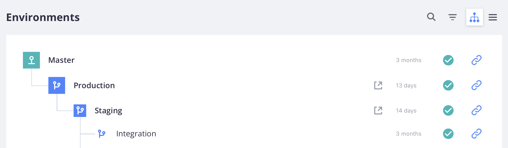
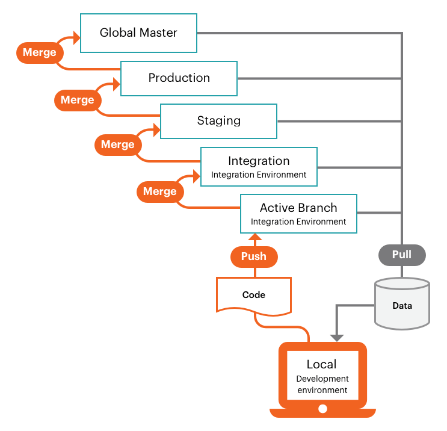

# プロのプロジェクトワークフロー

Pro プロジェクトには、グローバル `master` ブランチと3つの主要な環境を持つ単一のGit リポジトリが含まれます。

1. ライブサイトの起動とメンテナンスを行うための&#x200B;**実稼動**&#x200B;環境
1. すべてのサービスをテストする&#x200B;**ステージング**&#x200B;環境
1. 開発とテスト用の&#x200B;**統合**&#x200B;環境



これらの環境は`read-only`で、ローカル ワークスペースからのみプッシュされたブランチからのデプロイされたコード変更を受け付けています。

次の図は、シンプルなGit分岐アプローチを使用したPro開発およびデプロイワークフローを示しています。 `integration`環境に基づくアクティブなブランチを使用して[develop](#development-workflow) コードを作成し、_プッシュ_&#x200B;および&#x200B;_リモートのアクティブなブランチとの間で_ コードの変更を取り込みます。 確認されたコードをデプロイするには、_リモートブランチを_ ベースブランチに結合し、その環境に対して[&#x200B; ビルドとデプロイ &#x200B;](#deployment-workflow)の自動プロセスをアクティブにします。



環境は読み取り専用であるため、Cloud環境で直接コードを変更することはできません。 `composer install`を実行してモジュールをインストールしようとすると、次のようなエラーが発生します。

```bash
file_put_contents(...): Failed to open stream: Read-only file system  
The disk hosting /app/<cluster_ID> is full
```

>[!NOTE]
>
>どのPro環境でも、読み取り専用フォルダーの権限を変更することはできません。 この制限は、アプリケーションの整合性とセキュリティを保護します。 これらの読み取り専用ファイルシステムのフォルダー権限は変更できません。サポートでも変更できません。 変更は、アプリケーション環境のブランチから行い、ローカル開発環境にプッシュする必要があります。 詳しくは、「[Pro アーキテクチャ &#x200B;](pro-architecture.md) Pro環境の概要」を参照し、プロジェクトビューのPro環境リストの概要については「[[!DNL Cloud Console]](../project/overview.md#cloud-console)」を参照してください。

## 開発ワークフロー

統合環境は、Adobe Commerce on cloud インフラストラクチャコードを含む1つのベース `integration` ブランチを提供します。 アクティブな環境ブランチをさらに1つ作成できます。 これにより、最大2つのアクティブなブランチをPlatform as a Service （PaaS）コンテナにデプロイできます。 非アクティブな環境の数に制限はありませんが、非アクティブな環境が多ければ多いほど、Cloud Consoleの読み込みに時間がかかります。

{{enhanced-integration-envs}}

プロジェクト環境は、柔軟で継続的な統合プロセスをサポートします。 まず、`integration` ブランチをローカル プロジェクト フォルダーに複製します。 ブランチまたは複数のブランチの作成、新機能の開発、変更の設定、拡張機能の追加、更新のデプロイを行います。

- `integration`から&#x200B;**変更**&#x200B;を取得

- `integration`からの&#x200B;**分岐**

- ローカル ワークステーションの&#x200B;**現像** コード （更新[!DNL Composer]を含む）

- **リモートに**&#x200B;件のコード変更をプッシュして検証する

- **結合**&#x200B;から`integration`を行い、テストする

開発されたコードブランチと対応する設定ファイルを使用すると、コードの変更をより包括的なテストのために`integration` ブランチにマージする準備が整います。 `integration`環境は次の場合にも最適です。

- **サードパーティ サービスの統合** - PaaS環境ですべてのサービスを利用できるわけではありません。

- **構成管理ファイルの生成** – 一部の構成設定は、デプロイされた環境の&#x200B;_読み取り専用_&#x200B;です。

- **ストアの設定** – 統合環境を使用してすべてのストア設定を完全に設定する必要があります。 **ストア管理者URL**&#x200B;は、_[!DNL Cloud Console]_&#x200B;の_&#x200B;統合&#x200B;_環境ビューにあります。

## デプロイメントワークフロー

ローカル ワークステーションからリモート環境にコードをプッシュしたり、コードを環境ブランチにマージしたりするたびに、ビルドおよびデプロイ スクリプトによって新しいコードが生成され、設定されたサービスがリモート環境にプロビジョニングされます。

スクリプトアクションを作成：

- ビルド中もターゲット環境のサイトが引き続き実行されます

- クラウドインフラストラクチャのパッチとホットフィックスに対するAdobe Commerceの確認と実行

- ビルドとデプロイのログを使用してコードをコンパイル

- 構成管理を確認してください。このフェーズでは、静的コンテンツのデプロイメントが発生します

- 変更されていないコードのスラグを作成または使用して、プロセスを高速化します

- すべてのバックエンドサービスとアプリケーションのプロビジョニング

スクリプトアクションをデプロイ：

- サイトをターゲット環境に&#x200B;_メンテナンス_ モードで配置します

- ビルド中に完了しない場合は、静的コンテンツをデプロイします

- クラウドインフラストラクチャへのAdobe Commerceのインストールまたは更新

- トラフィックのルーティングの設定

ビルドとデプロイのプロセスが完了すると、最新のコード変更と設定を使用してストアがオンラインになります。 [&#x200B; デプロイメントプロセス &#x200B;](../deploy/process.md)を参照してください。

### 統合に統合

アクティブな開発ブランチをベース `integration` ブランチに結合することで、検証済みのすべてのコード変更を組み合わせます。 ステージング環境に変更を昇格する前に、`integration` ブランチですべての変更をテストできます。

### ステージングに統合

ステージングは、すべてのサービスと設定を可能な限り実稼動環境に近い状態で提供するプリプロダクション環境です。 すべてのサービスで詳細なテストを実行できるように、コードの変更を常に`integration`環境から`staging`環境にプッシュしてください。 ステージング環境を初めて使用する場合は、[Fastly CDN](../cdn/fastly.md)や[New Relic](../monitor/new-relic-service.md)などのサービスを設定する必要があります。 サンドボックスやテスト用の資格情報を使用して、支払いゲートウェイ、配送、通知などの重要なサービスを設定できます。

ストアの本番環境の準備が整ったと感じるまで、すべてのサービスを徹底的にテストし、パフォーマンステストツールを検証し、管理者として顧客としてUAT テストを実行することをお勧めします。 [&#x200B; ストアのデプロイ &#x200B;](../deploy/staging-production.md)を参照してください。

{{second-staging}}

### 実稼動環境に統合

ステージング環境で徹底的にテストした後、実稼動環境にマージし、ライブ資格情報を使用して徹底的にテストします。 本番サイトを立ち上げた瞬間に、顧客は購入を完了でき、管理者はライブストアを管理できる必要があります。 ストアのデプロイと公開時の詳しい手順について詳しくは、次のトピックを参照してください。

- [ストアのデプロイ](../deploy/staging-production.md)
- [サイトの起動](../launch/overview.md)

### グローバルマスターに統合

サービスを中断することなく実稼動環境をデバッグする緊急の必要がある場合に備えて、実稼動コードのコピーを常にグローバル `master`にプッシュします。

グローバル `master`からブランチを&#x200B;**not**&#x200B;作成します。 `integration` ブランチを使用して、開発と修正のための新しいアクティブなブランチを作成します。
