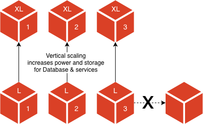

# 拡張されたアーキテクチャ

クラウドインフラストラクチャは、リソース要件に応じて拡張し、効率を高めます。 クラウドインフラストラクチャー上のAdobe Commerceは、アプリケーションを監視し、処理能力を調整して、安定した予測可能なパフォーマンスを維持できます。 このアーキテクチャに変換すると、待ち時間やトラフィックの大きなスパイクなどの問題を軽減できます。

>[!NOTE]
>
>拡張アーキテクチャは、Pro 48 クラスター以降のクラウドインフラストラクチャアカウント上のAdobe Commerceで使用できます。

## 分割層アーキテクチャ

従来、Pro アーキテクチャは 3 つのノードで構成され、各ノードには完全な技術スタックが含まれていました。 現在、6 つ以上のノードを持つ階層型アーキテクチャを提供する、拡張性の高いインフラストラクチャが存在します。つまり、コア・データベースおよびサービス用に 3 つのノード、Web サーバ用に 3 つのノードです。 このスプリット階層アーキテクチャでは、最適なパフォーマンス・バランスを実現するために個別に階層を拡張する機能が提供されます。

### サービス層

データストレージ、キャッシュ、サービスには、**OpenSearch** または **Elasticsearch**、**MariaDB**、**Redis** などの 3 つのサービスノードがあります。 サービス層が処理能力に近づいた場合、拡張する唯一の方法は、CPUの電力やメモリを増やすなど、サーバーのサイズを大きくすることです。 処理能力は、使用できるノードのサイズによって制限されます。 データベースクラスターは高可用性を実現するように設計されているので、使用されるテクノロジーでは、信頼性の高い方法で水平方向にスケールすることはできません。



サービスノードインスタンスタイプが _m5.2xlarge で_ RAM が 32 Gb の場合を考えてみましょう。 データベースなどのサービスは、かなりの量のメモリ（30 Gb）を使用します。 次に利用可能なインスタンスサイズ _m5.4xlarge_ に拡張すると、64-Gb RAM が提供されます。これにより、メモリが 2 倍になり、データベースの増大するニーズに対応できます。

ノードタイプに基づいてトラフィックをルーティングすることで、サービス層のパフォーマンスをさらに最適化できます。 デフォルトでは、データベースノードは web トラフィックから分離されています。 例えば、データベースノードで web トラフィックを提供するように選択できます。

### Web 層

リクエストとウェブトラフィックを処理するウェブノードには、**php-fpm** と **NGINX** の 3 つがあります。 Web 層は、電力とメモリを増大させることで垂直方向のスケーリングに加えて、PHP レベルで縮小した場合に既存のクラスタに Web サーバを追加することで水平方向のスケーリングが可能です。 Web ノードの自動スケーリング方法については、[&#x200B; 自動スケーリング &#x200B;](autoscaling.md) を参照してください。


これは、サービス層が提供する垂直方向のスケーリングを補完するものです。 サービス層のサイズと電力は、増大するデータベースとサービスの使用に対応して拡張されるため、Web 層のサイズ、電力、インスタンスは、プロセス・リクエストの増加やトラフィック要件の増加に対応して拡張されます。

Web ノードインスタンスタイプが _C5.2xlarge で、CPU が 8 個で RAM が 16-Gb_ という例を考えてみましょう。 サイトへのリクエスト数が大幅に増加しました。 C5.2xlarge ノードを追加して php-fpm プロセスの増加に対処することも、16 のCPUと 32-Gb RAM _を使用して各インスタンスタイプを_ C5.4xlarge に変更することもできます。 ノードを追加すると、サージ容量が不十分になるリスクが軽減されます。

## プロジェクト構造

最小で、Scaled アーキテクチャを使用する Pro プロジェクトでは、6 つのノードを使用できます。

- 3 つの Web ノード c5.2xlarge （8 つのCPU、16 Gb RAM）

- m5.2xlarge サービスノード x 3 （CPU x 8、32 Gb RAM）

ただし、各プロジェクトは固有であり、リソース管理を適切に分析するためのパフォーマンス監視が必要です。 各アカウントには、[&#128279;](../monitor/new-relic-service.md)0&rbrace;New Relic サービス &rbrace; が含まれます。このサービスは、アプリケーションデータおよび Performance Analytics と自動的に接続され、動的なサーバー監視を提供します。 特に、New Relic サービスを使用して、CPUと RAM の使用率を監視し、追加のリソースが必要なノードを判断できます。 リソースが処理能力に達するか、分析に基づくパフォーマンスの低下に気付いた場合、リクエストを作成して、需要に合わせてインフラストラクチャを拡張できます。

### SSH アクセス

`/app/<project-id>/var/log` ディレクトリなどの特定のファイルとログは、ノード間で共有されません。 各ノードには一意の SSH アクセス権があります。 `magento-cloud` CLI を使用してサービスや Web ノードにログインすることはできませんが、[!DNL Cloud Console] の SSH アクセスリストにノードアドレスが表示されます。

```bash
ssh <node>.<project-ID>-<environment>-<user-ID>@ssh.<region>.magento.com
```

- `node` 1 ～ 3 - サービス ノードにアクセスするアドレス

- `node` 4 ～ _n_ - Web ノードにアクセスするアドレス

>[!TIP]
>
>ログインしたら、サーバー ID と役割を確認できます。サービスノードでは _unified_ 役割を使用し、web ノードでは _web_ 役割を使用します。

**サービスノード** にログインしたときの応答の例には、_unified_ の役割が含まれます。

```
 __  __                   _          ___ _             _
|  \/  |__ _ __ _ ___ _ _| |_ ___   / __| |___ _  _ __| |
| |\/| / _` / _` / -_) ' \  _/ _ \ | (__| / _ \ || / _` |
|_|  |_\__,_\__, \___|_||_\__\___/  \___|_\___/\_,_\__,_|
            |___/

 Welcome to Magento Cloud.

 This is server unique-server-id, role project-id:unified.

project-id@server-id:~$
```

**web ノード** にログインしたときの応答の例には、_web_ の役割が含まれます。

```
 __  __                   _          ___ _             _
|  \/  |__ _ __ _ ___ _ _| |_ ___   / __| |___ _  _ __| |
| |\/| / _` / _` / -_) ' \  _/ _ \ | (__| / _ \ || / _` |
|_|  |_\__,_\__, \___|_||_\__\___/  \___|_\___/\_,_\__,_|
            |___/

 Welcome to Magento Cloud.

 This is server unique-server-id, role project-id:web.

project-id@server-id:~$
```

### ログの場所

ログの場所は、ノードによって若干異なります。 例えば、**MySQL エラーログ** などのデータベースログは、サービスノード（`/var/log/mysql/mysql-error.log`）では使用できますが、web ノードでは使用できません。

各 Pro アカウントには、アプリケーションのログデータと自動的に接続して動的なログ管理を提供する [&#128279;](../monitor/new-relic-service.md)0&rbrace;New Relic ログサービス &rbrace; が含まれています。 すべてのノードからの集計ログデータがNew Relicのログアプリケーションに表示されるので、1 つのダッシュボードから特定のノードのパフォーマンスの問題をトラブルシューティングできます。
