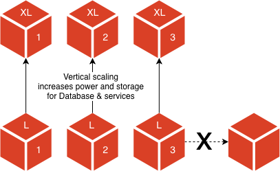
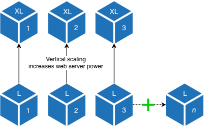

# 拡張されたアーキテクチャ

クラウド基盤は、リソース要件に応じて拡大できるため、効率性が向上します。 Adobe Commerce on cloud インフラストラクチャは、アプリケーションを監視し、安定して予測可能なパフォーマンスを維持するために容量を調整することができます。 このアーキテクチャに変換すると、遅延やトラフィックの大幅な増加などの問題を軽減するのに役立ちます。

>[!NOTE]
>
>拡張されたアーキテクチャは、Pro 48 クラスター以上のAdobe Commerce オンクラウドインフラストラクチャアカウントで使用できます。

## 分割階層アーキテクチャ

従来、Pro アーキテクチャは3つのノードで構成され、それぞれに完全なテクノロジースタックが含まれていました。 現在では、最低6つのノードを持つ階層化されたアーキテクチャを提供するスケーラブルなインフラストラクチャが存在します。つまり、コアデータベースとサービス用の3つのノードとweb サーバー用の3つのノードです。 このスプリットティアアーキテクチャでは、最適なパフォーマンスバランスを実現するために、階層を個別に拡張できます。

### サービス層

データストレージ、キャッシュ、およびサービスには3つのサービスノードがあります。**OpenSearch**&#x200B;または&#x200B;**Elasticsearch**、**MariaDB**、**Redis**&#x200B;など。 サービス層がキャパシティに近づくと、拡張する唯一の方法は、CPUのパワーとメモリを増やすなど、サーバーサイズを増やすことです。 キャパシティは、使用可能なノードのサイズに制限されます。 データベースクラスターは高可用性を目的として設計されているため、使用するテクノロジーを使用して信頼性の高い方法で水平方向に拡張することはできません。



サービスノードインスタンスのタイプが32 Gb RAMを搭載した&#x200B;_m5.2xlarge_&#x200B;である例を考えてみましょう。 データベースのようなサービスは、かなりの量のメモリ（30 Gb）を使用します。 次の使用可能なインスタンスサイズ _m5.4xlarge_&#x200B;に拡張すると、64 Gb RAMが提供され、メモリが2倍になり、データベースのニーズの増加に対応できます。

ノードタイプに基づいてトラフィックをルーティングすることで、サービス層のパフォーマンスをさらに最適化できます。 デフォルトでは、データベースノードはweb トラフィックから分離されます。 例えば、データベースノードでweb トラフィックを提供するように選択できます。

### web層

リクエストとweb トラフィックを処理するためのweb ノードは3つあります。**php-fpm**&#x200B;と&#x200B;**NGINX**。 電力とメモリを増やすことによる垂直方向のスケーリングに加えて、web層は、PHP レベルで制約されたときに既存のクラスターにweb サーバーを追加することで水平方向にスケーリングできます。 Web ノードの自動スケーリング方法については、[自動スケーリング &#x200B;](autoscaling.md)を参照してください。



これにより、サービス層が提供する垂直方向の拡張が補完されます。 データベースやサービスの利用状況の増加に対応するために、サービス層の規模と処理能力が拡大するにつれ、web層の規模、処理能力、インスタンスの規模が拡大し、プロセスリクエストの増加やトラフィック要件の高まりに対応できるようになります。

Web ノードインスタンスの種類が&#x200B;_C5.2xlargeで、CPUが8台、RAMが16 Gb_&#x200B;である例を考えてみましょう。 サイトへのリクエスト数が大幅に増加しました。 C5.2xlarge ノードを追加してphp-fpm プロセスの増加を処理するか、16 CPUと32 Gb RAM _で各インスタンスタイプを_ C5.4xlargeに変更できます。 ノードを追加すると、サージキャパシティが不十分になるリスクが軽減されます。

## プロジェクト構造

最小で、Scaled アーキテクチャを持つPro プロジェクトには6つのノードが利用可能です。

- 3 web ノード c5.2xlarge （8 CPU、16 Gb RAM）

- 3つのサービスノード m5.2xlarge （8 CPU、32 Gb RAM）

ただし、プロジェクトごとに独自性があるため、リソース管理を適切に分析するには、パフォーマンスの監視が必要です。 各アカウントには[New Relic サービス &#x200B;](../monitor/new-relic-service.md)が含まれており、アプリケーションデータとパフォーマンス分析に自動的に接続して、動的なサーバーモニタリングを提供します。 具体的には、New Relic サービスを使用して、CPUとRAMの使用率を監視し、追加リソースが必要なノードを判断できます。 リソースがキャパシティに達するか、分析に基づいてパフォーマンスが低下した場合、需要に応じてインフラストラクチャを拡張するためのリクエストを作成できます。

### SSH アクセス

`/app/<project-id>/var/log` ディレクトリなどの特定のファイルとログは、ノード間で共有されません。 各ノードには一意のSSH アクセスがあります。 `magento-cloud` CLIを使用してサービスまたはweb ノードにログインすることはできませんが、[!DNL Cloud Console]のSSH アクセス リストにノードアドレスがあります。

```bash
ssh <node>.<project-ID>-<environment>-<user-ID>@ssh.<region>.magento.com
```

- `node` 1 ～ 3 - サービスノードにアクセスするためのアドレス

- `node` 4 ～ _n_ - Web ノードにアクセスするためのアドレス

>[!TIP]
>
>ログイン後、サーバーIDと役割を確認できます。サービスノードは&#x200B;_統合_&#x200B;役割を使用し、web ノードは&#x200B;_web_&#x200B;役割を使用します。

**サービスノード**&#x200B;にログインする際の応答の例には、_統合_&#x200B;の役割が含まれています。

```
 __  __                   _          ___ _             _
|  \/  |__ _ __ _ ___ _ _| |_ ___   / __| |___ _  _ __| |
| |\/| / _` / _` / -_) ' \  _/ _ \ | (__| / _ \ || / _` |
|_|  |_\__,_\__, \___|_||_\__\___/  \___|_\___/\_,_\__,_|
            |___/

 Welcome to Magento Cloud.

 This is server unique-server-id, role project-id:unified.

project-id@server-id:~$
```

**web ノード**&#x200B;にログインする際の応答の例には、_web_&#x200B;の役割が含まれています。

```
 __  __                   _          ___ _             _
|  \/  |__ _ __ _ ___ _ _| |_ ___   / __| |___ _  _ __| |
| |\/| / _` / _` / -_) ' \  _/ _ \ | (__| / _ \ || / _` |
|_|  |_\__,_\__, \___|_||_\__\___/  \___|_\___/\_,_\__,_|
            |___/

 Welcome to Magento Cloud.

 This is server unique-server-id, role project-id:web.

project-id@server-id:~$
```

### ログの場所

ログの場所は、ノードによって少し異なります。 例えば、**MySQL エラーログ**&#x200B;などのデータベースログは、サービスノード（`/var/log/mysql/mysql-error.log`）では利用できますが、web ノードでは利用できません。

各Pro アカウントには、[New Relic Logs サービス &#x200B;](../monitor/new-relic-service.md)が含まれており、このサービスはアプリケーションのログデータと自動的に接続して、動的なログ管理を提供します。 すべてのノードから集約されたログデータは、New Relic Logs アプリケーションに表示されるため、1つのダッシュボードから特定のノードのパフォーマンスの問題をトラブルシューティングできます。

