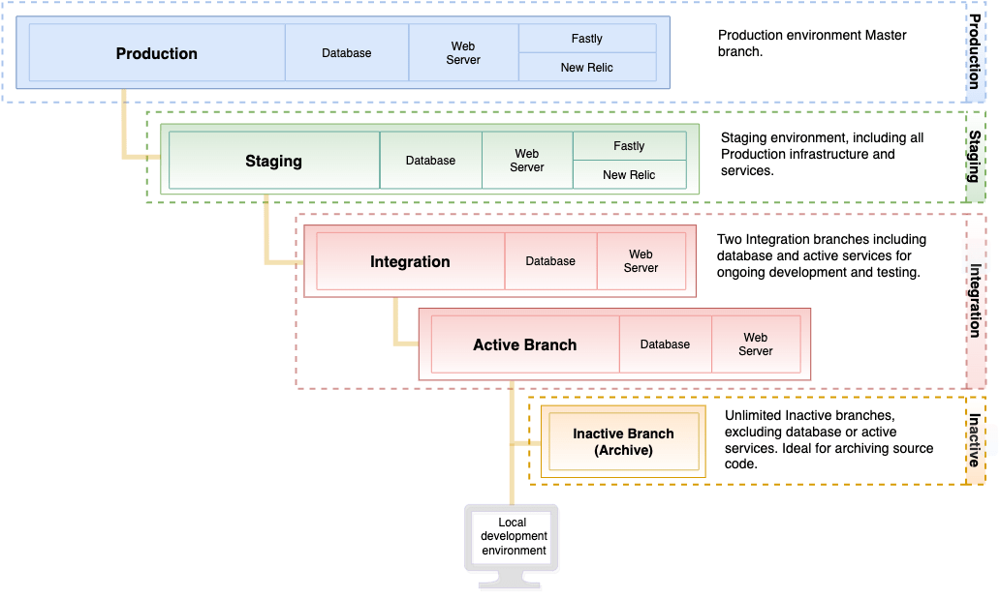

# スターターアーキテクチャ

Adobe Commerce on cloud infrastructure スターターアーキテクチャでは、初期プロジェクトコード、ステージング環境、および最大2つの統合環境を含む`master`環境を含む、最大&#x200B;**4**&#x200B;環境をサポートします。

すべての環境はPaaS （Platform as a Service）コンテナ内にあります。 これらのコンテナは、サーバーのグリッド上の非常に制限されたコンテナ内にデプロイされます。 これらの環境は読み取り専用で、ローカルワークスペースからプッシュされたブランチからデプロイされたコード変更を受け入れます。 各環境には、データベースとweb サーバーが用意されています。

>[!NOTE]
>
>どのスターター環境でも、読み取り専用フォルダーの権限を変更することはできません。 この制限は、アプリケーションの整合性とセキュリティを保護します。 これらの読み取り専用ファイルシステムのフォルダー権限は変更できません。サポートでも変更できません。 変更は、アプリケーション環境のブランチから行い、ローカル開発環境にプッシュする必要があります。 任意の開発および分岐手法を使用できます。 プロジェクトへの初期アクセスを取得したら、`master`環境から`staging`環境を作成します。 次に、`staging`から分岐して`integration`環境を作成します。

## スターター環境のアーキテクチャ

次の図は、スターター環境の階層関係を示しています。



## 本番環境

実稼動環境は、Adobe Commerceをパブリッシュ対応の単一およびマルチサイトストアフロントを実行するクラウドインフラストラクチャにデプロイするためのソースコードを提供します。 実稼動環境では、`master` ブランチのコードを使用して、web サーバー、データベース、設定済みサービス、およびアプリケーションコードを設定および有効にします。

`production`環境は読み取り専用なので、`integration`環境を使用してコードを変更し、`integration`から`staging`までのアーキテクチャ全体にデプロイし、最後に`production`環境にデプロイします。 [ ストアのデプロイ ](../deploy/staging-production.md)および[ サイトの立ち上げ](../launch/overview.md)を参照してください。

Adobeでは、`production`環境にデプロイされる`master` ブランチにプッシュする前に、`staging` ブランチで完全にテストすることをお勧めします。

## ステージング環境

Adobeでは、`master`から`staging`という名前のブランチを作成することをお勧めします。 `staging` ブランチは、コードをステージング環境にデプロイして、コード、モジュールと拡張機能、支払いゲートウェイ、配送、製品データなどをテストするための実稼働前の環境を提供します。 この環境では、Fastly、New Relic APM、検索など、実稼動環境に一致するすべてのサービスの設定が提供されます。

このガイドの追加セクションでは、最終的なコードのデプロイと、セキュアなステージング環境での実稼動レベルのインタラクションのテストについて説明します。 最高のパフォーマンスと機能テストを実行するには、データベースをステージング環境にレプリケートします。

>[!WARNING]
>
>Adobeでは、実稼動環境にデプロイする前に、ステージング環境のすべてのマーチャントと顧客のインタラクションをテストすることをお勧めします。 [ ストアのデプロイ ](../deploy/staging-production.md)および[ デプロイメントのテスト ](../test/staging-and-production.md)を参照してください。

## 統合環境

開発者は、`integration`環境を使用して、開発、デプロイ、およびテストを行います。

- Adobe Commerce アプリケーションコード

- カスタムコード

- 拡張機能

- サービス

**推奨されるユースケース：**

統合環境は、限定的なテストと開発のために設計されています。 例えば、統合環境を使用して次のタスクを実行できます。

- 継続的インテグレーション（CI）プロセスへの変更がクラウド互換であることを確認します

- ホーム、カテゴリー、商品詳細ページ（PDP）、チェックアウト、管理者など、主要なページで重要なワークフローをテストします

統合環境で最高のパフォーマンスを発揮するには、次のベストプラクティスに従います。

- カタログサイズの制限 – 参考までに、サンプルデータには約2,048の製品が含まれています。カタログサイズを4,000～5,000個程度に減らしてみてください。
カタログ内の製品数を確認するには、次のMySQL クエリを実行します。

  ```sql
  select distinct count(entity_id) from catalog_product_entity;
  ```

- 顧客グループの数を減らします。顧客グループが多すぎると、インデックス作成のパフォーマンスと全体的なパフォーマンスに影響を与える可能性があります。

- 同時ユーザー数を1人または2人に制限

- cron ジョブを無効にし、必要に応じて手動で実行します

アクティブな統合環境は、最大&#x200B;**2**&#x200B;個まで設定できます。 統合環境を作成するには、`staging` ブランチからブランチを作成します。 統合環境を作成する場合、環境名はブランチ名と一致します。 統合環境は、ウェブサーバとデータベースとを含む。 Fastly CDNやNew Relicなど、すべてのサービスが含まれているわけではありません。

コードを保存するための非アクティブなブランチの数は無制限にできます。 非アクティブなブランチにアクセスし、表示し、テストするには、ブランチをアクティブ化する必要があります

{{enhanced-integration-envs}}

## 制作およびステージングのテクノロジースタック

実稼動環境とステージング環境には、次のテクノロジーが含まれます。 これらのテクノロジーは、[`.magento.app.yaml`](../application/configure-app-yaml.md) ファイルを使用して変更および設定できます。

- HTTP キャッシュとCDN向けFastly
- 複数のワーカーを持つ1つのインスタンスであるPHP-FPMに話しかけるNginx web サーバー
- Redis サーバー
- Adobe Commerce 2.2から2.4.3-p2までのカタログ検索のためのElasticsearch
- OpenSearch Adobe Commerce 2.3.7-p3、2.4.3-p2、および2.4.4以降のカタログ検索
- 出力フィルタリング（アウトバウンドファイアウォール）

### サービス

Adobe Commerce on cloud infrastructureは、現在、PHP、MySQL （MariaDB）、Elasticsearch（Adobe Commerce 2.2 ～ 2.4.3-p2）、OpenSearch （2.3.7-p3、2.4.3-p2、2.4.4以降）、Redis、および[!DNL RabbitMQ]のサービスをサポートしています。

各サービスは、個別の安全なコンテナで実行されます。 コンテナは、プロジェクト内で一緒に管理されます。 次のような一部のサービスが標準です。

- HTTP ルーター（受信リクエストの処理だけでなく、キャッシュとリダイレクトも処理）

- PHP アプリケーションサーバー

- Git

- セキュアシェル（SSH）

### ソフトウェア版

Adobe Commerce on cloud infrastructureは、Debian GNU/Linux オペレーティングシステムとNGINX web サーバーを使用します。 このソフトウェアはアップグレードできませんが、次のバージョンを設定できます。

- [PHP](../application/php-settings.md)

- [MySQL](../services/mysql.md)

- [Redis](../services/redis.md)

- [RabbitMQ](../services/rabbitmq.md)

- [Elasticsearch](../services/elasticsearch.md)

- [OpenSearch](../services/opensearch.md)

ステージング環境と本番環境では、CDNとキャッシュにFastlyを使用します。 最新バージョンのFastly CDN拡張機能は、プロジェクトの最初のプロビジョニング中にインストールされます。 拡張機能をアップグレードして、最新のバグ修正と機能強化を取得できます。 Magento 2](https://github.com/fastly/fastly-magento2)の[Fastly CDN モジュールを参照してください。 また、パフォーマンス モニタリング用に[New Relic](../monitor/account-management.md)にアクセスできます。

以下のファイルを使用して、実装で使用するソフトウェアのバージョンを設定します。

- [`.magento.app.yaml`](../application/configure-app-yaml.md)

- [`routes.yaml`](../routes/routes-yaml.md)

- [`services.yaml`](../services/services-yaml.md)

### バックアップと災害復旧

データベースとファイルシステムのバックアップは、[!DNL Cloud Console]またはCLIを使用して作成できます。 [ バックアップ管理](../storage/snapshots.md)を参照してください。

## 開発のための準備

次のワークフローでは、コードのブランチ、ストアの開発およびデプロイのプロセスを要約します。

1. ローカル環境の設定

1. `master` ブランチをローカル環境に複製します

1. `master`から`staging` ブランチを作成

1. `staging`からの開発用ブランチの作成

1. ビルドしてテスト用の環境にデプロイするコードをGitにプッシュします

ストアの開発、テスト、デプロイについて詳しい手順と手順については、次の節を参照してください。

- [開発とデプロイのワークフローを開始する](starter-develop-deploy-workflow.md)

- [Docker development](../dev-tools/cloud-docker.md) （Cloud Docker for Commerceでローカル開発環境を有効にする）

- [分岐を管理](../project/console-branches.md)

- [ストアのデプロイ](../deploy/staging-production.md)

- [サイトの起動](../launch/overview.md)
