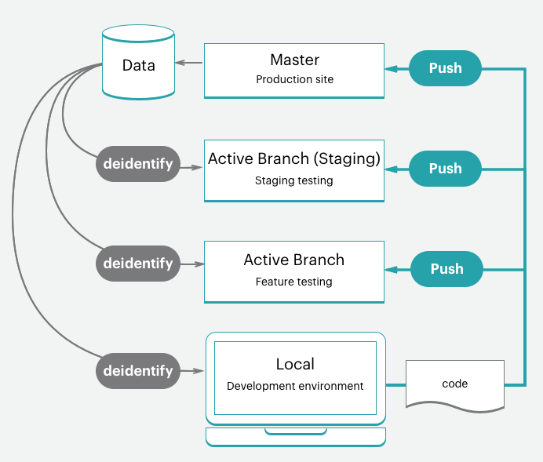
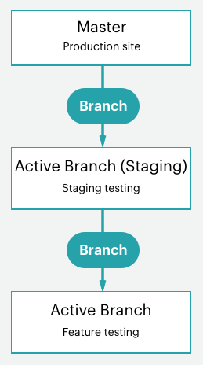
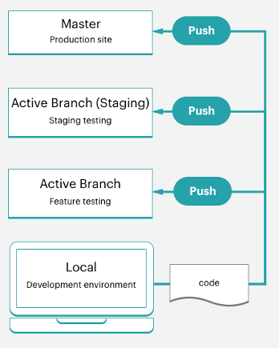
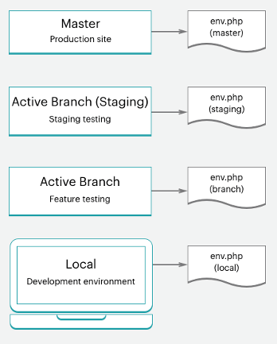
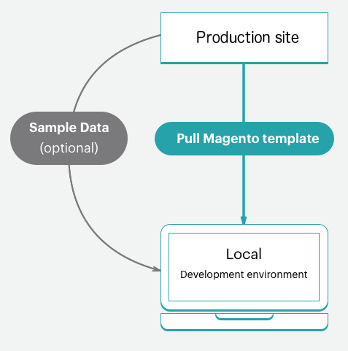
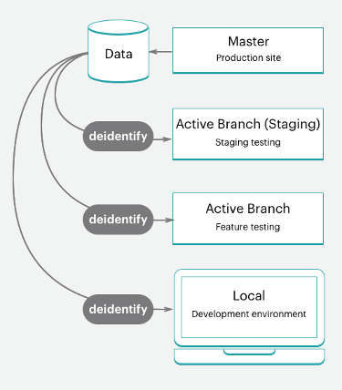

# スタータープロジェクトワークフロー

Adobe Commerce on cloud インフラストラクチャには、実稼動環境用の`master` ブランチを持つ単一のGit リポジトリが含まれています。このブランチは、ステージング環境と複数の統合環境を作成して、テストと開発作業を行うことができます。 実稼動サーバーの`master`環境を含め、最大4つのアクティブ環境を設定できます。 概要については、[&#x200B; スターターアーキテクチャ &#x200B;](starter-architecture.md)を参照してください。

環境の場合は、[!UICONTROL Development > Staging > Production] ワークフローに従ってサイトを開発およびデプロイします。

- **実稼動環境（ライブサイト）** - `master` ブランチのコードから構築およびデプロイされたすべてのサービスを含む完全な実稼動環境を提供します。
- **ステージング環境** - `master`から複製して作成する`staging` ブランチから構築およびデプロイされたすべてのサービスと実稼動環境に一致する完全なステージング環境を提供します。
- **統合環境** - `staging` ブランチから作成するアクティブな開発環境を2つまで提供します。 `integration`環境では、FastlyやNew Relicなどのサードパーティ製サービスはサポートされていません。

各ブランチでは、あらゆる開発手法に従うことができます。 たとえば、スクラムのようなアジャイル手法に従って、スプリントごとに分岐を作成することができます。

各スプリントから、ユーザーストーリーごとに分岐を作成できます。 全てのストーリーがテスト可能になります。 スプリントブランチに継続的にマージし、そのブランチを継続的に検証できます。 スプリントが終了したら、スプリントブランチを`master`にマージして、テストのボトルネックに対処することなく、すべてのスプリントの変更を実稼動環境にデプロイできます。

## 開発ワークフロー

スタータープランの開発とデプロイメントは、最初のプロジェクトから始まります。 「空白のサイト」を使用してプロジェクトを作成します。これは、完全に準備されたストアを備えたAdobe Commerce on cloud infrastructure テンプレートコードのリポジトリです。 これにより、実稼動環境のコードのコピーを含む`master` ブランチが作成されます。

開発ワークフローには、次の項目が含まれます。

- `master`から[&#x200B; クローンとブランチ &#x200B;](#clone-and-branch)を作成して`staging`と開発ブランチを作成します
- [&#x200B; コード &#x200B;](#develop-code)を開発し、[!DNL Composer]個の更新を含む開発ブランチに拡張機能をローカルにインストールします
- [&#x200B; ストアと拡張機能の設定](#configure-store)を構成する
- [設定ファイル &#x200B;](#generate-configuration-management-files)を生成
- [&#x200B; プッシュコード &#x200B;](#push-code-and-test)と設定を使用してビルドし、`staging`および`production`環境にデプロイする



また、コードとストアデータの開発とテストに役立つオプションの手順もいくつか用意されています。

- [&#x200B; サンプルデータ &#x200B;](#optional-install-sample-data)をストアにインストールする
- [実稼動ストアデータ &#x200B;](#optional-pull-production-data)を環境にプルします

このプロセスでは、[&#x200B; ローカル開発者ワークスペース &#x200B;](../development/overview.md)を設定していることを前提としています。

### 複製と分岐

新しいスタータープランプロジェクトの場合、`master` ブランチがAdobe Commerce オンクラウドインフラストラクチャ Git リポジトリから複製されました。 分岐とコードの操作を開始するには、`master` ブランチをローカル環境に複製します。

Git clone コマンドの形式は次のとおりです。

```bash
git fetch origin
```

```bash
git pull origin <environment-ID>
```

スタータープロジェクトのブランチで初めて作業を開始する場合は、`staging` ブランチを作成します。 これにより、ステージング環境にデプロイされる`master` ブランチと一致するコードブランチが作成され、実稼動環境にデプロイする前に、構成とコード変更をテストできます。

次に、`staging`から分岐を作成して、コードを開発し、拡張機能を追加し、サードパーティ統合を設定します。 カスタムコードの開発、拡張機能の追加、サードパーティのサービスとの統合、`staging` ブランチから作成された開発ブランチでの作業が可能です。 4つのアクティブな統合環境があります。 アクティブなブランチをプッシュすると、これらの統合環境のいずれかが、テスト用にコードを自動的にデプロイします。

Git ブランチコマンドの形式は次のとおりです。

```bash
git checkout <branch-name>
```

Cloud CLI `branch` コマンドの形式は次のとおりです。

```bash
magento-cloud environment:branch <environment-name> <parent-environment-ID>
```



### コードを開発

Adobe Commerceのクラウドインフラストラクチャコード上のベースブランチを使用すると、拡張機能のインストール、カスタムコードの開発、テーマの追加などを開始できます。

開発作業で分岐戦略を利用する： ひとつのブランチであらゆる作業を一括して行うと、テストが難しくなる可能性があります。 たとえば、継続的インテグレーションとスプリント手法に従って作業することができます。

- いくつかの拡張機能を追加し、最初のブランチで設定します
- このコードをプッシュし、テストしてステージングと実稼動に結合します
- `services.yaml`でサービスを完全に設定し、テーマを追加します
- このコードをプッシュし、テストしてステージングと実稼動に結合します
- サードパーティサービスとの統合
- このコードをプッシュし、テストしてステージングと実稼動に結合します

ストアを完全に構築し、設定し、立ち上げる準備ができるまで。 しかし、ストアとコード設定には多くのオプションがあります。

>[!NOTE]
>
>ローカルワークステーションの設定は、まだ完了しないでください。



### ストアの設定

ストアを設定する準備ができたら、すべてのコードを`integration`環境にプッシュします。 ローカル環境ではなく、統合環境の管理者からストア設定を行います。 URLは、[!DNL Cloud Console]の&#x200B;**サイトへのアクセス**&#x200B;をクリックして検索できます

設定について詳しくは、Adobe Commerceのドキュメントとインストールされている拡張機能を参照してください。 まず、それぞれのCMSを導入することを想定し、自社のニーズを確認しましょう。

- クラウド内の特定のベストプラクティスの[&#x200B; ストア設定のベストプラクティス &#x200B;](../store/best-practices.md)
- [&#x200B; ストア管理者アクセス、名前、言語、通貨、ブランディング、サイト、ストアビューなどの基本設定](https://experienceleague.adobe.com/en/docs/commerce-admin/start/setup/store-details)
- CSSやレイアウトを含むサイトとストアのルックアンドフィール用の[&#x200B; テーマ &#x200B;](https://experienceleague.adobe.com/en/docs/commerce-admin/content-design/content-menu#design-features)
- 役割、ツール、通知、およびデータベースの暗号化キーに対する[&#x200B; システム設定](https://experienceleague.adobe.com/en/docs/commerce-admin/systems/guide-overview)
- ドキュメントを使用した拡張機能の設定

ストア設定だけでなく、複数のサイトやストア、設定済みのサービスなどを設定することもできます。 [&#x200B; ストアの設定](../store/overview.md)を参照してください。

### 構成管理ファイルの生成

Adobe Commerceに精通している場合は、開発中のデータベースからステージング環境と実稼動環境に設定を取得する方法について懸念している可能性があります。 以前は、すべての設定設定を紙またはファイルにコピーし、その設定を他の環境に手動で適用する必要がありました。 データベースをダンプして別の環境にプッシュした可能性もあります。

Adobe Commerce on cloud infrastructureには、環境からファイルに構成設定を書き出す2つの[Configuration Management](../store/store-settings.md) コマンドのセットが用意されています。 これらのコマンドは、クラウドインフラストラクチャ 2.2以降&#x200B;**の** Adobe Commerceでのみ使用できます。

- `php .vendor/bin/ece-tools config:dump` - デフォルトから入力または変更した構成設定のみを構成ファイルに書き出します。 _推奨_。
- `php bin/magento app:config:dump` – 変更およびデフォルトを含むすべての構成設定を構成ファイルに書き出します。

生成されたファイルは`app/etc/config.php`です。

Adobe Commerceを設定した統合環境でファイルを生成します。 ファイルを生成し、ブランチに追加し、デプロイする手順を順を追って説明します。

構成管理に関する&#x200B;**重要な注意事項**:

- `app:config:dump` コマンドから生成されたファイルに含まれるすべての構成設定は、デプロイされた環境で編集または読み取り専用からロックされます。 これは、`.vendor/bin/ece-tools config:dump` コマンドを使用することをAdobeが推奨する理由の1つです。

  例えば、開発環境にFastly用のモジュールをインストールするとします。 このモジュールは、ステージング環境と実稼動環境でのみ設定できます。 `.vendor/bin/ece-tools config:dump` コマンドを使用すると、開発の変更をステージング環境と実稼動環境にデプロイする際に、これらのデフォルトフィールドを編集可能のままになります。

- 生成されるファイルは、デプロイメントのサイズに応じて長くなる可能性があります。 `.vendor/bin/ece-tools config:dump` コマンドは、`app:config:dump` コマンドによって生成されたファイルよりも小さいファイルを生成します。

Adobe Commerce バージョン 2.2以降を使用している場合、Configuration Management コマンドは、PayPal モジュールのサンドボックス資格情報など、機密データを保護するための追加機能を提供します。 書き出しプロセス中に、機密データを含む値はすべて、`app/etc/` ディレクトリの個別の設定ファイル（`env.php`）に書き出されます。 このファイルはローカル環境に残り、コードを別のブランチにプッシュしてもコピーされません。 また、すべてのAdobe Commerce on cloud インフラストラクチャバージョンのCLI コマンドを使用して、環境変数を作成することもできます。



[構成管理](../store/store-settings.md)を参照してください。

### プッシュコードとテスト

この時点で、テスト用の設定ファイル （`config.local.php`または`config.php`）を備えた開発されたコードブランチが必要です。

ローカル環境からコードをプッシュするたびに、一連のビルドとデプロイのスクリプトが実行されます。 これらのスクリプトは新しいコードを生成し、リモート環境にデプロイします。 例えば、開発用ブランチをローカル環境からリモートブランチにプッシュする場合、一致する環境はサービス、コード、静的コンテンツを更新します。

ストア URL、管理者URL、SSHを使用して、この環境に直接アクセスできます。 これらの環境には、web サーバー、データベース、設定されたサービスが含まれます。 準備ができたら、ステージング環境でデプロイとテストを開始できます。

詳しくは、[&#x200B; デプロイメントワークフロー](#deployment-workflow)を参照してください。

### オプション：サンプルデータのインストール

ストアの開発時にサンプルデータが必要な場合は、サンプルデータをインストールできます。 このデータは、顧客、商品、その他のデータを含む、アクティブなストアをシミュレートします。 このサンプルデータは、プロジェクトの作成時にAdobe Commerce on cloud infrastructure テンプレートをインストールする「空白のサイト」で最も効果的です。 ベストプラクティスとして、本番稼働前にサンプルデータを削除します。 [&#x200B; オプションのサンプルデータのインストール &#x200B;](../test/sample-data.md)を参照してください。



### オプション：本番データの取得

すべての製品、カタログ、サイトコンテンツなどを`production`環境に直接追加します。 このデータを本番環境に追加することで、顧客に対して、最新の価格、クーポン、在庫在庫、販売のお知らせ、今後の製品に関する情報などを提供することができます。 このデータには、ローカル開発ブランチで設定した拡張機能の設定は含まれていません。

機能を開発したり、拡張機能を追加したり、テーマをデザインしたりするときは、実際のデータを持つことが役に立ちます。 いつでも、実稼動環境から[&#x200B; データベースダンプ &#x200B;](../storage/database-dump.md)を作成し、必要に応じてステージング環境および統合環境にプッシュできます。

ステージング環境と統合環境で使用するテストデータとして実稼動データを書き出すには、次の手順を実行します。

- [Adobe Commerce暗号化キーを使用して、お客様とストアデータの保護されたバックアップを書き出す際に、](https://experienceleague.adobe.com/docs/commerce-operations/configuration-guide/cli/run-support-utilities.html) CLI コマンドを実行する（推奨）

- データの生成と書き出しを行うための[&#x200B; データ収集](https://experienceleague.adobe.com/en/docs/commerce-admin/systems/tools/support#data-collector) ツール

このデータを移行するには、[静的ファイルとデータの移行とデプロイ &#x200B;](../deploy/staging-production.md#migrate-static-files)を参照してください。



>[!NOTE]
>
>データを別の環境にプッシュする前に、データのサニタイズを検討する必要があります。 [&#x200B; サポートユーティリティの使用](https://experienceleague.adobe.com/docs/commerce-operations/configuration-guide/cli/run-support-utilities.html)や、顧客データを削除するスクリプトの開発など、いくつかのオプションがあります。

>[!WARNING]
>
>データベースを統合環境またはステージング環境から実稼動環境にプッシュしないでください。 その場合、統合環境またはステージング環境のデータは、売上、注文、新規顧客および更新済み顧客など、ライブの実稼動データを上書きします。

## デプロイメントワークフロー

アーキテクチャについて詳しく説明しているように、Adobe Commerce オンクラウドインフラストラクチャはGit駆動型です。 Adobe Commerceをクラウドインフラストラクチャにデプロイすることは、ブランチのGit プッシュプロセスの一部です。

分岐されたコードをローカル環境からリモートブランチにプッシュすると、一連のビルドスクリプトとデプロイスクリプトが開始されます。

スクリプトを作成します。

- ターゲット環境のサイトは、ビルド中も引き続き実行されます

- クラウドインフラストラクチャのパッチとホットフィックスに対するAdobe Commerceの確認と実行

- ビルドとデプロイのログを使用してコードをコンパイル

- このフェーズで静的コンテンツのデプロイメントが発生する場合は、構成管理を確認します

- 変更されていないコードのスラグを作成または使用して、より迅速なプロセスを実現

- すべてのバックエンドサービスとアプリケーションのプロビジョニング

スクリプトをデプロイ：

- メンテナンスモードでサイトをターゲット環境に設定します

- ビルド中に完了しなかった場合は、静的コンテンツをデプロイします

- クラウドインフラストラクチャ上のAdobe Commerceのインストールまたは更新

- トラフィックのルーティングの設定

ストアが完全に完成したら、更新されたコードと設定がすべてオンラインで利用可能になります。

[&#x200B; デプロイメントプロセス &#x200B;](../deploy/process.md)を参照してください。

### ステージングとテストへのプッシュ

完全なテストを行うには、常に反復コードを`staging`環境にプッシュしてください。 この環境を初めて使用する場合は、[Fastly](/help/cloud-guide/cdn/fastly.md)や[New Relic](../monitor/new-relic-service.md)など、いくつかのサービスを設定する必要があります。 また、サンドボックスやテスト用の資格情報を使用して、支払いゲートウェイ、配送、通知などの重要なサービスを設定できます。

ステージングはプリプロダクション環境で、すべてのサービスと設定を可能な限りプロダクションに近い状態で提供します。 あらゆるサービスを徹底的にテストし、パフォーマンステストツールを検証し、ストアの準備が整ったと実感できるまで、管理者および顧客としてUAT テストを実施します。

[&#x200B; ストアのデプロイ &#x200B;](../deploy/staging-production.md)を参照してください。

### 本番環境へのプッシュ

`master` ブランチにプッシュすると、`production`環境にプッシュされます。 ステージング環境と同様に、実稼動環境での設定とテストのアクティビティを1つの重要な違いで完了します。 本番環境では、設定とテストにライブ資格情報を使用します。 サイトを立ち上げた瞬間に、顧客は購入を完了し、管理者はライブストアを管理できます。

[&#x200B; ストアのデプロイ &#x200B;](../deploy/staging-production.md)を参照してください。

### サイトの起動

サイトを公開するための明確な方法があります。 これらのステップを完了すると、ストアでカスタマイズしたテーマの商品をすぐに提供できるようになります。

[&#x200B; サイトの起動](../launch/overview.md)を参照してください。

## 継続的な連携

分岐と開発手法に従うことで、新しい機能の開発、変更の設定、拡張機能の追加を簡単におこない、継続的にアップデートを開発してデプロイできます。

あらゆるクラウドインフラストラクチャ環境は、継続的なアップデートのために継続的な統合をサポートします。 このワークフローでは、ビジネスニーズに応じて、1日に複数回または設定されたスケジュールでリリースをサポートします。

- 将来の機能や変更を備えた開発ブランチを作成したい

- `integration`環境でコードをテストします

- `staging`環境でのデプロイとテスト

- `production`環境へのデプロイ
