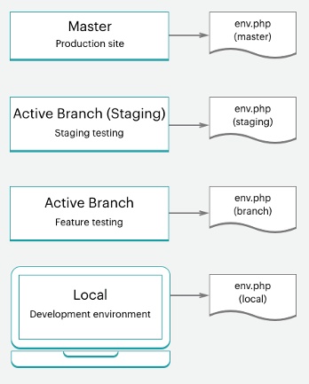

# スタータープロジェクトワークフロー

Adobe Commerce on cloud インフラストラクチャには、実稼動環境用の `master` ブランチを持つ単一の Git リポジトリーが含まれています。このリポジトリーは分岐して、テストおよび開発作業用のステージング環境と複数の統合環境を作成できます。 実稼動サーバーの `master` 環境を含め、最大 4 つのアクティブな環境を持つことができます。 概要については、[&#x200B; スターターアーキテクチャ &#x200B;](starter-architecture.md) を参照してください。

お使いの環境では、[!UICONTROL Development > Staging > Production] のワークフローに従って、サイトを開発およびデプロイします。

- **実稼動環境（ライブサイト）** – 実 `master` 動分岐のコードから構築およびデプロイされたすべてのサービスを含む、完全な実稼動環境を提供します。
- **ステージング環境** – 実稼動環境と一致する、完全なステージング環境を提供します。これは、`master` からクローン作成する `staging` のブランチから構築およびデプロイされたすべてのサービスと一致します。
- **統合環境** - `staging` ブランチから作成するアクティブな開発環境を最大 2 つ提供します。 この `integration` 環境では、Fastly やNew Relicなどのサードパーティサービスはサポートされていません。

ブランチの場合は、任意の開発手法に従うことができます。 例えば、スクラムなどのアジャイル手法に従って、スプリントごとに分岐を作成できます。

各スプリントから、各ユーザーストーリーの分岐を作成できます。 すべてのストーリーがテスト可能になります。 スプリントの分岐に継続的に結合し、その分岐を継続的に検証できます。 スプリントが終了したら、テストのボトルネックに対処することなく、スプリントのブランチを `master` に結合し、スプリントのすべての変更を実稼動環境にデプロイできます。

## 開発ワークフロー

スタータープランでの開発とデプロイメントは、最初のプロジェクトから始めます。 「空白のサイト」（クラウドインフラストラクチャテンプレート上のAdobe Commerceのコードリポジトリ）を使用してプロジェクトを作成し、完全に準備されたストアを含めます。 これにより、実稼動環境のコードのコピーを含む `master` ブランチが作成されます。

開発ワークフローには以下が含まれます。

- `master` ージから [&#x200B; クローンとブランチ &#x200B;](#clone-and-branch) を作成して、`staging` 開発ブランチを作成します。
- [&#x200B; コードを開発 &#x200B;](#develop-code) し、開発ブランチで拡張機能をローカルにインストール（[!DNL Composer] のアップデートを含む）
- ストアと拡張機能の設定 [&#128279;](#configure-store) 設定）
- [&#x200B; 設定の生成 &#x200B;](#generate-configuration-management-files) 管理ファイル
- [&#x200B; プッシュコード &#x200B;](#push-code-and-test) と、ビルドして `staging` 環境および `production` 環境にデプロイするための設定


また、コードとストアデータの開発とテストに役立つオプションの手順もあります。

- ストアへの [&#x200B; サンプルデータのインストール &#x200B;](#optional-install-sample-data)
- [&#x200B; 本番ストア・データのプル配信 &#x200B;](#optional-pull-production-data) 環境への取り込み

このプロセスは、[&#x200B; ローカル開発者ワークスペース &#x200B;](../development/overview.md) が設定されていることを前提としています。

### クローンとブランチ

新しいスタータープランプロジェクトでは、Adobe Commerce on cloud infrastructure Git リポジトリから `master` ブランチのクローンが作成されました。 コードのブランチ化と操作を開始するには、`master` ブランチをローカル環境にクローンします。

Git clone コマンドの形式は次のとおりです。

```bash
git fetch origin
```

```bash
git pull origin <environment-ID>
```

スタータープロジェクトのブランチで初めて作業を開始するときは、`staging` ブランチを作成します。 これにより、ステージング環境にデプロイする `master` ブランチに一致するコードブランチが作成され、実稼動環境にデプロイする前に設定とコードの変更をテストします。

次に、`staging` からブランチを作成して、コードの開発、拡張機能の追加、サードパーティ統合の設定を行います。 カスタムコードを開発したり、拡張機能を追加したり、サードパーティのサービスと統合したりするたびに、`staging` ブランチから作成された開発ブランチで作業します。 4 つのアクティブな統合環境を使用できます。 アクティブなブランチをプッシュすると、これらの統合環境の 1 つがテストするコードを自動的にデプロイします。

Git ブランチ コマンドの形式は次のとおりです。

```bash
git checkout <branch-name>
```

Cloud CLI `branch` コマンドの形式は次のとおりです。

```bash
magento-cloud environment:branch <environment-name> <parent-environment-ID>
```


### コードの開発

クラウドインフラストラクチャコード上のAdobe Commerceのベースブランチを使用すると、拡張機能のインストール、カスタムコードの開発、テーマの追加などを開始できます。

開発作業でブランチ戦略を使用します。 1 つのブランチですべての作業を一度に行うと、テストが難しくなる場合があります。 例えば、継続的統合とスプリントの方法論に従って作業できます。

- 拡張機能をいくつか追加し、最初のブランチで設定します
- このコードをプッシュし、テストして、ステージング環境から実稼動環境に結合します
- `services.yaml` でのサービスの完全な設定とテーマの追加
- このコードをプッシュし、テストして、ステージング環境から実稼動環境に結合します
- サードパーティのサービスとの統合
- このコードをプッシュし、テストして、ステージング環境から実稼動環境に結合します

ストアを完全に構築、設定し、ローンチする準備ができるまで。 ただし、ストアとコードの設定には多くのオプションがあります。

>[!NOTE]
>
>ローカル ワークステーションの設定は、まだ完了していません。


### ストアの設定

ストアを設定する準備が整ったら、すべてのコードを `integration` 環境にプッシュします。 ローカル環境ではなく、統合環境用に管理者からストアの設定を指定します。 URL を見つけるには、[!DNL Cloud Console] の **サイトにアクセス** をクリックします

設定に関する最適な情報については、Adobe Commerceのドキュメントとインストールされている拡張機能を参照してください。 開始に役立つリンクとアイデアを次に示します。

- クラウド内の特定のベストプラクティスに関する [&#x200B; ストア設定のベストプラクティス &#x200B;](../store/best-practices.md)
- ストア管理アクセス、名前、言語、通貨、ブランディング、サイト、ストア表示などの [&#x200B; 基本設定 &#x200B;](https://experienceleague.adobe.com/ja/docs/commerce-admin/start/setup/store-details)
- [&#x200B; テーマ &#x200B;](https://experienceleague.adobe.com/ja/docs/commerce-admin/content-design/content-menu#design-features):CSS やレイアウトを含むサイトやストアのルックアンドフィール用
- 役割、ツール、通知およびデータベースの暗号化キーの [&#x200B; システム設定 &#x200B;](https://experienceleague.adobe.com/ja/docs/commerce-admin/systems/guide-overview)
- ドキュメントを使用した拡張機能の設定

ストアの設定だけでなく、複数のサイトやストア、設定されたサービスなどをさらに設定できます。 詳しくは [&#x200B; ストアの設定 &#x200B;](../store/overview.md) を参照してください。

### 構成管理ファイルの生成

Adobe Commerceに精通しているユーザーは、開発環境のデータベースからステージング環境および実稼動環境に設定を取得する方法を気にする必要があります。 以前は、すべての設定を紙またはファイルにコピーしてから、手動でその設定を他の環境に適用する必要がありました。 または、データベースをダンプし、そのデータを別の環境にプッシュした可能性があります。

クラウドインフラストラクチャー上のAdobe Commerceには、お使いの環境からファイルに設定を書き出す 2 つの [&#x200B; 設定 &#x200B;](../store/store-settings.md) 管理」コマンドが用意されています。 これらのコマンドは、**cloud infrastructure 2.2 以降のAdobe Commerce** でのみ使用できます。

- `php .vendor/bin/ece-tools config:dump` – 入力またはデフォルトから変更した構成設定のみを構成ファイルにエクスポートします。 _推奨_。
- `php bin/magento app:config:dump` – 変更された設定とデフォルト設定を含むすべての設定を構成ファイルにエクスポートします。

生成されたファイルは `app/etc/config.php` です。

Adobe Commerceを設定した統合環境にファイルを生成します。 ファイルを生成し、ブランチに追加してデプロイするプロセスを順を追って説明します。

設定管理に関する **重要な注意事項**

- `app:config:dump` コマンドから生成されたファイルに含まれているすべての構成設定が、デプロイ済み環境で編集できないようにロックされています（読み取り専用になっています）。 これは、Adobeが `.vendor/bin/ece-tools config:dump` コマンドを使用することをお勧めする理由の 1 つです。

  例えば、開発環境に Fastly 用のモジュールをインストールします。 ステージング環境および実稼動環境では、このモジュールのみを設定できます。 `.vendor/bin/ece-tools config:dump` コマンドを使用すると、開発変更をステージング環境および実稼動環境にデプロイする際に、これらのデフォルトフィールドを編集可能な状態に保つことができます。

- 生成されるファイルは、デプロイメントのサイズによっては長くなる場合があります。 `.vendor/bin/ece-tools config:dump` コマンドを実行すると、`app:config:dump` コマンドで生成されるファイルよりも小さなファイルが生成されます。

Adobe Commerce バージョン 2.2 以降を使用している場合、Configuration Management コマンドには、PayPal モジュールのサンドボックス資格情報などの機密データを保護する追加機能が用意されています。 書き出しプロセス中に、機密データを含むすべての値が別々の設定ファイル（`app/etc/` ディレクトリ内の `env.php`）に書き出されます。 このファイルはローカル環境に残り、コードを別のブランチにプッシュしてもコピーされません。 また、クラウドインフラストラクチャバージョン上のすべてのAdobe Commerceで、CLI コマンドを使用して環境変数を作成することもできます。



[&#x200B; 設定の管理 &#x200B;](../store/store-settings.md) を参照してください。

### コードとテストのプッシュ

この時点で、テスト準備が整った設定ファイル（`config.local.php` または `config.php`）を含む、開発済みのコードブランチが必要です。

ローカル環境からコードをプッシュするたびに、一連のビルドスクリプトとデプロイスクリプトが実行されます。 これらのスクリプトは、新しいコードを生成して、リモート環境にデプロイします。 例えば、開発ブランチをローカル環境からリモートブランチにプッシュする場合、一致する環境でサービス、コードおよび静的コンテンツが更新されます。

ストア URL、管理者 URL、SSH を使用して、この環境に直接アクセスできます。 これらの環境には、web サーバー、データベース、設定済みサービスが含まれます。 準備が整ったら、ステージング環境でデプロイとテストを開始できます。

詳しくは、[&#x200B; デプロイメントワークフロー &#x200B;](#deployment-workflow) を参照してください。

### オプション：サンプル・データのインストール

ストアの開発時にサンプルデータが必要な場合は、サンプルデータをインストールできます。 このデータは、顧客、製品、その他のデータを含む、アクティブなストアをシミュレートします。 このサンプルデータは、プロジェクトの作成時にクラウドインフラストラクチャテンプレートの「空白のサイト」Adobe Commerceで最適に機能します。 ベストプラクティスとして、運用を開始する前にサンプルデータを削除してください。 [&#x200B; オプションのサンプルデータをインストールする &#x200B;](../test/sample-data.md) を参照してください。


### オプション：実稼動データの取り込み

すべての製品、カタログ、サイトコンテンツなどを `production` 環境に直接追加します。 このデータを実稼動環境に追加すると、更新された価格、クーポン、在庫在庫、販売のお知らせ、今後のオファーに関する情報などを顧客に提供できます。 このデータには、ローカル開発ブランチで設定した拡張機能の設定は含まれていません。

機能を開発したり、拡張機能を追加したり、テーマをデザインしたりする際に、実際のデータを操作できると便利です。 いつでも、実稼動環境から [&#x200B; データベースダンプを作成 &#x200B;](../storage/database-dump.md) し、必要に応じてステージング環境や統合環境にプッシュできます。

実稼働データをテストデータとしてエクスポートし、ステージング環境と統合環境で使用できるようにするには、次の手順に従います。

- [Adobe Commerce暗号化キーを使用して &#x200B;](https://experienceleague.adobe.com/docs/commerce-operations/configuration-guide/cli/run-support-utilities.html?lang=ja) お客様およびストアデータの保護されたバックアップを書き出す場合は、サポートユーティリティを実行し、CLI コマンドを実行します（推奨）。

- [&#x200B; データ収集 &#x200B;](https://experienceleague.adobe.com/ja/docs/commerce-admin/systems/tools/support#data-collector) データを生成および書き出すためのツール

このデータを移行するには、[&#x200B; 静的ファイルおよびデータの移行およびデプロイ &#x200B;](../deploy/staging-production.md#migrate-static-files) を参照してください。


>[!NOTE]
>
>データを別の環境にプッシュする前に、データのサニタイズを検討する必要があります。 [&#x200B; サポートユーティリティの使用 &#x200B;](https://experienceleague.adobe.com/docs/commerce-operations/configuration-guide/cli/run-support-utilities.html?lang=ja) または顧客データをスクラブするスクリプトの開発など、いくつかのオプションがあります。

>[!WARNING]
>
>データベースを統合環境またはステージング環境から実稼動環境にプッシュしないでください。 その場合、統合環境またはステージング環境からのデータによって、販売、注文、新規顧客および更新顧客などのライブ実稼動データが上書きされます。

## デプロイメントワークフロー

アーキテクチャ情報で詳しく説明しているように、クラウドインフラストラクチャー上のAdobe Commerceは Git 主導です。 クラウドインフラストラクチャへのAdobe Commerceのデプロイは、ブランチの Git プッシュプロセスの一部です。

分岐したコードをローカル環境からリモートブランチにプッシュすると、一連のビルドスクリプトとデプロイスクリプトが開始されます。

ビルドスクリプト：

- ターゲット環境内のサイトは、ビルド中も実行を続けます

- Adobe Commerce on cloud infrastructure のパッチおよびホットフィックスを確認して実行します。

- ビルドおよびデプロイログを使用したコードのコンパイル

- 静的コンテンツのデプロイメントがこのフェーズで行われるかどうかを構成管理で確認します

- 変更されていないコードのスラッグを作成または使用すると、プロセスを高速化できます

- すべてのバックエンドサービスおよびアプリケーションのプロビジョニング

スクリプトをデプロイします。

- サイトをターゲット環境にメンテナンスモードにします

- ビルド中に完了しない場合は静的コンテンツをデプロイ

- クラウドインフラストラクチャにAdobe Commerceをインストールまたは更新します

- トラフィックのルーティングの設定

完了すると、更新されたすべてのコードと設定を使用して、ストアがオンラインでライブ状態に戻ります。

[&#x200B; デプロイメントプロセス &#x200B;](../deploy/process.md) を参照してください。

### ステージングおよびテストへのプッシュ

完全なテストを行うには、常に繰り返しコードを `staging` 環境にプッシュします。 この環境を初めて使用する場合は、{Fastly[&#128279;](/help/cloud-guide/cdn/fastly.md) や [2}New Relic](../monitor/new-relic-service.md) などのいくつかのサービスを設定する必要があります。 また、サンドボックスまたはテスト資格情報を使用して、支払いゲートウェイ、配送、通知、その他の重要なサービスを設定します。

ステージングは実稼動前の環境であり、可能な限り実稼動環境に近いすべてのサービスと設定を提供します。 ストアが実稼動の準備ができていると感じられるまで、すべてのサービスを徹底的にテストし、パフォーマンステストツールを検証し、管理者および顧客として UAT テストを実行します。

[&#x200B; ストアのデプロイ &#x200B;](../deploy/staging-production.md) を参照してください。

### 実稼動へのプッシュ

`master` ブランチにプッシュすると、`production` 環境にプッシュされます。 ステージング環境と同様に、実稼動環境での設定およびテストアクティビティを、1 つの重要な違いを除いて完了します。 実稼動環境では、設定とテストにライブ資格情報を使用します。 サイトが立ち上げられた瞬間に、顧客は購入を完了でき、管理者はライブストアを管理できます。

[&#x200B; ストアのデプロイ &#x200B;](../deploy/staging-production.md) を参照してください。

### サイトの起動

サイトの運用を開始するための明確な手順があります。 これらの手順を完了すると、カスタマイズしたテーマの製品をすぐに販売することができます。

[&#x200B; サイトのローンチ &#x200B;](../launch/overview.md) を参照してください。

## 継続的統合

ブランチと開発の方法論に従って、新機能を簡単に開発し、変更を設定し、拡張機能を追加して、更新を継続的に開発およびデプロイできます。

すべてのクラウドインフラストラクチャ環境で、継続的な統合をサポートして、継続的なアップデートを実現します。 このワークフローでは、ビジネスニーズに応じて、1 日に複数回、または設定したスケジュールでリリースをサポートします。

- 今後の機能および変更を伴う開発部門の作成

- `integration` 環境でのコードのテスト

- `staging` 環境でのデプロイとテスト

- `production` 環境へのデプロイ
