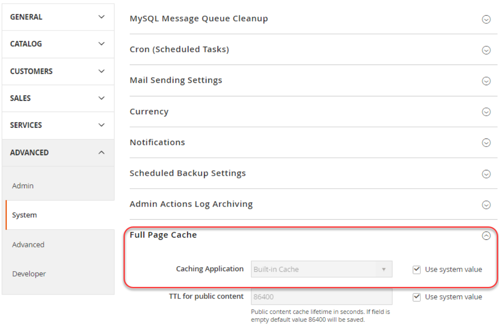
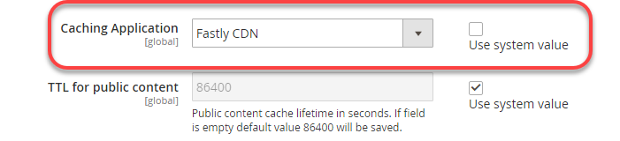
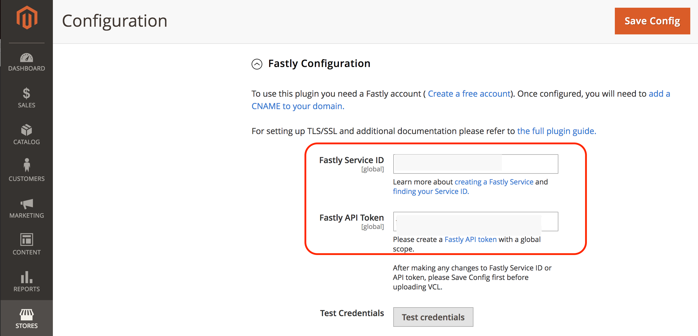
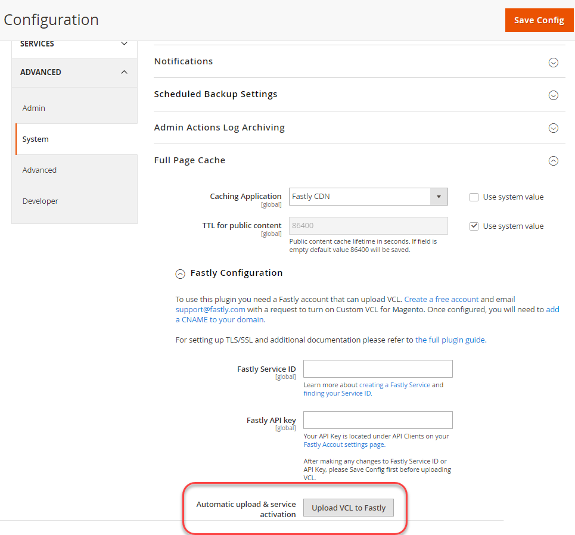

# Fastly サービスの設定

Fastlyは、Adobe Commerceのクラウドインフラストラクチャ上のステージング環境および本番環境に必要です。

FastlyはVarnishと連携して、静的アセットに高速キャッシュ機能とコンテンツ配信ネットワーク（CDN）を提供します。 また、Fastlyは、サイトとクラウドインフラストラクチャを保護するためのweb アプリケーションファイアウォール（WAF）も提供しています。 悪意のあるトラフィックや攻撃からサイトとクラウドインフラストラクチャを保護するには、Fastlyを介してすべての着信サイトトラフィックをルーティングします。

>[!NOTE]
>
>Fastlyは統合環境では使用できません。

サイト開発プロセスの初期段階でFastlyを有効、設定、テストして、サイトへの安全なアクセスを可能にするには、次の手順を実行します。

- ステージング環境と実稼動環境に対するFastlyの認証情報を取得
- Fastly CDN キャッシュの有効化
- Fastly VCL スニペットのアップロード
- Fastly サービスにトラフィックをルーティングするためのDNS設定の更新
- Fastly キャッシュのテスト

>[!NOTE]
>
>Fastlyの初期設定を有効にして検証したら、設定をカスタマイズできます。 例えば、画像の最適化、エッジモジュール、カスタム VCL コードなどの追加のオプションを有効にできます。 [&#x200B; キャッシュ設定のカスタマイズ &#x200B;](fastly-custom-cache-configuration.md)を参照してください。

プロジェクトのプロビジョニング中に、Adobeはクラウドインフラストラクチャ上のAdobe Commerceの[Fastly サービスアカウント &#x200B;](fastly.md#fastly-service-account-and-credentials)にプロジェクトを追加し、Starter `master`およびPro ステージング環境と実稼動環境のFastly アカウント資格情報を作成します。 各環境には一意の資格情報があります。

Adobe Commerce管理者からFastly CDN サービスを設定し、Fastly API リクエストを送信するには、Fastly認証情報が必要です。

## Fastly管理者ダッシュボードへのアクセス

Adobe Commerceクラウドインフラストラクチャでは、Fastly管理者ダッシュボードに直接アクセスすることはできません。

Adobe Commerce管理者を使用して、お使いの環境のFastly設定を確認し、更新します。 AdminでFastly機能を使用して問題を解決できない場合は、[Adobe Commerce サポートチケット &#x200B;](https://experienceleague.adobe.com/docs/commerce-knowledge-base/kb/help-center-guide/magento-help-center-user-guide.html?lang=ja)を送信します。

## Fastly認証情報を取得

ステージング環境と実稼動環境のFastly サービス IDとAPI トークンは、Cloud プロジェクト環境に保存されます。 両方の環境の資格情報が必要です。

**Cloud Pro プロジェクトの資格情報を取得**:

Cloud Pro プロジェクトで、IaaS マウントされた共有ディレクトリから資格情報を確認します。

1. SSHを使用してサーバーに接続します。

2. `/mnt/shared/fastly_tokens.txt` ファイルを開いて、資格情報を取得します。

   ステージング環境と実稼動環境には一意の資格情報があります。 各環境の資格情報を取得する必要があります。

**Cloud スタータープロジェクトの資格情報を取得**:

Cloud Starter プロジェクトで、Cloud ConsoleまたはCloud CLIを使用して資格情報を取得します。

- [!DNL Cloud Console]から、[環境設定](../project/overview.md#configure-environment)で次の環境変数を確認します。

   - `CONFIG__DEFAULT__SYSTEM__FULL_PAGE_CACHE__FASTLY__FASTLY_API_KEY`

   - `CONFIG__DEFAULT__SYSTEM__FULL_PAGE_CACHE__FASTLY__FASTLY_SERVICE_ID`

- ローカルワークスペースのコマンドラインから、`magento-cloud` CLIを使用して[Fastly環境変数を一覧表示およびレビュー](../environment/variables-cloud.md#viewing-environment-variables)します。

  ```bash
  magento-cloud variable:get -e <environment-ID>
  ```

### トラブルシューティング

- ステージング環境または実稼動環境のFastly資格情報が見つからない場合は、Adobe カスタマーテクニカルアドバイザー（CTA）にお問い合わせください。

- [Fastly資格情報の検証中にエラーが発生しました](https://experienceleague.adobe.com/ja/docs/commerce-knowledge-base/kb/troubleshooting/miscellaneous/error-when-validating-fastly-credentials#solution)。

## 資格情報の保護

サポートチケット、公開フォーラム、または公開場所でAPI トークンを共有しないでください。 さらに、API トークンをコードリポジトリにコミットしないでください。リポジトリには、機密情報のない不変ファイルのみを含める必要があります。

Adobe Commerce サポートは既に必要なキーにアクセスできるので、サポートを求める際にAPI トークンを提供する必要はありません。

API トークンが公開で共有されたり、サポートチケットに添付されたりした場合、そのトークンは侵害されたと見なされます。 このような場合、Adobeは新しいトークンを生成する必要があります。

## Fastly キャッシュを有効にする

Fastly サービスを有効にして設定するには、次のコンポーネントが必要です。

- Magento 2 モジュール [&#128279;](fastly.md#fastly-cdn-module-for-magento-2)用Fastly CDNの最新バージョンが、ステージング環境および実稼動環境にインストールされています。 [Fastlyのアップグレード &#x200B;](#upgrade-the-fastly-module)を参照してください。

- クラウドインフラストラクチャのステージング環境と実稼動環境でのAdobe Commerceの[Fastly資格情報](#get-fastly-credentials)

**ステージングおよび実稼動環境でFastly CDN キャッシュを有効にするには**:

{{admin-login-step}}

1. **ストア** / 設定/**構成** / **詳細** / **システム**&#x200B;をクリックし、**フルページキャッシュ**&#x200B;を展開します。

   

1. _Caching Application_ セクションで、**システム値**&#x200B;から選択範囲を削除し、ドロップダウンリストから&#x200B;**Fastly CDN**&#x200B;を選択します。

   

1. **Fastly Configuration**&#x200B;を展開し、[&#x200B; キャッシングオプションを選択](https://github.com/fastly/fastly-magento2/blob/master/Documentation/CONFIGURATION.md#configure-the-module)します。

1. キャッシュオプションを設定したら、ページ上部の「**設定を保存**」をクリックします。

1. 通知に従ってキャッシュをクリアします。

1. **Stores** > **Settings** > **Configuration** > **Advanced** > **System** > **Fastly Configuration**&#x200B;に戻って、Fastlyの設定を続行します。

### Fastly認証情報をテストする

1. 管理者で、**Stores** / 設定/**Configuration** / **Advanced** / **System** / **Fastly Configuration**&#x200B;に移動します。

1. 必要に応じて、プロジェクト環境の&#x200B;**Fastly サービス ID**&#x200B;と&#x200B;**API トークン**&#x200B;の値を追加します。

   

   >[!NOTE]
   >
   >Fastly API トークンを作成するリンクを選択しないでください。 代わりに、Adobe[&#128279;](#get-fastly-credentials)が提供するFastly資格情報（サービス IDおよびAPI トークン）を使用してください。

1. 「**資格情報をテスト**」をクリックします。

1. テストが成功した場合は、**設定を保存**&#x200B;をクリックし、キャッシュをクリアします。

   テストが失敗した場合は、正しいサービス IDとAPI トークンの値が現在の環境の資格情報と一致していることを確認します。

   テストが再度失敗した場合は、Adobe Commerce サポートチケットを送信するか、Adobeの担当者にお問い合わせください。 Pro プロジェクトの場合は、実稼動サイトとステージングサイトのURLを含めます。 スタータープロジェクトの場合は、`Master`とステージングサイトのURLを含めます。

>[!NOTE]
>
>ステージング環境または実稼動環境のFastly API トークン資格情報を変更する手順については、[Fastly資格情報の変更](fastly.md#change-fastly-api-token)を参照してください。

### VCLをFastlyにアップロード

Fastly モジュールを有効にした後、デフォルトの[VCL コード &#x200B;](https://github.com/fastly/fastly-magento2/tree/master/etc/vcl_snippets)をFastly サーバーにアップロードします。 このコードでは、Adobe Commerce on cloud インフラストラクチャのキャッシュやその他のFastly CDN サービスを有効にするための一連のVCL スニペットを提供します。

>[!NOTE]
>
>Fastly キャッシングサービスは、Fastly VCL コードを最初にAdobe Commerce ステージングおよび実稼動サイトにアップロードするまで機能しません。

**Fastly VCL**&#x200B;をアップロードするには：

1. 次の図に示すように、_Fastly Configuration_ セクションで、**VCLをFastly**&#x200B;にアップロードをクリックします。

   

1. アップロードが完了したら、ページ上部の通知に従ってキャッシュを更新します。

## SSL/TLS証明書のプロビジョニング

Adobeでは、Fastlyからの安全なHTTPS トラフィックを提供するために、Domain-Validated Let&#39;s Encrypt SSL/TLS証明書を提供しています。 Adobeは、Pro実稼動環境、ステージング環境およびStarter実稼動環境ごとに1つの証明書を提供し、その環境のすべてのドメインを保護します。 指定された証明書について詳しくは、[&#x200B; クラウドインフラストラクチャ上のAdobe CommerceのAdobe SSL （TLS）証明書](https://experienceleague.adobe.com/ja/docs/commerce-knowledge-base/kb/how-to/ssl-tls-certificates-for-magento-commerce-cloud-faq)を参照してください。

>[!NOTE]
>
>Adobeが提供するLet&#39;s Encrypt証明書を使用する代わりに、独自のTLSまたはSSL証明書を指定できます。 ただし、このプロセスを設定および維持するには、追加の作業が必要です。 このオプションを選択するには、Adobe Commerce サポートチケットを送信するか、Adobeと連携して、カスタムのホストされた証明書をAdobe Commerce on cloud infrastructure環境に追加します。

Adobe Commerce環境でSSL/TLS証明書を有効にするには、Adobeの自動処理で次の手順を実行します。

- ドメインの所有権を検証します
- ストアの指定されたトップレベルおよびサブドメインをカバーするLet&#39;s Encrypt SSL/TLS証明書をプロビジョニングします
- サイトの公開時に証明書をクラウド環境にアップロードします

この自動化では、ドメイン検証情報を提供するために、サイトのDNS設定を更新する必要があります。 次のメソッドのうち&#x200B;**one**&#x200B;を使用してください：

- **DNS検証** – ライブサイトの場合は、Fastly サービスを指すCNAME レコードでDNS設定を更新します
- **ACME チャレンジ CNAME レコード** – 環境内の各ドメインに対してAdobeが提供するACME チャレンジ CNAME レコードを使用して、DNS設定を更新します

>[!TIP]
>
>アクティブでない実稼動ドメインがある場合は、ドメインの検証にACME チャレンジ CNAME レコードを使用します。 DNS設定にレコードを早期に追加することで、Adobeはサイトの起動前に適切なドメインでSSL/TLS証明書をプロビジョニングできます。 実稼動環境に起動する前に、これらのプレースホルダーレコードをAdobeが提供するCNAME レコードに置き換える必要があります。

ドメインの検証が完了すると、AdobeはLet&#39;s Encrypt TLS/SSL証明書をプロビジョニングし、ライブステージング環境または実稼動環境にアップロードします。 このプロセスには最大12時間かかる場合があります。 Adobeでは、サイト開発とサイト起動の遅延を防ぐために、DNS設定の更新を数日前に完了することをお勧めします。

## 開発設定を使用したDNS設定の更新

Fastlyの初期設定プロセスでは、次のURLを使用して、ステージング環境と実稼動環境でFastly キャッシュを設定およびテストできます。

- プロステージングおよび実稼動用：

   - `mcprod.<your-domain>.com`
   - `mcstaging.<your-domain>.com`

- スタータープロダクションのみ：

   - `mcprod.<your-domain>.com`

これらのデフォルトのプリプロダクション URLは、プロジェクトのプロビジョニング後に使用できます。 `"your-domain"`の値は、オンボーディングプロセス中に指定したドメイン名です。

>[!NOTE]
>
>スタータープロジェクトの実稼動以外の環境にカスタムドメインを指定することはできません。

ストア URLからFastly サービスにトラフィックをルーティングするには、DNS設定を更新します。 設定を更新すると、Adobeは必要なSSL/TLS証明書を自動的にプロビジョニングし、クラウド環境にアップロードします。 このプロビジョニングには最大で12時間かかる場合があります。

>[!NOTE]
>
>実稼動サイトを起動する準備ができたら、実稼動ドメインをFastly サービスに誘導し、追加の設定タスクを完了するように、DNS設定を再度更新する必要があります。 [&#x200B; チェックリストを起動](../launch/checklist.md)を参照してください。

**前提条件：**

- Fastly モジュールを有効にします。
- デフォルトのFastly VCL コードをアップロードします。
- 各環境のトップレベルおよびサブドメインのリストをAdobeに提供するか、Adobe Commerce サポートチケットを送信します。
- 指定したドメインがクラウド環境に追加されたことが確認されるまで待ちます。
- スタータープロジェクトで、Fastly サービス設定にドメインを追加します。 [&#x200B; ドメインの管理](fastly-custom-cache-configuration.md#manage-domains)を参照してください。
- DNS設定の更新について詳しくは、[DNS レジストラー](https://lookup.icann.org/)でドメインサービスの正しい方法を確認してください。

**開発用のDNS設定を更新するには**:

1. CNAME レコード `prod.magentocloud.map.fastly.net`を追加して、プリプロダクション URLをFastly サービスにポイントします。例：

   | ドメインまたはサブドメイン | CNAME |
   |---------------------------|----------------------------------|
   | mcprod.your-domain.com | prod.magentocloud.map.fastly.net |
   | mcstaging.your-domain.com | prod.magentocloud.map.fastly.net |

   CNAME レコードがライブの場合、Adobeは証明書をプロビジョニングし、SSL/TLS証明書をアップロードします。

   >[!NOTE]
   >
   >実稼動サイトにapex ドメイン （`your-domain.com`）を使用する場合は、Fastly サーバーのIP アドレスを指すようにDNS アドレスレコード （A レコード）を設定する必要があります。 [実稼動設定を使用したDNS設定の更新](../launch/checklist.md#to-update-dns-configuration-for-site-launch)を参照してください。


1. 実稼動SSL/TLS証明書のドメイン検証と事前プロビジョニング用にACME チャレンジ CNAME レコードを追加します。例：

   | ドメインまたはサブドメイン | CNAME |
   |-------------------------------------------|-------------------------------------------|
   | _acme-challenge.your-domain.com | 0123456789abcdef.validation.magento.cloud |
   | _acme-challenge.www.your-domain.com | 9573186429stuvwx.validation.magento.com |
   | _acme-challenge.mystore.your-domain.com | 1234567898zxywvu.validation.magento.cloud |
   | _acme-challenge.subdomain.your-domain.com | 1098765743lmnopq.validation.magento.cloud |

   >[!NOTE]
   >
   >この例のACME チャレンジレコードは、Adobe Commerce ステージングおよび実稼動サイトのプロビジョニングを目的としないプレースホルダーです。 Adobeにお問い合わせいただくと、プロジェクトの正しいACME チャレンジレコード情報を取得できます。

   CNAME レコードを追加した後、Adobeはドメインを検証し、環境のSSL/TLS証明書をプロビジョニングします。 これらのドメインからFastly サービスにトラフィックをルーティングするようにDNS設定を更新すると、Adobeは証明書を環境にアップロードします。

1. Adobe Commerceのベース URLを更新します。

   - SSHを使用して本番環境にログインします。

     ```bash
     magento-cloud ssh
     ```

   - Cloud CLIを使用して、ストアのベース URLを変更します。

     ```bash
     php bin/magento setup:store-config:set --base-url="https://mcstaging.your-domain.com/"
     ```

   >[!NOTE]
   >
   >Cloud CLIを使用する代わりに、[管理者](https://experienceleague.adobe.com/ja/docs/commerce-admin/stores-sales/site-store/store-urls)からベース URLを更新できます

1. Web ブラウザーを再起動します。

1. web サイトのテスト：

## Fastly キャッシュのテスト

DNS設定の変更が完了したら、[cURL](https://curl.se/) コマンドラインツールを使用して、Fastly キャッシュが機能していることを確認します。

**応答ヘッダーを確認するには**:

1. ターミナルで、次の`curl` コマンドを使用して、ライブサイト URLをテストします。

   ```bash
   curl -vo /dev/null -H Fastly-Debug:1 https://<live-URL>
   ```

   静的ルートを設定していないか、ライブサイト上のドメインのDNS設定を完了していない場合は、DNS名前解決を回避する`--resolve` フラグを使用します。

   ```bash
   curl -vo /dev/null -H Fastly-Debug:1 --resolve <live-URL-hostname>:443:<live-IP-address>
   ```

1. 応答で、[&#x200B; ヘッダー](fastly-troubleshooting.md#check-cache-hit-and-miss-response-headers)を確認して、Fastlyが動作していることを確認します。 例えば、応答に次の一意のヘッダーが表示される必要があります。

   ```http
   < Fastly-Magento-VCL-Uploaded: 1.2.228
   < X-Cache: HIT, MISS
   ```

ヘッダーに正しい値がない場合は、トラブルシューティングのヘルプについては、[応答ヘッダー](fastly-troubleshooting.md#curl)で見つかったエラーを解決するを参照してください。

## Fastly モジュールのアップグレード

Fastlyは、Fastly CDN for Magento 2 モジュールをアップデートして、問題を解決し、パフォーマンスを向上させ、新機能を提供します。
Adobeでは、ステージング環境および実稼動環境のFastly モジュールを[最新バージョン &#x200B;](https://github.com/fastly/fastly-magento2/blob/master/VERSION)に更新することをお勧めします。

モジュールバージョンとアップデートの最新情報については、GitHubのFastly CDN for Magento2 モジュール [&#128279;](https://github.com/fastly/fastly-magento2/blob/master/Release-Notes.md)の リリースノートを参照してください。

モジュールを更新したら、VCL コードをアップロードして、変更をFastly サービス設定に適用する必要があります。

>[!WARNING]
>
> カスタムバージョンでデフォルトのFastly VCL コードをカスタマイズした場合、Fastly モジュールをアップグレードすると、変更が上書きされます。 一意の名前を持つカスタム VCL スニペットを追加した場合、それらの変更はアップグレードプロセス中に保持されます。 ベストプラクティスとして、ステージング環境をアップグレードし、実稼動環境に変更を適用する前に変更を検証します。

**Magento 2**&#x200B;のFastly CDN モジュールのバージョンを確認するには：

1. Cloud環境のルートディレクトリに変更します。

1. Composerを使用して、インストールされているバージョンを確認します。

   ```bash
   composer show *fastly*
   ```

1. [最新リリース &#x200B;](https://github.com/fastly/fastly-magento2/releases)がインストールされていない場合は、Fastly モジュールをアップグレードする手順を完了します。

**Fastly モジュールをアップグレードするには**:

1. ローカル統合環境で、次のモジュール情報を使用して[Fastly モジュールをアップグレード &#x200B;](../store/extensions.md#upgrade-an-extension)します。

   ```text
   module name: fastly/magento2
   repository: https://github.com/fastly/fastly-magento2.git
   ```

1. 更新をステージング環境にプッシュします。

1. ステージング環境の管理者にログインして[VCL コードをアップロード &#x200B;](#upload-vcl-to-fastly)します。

1. Adobe Commerce ステージング サイトで[Fastly サービス &#x200B;](fastly-troubleshooting.md#verify-or-debug-fastly-services)を確認します。

ステージングサイトでFastly サービスを確認したら、実稼動環境でアップグレードプロセスを繰り返します。

>[!TIP]
>
> Adobe Commerce環境でFastly サービスに関する問題が発生した場合は、[Adobe Commerce Fastlyのトラブルシューティング &#x200B;](https://experienceleague.adobe.com/ja/docs/commerce-knowledge-base/kb/troubleshooting/miscellaneous/magento-fastly-troubleshooter)を参照してください。
