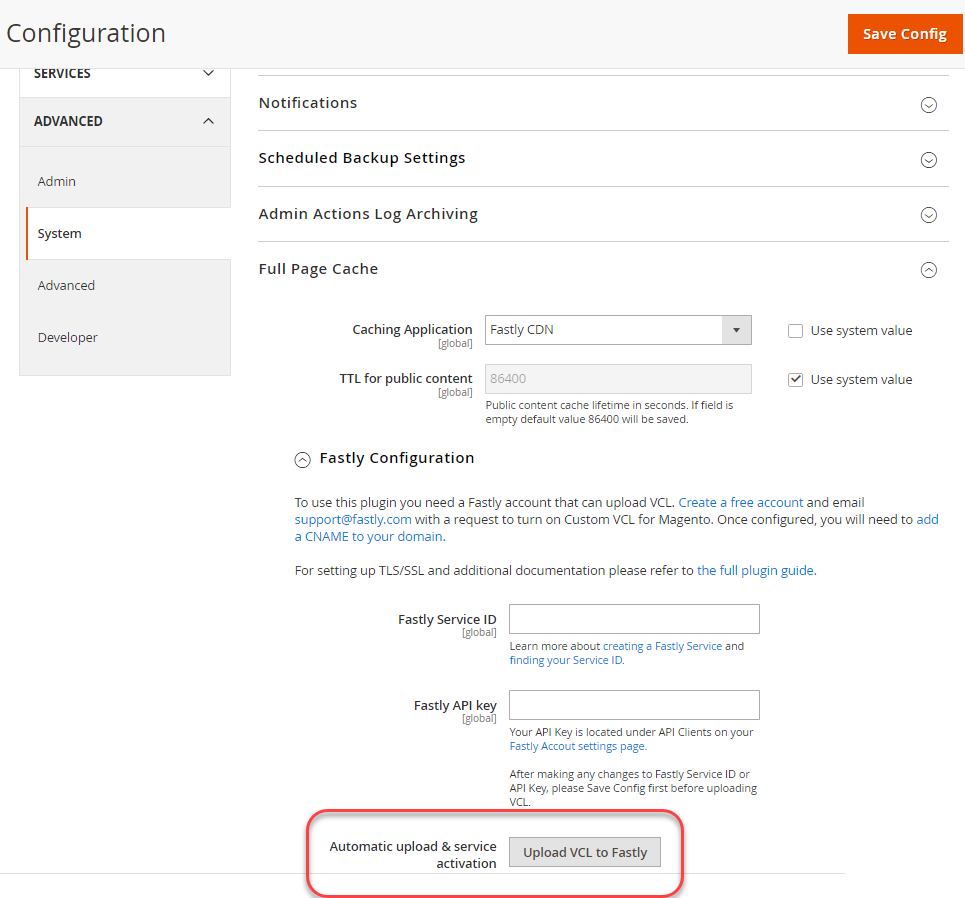

# Fastly サービスの設定

Fastly は、クラウドインフラストラクチャー上のAdobe Commerceのステージング環境および実稼動環境で必要です。

Fastly は、Varnish と連携して高速キャッシュ機能と、静的アセット用のコンテンツ配信ネットワーク（CDN）を提供します。 また、Fastly は、サイトとクラウドインフラストラクチャを保護するための web アプリケーションファイアウォール（WAF）も提供しています。 悪意のあるトラフィックや攻撃からサイトやクラウドインフラストラクチャを保護するには、すべての受信サイトトラフィックを Fastly 経由でルーティングします。

>[!NOTE]
>
>Fastly は、統合環境では使用できません。

サイト開発プロセスの早い段階で Fastly を有効にし、設定し、テストして、サイトへの安全なアクセスを可能にするには、次の手順を実行します。

- ステージング環境と実稼動環境での Fastly 資格情報の取得
- Fastly CDN キャッシュの有効化
- Fastly VCL スニペットのアップロード
- Fastly サービスにトラフィックをルーティングするように DNS 設定を更新します。
- Fastly キャッシュのテスト

>[!NOTE]
>
>Fastly の初期設定を有効にして確認したら、設定をカスタマイズできます。 例えば、画像の最適化、エッジモジュール、カスタム VCL コードなどの追加オプションを有効にできます。 [ キャッシュ設定のカスタマイズ ](fastly-custom-cache-configuration.md) を参照してください。

プロジェクトのプロビジョニング時に、Adobeはクラウドインフラストラクチャ上のAdobe Commerceの [Fastly サービスアカウント ](fastly.md#fastly-service-account-and-credentials) にプロジェクトを追加し、スターターインスタンスと Pro ステージングおよび実稼動 `master` 境の Fastly アカウント資格情報を作成します。 各環境には一意の資格情報があります。

Adobe Commerce管理者から Fastly CDN サービスを設定し、Fastly API リクエストを送信するには、Fastly 資格情報が必要です。

## Fastly 管理ダッシュボードへのアクセス

クラウドインフラストラクチャー上のAdobe Commerceを使用して、Fastly Admin Dashboard に直接アクセスすることはできません。

お使いの環境の Fastly 設定をレビューおよび更新するには、Adobe Commerce管理者を使用する必要があります。 管理者の Fastly 機能を使用して問題を解決できない場合は、[Adobe Commerce サポートチケット ](https://experienceleague.adobe.com/docs/commerce-knowledge-base/kb/help-center-guide/magento-help-center-user-guide.html#submit-ticket) を送信します。

## Fastly 資格情報の取得

以下の方法を使用して、お使いの環境の Fastly サービス ID と API トークンを検索して保存します。

**Fastly 資格情報を表示するには**:

資格情報の表示方法は、Pro プロジェクトと Starter プロジェクトで異なります。

- IaaS でマウントされた共有ディレクトリ - Pro プロジェクトでは、SSH を使用してサーバーに接続し、`/mnt/shared/fastly_tokens.txt` ファイルから Fastly 資格情報を取得します。 ステージング環境と実稼動環境には、一意の資格情報があります。 各環境の資格情報を取得する必要があります。

- ローカルワークスペース – コマンドラインから `magento-cloud` CLI を使用して、Fastly 環境変数を [ リストおよび確認 ](../environment/variables-cloud.md#viewing-environment-variables) します。

  ```bash
  magento-cloud variable:get -e <environment-ID>
  ```

- [!DNL Cloud Console] - [ 環境設定 ](../project/overview.md#configure-environment) で次の環境変数を確認します。

   - `CONFIG__DEFAULT__SYSTEM__FULL_PAGE_CACHE__FASTLY__FASTLY_API_KEY`

   - `CONFIG__DEFAULT__SYSTEM__FULL_PAGE_CACHE__FASTLY__FASTLY_SERVICE_ID`

>[!NOTE]
>
>ステージング環境または実稼動環境の Fastly 資格情報が見つからない場合は、Adobe カスタマーテクニカルアドバイザー（CTA）にお問い合わせください。

## Fastly キャッシュの有効化

Fastly サービスを有効にして設定するには、次のコンポーネントが必要です。

- ステージング環境と実稼動環境にインストールされた最新バージョンの [Fastly CDN for Magento 2 モジュール ](fastly.md#fastly-cdn-module-for-magento-2)。 [Fastly へのアップグレード ](#upgrade-the-fastly-module) を参照してください。

- クラウドインフラストラクチャステージング環境および実稼動環境でのAdobe Commerce用 [Fastly 資格情報 ](#get-fastly-credentials)

**ステージング環境と実稼動環境で Fastly CDN キャッシュを有効にするには**:

{{admin-login-step}}

1. **ストア**/設定/**設定**/**詳細**/**システム** をクリックし、「**フルページキャッシュ**」を展開します。

   

1. _キャッシュアプリケーション_ セクションで、**システム値を使用** の選択を解除し、ドロップダウンリストから **Fastly CDN** を選択します。

   

1. **Fastly 設定** を展開し、[ キャッシュオプションを選択 ](https://github.com/fastly/fastly-magento2/blob/master/Documentation/CONFIGURATION.md#configure-the-module) します。

1. キャッシュオプションを設定したら、ページ上部の **設定を保存** をクリックします。

1. 通知に従ってキャッシュをクリアします。

1. **ストア**/**設定**/**設定**/**詳細**/**システム**/**Fastly 設定** に戻って、Fastly の設定を続行します。

### Fastly 資格情報のテスト

1. 管理者で、**ストア**/設定/**設定**/**詳細**/**システム**/**Fastly 設定** に移動します。

1. 必要に応じて、プロジェクト環境の **Fastly サービス ID** と **API トークン** の値を追加します。

   

   >[!NOTE]
   >
   >Fastly API トークンを作成するには、リンクを選択しないでください。 代わりに、Adobeが提供する [Fastly 資格情報（サービス ID と API トークン） ](#get-fastly-credentials) を使用します。

1. 「**認証情報をテスト**」をクリックします。

1. テストが成功した場合は、[**構成の保存**] をクリックし、キャッシュをクリアします。

   テストが失敗した場合は、正しいサービス ID と API トークンの値が、現在の環境の資格情報と一致することを確認します。

   テストが再び失敗した場合は、Adobe Commerce サポートチケットを送信するか、Adobe アカウント担当者にお問い合わせください。 Pro プロジェクトの場合は、実稼動サイトとステージングサイトの URL を含めます。 スタータープロジェクトの場合は、`Master` ージおよびステージングサイトの URL を含めます。

>[!NOTE]
>
>ステージング環境または実稼動環境用の Fastly API トークン資格情報の変更手順については、[Fastly 資格情報の変更 ](fastly.md#change-fastly-api-token) を参照してください。

### Fastly への VCL のアップロード

Fastly モジュールを有効にしたら、デフォルトの [VCL コード ](https://github.com/fastly/fastly-magento2/tree/master/etc/vcl_snippets) を Fastly サーバーにアップロードします。 このコードは、クラウドインフラストラクチャ上のAdobe Commerceのキャッシュおよびその他の Fastly CDN サービスを有効にするための設定を指定する一連の VCL スニペットを提供します。

>[!NOTE]
>
>Fastly キャッシュサービスは、Adobe Commerceのステージングサイトおよび実稼動サイトへの Fastly VCL コードの最初のアップロードを完了するまで機能しません。

**Fastly VCL をアップロードするには**:

1. _Fastly 設定_ セクションで、**VCL を Fastly にアップロード** をクリックします（下図を参照）。

   

1. アップロードが完了したら、ページ上部の通知に従ってキャッシュを更新します。

## SSL/TLS 証明書のプロビジョニング

Adobeは、ドメインで検証された Let’s Encrypt SSL/TLS 証明書を提供し、Fastly から安全な HTTPS トラフィックを提供します。 Adobeは、実稼動環境、ステージング環境、スターター実稼動環境ごとに 1 つの証明書を提供し、その環境内のすべてのドメインを保護します。 提供された証明書について詳しくは、[ クラウドインフラストラクチャー上のAdobe Commerce用Adobe SSL （TLS）証明書 ](https://experienceleague.adobe.com/docs/commerce-knowledge-base/kb/how-to/ssl-tls-certificates-for-magento-commerce-cloud-faq.html) を参照してください。

>[!NOTE]
>
>Adobeが提供する Let’s Encrypt 証明書を使用する代わりに、独自の TLS または SSL 証明書を指定できます。 ただし、このプロセスでは、の設定と保守に追加の作業が必要です。 このオプションを選択するには、Adobe Commerce サポートチケットを送信するか、Adobeと連携してクラウドインフラストラクチャ環境のAdobe Commerceにカスタムのホスト型証明書を追加します。

Adobe Commerce環境に対して SSL/TLS 証明書を有効にするには、Adobeの自動処理で次の手順が実行されます。

- ドメイン所有権を検証します
- ストアに対して指定されたトップレベルとサブドメインに対応する Let’s Encrypt SSL/TLS 証明書をプロビジョニングします
- サイトが稼動しているときに証明書をクラウド環境にアップロードします

この自動処理では、ドメイン検証情報を提供するために、サイトの DNS 設定を更新する必要があります。 次のいずれかの方法 **使用します**

- **DNS 検証** - ライブサイトの場合、Fastly サービスを指す CNAME レコードで DNS 設定を更新します
- **ACME チャレンジ CNAME レコード** - Adobeから提供される、環境内の各ドメインの ACME チャレンジ CNAME レコードを使用して DNS 設定を更新します

>[!TIP]
>
>アクティブでない実稼動ドメインがある場合は、ACME チャレンジ CNAME レコードをドメインの検証に使用します。 レコードを DNS 設定の早期段階に追加すると、Adobeは、サイトの起動前に、SSL/TLS 証明書を正しいドメインでプロビジョニングできます。 実稼動環境に起動する前に、これらのプレースホルダーレコードをAdobeから提供された CNAME レコードに置き換える必要があります。

ドメインの検証が完了すると、Adobeによって Let’s Encrypt TLS/SSL 証明書がプロビジョニングされ、実稼働のステージング環境または実稼動環境にアップロードされます。 この処理には、最大 12 時間かかる場合があります。 サイトの開発とサイトの立ち上げの遅延を防ぐために、DNS 設定の更新は数日前に行うことをお勧めします。

## 開発設定で DNS 設定を更新します

Fastly の初期セットアッププロセス中に、次の URL を使用して、ステージング環境と実稼動環境で Fastly キャッシュを設定およびテストできます。

- ステージング環境および実稼動環境を想定した場合：

   - `mcprod.<your-domain>.com`
   - `mcstaging.<your-domain>.com`

- スターター実稼動の場合のみ：

   - `mcprod.<your-domain>.com`

これらのデフォルトの実稼動前 URL は、プロジェクトのプロビジョニング後に使用できます。 `"your-domain"` の値は、オンボーディングプロセス中に指定したドメイン名です。

>[!NOTE]
>
>スタータープロジェクトでは、実稼動以外の環境にカスタムドメインを指定することはできません。

ストア URL から Fastly サービスにトラフィックをルーティングするには、DNS 設定を更新します。 設定を更新すると、Adobeによって、必要な SSL/TLS 証明書が自動的にプロビジョニングされ、クラウド環境にアップロードされます。 このプロビジョニングには最大 12 時間かかることがあります。

>[!NOTE]
>
>実稼動サイトを起動する準備が整ったら、DNS 設定を再度更新して、実稼動ドメインを Fastly サービスに指定し、追加の設定タスクを実行する必要があります。 [Launch チェックリスト ](../launch/checklist.md) を参照してください。

**前提条件：**

- Fastly モジュールを有効にします。
- デフォルトの Fastly VCL コードをアップロードします。
- 各環境の最上位ドメインとサブドメインのリストをAdobeに送信するか、Adobe Commerce サポートチケットを送信します。
- 指定したドメインがクラウド環境に追加されたことを確認するまで待ちます。
- スタータープロジェクトでは、ドメインを Fastly サービス設定に追加します。 [ ドメインの管理 ](fastly-custom-cache-configuration.md#manage-domains) を参照してください。
- DNS 設定の更新の詳細については、[DNS レジストラー ](https://lookup.icann.org/) で、ドメイン サービスの正しい方法を確認してください。

**開発用に DNS 設定を更新するには**:

1. CNAME レコードを追加して、実稼動前の URL を Fastly サービスに指定します。例：`prod.magentocloud.map.fastly.net`

   | ドメインまたはサブドメイン | CNAME |
   |---------------------------|----------------------------------|
   | mcprod.your-domain.com | prod.magentocloud.map.fastly.net |
   | mcstaging.your-domain.com | prod.magentocloud.map.fastly.net |

   CNAME レコードがライブの場合、Adobeは証明書をプロビジョニングし、SSL/TLS 証明書をアップロードします。

   >[!NOTE]
   >
   >実稼動サイトに apex ドメイン（`your-domain.com`）を使用する予定の場合、Fastly サーバーの IP アドレスを指すように DNS アドレスレコード（A レコード）を設定する必要があります。 [ 実稼働設定を使用した DNS 設定の更新 ](../launch/checklist.md#to-update-dns-configuration-for-site-launch) を参照してください。


1. ドメインの検証と実稼動 SSL/TLS 証明書の事前プロビジョニングのために、ACME チャレンジ CNAME レコードを追加します。次に例を示します。

   | ドメインまたはサブドメイン | CNAME |
   |-------------------------------------------|-------------------------------------------|
   | _acme-challenge.your-domain.com | 0123456789abcdef.validation.magento.cloud |
   | _acme-challenge.www.your-domain.com | 9573186429stuvwx.validation.magento.com |
   | _acme-challenge.mystore.your-domain.com | 1234567898zxywvu.validation.magento.cloud |
   | _acme-challenge.subdomain.your-domain.com | 1098765743lmnopq.validation.magento.cloud |

   >[!NOTE]
   >
   >この例の ACME チャレンジ レコードは、Adobe Commerceのステージングサイトと実稼動サイトをプロビジョニングするためのプレースホルダーではありません。 Adobeに連絡して、プロジェクトの正しい ACME チャレンジ記録情報を入手してください。

   CNAME レコードを追加した後、Adobeがドメインを検証し、環境用の SSL/TLS 証明書をプロビジョニングします。 これらのドメインから Fastly サービスにトラフィックをルーティングするように DNS コンフィギュレーションを更新すると、Adobeは証明書を環境にアップロードします。

1. Adobe Commerceのベース URL を更新します。

   - SSH を使用して実稼動環境にログインします。

     ```bash
     magento-cloud ssh
     ```

   - Cloud CLI を使用して、ストアのベース URL を変更します。

     ```bash
     php bin/magento setup:store-config:set --base-url="https://mcstaging.your-domain.com/"
     ```

   >[!NOTE]
   >
   >Cloud CLI を使用する代わりに、[Admin](https://experienceleague.adobe.com/docs/commerce-admin/stores-sales/site-store/store-urls.html) からベース URL を更新できます

1. Web ブラウザーを再起動します。

1. Web サイトをテストします。

## Fastly キャッシュのテスト

DNS 設定の変更が完了したら、[cURL](https://curl.se/) コマンドラインツールを使用して、Fastly キャッシュが機能していることを確認します。

**応答ヘッダーを確認するには**:

1. ターミナルでは、次の `curl` コマンドを使用してライブサイト URL をテストします。

   ```bash
   curl -vo /dev/null -H Fastly-Debug:1 https://<live-URL>
   ```

   静的ルートを設定していない場合や、ライブサイト上のドメインの DNS 設定が完了した場合は、`--resolve` フラグを使用して DNS の名前解決をバイパスします。

   ```bash
   curl -vo /dev/null -H Fastly-Debug:1 --resolve <live-URL-hostname>:443:<live-IP-address>
   ```

1. 応答で [headers](fastly-troubleshooting.md#check-cache-hit-and-miss-response-headers) を検証し、Fastly が機能していることを確認します。 応答に次の一意のヘッダーが表示されます。

   ```http
   < Fastly-Magento-VCL-Uploaded: yes
   < X-Cache: HIT, MISS
   ```

ヘッダーに正しい値がない場合は、[ 応答ヘッダーで見つかったエラーの解決 ](fastly-troubleshooting.md#curl) のトラブルシューティングのヘルプを参照してください。

## Fastly モジュールのアップグレード

Fastly は、Magento 2 モジュール用の Fastly CDN を更新して、問題の解決、パフォーマンスの向上、新機能の提供を行います。
ステージング環境および実稼動環境の Fastly モジュールを [ 最新バージョン ](https://github.com/fastly/fastly-magento2/blob/master/VERSION) に更新することをお勧めします。

モジュールを更新したら、VCL コードをアップロードして、変更を Fastly サービス設定に適用する必要があります。

>[!WARNING]
>
> デフォルトの Fastly VCL コードをカスタムバージョンでカスタマイズしている場合、Fastly モジュールをアップグレードすると、変更内容が上書きされます。 一意の名前を持つカスタム VCL スニペットを追加した場合、その変更はアップグレード プロセス中も保持されます。 ベストプラクティスとしては、ステージング環境をアップグレードし、変更を検証してから実稼動環境に適用します。

**Magento 2 用 Fastly CDN モジュールのバージョンを確認するには**:

1. をクラウド環境のルートディレクトリに変更します。

1. Composer を使用して、インストールされているバージョンをチェックします。

   ```bash
   composer show *fastly*
   ```

1. [ 最新リリース ](https://github.com/fastly/fastly-magento2/releases) がインストールされていない場合は、Fastly モジュールをアップグレードする手順を実行します。

**Fastly モジュールをアップグレードするには**:

1. ローカル統合環境で、次のモジュール情報を使用して [Fastly モジュールをアップグレード ](../store/extensions.md#upgrade-an-extension) します。

   ```text
   module name: fastly/magento2
   repository: https://github.com/fastly/fastly-magento2.git
   ```

1. 更新内容をステージング環境にプッシュします。

1. ステージング環境の管理者にログインして、[VCL コードをアップロード ](#upload-vcl-to-fastly) します。

1. Adobe Commerce ステージングサイトで [Fastly サービスを検証 ](fastly-troubleshooting.md#verify-or-debug-fastly-services) します。

ステージングサイトで Fastly サービスを確認したら、実稼動環境でアップグレードプロセスを繰り返します。

>[!TIP]
>
> Adobe Commerce環境で Fastly サービスに関する問題が発生した場合は、[Adobe Commerce Fastly トラブルシュータ ](https://experienceleague.adobe.com/docs/commerce-knowledge-base/kb/troubleshooting/miscellaneous/magento-fastly-troubleshooter.html) を参照してください。
