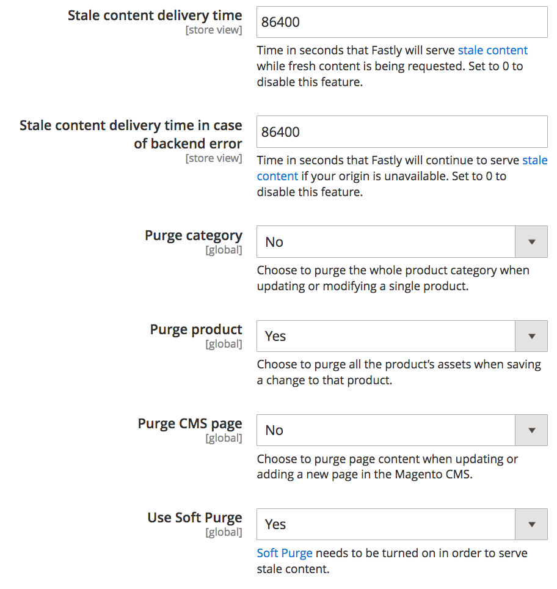
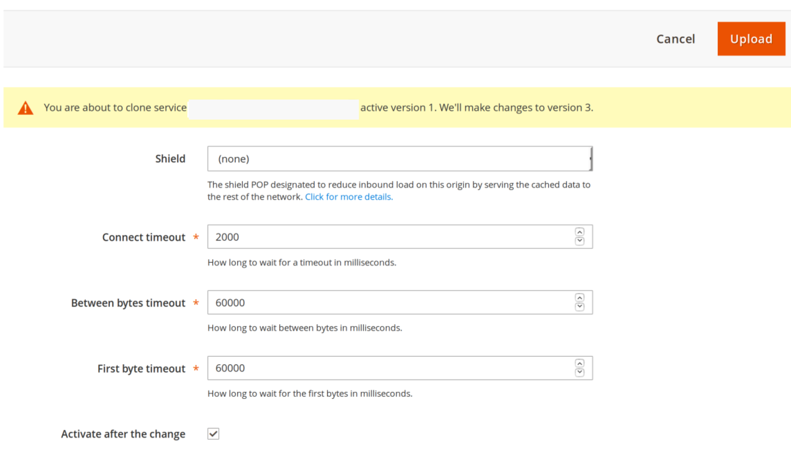
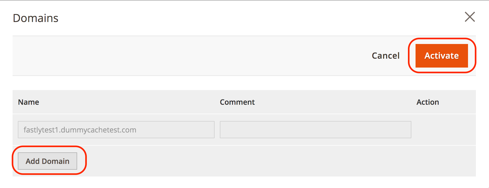
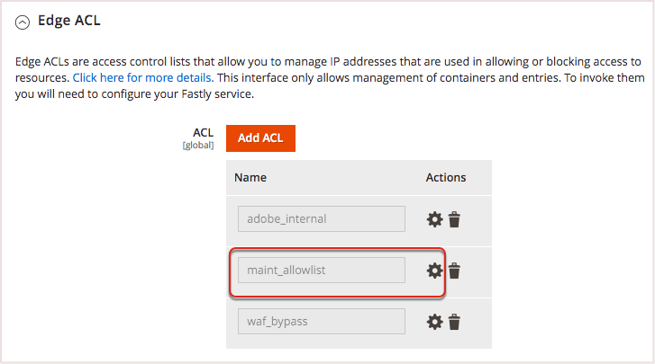

# キャッシュ設定のカスタマイズ

ステージング環境と実稼動環境でFastly サービスを設定してテストした後、キャッシュ設定設定を確認してカスタマイズします。 例えば、設定を更新して、TLSがHTTP リクエストをFastlyにリダイレクトし、パージ設定を更新し、開発中にサイトをパスワードで保護するための基本認証を有効にすることができます。

次の節では、一部のキャッシュ設定の概要と手順について説明します。

>[!IMPORTANT]
>
>Fastly キャッシュを設定するための利用可能な管理オプションは、Magento 2用Fastly CDN Moduleのどのバージョンがインストールされているかによって異なります。 Adobeでは、[ ステージング環境と実稼動環境のFastly モジュール ](fastly-configuration.md#upgrade)を最新バージョンにアップグレードすることをお勧めします。 最新の情報については、Fastly CDN for Magento2 モジュールの[ リリースノート ](https://github.com/fastly/fastly-magento2/blob/master/Release-Notes.md)を参照してください。

## TLSを強制

Fastlyは、暗号化されていない要求（HTTP）をFastlyにリダイレクトするための&#x200B;_Force TLS_ オプションを提供します。 ステージング環境または実稼動環境に[有効なSSL/TLS証明書](fastly-configuration.md#provision-ssltls-certificates)をプロビジョニングした後、ストアのFastly設定を更新して、TLSを強制オプションを有効にすることができます。 Magento 2 _向け_ Fastly CDN Moduleのドキュメントの[Force TLS ガイド ](https://github.com/fastly/fastly-magento2/blob/master/Documentation/Guides/FORCE-TLS.md)を参照してください。

>[!NOTE]
>
>「TLSを強制」オプションを有効にすることは、Adobe Commerce オンクラウドインフラストラクチャストアで推奨されるベストプラクティスです。

## Fastly タイムアウトの拡張

Fastly サービス設定では、管理者へのHTTPS リクエストに対して、デフォルトのタイムアウト期間として180秒を指定しています。 タイムアウト期間を超えるリクエスト処理では、503 エラーが返されます。 その結果、長時間の処理が必要なリクエストや、一括操作を実行しようとすると、503件のエラーが発生する可能性があります。

3分以上かかる一括アクションを完了するには、503 エラーを防ぐために&#x200B;_管理者パスのタイムアウト_&#x200B;値_を変更します。

>[!NOTE]
>
>**ストア** > **設定** > **詳細** > **管理者** > **管理者基本URL**&#x200B;の&#x200B;**カスタム管理パス** フィールドでカスタム管理パスエンドポイントを指定した場合は、その環境の[ADMIN_URL変数](../environment/variables-admin.md#change-the-admin-url)も同じ値に設定する必要があります。 設定が異なる場合、タイムアウトは機能しません。
>
>Fastly UIの管理者以外のFastly タイムアウトパラメーターを拡張するには、[長いジョブのタイムアウトを増やす](https://github.com/fastly/fastly-magento2/blob/master/Documentation/Guides/Edge-Modules/EDGE-MODULE-INCREASE-TIMEOUTS-LONG-JOBS.md)を参照してください。

**管理者**&#x200B;のFastly タイムアウトを拡張するには：

{{admin-login-step}}

1. **ストア** / 設定/**構成** / **詳細** / **システム**&#x200B;をクリックし、**フルページキャッシュ**&#x200B;を展開します。

1. _Fastly設定_ セクションで、**詳細設定**&#x200B;を展開します。

1. **管理者パスのタイムアウト**&#x200B;値を秒単位で設定します。 この値は、10分（600秒）を超えることはできません。

>[!NOTE]
>
>**_管理者パスのタイムアウト_**&#x200B;設定では、Fastly WAFのタイムアウトなど、Adobe Commerce以外のタイムアウト値は制御されません。 Fastly WAFのタイムアウト値を調整するには、Adobe サポートチケットを開いてFastly サービスで更新する必要があります。

1. ページの上部にある「**設定を保存**」をクリックします。

1. ページがリロードされたら、_Fastly設定_ セクションの「**VCLをFastly**&#x200B;にアップロード」を選択します。

VCL ファイルを生成するための管理パスを`app/etc/env.php`設定ファイルからFastlyに取得します。

## 消去オプションの設定

Fastlyは、商品カテゴリ、商品アセット、コンテンツをパージするオプションなど、Magentoのキャッシュ管理ページに複数のタイプのパージのオプションを提供します。 有効にすると、Fastlyはイベントを監視して、それらのキャッシュを自動的にパージします。 「パージ」オプションを無効にした場合は、キャッシュ管理ページで更新を完了した後、Fastly キャッシュを手動でパージできます。

パージのオプションには、次のものがあります。

- **カテゴリをパージ** – 製品カテゴリのコンテンツ（製品コンテンツではなく）を1つの製品を追加および更新するとパージします。 このオプションを無効にして、製品と製品カテゴリをパージする製品パージを有効にすることができます。
- **製品をパージ** – 製品に対して1つの変更を保存すると、すべての製品と製品カテゴリのコンテンツをパージします。 「製品のパージ」を有効にすると、価格の変更、製品オプションの追加、製品の在庫の在庫切れなど、顧客に関する最新情報をすぐに入手できます。
- **CMS ページをパージ**- Adobe Commerce CMSにページを更新および追加する際に、ページコンテンツをパージします。 例えば、利用条件または返品ポリシーを更新する際にパージする場合があります。 これらの変更をほとんど行わない場合は、自動消去を無効にすることができます。
- **ソフトパージ** – 古いコンテンツに変更し、古いタイミングに従ってパージします。 顧客には、古いタイミングに加えて、古いコンテンツが提供され、Fastlyはバックグラウンドでコンテンツを更新します。

**Fastlyの消去オプションを設定するには**:

1. _Fastly Configuration_ セクションで、**詳細設定**&#x200B;を展開して、パージ オプションを表示します。

1. 各パージ オプションで、**Yes**&#x200B;を選択して自動パージを有効にするか、**No**&#x200B;を選択して自動パージを無効にします。

   パージ オプションを無効にする場合、_キャッシュ管理_ ページからそのカテゴリのキャッシュを手動でパージする必要があります。

1. ページの上部にある「**設定を保存**」をクリックします。

1. ページがリロードされたら、_Fastly設定_ セクションの「**VCLをFastly**&#x200B;にアップロード」を選択します。

詳しくは、[Fastlyの設定オプション ](https://github.com/fastly/fastly-magento2/blob/21b61c8189971275589219d418332798efc7db41/Documentation/CONFIGURATION.md#further-configuration-options)を参照してください。

## GeoIP処理の設定

Fastly モジュールには、訪問者を自動的にリダイレクトしたり、取得した国コードに一致するストアのリストを提供したりするためのGeoIP処理が含まれています。 GeoIP処理に拡張機能を既に使用している場合は、Fastly オプションを使用して機能を確認する必要がある場合があります。

**GeoIp処理を設定するには**:

{{admin-login-step}}

1. **ストア** / 設定/**構成** / **詳細** / **システム**&#x200B;をクリックし、**フルページキャッシュ**&#x200B;を展開します。

1. _Fastly設定_ セクションで、**詳細設定**&#x200B;を展開します。

1. 下にスクロールして、**はい**&#x200B;から&#x200B;**GeoIPを有効にする**&#x200B;を選択します。 追加の設定オプションが表示されます。

1. GeoIP アクションで、訪問者が&#x200B;**リダイレクト**&#x200B;で自動的にリダイレクトされるか、**ダイアログ**&#x200B;で選択するストアのリストが提供されるかを選択します。

1. **国マッピング**&#x200B;の場合、**追加**&#x200B;を選択して、リストから特定のAdobe Commerce ストアとマッピングする2文字の国コードを入力します。

   

1. ページの上部にある「**設定を保存**」をクリックします。

1. ページのリロード後、「_Fastly設定_」セクションで「**VCLをFastly**&#x200B;にアップロード」を選択します。

>[!NOTE]
>
>現在のAdobe Commerce Fastly GeoIP モジュールの実装では、複数のweb サイト間のリダイレクトはサポートされていません。

Fastlyは、カスタマイズされた位置情報コーディング用の[位置情報に関連する一連のVCL機能](https://developer.fastly.com/reference/vcl/variables/geolocation/)も提供しています。

## Fastly Edgeモジュールを有効にする

Fastly Edge Modulesは、テンプレートを通じてUI コンポーネントと関連するVCL コードを定義できる、柔軟なフレームワークです。 これらのモジュールにより、カスタム VCL スニペットを使用する代わりに、ユーザーインターフェイスを通じてFastly サービス設定を簡単にカスタマイズおよび拡張できます。

Edge モジュールを使用すると、CORS ヘッダーやCloud Sitemapの書き換えなどの特定の機能を有効にしたり、Adobe Commerce ストアと他のCMSやバックエンドとの統合を設定したりできます。

Edge モジュール メニューにアクセスして、使用可能なモジュールを表示、設定、管理するには、_Fastly Edge モジュールを有効にする_ オプションをオンにします。 Fastly CDN モジュールドキュメントの[Fastly Edge モジュール ](https://github.com/fastly/fastly-magento2/blob/master/Documentation/Guides/Edge-Modules/EDGE-MODULES.md)を参照してください。

## バックエンドとオリジンのシールドの設定

バックエンド設定では、オリジンのシールドとタイムアウトにより、Fastlyのパフォーマンスを細かく調整できます。 _バックエンド_&#x200B;は、特定の場所（IPまたはドメイン）で、キャッシュされたコンテンツを確認および提供するために、オリジン シールドとタイムアウト設定が構成されています。

_オリジンシールド_&#x200B;は、ストアに対するすべてのリクエストを特定のPoint of Presence （POP）にルーティングします。 リクエストを受け取ると、POPはキャッシュされたコンテンツをチェックして提供します。 キャッシュされない場合は、Shield POPに続き、コンテンツをキャッシュするOrigin サーバーに続きます。 シールドは発信元への直接トラフィックを減らします。

デフォルトのFastly VCL コードは、クラウドインフラストラクチャサイト上のAdobe Commerceのオリジンシールドとタイムアウトのデフォルト値を指定します。 場合によっては、デフォルト値を変更する必要があるかもしれません。 例えば、TTFB （Time to First Byte）エラーが発生した場合、_first byte timeout_&#x200B;値を調整する必要がある可能性があります。

>[!NOTE]
>
>サイトが[Wordpress](fastly-vcl-wordpress.md)のようなバックエンド統合を通じて機能的に配信される必要がある場合は、Fastly サービス設定をカスタマイズしてバックエンドを追加し、Adobe CommerceストアからWordpressへのリダイレクトを管理します。 詳しくは、Fastly モジュールドキュメントの「[Fastly Edge モジュール – その他のCMS/バックエンド統合](https://github.com/fastly/fastly-magento2/blob/master/Documentation/Guides/Edge-Modules/EDGE-MODULE-OTHER-CMS-INTEGRATION.md)」を参照してください。

**バックエンド設定の設定を確認するには**:

{{admin-login-step}}

1. **ストア** / 設定/**構成** / **詳細** / **システム**&#x200B;をクリックし、**フルページキャッシュ**&#x200B;を展開します。

1. 「**Fastly Configuration**」セクションを展開します。

1. **バックエンド設定**&#x200B;を展開し、ギアを選択してデフォルトのバックエンドを確認します。 モーダルが開き、現在の設定を変更するオプションが表示されます。

   

1. **Shield**&#x200B;の場所（またはデータセンター）を選択します。

   プロジェクトのデフォルトのFastly設定では、クラウドサービスのリージョンに最も近い場所が設定されます。 変更する必要がある場合は、デフォルトの場所に近い場所を選択します。

1. シールドへの接続、バイト間の時間、最初のバイトの時間のタイムアウト値（マイクロ秒単位）を変更します。 デフォルトのタイムアウト設定を維持することをお勧めします。

1. オプションで、を選択して&#x200B;**編集または保存後にバックエンドとシールドをアクティブ化**&#x200B;します。

1. 「**アップロード**」をクリックして変更を保存し、Fastly サーバーにアップロードします。

1. 管理者で、**設定を保存**&#x200B;を選択します。

詳しくは、Fastly モジュールドキュメントの[ バックエンド設定ガイド ](https://github.com/fastly/fastly-magento2/blob/21b61c8189971275589219d418332798efc7db41/Documentation/Guides/BACKEND-SETTINGS.md)を参照してください。

## 基本認証

基本認証とは、サイト上のすべてのページとアセットをユーザー名とパスワードで保護する機能です。

Adobe **では、実稼動環境で基本認証をアクティブ化することは**&#x200B;お勧めしません。 ステージングで設定して、開発プロセス中にサイトを保護できます。 Fastly CDN モジュールドキュメントの[基本認証ガイド ](https://github.com/fastly/fastly-magento2/blob/master/Documentation/Guides/BASIC-AUTH.md)を参照してください。

ユーザーアクセスを追加し、ステージングで基本認証を有効にした場合でも、追加の資格情報を必要とせずに管理者にアクセスできます。

>[!NOTE]
>
>Fastlyが有効になっている環境（ステージング環境や実稼動以外の実稼動環境など）については、**not**&#x200B;でCloud Consoleの[!UICONTROL Enable HTTP access control]を確認してください。 このようにアクセス制御が設定されている場合、以前にアクセス権を持っていたユーザーは、アクセス権が取り消された後でも、Fastlyによって資格情報がキャッシュされたままであれば、サイトにアクセスできる可能性があります。

## カスタム VCL スニペットの作成

Fastlyは、Varnish Configuration Language （VCL）のカスタマイズされたバージョンをサポートして、Fastly サービス設定をカスタマイズします。 例えば、EdgeおよびAccess Control List （ACL）ディクショナリを含むVCL コードブロックを使用して、特定のユーザーまたはIP アドレスに対するアクセスを許可、ブロック、またはリダイレクトできます。

カスタム VCL スニペット、エッジ ディクショナリ、およびACLを作成する手順については、[ カスタム Fastly VCL スニペット ](fastly-vcl-custom-snippets.md)を参照してください。

>[!NOTE]
>
>Fastly モジュール設定にカスタム VCL コード、エッジ ディクショナリ、およびACLを追加する前に、Fastly キャッシングサービスがデフォルト設定で動作することを確認してください。 [Fastlyの設定](fastly-configuration.md)を参照してください。

## ドメインの管理

スタータープロジェクトとPro プロジェクトの両方で、[!UICONTROL Domains] オプションを使用して、ストアのFastly ドメイン設定を追加および管理できます。

- スタータープロジェクトの場合は、[!DNL Cloud Console]の「[!UICONTROL Domains]」タブで「プロジェクト URL」に移動して、プロジェクト URLを追加します。

- Pro プロジェクトの場合は、[Adobe Commerce サポートチケット ](https://experienceleague.adobe.com/docs/commerce-knowledge-base/kb/help-center-guide/magento-help-center-user-guide.html#submit-ticket)を送信して、ドメインをクラウドプロジェクト設定に追加します。 サポートチームはまた、Adobe Commerce Fastly アカウント設定を更新して、ドメインを追加します。

**管理者**&#x200B;からFastly ドメイン設定を管理するには：

{{admin-login-step}}

1. **ストア** / 設定/**構成** / **詳細** / **システム**&#x200B;を選択し、**フルページキャッシュ**&#x200B;を展開します。

1. 管理者&#x200B;_Fastly設定_ セクションで、**ドメイン**&#x200B;を選択します。

1. 「**ドメインを管理**」をクリックして、ドメインページを開きます。

1. Cloud環境のストアのトップレベル名とサブドメイン名を追加します。

   クラウドインフラストラクチャ設定に既に追加されているドメインのみを指定できます。

   のFastly ドメイン設定を追加

1. 「**アクティベート**」をクリックして、Fastly ドメイン設定を更新します。

>[!NOTE]
>
>同じドメインが別のFastly アカウントに設定されている場合は、ドメインをAdobe Commerceに追加する前に、Adobe Commerce サポートチケットを送信してドメイン委任をリクエストする必要があります。 [複数のFastly アカウントと割り当てられたドメイン ](fastly.md#multiple-fastly-accounts-and-assigned-domains)を参照してください。

## メンテナンスモードを有効にする

_メンテナンスモード_ オプションを使用すると、指定したIP アドレスからサイトへの管理アクセスを許可し、その他のすべてのリクエストのエラーページを返すことができます。

**管理アクセスでメンテナンスモードを有効にするには**:

1. 管理者で「_Fastly設定_」セクションを開きます。

1. _Edge ACL_ セクションで、`maint_allow` アクセス制御リスト （ACL）を、メンテナンスモード中にストアにアクセスできる管理IP アドレスで更新します。

   

1. 「_メンテナンスモード_」セクションで、「**メンテナンスモードを有効にする**」を選択します。

   メンテナンスモードを有効にすると、`maint_allowlist` ACLのIP アドレスからのリクエストを除くすべてのトラフィックがブロックされます。 `maint_allowlist`を更新して、ACLのIP アドレスを変更できます。

   設定手順について詳しくは、Fastly CDN for Magento 2 モジュールのドキュメントの[ メンテナンスモードガイド ](https://github.com/fastly/fastly-magento2/blob/master/Documentation/Guides/MAINTENANCE-MODE.md)を参照してください。
