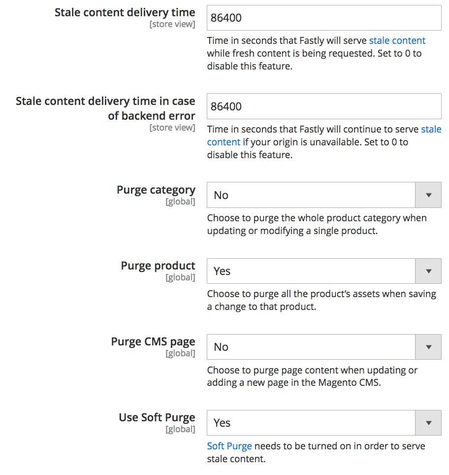

# キャッシュ設定のカスタマイズ

ステージング環境と実稼動環境で Fastly サービスを設定およびテストした後は、キャッシュ設定を確認し、カスタマイズします。 例えば、設定を更新して、TLS が HTTP 要求を Fastly にリダイレクトするように強制する、パージ設定を更新する、開発時にサイトをパスワードで保護するために基本認証を有効にするなどを行うことができます。

次の節では、キャッシュ設定の概要と設定方法について説明します。 使用可能な設定オプションについて詳しくは、[Fastly CDN Module for Magento 2](https://github.com/fastly/fastly-magento2/tree/master/Documentation) ドキュメントを参照してください。

## TLS を強制

Fastly には、暗号化されていない要求（HTTP）を Fastly にリダイレクトする _Force TLS_ オプションが用意されています。 ステージング環境または実稼動環境に [ 有効な SSL/TLS 証明書 ](fastly-configuration.md#provision-ssltls-certificates) がプロビジョニングされたら、ストアの Fastly 設定を更新して、「TLS を強制」オプションを有効にできます。 Magento 2 _ドキュメントの_ Fastly CDN モジュール ](https://github.com/fastly/fastly-magento2/blob/master/Documentation/Guides/FORCE-TLS.md)Fastly [Force TLS ガイド）を参照してください。

>[!NOTE]
>
>クラウドインフラストラクチャストア上のAdobe Commerceでは、「TLS を強制」オプションの有効化がベストプラクティスとして推奨されます。

## Fastly 拡張タイムアウト

Fastly サービス設定では、管理者への HTTPS リクエストに対してデフォルトのタイムアウト期間である 180 秒を指定しています。 タイムアウト期間を超えるリクエスト処理は、503 エラーを返します。 その結果、長い処理が必要なリクエストに応答したり、一括操作を実行しようとすると、503 エラーが発生する場合があります。

3 分を超える一括アクションを完了するには、_管理パスのタイムアウト_ 値_を変更して 503 エラーを防ぎます。

>[!NOTE]
>
>**ストア**/**設定**/**詳細**/**管理者**/**管理者のベース URL** の **カスタム管理パス** フィールドにカスタム管理パスエンドポイントを指定した場合は、その環境の [ADMIN_URL 変数 ](../environment/variables-admin.md#change-the-admin-url) を同じ値に設定する必要もあります。 設定が異なる場合、タイムアウトは機能しません。
>
>Fastly UI で管理者以外の Fastly タイムアウトパラメーターを拡張するには、[ 長いジョブのタイムアウトを増やす ](https://github.com/fastly/fastly-magento2/blob/master/Documentation/Guides/Edge-Modules/EDGE-MODULE-INCREASE-TIMEOUTS-LONG-JOBS.md) を参照してください。

**管理者の Fastly タイムアウトを拡張するには**:

{{admin-login-step}}

1. **ストア**/設定/**設定**/**詳細**/**システム** をクリックし、「**フルページキャッシュ**」を展開します。

1. _Fastly 設定_ セクションで、**詳細設定** を展開します。

1. **管理者パスのタイムアウト** 値を秒単位で設定します。 この値は、10 分（600 秒）を超えることはできません。

>[!NOTE]
>
>**_Admin path timeout_** 設定は、Fastly WAF タイムアウトなど、Adobe Commerce以外のタイムアウト値を制御しません。 Fastly WAFのタイムアウト値を調整するには、Adobe サポートチケットを開いて、Fastly サービスで更新する必要があります。

1. ページ上部にある「**設定を保存**」をクリックします。

1. ページのリロード後、「**Fastly 設定** セクションの _Fastly に VCL をアップロード_ を選択します。

Fastly は、`app/etc/env.php` 設定ファイルから VCL ファイルを生成するための管理者パスを取得します。

## パージオプションを設定

Fastly では、Magento Cache Management ページに、商品カテゴリ、商品アセット、コンテンツをパージするオプションなど、複数のタイプのパージオプションを提供しています。 有効にすると、Fastly はこれらのキャッシュを自動的にパージするイベントを監視します。 パージオプションを無効にした場合は、キャッシュ管理ページで更新を完了した後に、Fastly キャッシュを手動でパージできます。

パージのオプションには次のものがあります。

- **カテゴリをパージ** – 単一の製品を追加および更新すると、製品コンテンツではなく、製品カテゴリコンテンツがパージされます。 この機能を無効のままにして、「製品をパージ」を有効にすると、製品と製品カテゴリがパージされます。
- **製品をパージ** – 製品に対する 1 つの変更を保存すると、すべての製品および製品カテゴリコンテンツがパージされます。 製品のパージを有効にすると、価格の変更、製品オプションの追加、製品在庫が在庫切れになったときに、顧客にすぐにアップデートを送信できます。
- **CMSページをパージ** - Adobe Commerce CMSでページを更新して追加するときにページコンテンツをパージします。 例えば、利用規約や返品ポリシーを更新する際にパージすることができます。 これらの変更をほとんど行わない場合は、自動パージを無効にすることができます。
- **ソフトパージ** – 変更されたコンテンツを古いものに設定し、古くなったタイミングに従ってパージします。 古いタイミングに加えて、顧客には古いコンテンツが配信されるのに対して、Fastly はバックグラウンドでコンテンツを更新します。

**Fastly パージオプションを設定するには**:

1. 「_Fastly 設定_」セクションで、「**詳細設定**」を展開して、パージオプションを表示します。

1. 各パージオプションについて、「**はい**」を選択して自動パージを有効にするか、「**いいえ** を選択して自動パージを無効にします。

   パージ オプションを無効にした場合は、そのカテゴリのキャッシュを _キャッシュ管理_ ページから手動でパージする必要があります。

1. ページ上部にある「**設定を保存**」をクリックします。

1. ページのリロード後、「**Fastly 設定** セクションの _Fastly に VCL をアップロード_ を選択します。

詳しくは、[Fastly 設定オプション ](https://github.com/fastly/fastly-magento2/blob/21b61c8189971275589219d418332798efc7db41/Documentation/CONFIGURATION.md#further-configuration-options) を参照してください。

## GeoIP 処理の設定

Fastly モジュールには、訪問者を自動的にリダイレクトする GeoIP 処理や、取得した国コードに一致するストアのリストを提供する GeoIP 処理が含まれています。 GeoIP 処理に既に拡張機能を使用している場合は、Fastly オプションで機能を検証する必要がある場合があります。

**GeoIp 処理を設定するには**:

{{admin-login-step}}

1. **ストア**/設定/**設定**/**詳細**/**システム** をクリックし、「**フルページキャッシュ**」を展開します。

1. _Fastly 設定_ セクションで、**詳細設定** を展開します。

1. 下にスクロールして **はい** を選択し、**GeoIP を有効にする** を選択します。 追加の設定オプションが表示されます。

1. GeoIP アクションでは、訪問者が **リダイレクト** によって自動的にリダイレクトされるか、**ダイアログ** によって選択するストアのリストが提供されるかを選択します。

1. **国マッピング** の場合、「**追加** を選択して 2 文字の国コードを入力し、リストから特定のAdobe Commerce ストアにマッピングします。

   

1. ページ上部にある「**設定を保存**」をクリックします。

1. ページのリロード後、「**Fastly 設定** セクションの _Fastly に VCL をアップロード_ を選択します。

>[!NOTE]
>
>現在のAdobe Commerce Fastly GeoIP モジュールの実装では、複数の web サイト間のリダイレクトをサポートしていません。

また、Fastly は、カスタマイズされた位置情報コーディング用に一連の [ 位置情報関連の VCL 機能 ](https://developer.fastly.com/reference/vcl/variables/geolocation/) を提供しています。

## Fastly Edge モジュールの有効化

Fastly Edge モジュールは、テンプレートを使用して UI コンポーネントおよび関連する VCL コードを定義できる柔軟なフレームワークです。 これらのモジュールを使用すると、カスタム VCL スニペットを使用する代わりに、ユーザーインターフェイスを通じて Fastly サービス設定を簡単にカスタマイズおよび拡張できます。

Edge モジュールを使用すると、CORS ヘッダー、Cloud Sitemap の書き換えなどの特定の機能を有効にしたり、Adobe Commerce ストアと他の CMS またはバックエンドとの統合を設定したりできます。

Edge Modules メニューにアクセスして利用可能なモジュールを表示、設定、管理するには、_Fastly Edge モジュールを有効にする_ オプションをオンにします。 Fastly CDN モジュールドキュメントの [Fastly Edge モジュール ](https://github.com/fastly/fastly-magento2/blob/master/Documentation/Guides/Edge-Modules/EDGE-MODULES.md) を参照してください。

## バックエンドとオリジン シールドの設定

バックエンド設定では、オリジンのシールドとタイムアウトを使用して、Fastly パフォーマンスの微調整を行います。 _バックエンド_ は、キャッシュされたコンテンツを確認して提供するために設定されたオリジンシールドとタイムアウト設定を持つ特定の場所（IP またはドメイン）です。

_接触チャネルシールド_ は、ストアに対するすべてのリクエストを、特定のプレゼンスポイント（POP）にルーティングします。 リクエストを受信すると、POP はキャッシュされたコンテンツをチェックし、提供します。 キャッシュされていない場合、データは Shield POP に引き続き送信され、その後、コンテンツをキャッシュするオリジンサーバーに送信されます。 シールドは、接触チャネルへの直接トラフィックを減らします。

デフォルトの Fastly VCL コードは、クラウドインフラストラクチャサイト上のAdobe Commerceのオリジンシールドとタイムアウトのデフォルト値を指定します。 場合によっては、デフォルト値の変更が必要になることがあります。 例えば、Time to First Byte （TTFB）エラーが発生した場合は、_first byte timeout_ 値を調整する必要がある可能性があります。

>[!NOTE]
>
>サイトが [Wordpress](fastly-vcl-wordpress.md) のようなバックエンド統合を通じて機能的に配信される必要がある場合は、バックエンドを追加するように Fastly サービス設定をカスタマイズし、Adobe Commerce ストアから Wordpress へのリダイレクトを管理します。 詳しくは、Fastly モジュールのドキュメントの [Fastly Edge モジュール – その他のCMS/バックエンドの統合 ](https://github.com/fastly/fastly-magento2/blob/master/Documentation/Guides/Edge-Modules/EDGE-MODULE-OTHER-CMS-INTEGRATION.md) を参照してください。

**バックエンド設定の設定を確認するには**:

{{admin-login-step}}

1. **ストア**/設定/**設定**/**詳細**/**システム** をクリックし、「**フルページキャッシュ**」を展開します。

1. 「**Fastly 設定**」セクションを展開します。

1. **バックエンド設定** を展開し、歯車を選択してデフォルトのバックエンドを確認します。 現在の設定を変更するオプションを含むモーダルが開きます。

   

1. **シールド** の場所（またはデータセンター）を選択します。

   プロジェクトのデフォルトの Fastly 設定では、Cloud Service 地域に最も近い場所が設定されます。 変更が必要な場合は、デフォルトの場所に近い場所を選択します。

1. シールドへの接続のタイムアウト値（マイクロ秒単位）、バイト間の時間、最初のバイトの時間を変更します。 デフォルトのタイムアウト設定を維持することをお勧めします。

1. 必要に応じて、「編集または保存後にバックエンドとシールドをアクティベート **を選択し** す。

1. **アップロード** をクリックして、変更を保存し、Fastly サーバーにアップロードします。

1. 管理者で、「**設定を保存**」を選択します。

詳しくは、Fastly モジュールのドキュメントにある [ バックエンド設定ガイド ](https://github.com/fastly/fastly-magento2/blob/21b61c8189971275589219d418332798efc7db41/Documentation/Guides/BACKEND-SETTINGS.md) を参照してください。

## 基本認証

基本認証は、サイト上のすべてのページとアセットを保護する機能です
ユーザー名とパスワード。 基本 **アクティブ化する** お勧めしません）
実稼動環境での認証。 ステージングで設定できます
開発プロセス中にサイトを保護します。 Fastly CDN モジュールのドキュメントの [ 基本認証ガイド ](https://github.com/fastly/fastly-magento2/blob/master/Documentation/Guides/BASIC-AUTH.md) を参照してください。

ユーザーアクセスを追加し、ステージングで基本認証を有効にした場合も、引き続き可能です
追加の資格情報を必要とせずに管理者にアクセスする。

## カスタム VCL スニペットの作成

Fastly では、Fastly サービス設定をカスタマイズするために、Varnish Configuration Language （VCL）のカスタマイズバージョンをサポートしています。 例えば、エッジおよびアクセス制御リスト （ACL）辞書を持つ VCL コードブロックを使用して、特定のユーザーまたは IP アドレスに対するアクセスを許可、ブロック、またはリダイレクトできます。

カスタム VCL スニペット、エッジ辞書、ACL を作成する手順については、[Custom Fastly VCL スニペット ](fastly-vcl-custom-snippets.md) を参照してください。

>[!NOTE]
>
>カスタム VCL コード、エッジ辞書、ACL を Fastly モジュール設定に追加する前に、Fastly キャッシュサービスがデフォルト設定で機能することを確認してください。 [Fastly の設定 ](fastly-configuration.md) を参照してください。

## ドメインの管理

スタータープロジェクトと Pro プロジェクトの両方で、[!UICONTROL Domains] オプションを使用して、ストアの Fastly ドメイン設定を追加および管理できます。

- スタータープロジェクトの場合は、プロジェクトの「[!UICONTROL Domains]」タブで「プロジェクト URL」に移動して [!DNL Cloud Console] ロジェクト URL を追加します。

- Pro プロジェクトの場合は、[Adobe Commerce サポートチケット ](https://experienceleague.adobe.com/docs/commerce-knowledge-base/kb/help-center-guide/magento-help-center-user-guide.html#submit-ticket) を送信して、ドメインをクラウドプロジェクト設定に追加します。 また、サポートチームは、Adobe Commerce Fastly アカウント設定を更新して、ドメインを追加します。

**管理者から Fastly ドメイン設定を管理するには**:

{{admin-login-step}}

1. **ストア**/設定/**設定**/**詳細**/**システム** を選択し、「**フルページキャッシュ**」を展開します。

1. 「Admin _Fastly Configuration_」セクションで、「**ドメイン**」を選択します。

1. **ドメインを管理** をクリックして、ドメイン ページを開きます。

1. クラウド環境のストアの最上位およびサブドメイン名を追加します。

   指定できるのは、クラウドインフラストラクチャ設定に既に追加されているドメインのみです。

   

1. **アクティブ化** をクリックして、Fastly ドメイン設定を更新します。

>[!NOTE]
>
>同じドメインが異なる Fastly アカウントで設定されている場合、ドメインをAdobe Commerceに追加する前に、Adobe Commerce サポートチケットを送信してドメインデリゲーションをリクエストする必要があります。 [ 複数の Fastly アカウントと割り当てられたドメイン ](fastly.md#multiple-fastly-accounts-and-assigned-domains) を参照してください。

## メンテナンスモードの有効化

「_メンテナンスモード_」オプションを使用すると、指定した IP アドレスからのサイトへの管理アクセスが許可され、その他のすべてのリクエストについてはエラーページが返されます。

**管理アクセス権を持つメンテナンスモードを有効にするには**:

1. 管理で「_Fastly 設定_」セクションを開きます。

1. 「_Edgeの ACL_」セクションで、`maint_allow` の ACL （アクセス制御リスト）を、メンテナンスモード中にストアにアクセスできる管理 IP アドレスで更新します。

   

1. 「_メンテナンスモード_」セクションで、「**メンテナンスモードを有効にする**」を選択します。

   メンテナンスモードを有効にすると、`maint_allowlist` ACL の IP アドレスからのリクエストを除くすべてのトラフィックがブロックされます。 `maint_allowlist` を更新して、ACL の IP アドレスを変更できます。

   設定手順について詳しくは、Fastly CDN for Magento 2 モジュールドキュメントの [ メンテナンスモードガイド ](https://github.com/fastly/fastly-magento2/blob/master/Documentation/Guides/MAINTENANCE-MODE.md) を参照してください。
