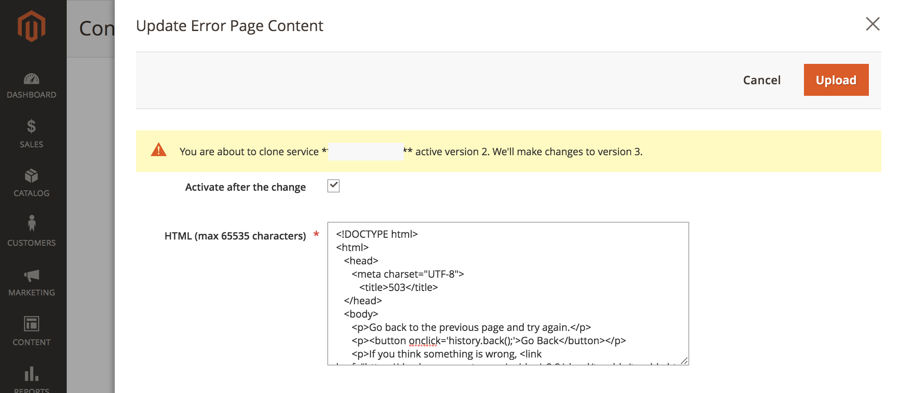
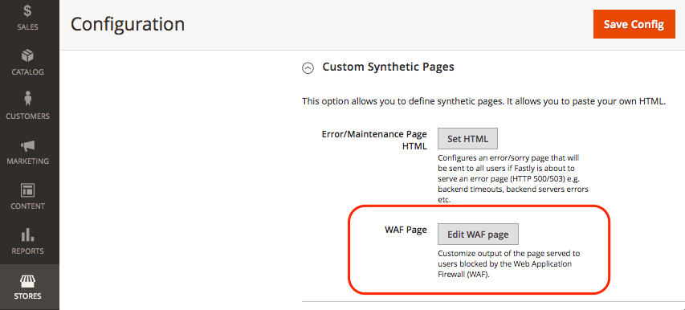

# エラーおよびメンテナンスページのカスタマイズ

Fastly オリジンへのリクエストが失敗した場合、Fastlyは、ユーザーにとって混乱しやすい基本的なフォーマットと汎用的なメッセージを含むデフォルトの応答ページを返します。 例えば、Fastlyは、503 エラーが原因でFastly オリジンへのリクエストが失敗した場合、次のデフォルトのエラーページを返します。


次の例に示すように、Adobe Commerce ストア設定を更新して、一部のデフォルトのレスポンスページを、より使いやすいメッセージングとHTMLのスタイルを改善したページに置き換えることができます。


現在、Adobe Commerce on cloud infrastructure プロジェクトに対して、次のFastly応答ページをカスタマイズできます。

- [サーバーエラー – 内部サーバーエラー、タイムアウト、またはサイトメンテナンスの停止（エラーコード 500以上）](#customize-the-503-error-page)
- [WAFが疑わしいリクエストトラフィックを検出したときに発生するWAF ブロッキングイベント（403 Forbidden）](#customize-the-waf-error-page)

**HTMLのコーディング要件：**

カスタムページのHTML コードは、次の要件を満たす必要があります。

- コンテンツには、最大65,535文字を含めることができます。
- HTML ソース内のすべてのCSS インラインを指定します。
- Fastlyがオフラインの場合でも表示されるように、base64を使用してHTML ページの画像をバンドルします。 css-tricks サイトの[&#x200B; データ URI](https://css-tricks.com/data-uris/)を参照してください。

## 503 エラーページのカスタマイズ

顧客には、次の場合にデフォルトの503 エラーページが表示されます。

- Fastly オリジンへのリクエストが500を超える応答ステータスを返す場合
- タイムアウト、メンテナンスアクティビティ、健康上の問題など、Fastlyの生成元が停止している場合

デフォルトページをカスタマイズするには、次のHTML コードを調整して、Adobe Commerce ストアのテーマに合わせてスタイルを設定し、必要に応じてタイトルとメッセージを変更します。

```html
<!DOCTYPE html>
<html>
   <head>
      <meta charset="UTF-8">
         <title>503</title>
   </head>
   <body>
      <p>Service unavailable</p>
   </body></html>
```

変更されたソースがブラウザーに正しく表示されていることを確認します。 次に、カスタマイズしたHTMLコードをFastly設定に追加します。

Fastly設定にカスタム応答ページを追加するには：

{{admin-login-step}}

1. **Stores** > **Settings** > **Configuration** > **Advanced** > **System**&#x200B;を選択します。

1. 右側のペインで、**フルページキャッシュ** > **Fastly設定** > **カスタム合成ページ**&#x200B;を展開します。

   

1. 「**HTMLを設定**」を選択します。

1. カスタムレスポンスページのソースコードをコピーして、HTML フィールドに貼り付けます。

   

1. ページの上部にある「**アップロード**」を選択して、カスタマイズしたHTML ソースをFastly サーバーにアップロードします。

1. ページの上部にある「**設定を保存**」を選択して、更新された設定ファイルを保存します。

1. キャッシュを更新します。

   - ページ上部の通知で、*キャッシュ管理* リンクを選択します。

   - キャッシュ管理ページで、**Magento キャッシュをフラッシュ**&#x200B;を選択します。

## WAF エラーページのカスタマイズ

Fastly オリジンへのリクエストが、[WAF](fastly-waf-service.md) ブロッキングイベントによって引き起こされた`403 Forbidden` エラーで失敗した場合、お客様には次のデフォルトのWAF エラーページが表示されます。


次のコードサンプルは、デフォルトページのHTML ソースを示しています。

```html
<html>
  <head>
    <title>Magento 403 Forbidden</title>
  </head>
  <body>
    <p>The requested URL was rejected.</p>
    <p>For additional information, please contact support and provide this reference ID:</p>
    <p>"} req.http.x-request-id {"</p>
    <p><button onclick='history.back();'>Go Back</button></p>
  </body>
</html>
```

Fastly設定メニューの「**カスタム合成ページ** > **WAFページを編集**」オプションを使用して、Adobe Commerce on cloud infrastructure プロジェクトのデフォルトコードをカスタマイズできます。 コードを編集する場合は、WAF ブロックイベントの参照IDを提供する次の行を保持します。

```html
<p>"} req.http.x-request-id {"</p>
```

>[!NOTE]
>
>「WAFを編集」オプションは、Adobe Commerce on cloud インフラストラクチャプロジェクトでManaged Cloud WAF サービスが有効になっている場合にのみ使用できます。

**WAF エラーページを編集するには**:

1. [管理者](../../get-started/onboarding.md#access-your-admin-panel)にログインします。

1. **Stores** > **Settings** > **Configuration** > **Advanced** > **System**&#x200B;を選択します。

1. 右側のペインで、**フルページキャッシュ** > **Fastly設定** > **カスタム合成ページ**&#x200B;を展開します。

   

1. 「**WAF ページを編集**」を選択します。

1. HTMLを更新するには、フィールドに入力します。

   

   - **ステータス** — `403 Forbidden` ステータスを選択します。
   - **MIME タイプ** — タイプ `text/html`。
   - **コンテンツ** — カスタム CSSを追加し、必要に応じてタイトルとメッセージを更新するには、デフォルトのHTML応答を編集します。

1. ページの上部にある「**アップロード**」を選択して、カスタマイズしたHTML ソースをFastly サーバーにアップロードします。

1. ページの上部にある「**設定を保存**」を選択して、更新された設定ファイルを保存します。

1. キャッシュを更新します。

   - ページ上部の通知で、**キャッシュ管理** リンクを選択します。

   - キャッシュ管理ページで、**Magento キャッシュをフラッシュ**&#x200B;を選択します。

## エラーレポート番号の表示

デフォルトでは、Fastlyは&#x200B;*503 Service Unavailable* エラーの背後にあるすべてのAdobe Commerce エラーを非表示にします。 エラーログレポート番号を表示して、ログ内のエラーの詳細を確認できるようにするには、次の手順を使用してFastlyを省略するweb サイトを開きます。

1. ストアのIP アドレスを取得します。

   - プロステージング環境および実稼動環境の場合：

     ```bash
     nslookup {your_project_id}.ent.magento.cloud
     ```

   - Pro統合環境およびスターター環境の場合：

     ```bash
     nslookup gw.{your_region}.magentosite.cloud
     ```

1. アプリケーションドメインとIP アドレスをローカルワークステーションのhosts ファイルに追加します。

   ```text
   {server_IP} {store_domain}
   ```

1. ブラウザーのキャッシュとCookieを消去します（またはシークレットモードに切り替えます）。

1. もう一度ストアサイトを開いて、エラーコードを表示します。

1. エラーコードを使用して、エラーレポートファイルの詳細を確認します。

   - [SSHを使用して影響を受ける環境に接続する](../development/secure-connections.md#connect-to-a-remote-environment)

   - `./var/report/{error_number}` ファイルを探します。
