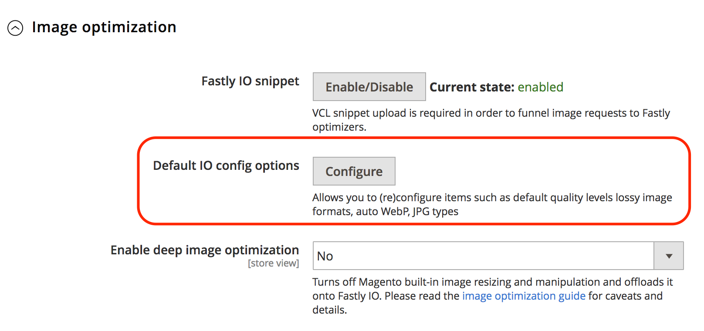
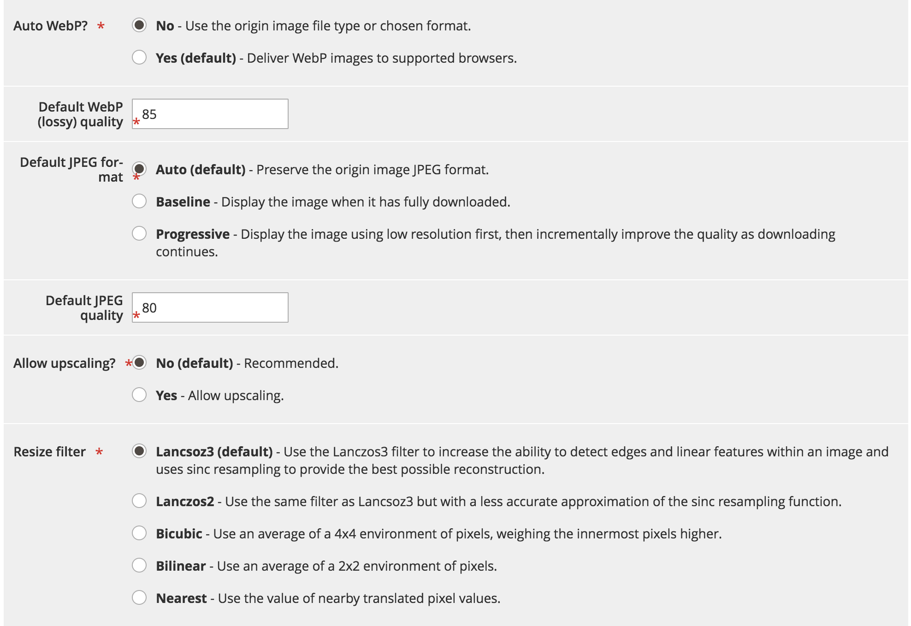
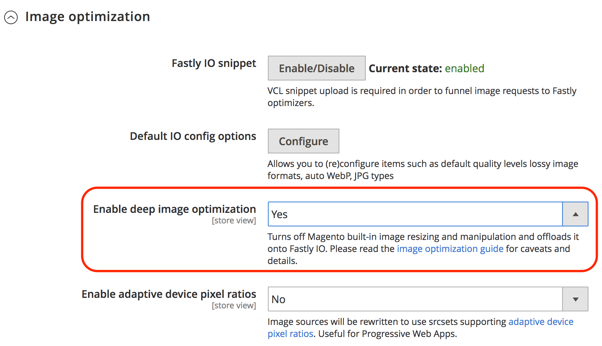
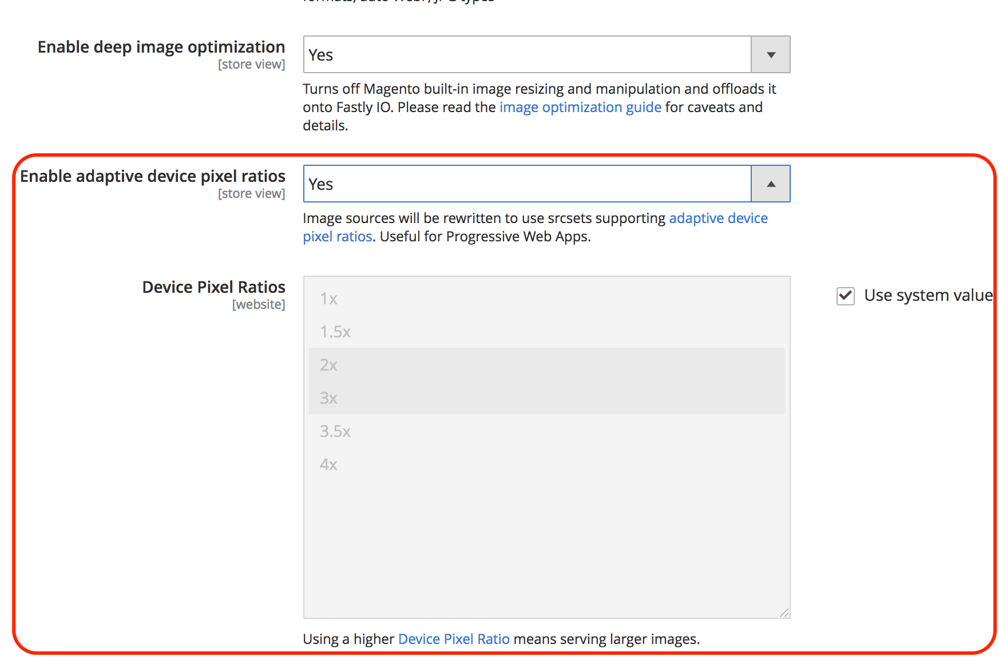

# Fastlyの画像最適化

Fastly画像最適化（Fastly IO）は、リアルタイムの画像操作と最適化を提供し、画像配信を高速化し、レスポンシブ web アプリケーションの画像ソースセットのメンテナンスを簡素化します。 Fastly IOを設定すると、次の画像最適化機能が提供されます。

- 非可逆コンバージョンを強制
- 高度な画像最適化
- アダプティブピクセル比
- 一般的な画像形式のサポート：PNG、JPEG、GIF、WebP

Fastly IO オプションを有効にして設定する前に、Fastly サービスを設定し、Origin シールドを設定する必要があります。

設定に基づいて、Fastly画像最適化（Fastly IO）スニペットはVCL コードを挿入して、ストアフロントでの製品画像配信を高速化する画像最適化を実行します。 Fastly IOを設定するには、有効、設定、検証の3つの手順があります。

## Fastly IOを有効にする

Fastly IO VCL スニペットをアップロードして、管理パネルからFastly画像最適化（Fastly IO）を有効にします。 スニペットには、デフォルトの設定を使用して、画像オプティマイザーを通じてすべての画像を処理するFastlyの設定手順が用意されています。

**前提条件：**

- Fastly モジュールバージョン 1.2.62以降をインストールまたはアップグレードする
- [Fastly Origin シールドとバックエンドの設定](fastly-custom-cache-configuration.md#configure-back-ends-and-origin-shielding)

**Fastly IO**&#x200B;を有効にするには：

1. ローカルの[管理者](../../get-started/onboarding.md#access-your-admin-panel) パネルに管理者としてログインします。

1. **Stores** > **Settings** > **Configuration** > **Advanced** > **System**&#x200B;を選択します。

1. 右側のペインで、**フルページキャッシュ**&#x200B;を展開します。

1. **Fastly Configuration** > **Image Optimization**&#x200B;を選択して、構成設定を指定します。

1. _Fastly IO スニペット_ フィールドで、**有効/無効**&#x200B;を選択します。

1. Fastly IO スニペットをアップロードします。

   - **既定のIO設定オプション**&#x200B;を選択して、画像最適化の既定の設定オプション ページを開きます。
   - 「**アップロード**」を選択して、VCL スニペットをサーバーにアップロードします。

## Fastly IOの設定

必要に応じて、画像の最適化に関するデフォルトのIO設定設定を確認して更新します。 例えば、非可逆的なフォーマットのWebPおよびJPEG画質レベルを変更したり、JPEG画像を提供するフォーマットを&#x200B;_プログレッシブ_&#x200B;または&#x200B;_ベースライン_&#x200B;に変更したりできます。 また、Fastly IOを使用すれば、次のような詳細な画像最適化機能を実現できます。

- 非可逆コンバージョンを強制
- 高度な画像最適化
- アダプティブピクセル比

**Fastly IO**&#x200B;を更新するには：

1. _デフォルト IO設定オプション_ フィールドの&#x200B;_Fastly設定_ ページで、**設定**&#x200B;を選択します。

   

1. _画像最適化のデフォルト設定オプション_ ページで、Fastly IOの設定設定を確認して更新します。

   

   - **自動WebP?** – 画像をサポートするブラウザーでWebP形式に変換するには、デフォルト設定（`Yes`）のままにします。 設定を&#x200B;**No**&#x200B;に変更すると、Fastlyは画像をWebP形式に変換する代わりに画像ファイルタイプを使用します。

   - **既定のWebP （非可逆）画質** - デフォルト設定（`85`）のままにするか、非可逆ファイル形式の画像の圧縮レベルを入力します。 1から100までの任意の整数を指定できます。

   - **既定のJPEG形式コントロール** – 既定の設定（`Auto`）のままにするか、画像の提供時に使用するJPEGの種類を選択します。 値が&#x200B;_Auto_&#x200B;に設定されている場合、Fastlyは入力タイプと一致する出力タイプの画像を配信します。 _ベースライン_&#x200B;を選択すると、画像が左上から右下に向かって行ごとに表示されます。 _プログレッシブ_&#x200B;を選択すると、読み込み時に鮮明になるぼやけた画像が表示されます。

   - **デフォルトのJPEG画質** – 初期設定（`85`）のままにするか、非可逆ファイル形式の画質の圧縮レベルを入力します。 1から100までの任意の整数を指定します。

   - **アップスケーリングを許可しますか？** - デフォルト設定（`No`）のままにするか、`Yes`を選択して、元のソースファイルよりも大きい画像を返し、要求されたサイズに合わせることができます。

   - **フィルター**&#x200B;のサイズ変更 – デフォルト設定（`Lancsoz3`）のままにするか、代替を選択します。 この設定では、サイズ変更された画像を配信するために使用するフィルターを指定します。 選択したフィルターに応じて、サイズ変更された画像のピクセル数を増減できます。

      - `Lanczos3` （デフォルト） – 最高画質の画像を提供します。 画像内のエッジと線形の特徴を検出する能力を高め、可能な限り最良の再構成を提供するために&#x200B;_[!DNL sinc]_&#x200B;リサンプリングを使用します。
      - `Lanczos2` - `Lancsoz3`と同じフィルターを使用しますが、_[!DNL sinc]_&#x200B;再サンプリング関数の精度が低くなります。
      - `Bicubic` – 画像を小さくすると、自然なシャープ効果が得られます。
      - `Bilinear` – 画像を大きくすると、自然なスムージング効果が得られます。
      - `Nearest` - ピクセルアートのサイズを変更すると、自然なピクセル化効果が得られます。

1. Fastly サービスのIO設定設定を指定したら、**キャンセル**&#x200B;を選択してFastly設定設定に戻ります。

1. 画像の最適化設定&#x200B;_詳細な画像の最適化を有効にする_ フィールドで、**はい**&#x200B;を選択して、詳細な画像の最適化を有効にします。

   

   深層画像最適化はデフォルトでオフになっています。 この機能が有効になっている場合、Adobe Commerceの組み込みのサイズ変更機能がオフになり、サイズ変更作業がFastly IO サービスにオフロードされます。 画像の最適化は、製品画像にのみ適用されます。 CMS画像のサイズは変更されません。 [Fastlyのドキュメント &#x200B;](#deep-image-optimization)を参照してください。

1. 深層画像の最適化を有効にした後、[&#x200B; アダプティブピクセル比](#adaptive-pixel-ratios)機能を有効にして、レスポンシブ web サイトでの使用に最適化された画像を生成します。

   

   - 「_アダプティブデバイスのピクセル比を有効にする_」フィールドで、**はい**&#x200B;を選択します。
   - 「_デバイスピクセルレシオ_」フィールドで、デフォルト設定を受け入れるか、「**システム入力**」チェックボックスを選択して設定を削除します。 次に、目的の比率を選択します。 デバイスピクセルレシオの設定を大きくすると、画像が大きくなります。

1. **設定を保存**&#x200B;を選択します。

### 非可逆コンバージョンを強制

デフォルトでは、Fastly IO サービスは、PNG、BMP、WEBPなどの可逆フォーマットをJPEG/WEBP フォーマットに強制的に変換します。

非可逆変換を強制する利点は、より小さな画像が提供されることです。
例えば、PNGの代わりにJPEGまたはWEBp形式を使用すると、Fastly IO設定で指定された品質レベルに応じて、サイズが60～70%縮小される場合があります。

画像の最適化で選択した画質レベルに応じて、画像の視覚的な違いが表示される場合があります。 例えば、Alphaのチャンネル/透明度は、テーマの背景色を使用した深層画像の最適化を使用しない限り、白い背景に削除されて置き換えられます。

非可逆変換（`WebP Auto? = No`）をオフにすると、Fastly IOは互換性のあるブラウザーのJPEG画像のみをWEBP形式に変更します。 他の画像タイプは変更されません。 例えば、元の画像がPNGの場合、Fastly IO サービスの出力はPNGになります。

### 高度な画像最適化

深層画像最適化はデフォルトでオフになっています。このオプションを有効にすると、組み込みのAdobe Commerceのサイズ変更がオフになり、Fastly IO サービスに完全にオフロードされます。
この機能では、_製品_&#x200B;の画像のサイズのみが変更されます。CMS画像のサイズは変更されません。

ディープ画像の最適化を有効にすると、テーマで定義されているすべての画像に背景色の定義が追加されます。 その結果、WebP画像はWebPの可逆からWebPの非可逆に切り替わります。 可逆画像と非可逆画像の大きな違いの1つは、非可逆画像がPNG画像からアルファチャンネルをドロップし、はるかに小さい画像を配信することです。 ただし、透明部分のある画像は、背景が異なる製品ページやキャンペーンページでは奇妙に見える場合があります。

例えば、次のコードは、Luma テーマからの画像の元のソースを表します。

```html

```

Fastly IOのディープ画像最適化機能が有効になっている場合、画像の元のソースコードが次の例に示すように書き換えられます。

```html

```

### アダプティブピクセル比

アダプティブピクセル比機能は、プログレッシブ web アプリケーションの画像を最適化するのに便利です。 製品画像ごとに`srcset`を追加することで、1つの画像ソースファイルから複数の画像サイズと解像度を配信できます。

アダプティブピクセル比機能が有効になっている場合、Fastly IO サービスは、様々な`device-pixel-ratios`に適応できる固定幅の画像を提供します。
例えば、次の例に示すように、サービスは製品画像定義を変更します。

```html

```

`srcset` [&#x200B; ブラウザーのサポート &#x200B;](https://caniuse.com/#feat=srcset)および[仕様](https://html.spec.whatwg.org/multipage/embedded-content.html#attr-img-srcset)を参照してください。

## Fastly IOの検証

Fastly IOを有効にして設定した後、Fastly IOが有効になっている場合とない場合でweb ページの速度テストを実行して、設定を検証します。 また、ストア内の画像を確認して、画像のサイズと外観に問題がないか確認します。

