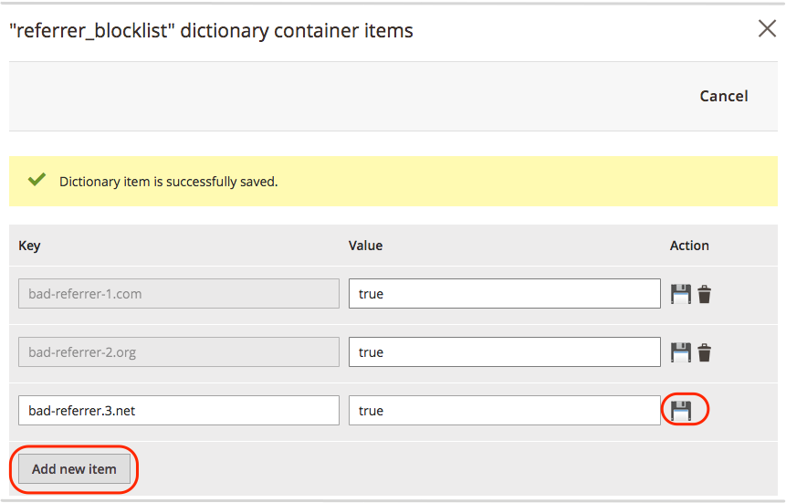

# ブロック紹介スパム

次の例は、[Fastly Edge Dictionary](https://docs.fastly.com/guides/edge-dictionaries/working-with-dictionaries-using-the-api)をカスタム VCL スニペットで設定して、Adobe Commerce on cloud infrastructure サイトからのリファラルスパムをブロックする方法を示しています。

>[!NOTE]
>
>ステージング環境にカスタム VCL設定を追加して、実稼動環境に対して実行する前にテストすることをお勧めします。

**前提条件：**

{{$include /help/_includes/vcl-snippet-prerequisites.md}}

- 偽の紹介URLがないかサイトログを確認し、ブロックするドメインのリストを作成します。

## リファラーブロックリストの作成

Edge ディクショナリは、VCL スニペット処理中にVCL関数にアクセス可能なキーと値のペアを作成します。 この例では、ブロックするリファラーweb サイトのリストを提供するエッジディクショナリを作成します。

{{admin-login-step}}

1. **Stores** > **Settings** > **Configuration** > **Advanced** > **System**&#x200B;をクリックします。

1. **フルページキャッシュ** > **Fastly Configuration** > **Edge ディクショナリ**&#x200B;を展開します。

1. 辞書コンテナを作成します。

   - 「**コンテナを追加**」をクリックします。

   - *コンテナ* ページで、**辞書の名前**—`referrer_blocklist`を入力します。

   - 変更の後に&#x200B;**アクティブ化**&#x200B;を選択して、編集中のFastly サービス設定のバージョンに変更をデプロイします。

   - 「**アップロード**」をクリックして、辞書をFastly サービス設定に添付します。

1. ブロックするドメイン名のリストを`referrer_blocklist`辞書に追加します。

   - `referrer_blocklist`辞書の設定アイコンをクリックします。

   - 新しい辞書にキーと値のペアを追加して保存します。 この例では、各&#x200B;**キー**&#x200B;はブロックするリファラーURLのドメイン名で、**値**&#x200B;は`true`です。

     

   - 「**キャンセル**」をクリックして、システム設定ページに戻ります。

1. 「**設定を保存**」をクリックします。

1. ページ上部の通知に従ってキャッシュを更新します。

Edge ディクショナリについて詳しくは、Fastly ドキュメントの[Edge ディクショナリの作成と使用](https://docs.fastly.com/guides/edge-dictionaries/working-with-dictionaries-using-the-api)および[&#x200B; カスタム VCL スニペット &#x200B;](https://docs.fastly.com/guides/edge-dictionaries/working-with-dictionaries-using-the-api#custom-vcl-examples)を参照してください。

## リファラースパムをブロックするためのカスタム VCL スニペットの作成

次のカスタム VCL スニペットコード（JSON形式）は、リクエストをチェックおよびブロックするロジックを示しています。 VCL スニペットは、リファラーサイトのホストをヘッダーにキャプチャし、ホスト名を`referrer_blocklist`辞書のURLのリストと比較します。 ホスト名が一致する場合、リクエストは`403 Forbidden` エラーでブロックされます。

```json
{
  "name": "block_bad_referrer",
  "dynamic": "0",
  "type": "recv",
  "priority": "5",
  "content": "if (req.http.Referer ~ \"^(.*:)//([A-Za-z0-9\-\.]+)(:[0-9]+)?(.*)$\") {set req.http.Referer-Host = re.group.2;}if (table.lookup(referrer_blocklist, req.http.Referer-Host)) {error 403 \"Forbidden\";}"
}
```

この例に基づいてスニペットを作成する前に、値を確認して、変更を加える必要があるかどうかを判断します。

- `name` — VCL スニペットの名前。 この例では、`block_bad_referrer`を使用しました。

- `dynamic` – 値0は、Fastly設定のバージョン管理されたVCLにアップロードする[通常のスニペット &#x200B;](https://docs.fastly.com/en/guides/using-regular-vcl-snippets)を示します。

- `priority` — VCL スニペットが実行されるタイミングを決定します。 このスニペットコードを実行する優先度は`5`です。このスニペットコードを実行すると、デフォルトのMagento VCL スニペット （`magentomodule_*`）のいずれかが優先度50に割り当てられます。 スニペットを実行するタイミングに応じて、各カスタムスニペットの優先度を50より高くまたは低く設定します。 優先度の低いスニペットが最初に実行されます。

- `type` - VCL バージョンでスニペットを挿入する場所を指定します。 この例では、VCL スニペットは`recv` スニペットです。 スニペットがVCL バージョンに挿入されると、デフォルトのFastly VCL コードの下、および任意のオブジェクトの上の`vcl_recv` サブルーチンに追加されます。

- `content` – 改行なしで1行で実行するVCL コードのスニペット。

環境のコードを確認して更新したら、次のいずれかの方法を使用して、Fastly サービス設定にカスタム VCL スニペットを追加します。

- [管理者](#add-the-custom-vcl-snippet)からカスタム VCL スニペットを追加します。 管理者にアクセスできる場合は、この方法をお勧めします。 （[Fastly バージョン 1.2.58](fastly-configuration.md#upgrade)以降が必要です）

- JSON コードの例をファイル （例：`allowlist.json`）に保存し、Fastly API[&#128279;](fastly-vcl-custom-snippets.md#manage-custom-vcl-snippets-using-the-api)を使用して アップロードします。 管理者にアクセスできない場合は、この方法を使用します。

## カスタム VCL スニペットの追加

{{admin-login-step}}

1. **ストア** / 設定/**構成** / **詳細** / **システム**&#x200B;をクリックします。

1. **フルページキャッシュ** > **Fastly設定** > **カスタム VCL スニペット**&#x200B;を展開します。

1. 「**カスタムスニペットを作成**」をクリックします。

1. VCL スニペット値を追加します。

   - **名前** — `block_bad_referrer`

   - **種類** — `recv`

   - **優先度** — `5`

   - **VCL** スニペットコンテンツ —

     ```conf
     if (req.http.Referer ~ "^(.*:)//([A-Za-z0-9\-\.]+)(:[0-9]+)?(.*)$") {
       set req.http.Referer-Host = re.group.2;  
     }
     if (table.lookup(referrer_blocklist, req.http.Referer-Host)) {
       error 403 "Forbidden";
     }
     ```

1. 「**作成**」をクリックします。

   

1. ページが再読み込みされたら、「*Fastly設定*」セクションの「**VCLをFastly**&#x200B;にアップロード」をクリックします。

1. アップロードが完了したら、ページ上部の通知に従ってキャッシュを更新します。

アップロードプロセス中に、更新されたVCL バージョンをFastlyが検証します。 検証が失敗した場合は、カスタム VCL スニペットを編集して問題を修正します。 次に、VCLをもう一度アップロードします。

{{automate-vcl-snippet-deployment}}

{{$include /help/_includes/vcl-snippet-modify.md}}

{{$include /help/_includes/vcl-snippet-delete.md}}

<!-- Last updated from includes: 2025-01-27 17:16:28 -->
