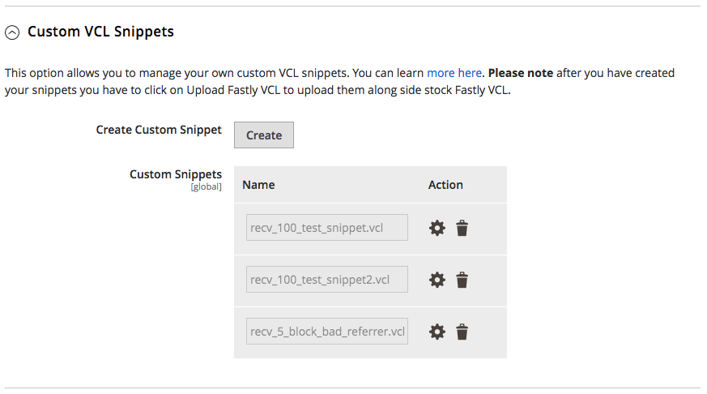

# カスタム VCLの概要

Fastlyでは、Varnish Configuration Language （VCL）のカスタマイズバージョンをサポートしており、Fastly サービス設定を要件に合わせてカスタマイズできます。

カスタム VCL スニペットは、Adobe Commerce サイトにアップロードされたアクティブ VCL バージョンに追加されたVCL ロジックのブロックです。 カスタム VCL スニペットは、Fastly キャッシングサービスがリクエストトラフィックに応答する方法を変更します。 例えば、カスタム VCL スニペットを追加して、指定したクライアント IP アドレスからのリクエストトラフィックのみを許可できます。 または、スニペットを作成して、Adobe Commerceのサイトにリファラルスパムを配信しているweb サイトからのトラフィックをブロックすることもできます。

カスタム VCL スニペット（生成、コンパイル、すべてのFastly キャッシュへの送信）をサーバーのダウンタイムなしで読み込み、アクティベートできます。

>[!NOTE]
>
>Fastly モジュール設定にカスタム VCL コード、エッジ ディクショナリ、およびACLを追加する前に、Fastly キャッシングサービスがデフォルト設定で動作することを確認してください。 [Fastly サービスの設定](fastly-configuration.md)を参照してください。

Fastlyは、次の2種類のカスタム VCL スニペットをサポートしています。

- [通常のスニペット &#x200B;](https://docs.fastly.com/en/guides/about-vcl-snippets)：カスタムの通常のVCL スニペットは、特定のVCL バージョン用にコーディングされます。 AdminまたはFastly APIから、通常のVCL スニペットを作成、変更、デプロイできます。

- [動的スニペット &#x200B;](https://docs.fastly.com/en/guides/using-dynamic-vcl-snippets) - Fastly APIを使用して作成されたVCL スニペット。 サービスのFastly VCL バージョンを更新することなく、動的スニペットを変更およびデプロイできます。

カスタムコードで使用されるデータを保存するには、Edge ディクショナリとアクセス制御リスト（ACL）でカスタム VCL スニペットを使用することをお勧めします。

- [**Edge ディクショナリ**](https://docs.fastly.com/guides/edge-dictionaries/about-edge-dictionaries) - カスタム VCL スニペットから参照できるディクショナリコンテナにデータをキーと値のペアとして保存します

- [**Edge ACL**](https://docs.fastly.com/guides/access-control-lists/about-acls)：カスタム VCL スニペットを使用して実装されたブロックまたは許可ルールのアクセス制御リストを定義するクライアント IP アドレス データを保存します

ディクショナリとACL データは、ネットワークリージョンをまたいでアクセスできるFastlyEdgeノードにデプロイされます。 また、ステージング環境または実稼動環境のVCL コードを再デプロイしなくても、データをネットワーク全体で動的に更新できます。

>[!NOTE]
>
>ステージング環境または実稼動環境にカスタム VCL スニペットを追加できるのは、その環境用に[設定されたFastly サービス &#x200B;](fastly-configuration.md)がある場合のみです。

## チュートリアル

このチュートリアルと例では、Adobe CommerceのFastly サービス設定をカスタマイズするために、Edge ディクショナリとEdge ACLで通常のカスタム VCL スニペットを使用する方法を示します。 詳細については、Fastlyのドキュメントを参照してください。

- [Fastly VCLのガイド &#x200B;](https://docs.fastly.com/guides/vcl/guide-to-vcl) - Fastly Varnishの実装、Fastly VCL拡張機能、およびVarnishとVCLの詳細を学ぶためのリソースに関する情報。
- [Fastly VCL リファレンス &#x200B;](https://docs.fastly.com/guides/vcl/) - Fastly カスタム VCLおよびカスタム VCL スニペットの開発とトラブルシューティングのための詳細なプログラミング リファレンス。

Adobe Commerce管理者またはFastly APIを使用して、カスタム VCL スニペットを作成および管理できます。

- [Adobe Commerce管理者](#manage-custom-vcl-from-admin) - Adobe Commerce管理者を使用して、VCLの変更を検証、アップロード、Fastly サービス設定に適用するプロセスを自動化するため、カスタム VCL スニペットを管理することをお勧めします。 また、管理者からFastly サービス設定に追加されたカスタム VCL スニペットを表示して編集することもできます。

- [Fastly API](#manage-vcl-using-the-api)：管理者にアクセスできない場合は、Fastly APIを使用してカスタム VCL スニペットを管理します。 例えば、サイトがダウンしている場合にFastly サービス設定をトラブルシューティングしたり、カスタム VCL スニペットを追加したりするためにAPIを使用します。 また、一部の操作はAPIを使用してのみ完了できます。 例えば、古いVCL バージョンを再アクティブ化したり、指定したVCL バージョンに含まれるすべてのVCL スニペットを表示したりするには、APIを使用する必要があります。 VCL スニペット [&#128279;](#api-quick-reference-for-vcl-snippets)については、API クイックリファレンスを参照してください。

### VCL スニペットコードの例

次の例は、クライアント IP アドレスでトラフィックをフィルタリングするカスタム VCL スニペット（JSON形式）を示しています。

```json
{
  "service_id": "FASTLY_SERVICE_ID",
  "version": "{Editable Version #}",
  "name": "apply_acl",
  "priority": "100",
  "dynamic": "1",
  "type": "hit",
  "content": "if ((client.ip ~ {ACLNAME}) && !req.http.Fastly-FF){ error 403; }"
}
```

>[!WARNING]
>
>この例では、VCL コードはJSON ペイロードとしてフォーマットされており、ファイルに保存し、Fastly API リクエストで送信できます。 API リクエスト用にスニペットをJSONとして送信する際のJSON検証エラーを防ぐには、バックスラッシュを使用してコード内の特殊文字をエスケープします。 Fastly VCL ドキュメントの[動的VCL スニペットの使用](https://docs.fastly.com/vcl/vcl-snippets/)を参照してください。 管理者からVCL スニペットを送信する場合、特殊文字をエスケープする必要はありません。

`content` フィールドのVCL ロジックは、次のアクションを実行します。

- 各リクエストの`client.ip`の受信IP アドレスを確認します

- *ACLNAME* エッジ ACLに含まれるIP アドレスを持つリクエストをブロックし、`403 Forbidden` エラーを返します

次の表に、カスタム VCL スニペットのキーデータの詳細を示します。 詳しくは、Fastly ドキュメントの[VCL スニペット &#x200B;](https://docs.fastly.com/api/config#api-section-snippet)のリファレンスを参照してください。

| 値 | 説明 |
|--------------|-------------------------------------------------------------------------------------------------------------------------------------------------------------------------------------------------------------------------------------------------------------------------------------------------------------------------------------------------------------------------------------------------------------------------------------------------------------------------------------------------------------------------------------------------------------------------------------------------------------------------------------------------------------------------------------------------------------------------|
| `API_KEY` | Fastly アカウントにアクセスするためのAPI キー。 [資格情報の取得](fastly-configuration.md)を参照してください。 |
| `active` | スニペットまたはバージョンのアクティブステータス。 `true`または`false`を返します。 trueの場合、スニペットまたはバージョンが使用中です。 バージョン番号を使用して、アクティブなスニペットを複製します。 |
| `content` | 実行するVCL コードのスニペット。 FastlyはVCL言語の機能をすべてサポートしているわけではありません。 また、Fastlyは拡張機能にカスタム機能を提供しています。 サポートされている機能について詳しくは、[Fastly VCL プログラミングリファレンス &#x200B;](https://docs.fastly.com/vcl/reference/)を参照してください。 |
| `dynamic` | スニペットの動的ステータス： Fastly サービス設定のバージョン済みVCLに含まれる[通常のスニペット &#x200B;](https://docs.fastly.com/en/guides/about-vcl-snippets)の`false`を返します。 新しいVCL バージョンを必要とせずに変更およびデプロイできる[動的スニペット &#x200B;](https://docs.fastly.com/vcl/vcl-snippets/using-dynamic-vcl-snippets/)の`true`を返します。 |
| `number` | スニペットが含まれるVCL バージョン番号。 Fastlyは、サンプル値に&#x200B;*編集可能バージョン #*&#x200B;を使用します。 APIからカスタムスニペットを追加する場合は、API リクエストにバージョン番号を含めます。 管理者からカスタム VCLを追加すると、バージョンが提供されます。 |
| `priority` | カスタム VCL スニペット コードの実行時を指定する`1`から`100`までの数値。 優先度の低い値のスニペットが最初に実行されます。 指定しない場合、`priority`値はデフォルトで`100`になります。<p>優先度が`5`のカスタム VCL スニペットは直ちに実行されます。これは、リクエストルーティング（ブロックとリダイレクトの許可リストに加えるとリダイレクト）を実装するVCL コードに最適です。 優先度`100`は、デフォルトのVCL スニペットコードを上書きするのに最適です。<p>Magento-Fastly モジュールに含まれている[&#x200B; デフォルトのVCL スニペット &#x200B;](fastly-configuration.md#upload-vcl-snippets)はすべて`priority=50`です。<ul><li>他のすべてのVCL関数の後にカスタム VCL コードを実行し、デフォルトのVCL コードを上書きするには、`100`のような優先度を高く割り当てます。</li></ul> |
| `service_id` | 特定のステージング環境または実稼動環境のFastly サービス ID。 このIDは、プロジェクトがクラウドインフラストラクチャ [Fastly サービスアカウント &#x200B;](fastly.md#fastly-service-account-and-credentials)上のAdobe Commerceに追加されたときに割り当てられます。 |
| `type` | 生成されたスニペットを挿入する場所を指定します。例えば、`init` （サブルーチンの上）や`recv` （サブルーチン内）などです。 詳しくは、Fastly [VCL スニペット &#x200B;](https://docs.fastly.com/api/config#api-section-snippet)のリファレンスを参照してください。 |

## 管理者からのカスタム VCLの管理

カスタム VCL スニペット [&#128279;](https://github.com/fastly/fastly-magento2/blob/master/Documentation/Guides/CUSTOM-VCL-SNIPPETS.md)は、管理者の&#x200B;*Fastly設定* > *カスタム VCL スニペット* セクションから追加できます。



*カスタム VCL スニペット* ビューには、管理者を通じて追加されたスニペットのみが表示されます。 スニペットがFastly APIを使用して追加された場合は、APIを使用して[管理します](#manage-vcl-using-the-api)。

次の例は、管理者からカスタム VCL スニペットを作成および管理する方法、およびFastly Edge モジュールとEdge ディクショナリを使用する方法を示しています。

- [CMS バックエンドへのリクエストのルート変更](fastly-vcl-wordpress.md)
- [紹介スパムをブロック](fastly-vcl-badreferer.md)
- [ブロック紹介スパム](fastly-vcl-badreferer.md)
- [IP許可リスト用カスタム VCL](fastly-vcl-allowlist.md)
- [IPブロックリスト用カスタム VCL](fastly-vcl-blocking.md)
- [Fastly キャッシュをバイパス](fastly-vcl-bypass-to-origin.md)

## Commerce管理者で表示または変更できないスニペット

Commerce管理画面では、一部のスニペットを直接表示または変更することはできません。 例：[動的スニペット &#x200B;](https://docs.fastly.com/en/guides/using-dynamic-vcl-snippets)。 「カスタム VCL スニペット」セクションには、[Fastly管理ダッシュボード &#x200B;](fastly.md#fastly-service-account-and-credentials)にクラウドサポートチームによって直接追加されたスニペットは表示されません。


**クラウドサポートチームによって追加されたスニペットを確認するには：**

1. 「**ツール**」セクションに移動します。

1. _バージョン履歴_&#x200B;の横にある&#x200B;**すべてのバージョンを一覧表示**&#x200B;をクリックします。

1. 該当するVCL バージョンの横にある目のアイコンをクリックして、既存のスニペットを表示します。


## APIを使用したVCLの管理

次のチュートリアルでは、通常のVCL スニペットファイルを作成し、Fastly APIを使用してFastly サービス設定に追加する方法を示します。 スニペットは、*ターミナル* アプリケーションから作成および管理できます。 特定の環境にSSH接続は必要ありません。

**前提条件：**

- Fastly サービス用にAdobe Commerce on cloud インフラストラクチャ環境を設定します。 [Fastlyの設定](fastly-configuration.md)を参照してください。

- [Fastly APIへのリクエストを認証するために、Fastly API資格情報](fastly-configuration.md)を取得します。 ステージングまたは実稼動環境の正しい環境の資格情報を取得していることを確認してください。

- Fastly サービスの資格情報を、cURL コマンドで使用できるbash環境変数として保存します。

  ```bash
  export FASTLY_SERVICE_ID=<Service-ID>
  ```

  ```bash
  export FASTLY_API_TOKEN=<API-Token>
  ```

  書き出された環境変数は、現在のbash セッションでのみ使用でき、ターミナルを閉じると失われます。 新しい値を書き出すことで、変数を再定義できます。 Fastlyに関連する書き出された変数のリストを表示するには：

  ```bash
  export | grep FASTLY
  ```

## VCL スニペットの追加

このチュートリアルでは、Fastly APIを使用してカスタムスニペットを追加する基本的な手順について説明します。

>[!NOTE]
>
>Adobe Commerce管理者からカスタム VCL スニペットを管理する方法については、[Adobe Commerce管理者からVCLを管理](#manage-custom-vcl-from-admin)を参照してください。


**前提条件**

{{$include /help/_includes/vcl-snippet-prerequisites.md}}

### 手順1：アクティブなVCL バージョンを探す

Fastly API [&#x200B; バージョンを取得](https://docs.fastly.com/api/config#version_dfde9093f4eb0aa2497bbfd1d9415987)操作を使用して、アクティブなVCL バージョン番号を取得します。

```bash
curl -H "Fastly-Key: $FASTLY_API_TOKEN" https://api.fastly.com/service/$FASTLY_SERVICE_ID/version/active
```

JSON応答で、`number` キー（例：`"number": 99`）で返されるアクティブなVCL バージョン番号をメモします。 編集のためにVCLを複製する場合は、バージョン番号が必要です。

```json
{
  "testing": false,
  "locked": true,
  "number": 99,
  "active": true,
  "service_id": "872zhjyxhto5SIRb3GAE0",
  "staging": false,
  "created_at": "2019-01-29T22:38:53Z",
  "deleted_at": null,
  "comment": "Magento Module uploaded VCL",
  "updated_at": "2019-01-29T22:39:06Z",
  "deployed": false
}
```

後続のAPI リクエストで使用するために、アクティブなバージョン番号をbash環境変数に保存します。

```bash
export FASTLY_VERSION_ACTIVE=<Version>
```

### 手順2：アクティブなVCL バージョンとすべてのスニペットを複製する

カスタム VCL スニペットを追加または変更する前に、編集用にアクティブ VCL バージョンのコピーを作成する必要があります。 Fastly API [&#x200B; クローン &#x200B;](https://docs.fastly.com/api/config#version_7f4937d0663a27fbb765820d4c76c709)操作を使用します。

```bash
curl -H "Fastly-Key: $FASTLY_API_TOKEN" https://api.fastly.com/service/$FASTLY_SERVICE_ID/version/$FASTLY_VERSION_ACTIVE/clone -X PUT
```

JSON応答では、バージョン番号が増分され、*active* キー値は`false`です。 新しい非アクティブなVCL バージョンをローカルで変更できます。

```json
{
  "testing": false,
  "locked": false,
  "number": 100,
  "active": false,
  "service_id": "vW2bLFWhhto5SIRb3GAE0",
  "staging": false,
  "created_at": "2019-01-29T22:38:53Z",
  "deleted_at": null,
  "comment": "Magento Module uploaded VCL",
  "updated_at": "2019-01-29T22:39:06Z",
  "deployed": false
}
```

新しいバージョン番号をbash環境変数に保存して、後続のコマンドで使用します。

```bash
export FASTLY_EDIT_VERSION=<Version>
```

### 手順3：カスタム VCL スニペットの作成

カスタム VCL コードを作成し、次のコンテンツと形式でJSON ファイルに保存します。

```json
{
  "name": "<name>",
  "dynamic": "0",
  "type": "<type>",
  "priority": "100",
  "content": "<code all in one line>"
}
```

値は次のとおりです。

- `name` - VCL スニペットの名前。

- `dynamic` – これが[通常のスニペット &#x200B;](https://docs.fastly.com/en/guides/about-vcl-snippets)か[動的スニペット &#x200B;](https://docs.fastly.com/guides/vcl-snippets/using-dynamic-vcl-snippets)かを示します。

- `type` – 生成されたスニペットを挿入する場所を指定します。例えば、`init` （サブルーチンの上）や`recv` （サブルーチン内）などです。 これらの値について詳しくは、[Fastly VCL スニペットオブジェクト値](https://docs.fastly.com/api/config#snippet)を参照してください。

- `priority` - カスタム VCL スニペット コードの実行時間を決定する`1`から`100`までの値。 より低い値のカスタム VCL スニペットが最初に実行されます。

  Fastly VCL モジュールのデフォルトのVCL コードはすべて、`priority`/`50`です。 アクションを最後に実行する場合や、デフォルトのVCL コードを上書きする場合は、`100`など、より大きな数値を使用します。 カスタム VCL スニペット コードをすぐに実行するには、優先度を`5`などの低い値に設定します。

- `content` – 改行なしで1行で実行するVCL コードのスニペット。 [&#x200B; カスタム VCL スニペットの例](#example-vcl-snippet-code)を参照してください。

### 手順4:VCL スニペットをFastly設定に追加する

Fastly API [&#x200B; スニペットを作成](https://docs.fastly.com/api/config#snippet_41e0e11c662d4d56adada215e707f30d)操作を使用して、カスタム VCL スニペットをVCL バージョンに追加します。

```bash
curl -H "Fastly-Key: $FASTLY_API_TOKEN" https://api.fastly.com/service/$FASTLY_SERVICE_ID/version/$FASTLY_EDIT_VERSION/snippet -H 'Content-Type: application/json' -X POST --data @<filename.json>
```

`<filename.json>`は、前の手順で準備したファイルの名前です。 VCL スニペットごとに、このコマンドを繰り返します。

Fastly サービスから`500 Internal Server Error`応答を受け取った場合は、JSON ファイルの構文を確認して、有効なファイルをアップロードしていることを確認します。

### 手順5：カスタム VCL スニペットの検証とアクティブ化

カスタム VCL スニペットを追加すると、Fastlyは編集中のVCL バージョンにスニペットを挿入します。 変更を適用するには、次の手順を実行してVCL スニペットコードを検証し、VCL バージョンをアクティベートします。

1. Fastly API [VCL バージョンの検証](https://docs.fastly.com/api/config#version_97f8cf7bfd5dc2e5ea1933d94dc5a9a6)操作を使用して、更新されたVCL コードを検証します。

   ```bash
   curl -H "Fastly-Key: $FASTLY_API_TOKEN" https://api.fastly.com/service/$FASTLY_SERVICE_ID/version/$FASTLY_EDIT_VERSION/validate
   ```

   Fastly APIがエラーを返す場合は、問題を修正し、更新されたVCL バージョンを再度検証します。

1. 新しいVCL バージョンをアクティブ化するには、Fastly API [activate](https://docs.fastly.com/api/config#version_0b79ae1ba6aee61d64cc4d43fed1e0d5)操作を使用します。

   ```bash
   curl -H "Fastly-Key: $FASTLY_API_TOKEN" https://api.fastly.com/service/$FASTLY_SERVICE_ID/version/$FASTLY_EDIT_VERSION/activate -X PUT
   ```


## VCL スニペットのAPI クイックリファレンス

これらのAPI リクエストの例では、書き出された環境変数を使用して、Fastlyで認証するための資格情報を提供します。 これらのコマンドについて詳しくは、[Fastly API リファレンス &#x200B;](https://docs.fastly.com/api/config#vcl)を参照してください。

>[!NOTE]
>
>Fastly APIを使用して追加したスニペットを管理するには、次のコマンドを使用します。 管理者からスニペットを追加した場合は、[管理者を使用したVCL スニペットの管理](#manage-vcl-using-the-api)を参照してください。

- **アクティブなVCL バージョン番号を取得**

  ```bash
  curl -H "Fastly-Key: $FASTLY_API_TOKEN" https://api.fastly.com/service/$FASTLY_SERVICE_ID/version/active
  ```

- **サービスに添付されているすべての通常のVCL スニペットを一覧表示**

  ```bash
  curl -H "Fastly-Key: $FASTLY_API_TOKEN" https://api.fastly.com/service/$FASTLY_SERVICE_ID/version/$FASTLY_VERSION/snippet
  ```

- **個別のスニペットを確認**

  ```bash
  curl -H "Fastly-Key: $FASTLY_API_TOKEN" https://api.fastly.com/service/$FASTLY_SERVICE_ID/version/$FASTLY_VERSION/snippet/<snippet_name>
  ```

  `<snippet_name>`は、`my_regular_snippet`などのスニペットの名前です。

- **スニペットの更新**

  [準備済みのJSON ファイル &#x200B;](#step-3-create-a-custom-vcl-snippet)を変更し、次のリクエストを送信します。

  ```bash
  curl -H "Fastly-Key: $FASTLY_API_TOKEN" https://api.fastly.com/service/$FASTLY_SERVICE_ID/version/$FASTLY_VERSION/snippet/<snippet_name> -H 'Content-Type: application/json' -X PUT --data @<filename.json>
  ```

- **個別のVCL スニペットを削除**

  スニペットのリストを取得し、削除する特定のスニペット名で次の`curl` コマンドを使用します。

  ```bash
  curl -H "Fastly-Key: $FASTLY_API_TOKEN" https://api.fastly.com/service/$FASTLY_SERVICE_ID/version/$FASTLY_VERSION/snippet/<snippet_name> -X DELETE
  ```

- **デフォルトのFastly VCL コード [&#128279;](https://github.com/fastly/fastly-magento2/tree/master/etc/vcl_snippets)**&#x200B;の値を上書き

  更新された値を含むスニペットを作成し、優先度`100`を割り当てます。

<!-- Last updated from includes: 2025-01-27 17:16:28 -->
