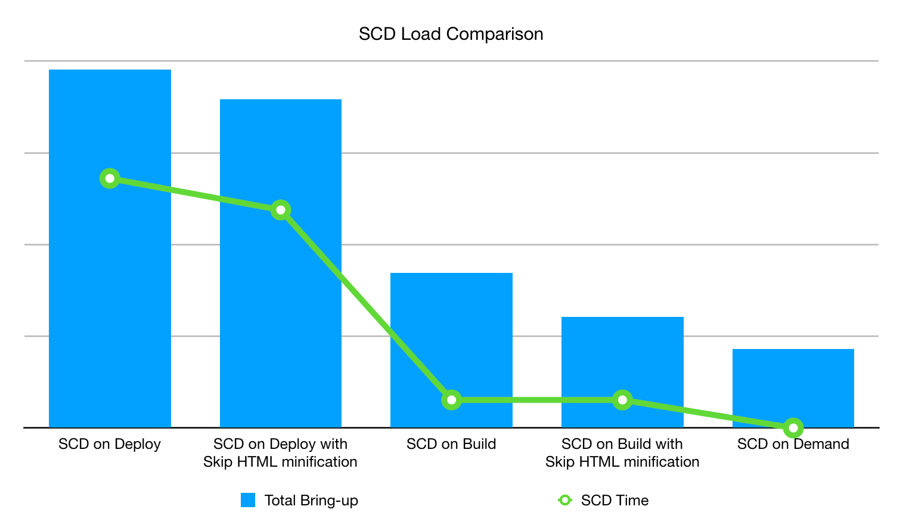

# 静的コンテンツの導入戦略

静的コンテンツのデプロイメント（SCD）は、画像、スクリプト、CSS、ビデオ、テーマ、ロケール、web ページなど、生成するコンテンツの量と、コンテンツを生成するタイミングに応じて、ストアのデプロイメントプロセスに大きな影響を与えます。 例えば、デフォルトの戦略では、サイトがメンテナンスモードの[&#x200B; デプロイフェーズ &#x200B;](process.md#deploy-phase-deploy-phase)中に静的コンテンツが生成されますが、このデプロイメント戦略では、マウントされた`pub/static` ディレクトリにコンテンツを直接書き込むのに時間がかかります。 ニーズに応じて、デプロイメント時間を短縮するのに役立つオプションや戦略がいくつかあります。

## JavaScriptとHTMLのコンテンツを最適化

バンドルおよび最小化を使用して、静的コンテンツのデプロイメント時に、最適化されたJavaScriptおよびHTML コンテンツを構築できます。

### コンテンツを最小化

`var/view_preprocessed` ディレクトリ内の静的ビューファイルのコピーをスキップし、要求されたときに&#x200B;_縮小_ HTMLを生成すると、デプロイメントプロセス中のSCD読み込み時間を短縮できます。 これを有効にするには、`.magento.env.yaml` ファイルの[SKIP_HTML_MINIFICATION](../environment/variables-global.md#skiphtmlminification) グローバル環境変数を`true`に設定します。

>[!NOTE]
>
>`ece-tools` パッケージバージョン 2002.0.13以降、SKIP_HTML_MINIFICATION変数のデフォルト値は`true`に設定されています。

不要なテーマファイルの数を減らすことで、**より**&#x200B;多くのデプロイメント時間とディスク容量を節約できます。 例えば、英語で`magento/backend` テーマを展開し、他の言語でカスタムテーマを展開できます。 これらのテーマ設定は、[SCD_MATRIX](../environment/variables-deploy.md#scdmatrix)環境変数で設定できます。

## デプロイ戦略の選択

デプロイメント戦略は、_ビルド_ フェーズ、_デプロイ_ フェーズ、または&#x200B;_オンデマンド_&#x200B;のいずれの段階で静的コンテンツを生成するかを選択するかによって異なります。 次の図に示すように、デプロイメントフェーズで静的コンテンツを生成することが最も最適ではありません。 縮小されたHTMLでも、各コンテンツファイルをマウントされた`~/pub/static` ディレクトリにコピーする必要があるため、時間がかかる場合があります。 オンデマンドで静的コンテンツを生成することは、最適な選択のように思えます。 ただし、コンテンツファイルがキャッシュに存在しない場合は、要求された時点で生成され、ユーザーエクスペリエンスに読み込み時間が追加されます。 そのため、ビルド段階での静的コンテンツの生成が最も最適です。



### ビルド時のSCDの設定

最小化されたHTMLを使用してビルド段階で静的コンテンツを生成することは、[**ダウンタイムがゼロ**&#x200B;のデプロイ &#x200B;](reduce-downtime.md)に最適な設定であり、**理想的な状態**&#x200B;とも呼ばれます。 マウントされたドライブにファイルをコピーする代わりに、`./init/pub/static` ディレクトリからシンボリックリンクを作成します。

静的コンテンツを生成するには、テーマとロケールにアクセスする必要があります。 Adobe Commerceは、ビルド段階でアクセス可能なファイルシステムにテーマを保存しますが、Adobe Commerceはデータベースにロケールを保存します。 データベースは、ビルド フェーズ中に&#x200B;_not_&#x200B;利用できます。 ビルド段階で静的コンテンツを生成するには、`ece-tools` パッケージの`config:dump` コマンドを使用して、ロケールをファイルシステムに移動する必要があります。 ロケールを読み取り、`app/etc/config.php` ファイルに保存します。

>[!NOTE]
>`ece-tools` パッケージで`config:dump` コマンドを実行すると、管理ダッシュボード [&#128279;](https://experienceleague.adobe.com/en/docs/commerce-knowledge-base/kb/troubleshooting/miscellaneous/locked-fields-in-magento-admin)で`config.php` ファイル にダンプされた設定がロック（グレー表示）されます。管理者でこれらの設定を更新する唯一の方法は、ファイルから削除してプロジェクトを再デプロイすることです。
>さらに、新しいストア/ストアグループ/web サイトをインスタンスに追加するたびに、`config:dump` コマンドを実行して、データベースが同期していることを確認する必要があります。`config.php` ファイルにダンプする設定[を選択することもできます](https://experienceleague.adobe.com/en/docs/commerce-operations/configuration-guide/cli/configuration-management/export-configuration?lang=en)。
> フィールドがグレー表示されているのに、この手順の実行を怠っているため、`config.php` ファイルからストア/ストアグループ/web サイト設定を削除すると、ダンプされていない新しいエンティティが次のデプロイメントでデータベースから削除されます。

**ビルド**&#x200B;でSCDを生成するようにプロジェクトを設定するには：

1. ローカル ワークステーションで、プロジェクト ディレクトリに移動します。
1. SSHを使用してリモート環境にログインします。

   ```bash
   magento-cloud ssh
   ```

1. ロケールをファイルシステムに移動してから、[`config.php` ファイル &#x200B;](../development/commerce-version.md#create-a-configphp-file)を更新します。

1. `.magento.env.yaml`設定ファイルには、次の値を含める必要があります。

   - [SKIP_HTML_MINIFICATION](../environment/variables-global.md#skip_html_minification)は`true`です
   - ビルド ステージの[SKIP_SCD](../environment/variables-build.md#skip_scd)は`false`です
   - [SCD_STRATEGY](../environment/variables-build.md#scd_strategy)は`compact`です

1. `.magento.app.yaml` ファイルの[&#x200B; デプロイ後のフック &#x200B;](../application/hooks-property.md)の設定を確認します。

1. 理想的な状態[&#128279;](smart-wizards.md)の スマートウィザードを実行して、設定を確認します。

   ```bash
   php ./vendor/bin/ece-tools wizard:ideal-state
   ```

### オンデマンドでのSCDの設定

オンデマンドでSCDを生成することは、統合環境での開発ワークフローにとって最適です。 実装をすばやくレビューし、統合テストを実行できるように、デプロイメントにかかる時間を短縮できます。 `.magento.env.yaml` ファイルのグローバルステージで[SCD_ON_DEMAND](../environment/variables-global.md#scdondemand)環境変数を有効にします。 SCD_ON_DEMAND変数は、SCDに関連するその他すべての設定を上書きし、`~/pub/static` ディレクトリから既存のコンテンツをクリアします。

SCD オンデマンド戦略を使用する場合、ホームページなど、リクエストするページを含むキャッシュをプリロードするのに役立ちます。 `.magento.env.yaml` ファイルのデプロイ後ステージの[WARM_UP_PAGES](../environment/variables-post-deploy.md#warmuppages)環境変数に、想定されるページのリストを追加します。

>[!WARNING]
>
>実稼動環境でSCD オンデマンド戦略を使用しないでください。

### SCDをスキップ

静的なコンテンツの生成を完全にスキップすることもできます。 グローバルステージで[SKIP_SCD](../environment/variables-build.md#skipscd)環境変数を設定して、SCDに関連するその他の設定を無視できます。 これは、`~/pub/static` ディレクトリ内の既存のコンテンツには影響しません。

