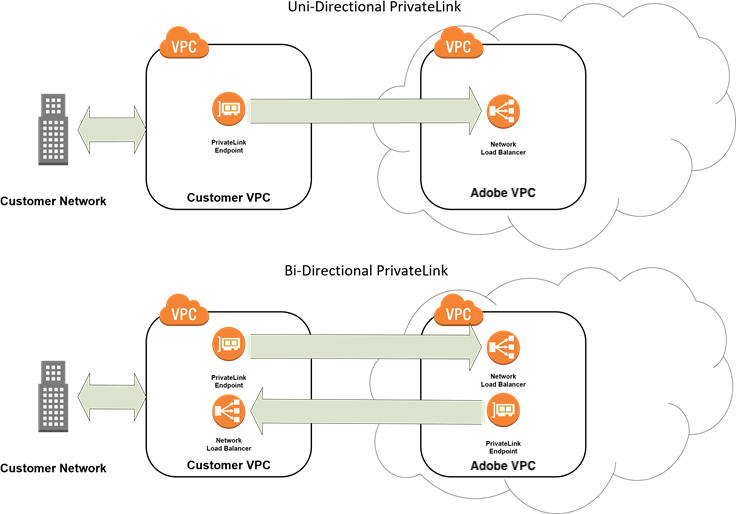

# PrivateLink サービス

Adobe Commerce on cloud infrastructureは、[AWS PrivateLink](https://aws.amazon.com/privatelink/)または[Azure Private Link](https://learn.microsoft.com/en-us/azure/private-link/) サービスとの統合をサポートしています。 PrivateLinkを使用すると、外部システムでホストされているサービスやアプリケーションを使用して、Adobe Commerceのクラウドインフラストラクチャ環境とセキュアなプライベート通信を確立できます。 Adobe Commerce アプリケーションと外部システムの両方に、同じクラウドリージョン内の同じクラウドプラットフォーム（AWSまたはAzure）で設定されたVirtual Private Cloud （VPC）エンドポイントを通じてアクセスできる必要があります。

>[!TIP]
>
>PrivateLinkは、データベースやファイル転送などのHTTP （S）以外の統合の接続を保護するのに最適です。 アプリケーションをAdobe Commerce APIと統合する場合は、_Adobe API Mesh for Adobe Developer App Builder_&#x200B;で[API Mesh](https://developer.adobe.com/graphql-mesh-gateway/gateway/create-mesh/)を作成する方法を参照してください。

## 機能とサポート

Adobe Commerce クラウドインフラストラクチャプロジェクト向けのPrivateLink サービス統合には、次の機能とサポートが含まれています。

- 同じCloud リージョン内の同じクラウドプラットフォーム（VPCまたはAzure）上のAdobe VPCと、お客様のVirtual Private Cloud （AWS）との間の安全な接続。
- AdobeとCustomer VPCで利用可能なエンドポイントサービス間の一方向または双方向のコミュニケーションをサポートします。
- サービス支援：

   - Adobe Commerce on cloud infrastructure環境で必要なポートを開きます
   - お客様とAdobe VPCの最初の接続を確立する
   - イネーブルメント中の接続の問題のトラブルシューティング

## 制限

- PrivateLinkのサポートは、Pro実稼動環境とステージング環境でのみ利用できます。 ローカル環境または統合環境、またはスタータープロジェクトでは使用できません。
- PrivateLinkを使用してSSH接続を確立することはできません。 [SSH キーを有効にする](secure-connections.md)を参照してください。
- Adobe Commerce サポートでは、初期イネーブルメント以外のAWS PrivateLinkの問題のトラブルシューティングは扱いません。
- お客様は、独自のVPCの管理に関連するコストについて責任を負います。
- プラットフォーム別&#x200B;**HTTPS プロトコル （ポート 443）のサポート：**
   - **Azure プライベートリンク**: [Fastly オリジンのクローキング &#x200B;](https://experienceleague.adobe.com/docs/commerce-knowledge-base/kb/faq/fastly-origin-cloaking-enablement-faq.html)により、HTTPS プロトコル（ポート 443）を使用してクラウドインフラストラクチャ上のAdobe Commerceに接続できません。
   - **AWS PrivateLink**: HTTPS プロトコル （ポート 443）接続がサポートされています。
- PrivateDNSは使用できません。

## PrivateLink接続タイプ

次のネットワーク図に示すように、PrivateLink接続タイプは2つあり、ストアとクラウド環境外でホストされている外部システムとの間で安全な通信を確立できます。



Adobe Commerce on cloud infrastructure環境に最適なPrivateLink接続タイプのいずれかを選択します。

- **単方向PrivateLink** – この設定を選択すると、Adobe Commerce on cloud インフラストラクチャ ストアから安全にデータを取得できます。
- **双方向PrivateLink** – この設定を選択すると、Adobe Commerce on cloud infrastructure環境以外のシステムとの間で安全な接続を確立できます。 双方向オプションには、次の2つの接続が必要です。

   - お客様のVPCとAdobe VPCのつながり
   - Adobe VPCとVPCのつながり

>[!TIP]
>
>PrivateLink接続タイプの選択やVPCの設定と管理に関するヘルプについては、ネットワーク管理者またはクラウドプラットフォームプロバイダーにお問い合わせください。 Cloud Platform PrivateLink ドキュメント：[AWS PrivateLink](https://aws.amazon.com/privatelink/)または[Azure Private Link](https://learn.microsoft.com/en-us/azure/private-link/)を参照してください。

## PrivateLinkの有効化をリクエスト

>[!WARNING]
>
>PrivateLinkを有効にするには、最大&#x200B;_5_&#x200B;営業日かかる場合があります。 不完全または不正確な情報を提供すると、プロセスが遅れる可能性があります。

### 前提条件

 Adobe Commerce on cloud infrastructure インスタンスと同じリージョンのCloud アカウント（AWSまたはAzure）。

 PrivateLinkを介して接続するサービスをホストするお客様の環境のVPC。 VPCの設定に関するヘルプについては、AWSまたはAzureのドキュメントを参照するか、ネットワーク管理者にお問い合わせください。

双方向のPrivateLink接続の場合、PrivateLinkの有効化をリクエストする前に、アプリケーションまたはサービスのエンドポイントサービス設定を作成し、VPC環境でエンドポイントを作成する必要があります。 [双方向PrivateLink接続の設定](#set-up-for-bidirectional-privatelink-connections)を参照してください。

PrivateLinkの有効化に必要な次のデータを収集します。

- **Customer Cloud アカウント番号** （AWSまたはAzure） – Adobe Commerce on cloud infrastructure インスタンスと同じリージョンにある必要があります
- **クラウド地域** - アカウントがホストされているクラウド地域を検証目的で指定します
- **サービスおよび通信ポート**:SQL ポート 3306、SFTP ポート 2222など、VPC間のサービス通信を有効にするには、Adobeでポートを開く必要があります
- **プロジェクト ID** - Adobe Commerce on cloud infrastructure Pro プロジェクト IDを指定します。 次の[Cloud CLI](../dev-tools/cloud-cli-overview.md) コマンドを使用して、プロジェクト IDおよびその他のプロジェクト情報を取得できます：`magento-cloud project:info`
- **接続タイプ** – 接続タイプの一方向または双方向を指定します
- **エンドポイントサービス** – 双方向PrivateLink接続の場合、Adobeが接続する必要があるVPC エンドポイントサービスのDNS URLを指定します（例：`com.amazonaws.vpce.<cloud-region>.vpce-svc-<service-id>`）
- **エンドポイントサービスアクセスが許可されました** – 外部サービスに接続するには、エンドポイントサービスに次のAWS アカウントプリンシパルへのアクセスを許可してください：`arn:aws:iam::402592597372:root`

  >[!WARNING]
  >
  >エンドポイントサービスへのアクセスが提供されない場合、VPCのサービスへの双方向PrivateLink接続が&#x200B;**not**&#x200B;追加され、設定が遅れます。

#### Azure プライベートリンクの有効化に固有のその他の前提条件

- クラスターIDを指定します。SSHを使用してリモートにログインし、次のコマンドを使用します：`cat /etc/platform_cluster`
- 外部サービスをAdobe Commerce Pro クラスターに接続するには、次のものが必要です。

   - 新しい外部プライベートエンドポイントに公開するPro クラスター上のポートのリスト
   - プライベートエンドポイント接続のAzure サブスクリプション IDの一覧

- Adobe Commerce Pro クラスターを外部サービスに接続するには、次の操作が必要です。

   - ターゲットサービスのリソース IDのリスト。 外部プライベートリンクサービス IDは、次のようになります。

  ```text
  /subscriptions/{subscriptionId}/resourceGroups/{resourceGroupName}/providers/Microsoft.Network/privateLinkServices/{svcNameID}
  ```

### イネーブルメントワークフロー

次のワークフローでは、PrivateLinkとAdobe Commerce オンクラウドインフラストラクチャとの統合のイネーブルメントプロセスの概要を説明します。

1. **お客様**&#x200B;が、件名`PrivateLink support for <company>`を含むPrivateLinkの有効化を要求するサポートチケットを送信しました。 チケットにイネーブルメント [&#128279;](#prerequisites)に必要な データを含めます。 Adobeでは、サポートチケットを使用して、イネーブルメントプロセス中のコミュニケーションを調整します。

1. **Adobe**&#x200B;は、Adobe VPCのエンドポイントサービスへの顧客アカウントアクセスを有効にします。

   - Adobe エンドポイントサービス設定を更新して、お客様のAWSまたはAzure アカウントから開始されたリクエストを受け入れるようにします。
   - サポート チケットを更新して、Adobe VPC エンドポイントのサービス名（例：`com.amazonaws.vpce.<cloud-region>.vpce-svc-<service-id>`）を指定します。

1. **お客様**&#x200B;は、Adobe エンドポイントサービスをCloud アカウント（AWSまたはAzure）に追加し、Adobeへの接続リクエストをトリガーします。 手順については、Cloud Platformのドキュメントを参照してください。

   - AWSについては、[ インターフェイス エンドポイント接続要求の受け入れと拒否]を参照してください。
   - Azureについては、[接続要求の管理]を参照してください。

1. **Adobe**&#x200B;が接続リクエストを承認します。

1. 接続リクエストの承認後、**お客様** [は、お客様のVPCとAdobe VPC間の接続](#test-vpc-endpoint-service-connection)を確認します。

1. 双方向接続を有効にするための追加の手順：

   - **Adobe**&#x200B;は、Adobe アカウント プリンシパル（AWSまたはAzure アカウントのルートユーザー）を提供し、お客様のVPC エンドポイントサービスへのアクセスをリクエストします。
   - **お客様**&#x200B;は、お客様のVPCのエンドポイントサービスへのAdobe アクセスを有効にします。 これは、Adobe アカウント プリンシパルが、**Endpoint service access granted**&#x200B;の前提条件で前述したように`arn:aws:iam::402592597372:root`へのアクセス権を持っていることを前提としています。

      - Adobe アカウントから開始されたリクエストを受け入れるように、顧客エンドポイントサービス設定を更新します。 手順については、Cloud Platformのドキュメントを参照してください。

         - AWSについては、[ エンドポイントサービスに対する権限の追加と削除]を参照してください。
         - Azureについては、[ プライベートエンドポイント接続の管理]を参照してください

      - Adobeに、お客様のVPCのエンドポイントサービス名を指定します。

   - **Adobe**&#x200B;は、customer endpoint serviceをAdobe platform アカウント（AWSまたはAzure）に追加し、customer VPCへの接続リクエストをトリガーします。
   - **お客様**&#x200B;は、設定を完了するためにAdobeからの接続リクエストを承認します。
   - **お客様** [は、Adobe VPCからの接続](#test-vpc-endpoint-service-connection)を確認します。

## VPC エンドポイントサービス接続のテスト

Telnet アプリケーションを使用して、VPC エンドポイントサービスへの接続をテストできます。

**VPC エンドポイントサービスへの接続をテストするには**&#x200B;次の手順を実行します。

1. プロジェクトのルートディレクトリから、PrivateLink エンドポイントサービスにアクセスするように設定されたステージング環境または実稼動環境を&#x200B;**チェックアウト**&#x200B;します。

   ```bash
   magento-cloud environment:checkout <environment-id>
   ```

1. 次のCURL コマンドを実行します。

   ```bash
   curl -v telnet://<endpoint-service-dns-url>:<port>/
   ```

   例：

   ```
   $ curl -v telnet://vpce-007ffnb9qkcnjgult-yfhmywqh.vpce-svc-083cqvm2ta3rxqat5v.us-east-1.vpce.amazonaws.com:80 -vvv
   ```

   成功した応答の例：

   ```
   * Rebuilt URL to: telnet://vpce-007ffnb9qkcnjgult-yfhmywqh.vpce-svc-083cqvm2ta3rxqat5v.us-east-1.vpce. amazonaws.com:80
   * Connected to vpce-0088d56482571241d-yfhmywqh.vpce-svc-083cqvm2ta3rxqat5v.us-east-1.vpce. amazonaws.com (191.210.82.246) port 80 (#0)
   ```

   失敗した応答の例：

   ```
   Failed to connect to vpce-007ffnb9qkcnjgult-yfhmywqh.vpce-svc-083cqvm2ta3rxqat5v.ap-southeast-1.vpce.amazonaws.com port 80: Connection timed out
   * Closing connection 0
   ```

1. サービスがVMをリッスンしていることを確認します。

   ```bash
   netstat -na | grep <port>
   ```

1. パッケージフローを確認します。

   ```bash
   tcpdump -i <ethernet-interface> -tt -nn port <destination-port> and host <source-host>
   ```

   次の内部設定を確認して、設定が有効であることを確認します。

   - エンドポイントおよびエンドポイントサービスの設定
   - Network Load Balancer （NLB）の設定
   - NLBのターゲットグループが正常であることを確認します
   - 各VMからのnetcat/curl エンドポイント URL （上記）

   接続の問題のトラブルシューティングについては、次の記事を参照してください。

   - [AWS: エンドポイントサービス接続のトラブルシューティング ]
   - [Amazon:Azure プライベートリンク接続に関する問題のトラブルシューティング ]

   エラーを解決できない場合は、Adobe Commerce サポートチケットを更新して、接続の確立に関するヘルプをリクエストしてください。

## PrivateLink設定の変更

[Adobe Commerce サポートチケット &#x200B;](https://experienceleague.adobe.com/docs/commerce-knowledge-base/kb/help-center-guide/magento-help-center-user-guide.html#submit-ticket)を送信して、既存のPrivateLink設定を変更します。 例えば、次のような変更をリクエストできます。

- Adobe Commerce on cloud infrastructure Proの実稼動環境またはステージング環境からPrivateLink接続を削除します。
- Adobe エンドポイントサービスにアクセスするためのCustomer Cloud Platform アカウント番号を変更します。
- Adobe VPCから、お客様のVPC環境で利用可能な他のエンドポイントサービスにPrivateLink接続を追加または削除します。

## 双方向PrivateLink接続用に設定

双方向のPrivateLink接続をサポートするには、お客様のVPCに次のリソースが用意されている必要があります。

- ネットワークロードバランサー（NLB）
- お客様のVPCからアプリケーションまたはサービスにアクセスできるようにするエンドポイントサービス設定
- VPCでホストされているエンドポイントサービスにAdobeを接続できる[ インターフェイスエンドポイント ] （AWS）または[ プライベートエンドポイント ] （Azure）です

お客様のVPCでこれらのリソースを使用できない場合は、Cloud Platform アカウントにサインインして設定を追加する必要があります。

- Amazon VPC コンソール - `https://console.aws.amazon.com/vpc/`
- Azure ポータル - `https://portal.azure.com`

PrivateLinkの設定手順については、Cloud Platformのドキュメントを参照してください。

- **AWS PrivateLink ドキュメント**
   - [ ネットワーク ロード バランサーの作成]
   - [ エンドポイントサービス設定を作成]
   - [ インターフェイス エンドポイントの作成]
   - [ インターフェイス エンドポイント ライフサイクル ]

- **Azure PrivateLink ドキュメント**
   - [ ロードバランサーの作成]
   - [Azure プライベートリンク ワークフロー]

<!--Link definitions-->

[インターフェイス エンドポイント接続要求の受け入れと拒否]: https://docs.aws.amazon.com/vpc/latest/userguide/accept-reject-endpoint-requests.html
[エンドポイントサービスに対する権限の追加と削除]: https://docs.aws.amazon.com/vpc/latest/userguide/add-endpoint-service-permissions.html
[Amazon:Azure プライベートリンク接続の問題のトラブルシューティング]: https://docs.microsoft.com/en-us/azure/private-link/troubleshoot-private-link-connectivity
[AWS：エンドポイントサービス接続のトラブルシューティング]: https://aws.amazon.com/premiumsupport/knowledge-center/connect-endpoint-service-vpc/
[Azure プライベートリンクのワークフロー]: https://docs.microsoft.com/en-us/azure/private-link/private-link-service-overview#workflow
[ロードバランサーの作成]: https://docs.microsoft.com/en-us/azure/load-balancer/quickstart-load-balancer-standard-public-portal
[ネットワークロードバランサーの作成]: https://docs.aws.amazon.com/elasticloadbalancing/latest/network/create-network-load-balancer.html
[エンドポイントサービス設定の作成]: https://docs.aws.amazon.com/vpc/latest/userguide/create-endpoint-service.html
[インターフェイスエンドポイントの作成]: https://docs.aws.amazon.com/vpc/latest/userguide/vpce-interface.html#create-interface-endpoint
[interface endpoint lifecycle]: https://docs.aws.amazon.com/vpc/latest/userguide/vpce-interface.html#vpce-interface-lifecycle
[インターフェイスエンドポイント]: https://docs.aws.amazon.com/vpc/latest/userguide/vpce-interface.html
[プライベートエンドポイント接続の管理]: https://docs.microsoft.com/en-us/azure/private-link/manage-private-endpoint
[接続リクエストの管理]: https://docs.microsoft.com/en-us/azure/private-link/private-link-service-overview#manage-your-connection-requests
[プライベートエンドポイント]: https://docs.microsoft.com/en-us/azure/private-link/private-endpoint-overview
