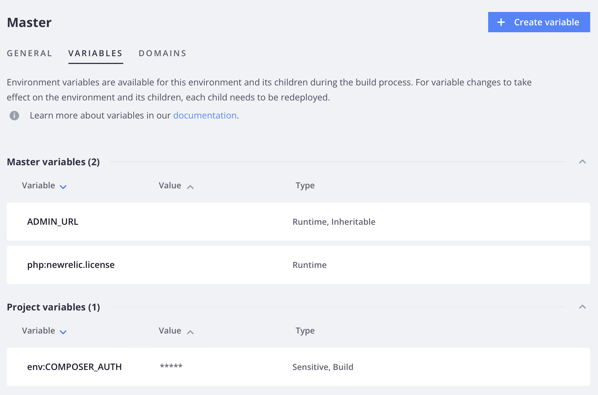

# 変数レベル

プロジェクト変数は、プロジェクト内のすべての環境に適用されます。 環境変数は、特定の環境またはブランチに適用されます。 環境は、親環境から変数の定義を _継承_ します。

継承された値を上書きするには、環境用に変数を特別に定義します。 例えば、開発用の変数を設定するには、統合環境の `.magento.env.yaml` ファイルで変数値を定義します。 統合環境から分岐するすべての環境は、これらの値を継承します。 `.magento.env.yaml` ファイルを使用した環境の設定について詳しくは、[ デプロイメント設定 ](configure-env-yaml.md) を参照してください。

>[!BEGINTABS]

>[!TAB CLI]

**Cloud CLI を使用して変数を設定するには**:

- **プロジェクト固有の変数** - プロジェクトの _すべて_ 環境に同じ値を設定します。 これらの変数は、ビルド時と実行時にすべての環境で使用できます。

  ```bash
  magento-cloud variable:create --level project --name <variable-name> --value <variable-value>
  ```

- **環境固有の変数** - _固有の_ 環境に一意の値を設定します。 これらの変数は、実行時に使用でき、子環境に継承されます。 `-e` オプションを使用して、コマンドで環境を指定します。

  ```bash
  magento-cloud variable:create --level environment --name <variable-name> --value <variable-value>
  ```

プロジェクト固有の変数を設定した後、変更を有効にするには、リモート環境を手動で再デプロイする必要があります。 新しいコミットをプッシュして、再デプロイメントをトリガーにします。

>[!TAB  コンソール ]

**[!DNL Cloud Console]** を使用して変数を設定するには：

1. _[!DNL Cloud Console]_&#x200B;で、プロジェクトナビゲーションの右側にある「設定」アイコンをクリックします。

   {width="36"}

1. プロジェクトレベルの変数を設定するには、「_プロジェクト設定_ の **変数** をクリックします。

   

1. 環境レベルの変数を設定するには、「_環境_」リストで環境を選択し、「**[!UICONTROL Variables]**」タブをクリックします。

   

1. 「**[!UICONTROL Create variable]**」をクリックします。

1. 変数の名前と値を指定します。 次のオプションから選択します。

   - 実行時に使用可能
   - ビルド時に使用可能
   - JSON 値
   - 機密変数（コンソールおよび CLI 応答では非表示の値）
   - 継承可能にする（子環境は環境レベルの変数を継承できます）

1. 「**[!UICONTROL Create variable]**」をクリックします。

>[!CAUTION]
>
>[!DNL Cloud Console] で環境固有の変数を設定すると、環境が自動的に再デプロイされます。

>[!ENDTABS]

## 可視性

`--visible-<build|runtime>` コマンドを使用して、ビルドまたは実行時の変数の表示を制限できます。 また、継承と機密性を設定するオプションもあります。

変数が表示または継承されないようにするには、次のオプションを使用します。

- `--inheritable false` – 子環境の継承を使用不可にします。 これは、`master` ブランチに実稼動専用の値を設定し、他のすべての環境が同じ名前のプロジェクトレベルの変数を使用できるようにする場合に便利です。
- `--sensitive true` - [!DNL Cloud Console] で変数を _読み取り不可_ としてマークします。 ユーザーインターフェイスでは変数を表示できませんが、他の変数と同様に、アプリケーションコンテナから変数を表示できます。

以下は、変数が表示または継承されるのを防ぐ具体的な例を示しています。 CLI では、以下のオプションのみを指定できます。 このケースは、使用可能なすべての環境変数に関係しているわけではありません。

```bash
magento-cloud variable:create --name <variable-name> --value <variable-value> --inheritable false --sensitive true
```

## 変数のレベルと値の検証

既存の変数のリストは、Cloud CLI を使用して表示できます。

```bash
magento-cloud variables
```

```
Variables on the project Project-Name (<project-id>), environment <environment-name>:
+----------------------------+-------------+-------------------------------------------+
| Name                       | Level       | Value                                     |
+----------------------------+-------------+-------------------------------------------+
| env:COMPOSER_AUTH          | project     | {                                         |
|                            |             |    "http-basic": {                        |
|                            |             |       "repo.magento.com": {               |
|                            |             |       "username":                         |
|                            |             | "<public-key>",                           |
|                            |             |       "password":                         |
|                            |             | "<private-key>"                           |
|                            |             |     }                                     |
|                            |             |   }                                       |
|                            |             | }                                         |
| ADMIN_EMAIL                | project     | admin@123.com                             |
| ADMIN_EMAIL                | environment | admin@123.com                             |
| ADMIN_PASSWORD             | environment | password                                  |
| ADMIN_URL                  | environment | admin123                                  |
| ADMIN_USERNAME             | environment | admin                                     |
| php:newrelic.license       | environment | xxxx71fb030366182117f955a22e4baf8exxxxxx  |
+----------------------------+-------------+-------------------------------------------+
```
