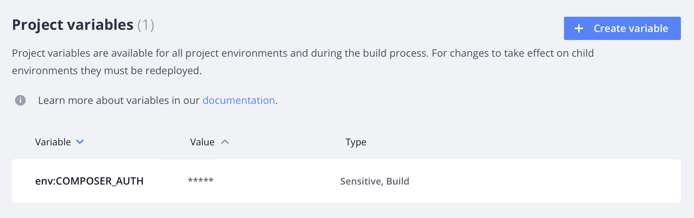
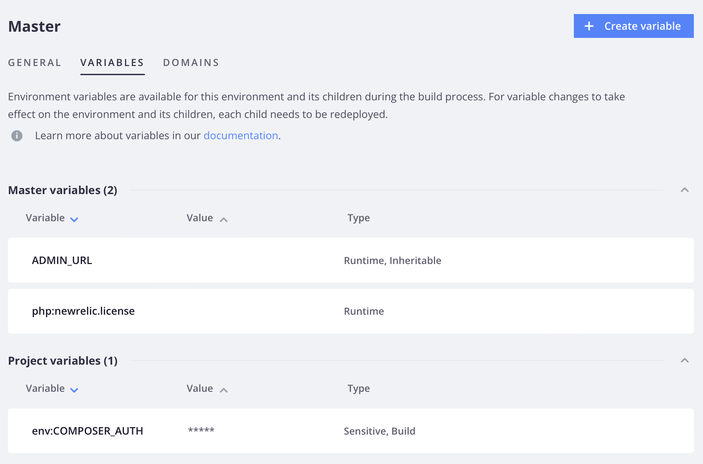

# 変数レベル

プロジェクト変数は、プロジェクト内のあらゆる環境に適用されます。 環境変数は、特定の環境またはブランチに適用されます。 環境&#x200B;_は、親環境から_&#x200B;変数定義を継承します。

環境に特化した変数を定義することで、継承された値を上書きできます。 例えば、開発用の変数を設定するには、統合環境の`.magento.env.yaml` ファイルで変数値を定義します。 統合環境から分岐するすべての環境は、これらの値を継承します。 `.magento.env.yaml` ファイルを使用して環境を設定する方法について詳しくは、[&#x200B; デプロイメント設定](configure-env-yaml.md)を参照してください。

>[!BEGINTABS]

>[!TAB CLI]

**Cloud CLI**&#x200B;を使用して変数を設定するには：

- **プロジェクト固有の変数** - プロジェクト内の&#x200B;_すべての_&#x200B;環境に同じ値を設定します。 これらの変数は、すべての環境でビルド時および実行時に使用できます。

  ```bash
  magento-cloud variable:create --level project --name <variable-name> --value <variable-value>
  ```

- **環境固有の変数**— _固有の_&#x200B;環境に一意の値を設定します。 これらの変数は実行時に使用でき、子環境に継承されます。 `-e` オプションを使用して、コマンドで環境を指定します。

  ```bash
  magento-cloud variable:create --level environment --name <variable-name> --value <variable-value>
  ```

プロジェクト固有の変数を設定した後、変更を有効にするには、リモート環境を手動で再デプロイする必要があります。 新しいコミットをプッシュして、再デプロイメントをトリガーします。

>[!TAB  コンソール ]

**[!DNL Cloud Console]**&#x200B;を使用して変数を設定するには：

1. _[!DNL Cloud Console]_&#x200B;で、プロジェクトナビゲーションの右側にある設定アイコンをクリックします。

   {width="36"}

1. プロジェクトレベルの変数を設定するには、_プロジェクト設定_&#x200B;で「**変数**」をクリックします。

   

1. 環境レベルの変数を設定するには、_環境_ リストで環境を選択し、**[!UICONTROL Variables]** タブをクリックします。

   

1. **[!UICONTROL Create variable]**&#x200B;をクリックします。

1. 変数の名前と値を指定します。 オプションから選択します。

   - ランタイム中に使用可能
   - ビルド時に使用可能
   - JSON値
   - 機密変数（コンソールおよびCLI応答で非表示になっている値）
   - 継承できるようにします（子環境は環境レベルの変数を継承できます）

1. **[!UICONTROL Create variable]**&#x200B;をクリックします。

>[!CAUTION]
>
>[!DNL Cloud Console]で環境固有の変数を設定すると、環境が自動的に再配置されます。

>[!ENDTABS]

## 表示

ビルドまたはランタイム中に、`--visible-<build|runtime>` コマンドを使用して変数の表示を制限できます。 また、継承と機密性を設定するオプションもあります。

変数が表示または継承されないようにするには、次のオプションを使用します。

- `--inheritable false` – 子環境の継承を無効にします。 これは、`master` ブランチで実稼動専用の値を設定し、他のすべての環境で同じ名前のプロジェクトレベル変数を使用できるようにするのに便利です。
- `--sensitive true` – 変数を[!DNL Cloud Console]の&#x200B;_読み取り不可能_&#x200B;としてマークします。 変数はユーザーインターフェイスでは表示できませんが、他の変数と同様に、アプリケーションコンテナから変数を表示できます。

次に、変数が表示または継承されないようにする特定のケースを示します。 これらのオプションは、CLIでのみ指定できます。 このケースは、利用可能なすべての環境変数に関連するわけではありません。

```bash
magento-cloud variable:create --name <variable-name> --value <variable-value> --inheritable false --sensitive true
```

## 変数レベルと値の検証

Cloud CLIを使用して、既存の変数のリストを表示できます。

```bash
magento-cloud variables
```

```
Variables on the project Project-Name (<project-id>), environment <environment-name>:
+----------------------------+-------------+-------------------------------------------+
| Name                       | Level       | Value                                     |
+----------------------------+-------------+-------------------------------------------+
| env:COMPOSER_AUTH          | project     | {                                         |
|                            |             |    "http-basic": {                        |
|                            |             |       "repo.magento.com": {               |
|                            |             |       "username":                         |
|                            |             | "<public-key>",                           |
|                            |             |       "password":                         |
|                            |             | "<private-key>"                           |
|                            |             |     }                                     |
|                            |             |   }                                       |
|                            |             | }                                         |
| ADMIN_EMAIL                | project     | admin@123.com                             |
| ADMIN_EMAIL                | environment | admin@123.com                             |
| ADMIN_PASSWORD             | environment | password                                  |
| ADMIN_URL                  | environment | admin123                                  |
| ADMIN_USERNAME             | environment | admin                                     |
| php:newrelic.license       | environment | xxxx71fb030366182117f955a22e4baf8exxxxxx  |
+----------------------------+-------------+-------------------------------------------+
```
