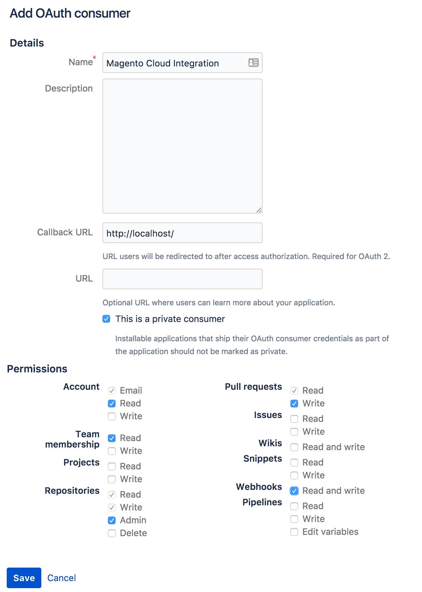
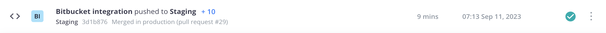

# Bitbucket統合

コード変更をプッシュする際に、環境を自動的にビルドおよびデプロイするようにBitbucket リポジトリを設定できます。 この統合により、Bitbucket リポジトリとAdobe Commerce on cloud infrastructure アカウントが同期されます。

{{private-repository}}

## 前提条件

- Adobe Commerce オンクラウド インフラストラクチャ プロジェクトへの管理者アクセス
- ローカル環境の[`magento-cloud` CLI](../dev-tools/cloud-cli-overview.md) ツール
- Bitbucket アカウント
- Bitbucket リポジトリへの管理者アクセス
- Bitbucket リポジトリのSSH アクセス キー

## リポジトリの準備

既存の環境からAdobe Commerce on cloud infrastructure プロジェクトを複製し、同じブランチ名を維持しながら、プロジェクト ブランチを新しい空のBitbucket リポジトリに移行します。 同一のGit ツリーを保持することは&#x200B;**重要**&#x200B;であるため、Adobe Commerce on cloud infrastructure プロジェクトの既存の環境やブランチが失われることはありません。

1. ターミナルから、Adobe Commerce on cloud infrastructure プロジェクトにログインします。

   ```bash
   magento-cloud login
   ```

1. プロジェクトのリストを作成し、プロジェクト IDをコピーします。

   ```bash
   magento-cloud project:list
   ```

1. プロジェクトをローカル環境に複製します。

   ```bash
   magento-cloud project:get <project-ID>
   ```

1. Bitbucket リポジトリをリモートとして追加します。

   ```bash
   git remote add origin git@bitbucket.org:<user-name>/<repo-name>.git
   ```

   リモート接続の既定の名前は`origin`または`magento`です。 `origin`が存在する場合は、別の名前を選択するか、既存の参照の名前を変更または削除できます。 [git-remote ドキュメント ](https://git-scm.com/docs/git-remote)を参照してください。

1. Bitbucket リモートが正しく追加されていることを確認します。

   ```bash
   git remote -v
   ```

   期待される応答：

   ```
   origin git@bitbucket.org:<user-name>/<repo-name>.git (fetch)
   origin git@bitbucket.org:<user-name>/<repo-name>.git (push)
   ```

1. プロジェクト ファイルを新しいBitbucket リポジトリにプッシュします。 すべてのブランチ名を同じにしておくことを忘れないでください。

   ```bash
   git push -u origin master
   ```

   新しいBitbucket リポジトリで始める場合、リモート リポジトリがローカル コピーと一致しないため、`-f` オプションを使用する必要がある場合があります。

1. Bitbucket リポジトリにすべてのプロジェクト ファイルが含まれていることを確認します。

## OAuth コンシューマーの作成

Bitbucket統合には[OAuth コンシューマー](https://support.atlassian.com/bitbucket-cloud/docs/use-oauth-on-bitbucket-cloud/)が必要です。 次のセクションを完了するには、このコンシューマーのOAuth `key`と`secret`が必要です。

**Bitbucket**&#x200B;でOAuth コンシューマーを作成するには：

1. [Bitbucket](https://id.atlassian.com/login) アカウントにログインします。

1. **設定** > **アクセス管理** > **OAuth**&#x200B;をクリックします。

1. 「**消費者を追加**」をクリックし、次のように設定します。

   

   >[!WARNING]
   >
   >有効な&#x200B;**コールバック URL**&#x200B;は必要ありませんが、統合を正常に完了するには、このフィールドに値を入力する必要があります。

1. **保存**&#x200B;をクリックします。

1. 消費者&#x200B;**の名前**&#x200B;をクリックして、OAuth `key`と`secret`を表示します。

1. 統合を構成するためにOAuth `key`と`secret`をコピーします。

## 統合の設定

1. ターミナルから、Adobe Commerce on cloud infrastructure プロジェクトに移動します。

1. `bitbucket.json`という名前の一時ファイルを作成し、次を追加して、角括弧の変数を値に置き換えます。

   ```json
   {
     "type": "bitbucket",
     "repository": "<bitbucket-user-name/bitbucket-repo-name>",
     "app_credentials": {
       "key": "<oauth-consumer-key>",
       "secret": "<oauth-consumer-secret>"
     },
     "prune_branches": true,
     "fetch_branches": true,
     "build_pull_requests": true,
     "resync_pull_requests": true
   }
   ```

   >[!TIP]
   >
   >必ず、URLではなくBitbucket リポジトリの名前を使用してください。 URLを使用すると、統合が失敗します。

1. `magento-cloud` CLI ツールを使用して、統合をプロジェクトに追加します。

   >[!WARNING]
   >
   >次のコマンドは、Adobe Commerce on cloud infrastructure プロジェクトの&#x200B;_all_ コードをBitbucket リポジトリのコードで上書きします。 これには、`production` ブランチを含むすべてのブランチが含まれます。 この操作は瞬時におこなわれ、元に戻すことはできません。 ベストプラクティスとして、すべてのブランチをAdobe Commerce on cloud infrastructure プロジェクトから複製し、Bitbucket統合を追加する前に&#x200B;**Bitbucket リポジトリ**&#x200B;にプッシュすることが重要です。

   ```bash
   magento-cloud project:curl -p '<project-ID>' /integrations -i -X POST -d "$(< bitbucket.json)"
   ```

   これにより、ヘッダーを含む長いHTTP応答が返されます。 統合が成功すると、200または201のステータスコードが返されます。 ステータスが400以上の場合は、エラーが発生したことを示します。

1. 一時`bitbucket.json` ファイルを削除します。

1. プロジェクト統合の検証：

   ```bash
   magento-cloud integrations -p <project-ID>
   ```

   ```
   +----------+-----------+--------------------------------------------------------------------------------+
   | ID       | Type      | Summary                                                                        |
   +----------+-----------+--------------------------------------------------------------------------------+
   | <int-id> | bitbucket | Repository: bitbucket_Account/magento-int                                      |
   |          |           | Hook URL:                                                                      |
   |          |           | https://magento-url.cloud/api/projects/<project-id>/integrations/<int-id>/hook |
   +----------+-----------+--------------------------------------------------------------------------------+
   ```

   BitBucketでWebhookを設定するには、**Hook URL**&#x200B;をメモします。

### BitBucketでのWebhookの追加

プッシュなどのイベントをCloud Git サーバーと通信するには、BitBucket リポジトリ用のWebhookが必要です。 このページで詳細に説明されているBitbucket統合を設定する方法は、正しく従うと、自動的にWebhookを作成します。 複数の統合を作成しないように、Webhookを検証することが重要です。

1. [Bitbucket](https://id.atlassian.com/login) アカウントにログインします。

1. 「**リポジトリ**」をクリックし、プロジェクトを選択します。

1. **リポジトリ設定** > **ワークフロー** > **Webhook**&#x200B;をクリックします。

1. 続行する前にWebhookを確認します。

   フックがアクティブな場合は、残りの手順をスキップし、[統合をテストします](#test-the-integration)。 フックの名前は、**「Adobe Commerce on cloud infrastructure &lt;project_id>」**&#x200B;に似ており、フック URLの形式は`https://<zone>.magento.cloud/api/projects/<project_id>/integrations/<id>/hook`に似ています

1. 「**Webhookを追加**」をクリックします。

1. _新しいWebhookを追加_ ビューで、次のフィールドを編集します。

   - **Title**: Adobe Commerceとの連携
   - **URL**: `magento-cloud`統合リストのフック URLを使用します
   - **トリガー**: デフォルトは基本的な&#x200B;_リポジトリプッシュ_&#x200B;です

1. **保存**&#x200B;をクリックします。

### 統合をテストする

Bitbucket統合を設定した後、`magento-cloud` CLIを使用して統合が動作していることを確認できます。

```bash
magento-cloud integration:validate
```

または、Bitbucket リポジトリに簡単な変更をプッシュしてテストすることもできます。

1. テストファイルを作成します。

   ```bash
   touch test.md
   ```

1. 変更をコミットしてBitbucket リポジトリにプッシュします。

   ```bash
   git add . && git commit -m "Testing Bitbucket integration" && git push
   ```

1. [[!DNL Cloud Console]](../project/overview.md)にログインし、コミットメッセージが表示され、プロジェクトがデプロイされていることを確認します。

   

## Cloud ブランチの作成

Bitbucket統合では、Adobe Commerce on cloud インフラストラクチャ プロジェクトの新しい環境をアクティブ化できません。 Bitbucketを使用して環境を作成する場合は、環境を手動でアクティブ化する必要があります。 この追加の手順を回避するには、`magento-cloud` CLI ツールまたは[!DNL Cloud Console]を使用して環境を作成することをお勧めします。

**Bitbucket**&#x200B;で作成されたブランチをアクティブ化するには：

1. ブランチをプッシュするには、`magento-cloud` CLIを使用します。

   ```bash
   magento-cloud environment:push from-bitbucket
   ```

   ```
   Pushing from-bitbucket to the new environment from-bitbucket
   Activate from-bitbucket after pushing? [Y/n] y
   Parent environment [master]: integration
   --- (Validation and activation messages)
   ```

1. 環境がアクティブであることを確認します。

   ```bash
   magento-cloud environment:list
   ```

   ```
   Your environments are:
   +---------------------+----------------+--------+
   | ID                  | Name           | Status |
   +---------------------+----------------+--------+
   | master              | Master         | Active |
   |  integration        | integration    | Active |
   |    from-bitbucket * | from-bitbucket | Active |
   +---------------------+----------------+--------+
   * - Indicates the current environment
   ```

環境を作成したら、通常のGit コマンドを使用して、対応するブランチをリモート Bitbucket リポジトリにプッシュできます。 Bitbucketのブランチに対するその後の変更は、環境を自動的にビルドしてデプロイします。

## 統合の削除

コードに影響を与えることなく、プロジェクトからBitbucket統合を安全に削除できます。

**Bitbucket統合を削除するには**:

1. ターミナルから、Adobe Commerce on cloud infrastructure プロジェクトにログインします。

1. 統合機能のリストアップ。 次の手順を完了するには、Bitbucket統合IDが必要です。

   ```bash
   magento-cloud integration:list
   ```

1. 統合を削除します。

   ```bash
   magento-cloud integration:delete <int-ID>
   ```

また、Bitbucket アカウントにログインし、アカウント _設定_ ページでOAuth付与を取り消すことで、Bitbucket統合を削除できます。

## Bitbucket サーバー統合

Bitbucket サーバー統合を使用するには、次のものが必要です。

- [Bitbucket アクセス トークン ](https://confluence.atlassian.com/bitbucketserver/http-access-tokens-939515499.html) - プロジェクト `read`のアクセスとリポジトリ `admin`のアクセスを許可するトークンを生成します
- [Bitbucket サーバーURL](https://confluence.atlassian.com/bitbucketserver/specify-the-bitbucket-base-url-776640392.html) - Bitbucket インスタンスのベース URLを追加します

Cloud CLIを使用してBitbucket サーバーの統合手順を実行できますが、完全なコマンドは次のようになります。

```bash
magento-cloud integration:add --type=bitbucket_server --base-url=<bitbucket-url> --username=<username> --token=<bitbucket-access-token> --project=<project-ID>
```

その他の使用要件とオプションについては、help コマンドを使用してください：`magento-cloud integration:add --help`
