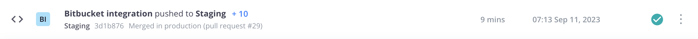

# Bitbucket の統合

コードの変更をプッシュする際に、環境を自動的にビルドおよびデプロイするように、Bitbucket リポジトリーを設定できます。 この統合により、Bitbucket リポジトリがクラウドインフラストラクチャアカウント上のAdobe Commerceと同期されます。

{{private-repository}}

## 前提条件

- Adobe Commerce on cloud infrastructure プロジェクトへの管理者アクセス
- ローカル環境での [`magento-cloud` CLI](../dev-tools/cloud-cli-overview.md) ツール
- Bitbucket アカウント
- Bitbucket リポジトリへの管理者アクセス
- Bitbucket リポジトリの SSH アクセスキー

## リポジトリを準備

既存の環境からクラウドインフラストラクチャプロジェクト上にAdobe Commerceのクローンを作成し、同じブランチ名を保持したまま、プロジェクトのブランチを新しい空の Bitbucket リポジトリに移行します。 Adobe Commerce on cloud infrastructure プロジェクトで既存の環境やブランチが失われないように、同一の Git ツリーを保持することが **重要** です。

1. ターミナルから、クラウドインフラストラクチャプロジェクトのAdobe Commerceにログインします。

   ```bash
   magento-cloud login
   ```

1. プロジェクトをリストして、プロジェクト ID をコピーします。

   ```bash
   magento-cloud project:list
   ```

1. プロジェクトのクローンをローカル環境に作成します。

   ```bash
   magento-cloud project:get <project-ID>
   ```

1. Bitbucket リポジトリをリモートとして追加します。

   ```bash
   git remote add origin git@bitbucket.org:<user-name>/<repo-name>.git
   ```

   リモート接続の既定の名前は `origin` または `magento` です。 `origin` が存在する場合は、別の名前を選択するか、既存の参照の名前を変更または削除できます。 [git-remote ドキュメント ](https://git-scm.com/docs/git-remote) を参照してください。

1. Bitbucket リモートを正しく追加したことを確認します。

   ```bash
   git remote -v
   ```

   期待される応答：

   ```
   origin git@bitbucket.org:<user-name>/<repo-name>.git (fetch)
   origin git@bitbucket.org:<user-name>/<repo-name>.git (push)
   ```

1. プロジェクトファイルを新しい Bitbucket リポジトリにプッシュします。 すべてのブランチ名は同じにしておくことを忘れないでください。

   ```bash
   git push -u origin master
   ```

   新しい Bitbucket リポジトリで開始する場合、リモートリポジトリがローカルコピーと一致しないので、`-f` オプションを使用する必要がある場合があります。

1. Bitbucket リポジトリに、すべてのプロジェクトファイルが含まれていることを確認します。

## OAuth コンシューマーの作成

Bitbucket 統合には [OAuth コンシューマー ](https://support.atlassian.com/bitbucket-cloud/docs/use-oauth-on-bitbucket-cloud/) が必要です。 次の節を完了するには、このコンシューマーからの OAuth `key` と `secret` が必要です。

**Bitbucket で OAuth コンシューマーを作成するには**:

1. [Bitbucket](https://id.atlassian.com/login) アカウントにログインします。

1. **設定**/**アクセス管理**/**OAuth** をクリックします。

1. 「**消費者を追加**」をクリックして、次のように設定します。

   

   >[!WARNING]
   >
   >有効な **コールバック URL** は必須ではありませんが、統合を正常に完了するには、このフィールドに値を入力する必要があります。

1. **保存** をクリックします。

1. コンシューマー **名前** をクリックして、OAuth `key` と `secret` を表示します。

1. 統合を設定するために、OAuth `key` と `secret` をコピーします。

## 統合の設定

1. ターミナルから、クラウドインフラストラクチャプロジェクトのAdobe Commerceに移動します。

1. `bitbucket.json` という一時ファイルを作成し、次のように追加して、山括弧で囲まれた変数を値に置き換えます。

   ```json
   {
     "type": "bitbucket",
     "repository": "<bitbucket-user-name/bitbucket-repo-name>",
     "app_credentials": {
       "key": "<oauth-consumer-key>",
       "secret": "<oauth-consumer-secret>"
     },
     "prune_branches": true,
     "fetch_branches": true,
     "build_pull_requests": true,
     "resync_pull_requests": true
   }
   ```

   >[!TIP]
   >
   >URL ではなく、Bitbucket リポジトリの名前を使用してください。 URL を使用すると、統合が失敗します。

1. `magento-cloud` CLI ツールを使用して、統合をプロジェクトに追加します。

   >[!WARNING]
   >
   >次のコマンドは、クラウドインフラストラクチャプロジェクト上のAdobe Commerceのコード _all_ を、Bitbucket リポジトリのコードで上書きします。 これには、`production` ブランチを含むすべてのブランチが含まれます。 このアクションは即座に実行され、元に戻すことはできません。 ベストプラクティスとして、クラウドインフラストラクチャプロジェクト上のAdobe Commerceからすべてのブランチをクローンし、Bitbucket 統合を追加して **前に** Bitbucket リポジトリにプッシュすることが重要です。

   ```bash
   magento-cloud project:curl -p '<project-ID>' /integrations -i -X POST -d "$(< bitbucket.json)"
   ```

   これは、ヘッダー付きの長い HTTP 応答を返します。 統合が成功すると、200 または 201 ステータスコードが返されます。 ステータスが 400 以上の場合は、エラーが発生したことを示します。

1. 一時 `bitbucket.json` ファイルを削除します。

1. プロジェクトの統合を確認します。

   ```bash
   magento-cloud integrations -p <project-ID>
   ```

   ```
   +----------+-----------+--------------------------------------------------------------------------------+
   | ID       | Type      | Summary                                                                        |
   +----------+-----------+--------------------------------------------------------------------------------+
   | <int-id> | bitbucket | Repository: bitbucket_Account/magento-int                                      |
   |          |           | Hook URL:                                                                      |
   |          |           | https://magento-url.cloud/api/projects/<project-id>/integrations/<int-id>/hook |
   +----------+-----------+--------------------------------------------------------------------------------+
   ```

   **フック URL** をメモして、BitBucket で Webhook を設定します。

### BitBucket への Webhook の追加

プッシュなどのイベントを Cloud Git サーバーと通信するには、BitBucket リポジトリに Webhook が必要です。 このページで詳しく説明している Bitbucket 統合の設定方法に従うと、自動的に Webhook が作成されます。 複数の統合を作成しないようにするために、Webhook を検証することが重要です。

1. [Bitbucket](https://id.atlassian.com/login) アカウントにログインします。

1. **リポジトリ** をクリックし、プロジェクトを選択します。

1. **リポジトリ設定**/**ワークフロー**/**Webhook** をクリックします。

1. 続行する前に Webhook を確認します。

   フックがアクティブな場合は、残りの手順をスキップして [ 統合をテスト ](#test-the-integration) します。 フックの名前は「**cloud infrastructure 上のAdobe Commerce &lt;project_id>」のようになり** フック URL フォーマットは `https://<zone>.magento.cloud/api/projects/<project_id>/integrations/<id>/hook` のようになります。

1. **Webhook を追加** をクリックします。

1. _新しい Webhook を追加_ ビューで、次のフィールドを編集します。

   - **タイトル**:Adobe Commerce統合
   - **URL**:`magento-cloud` 統合リストのフック URL を使用します
   - **トリガー**: デフォルトは基本的な _リポジトリのプッシュ_ です

1. **保存** をクリックします。

### 統合のテスト

Bitbucket 統合を設定したら、`magento-cloud` CLI を使用して、統合が動作していることを確認できます。

```bash
magento-cloud integration:validate
```

または、単純な変更を Bitbucket リポジトリにプッシュしてテストすることもできます。

1. テストファイルを作成します。

   ```bash
   touch test.md
   ```

1. 変更をコミットし、Bitbucket リポジトリにプッシュします。

   ```bash
   git add . && git commit -m "Testing Bitbucket integration" && git push
   ```

1. [[!DNL Cloud Console]](../project/overview.md) にログインし、コミットメッセージが表示され、プロジェクトがデプロイされていることを確認します。

   

## クラウドブランチの作成

Bitbucket 統合では、クラウドインフラストラクチャプロジェクト上のAdobe Commerceで新しい環境をアクティブ化できません。 Bitbucket を使用して環境を作成する場合は、手動で環境をアクティブ化する必要があります。 このような追加の手順を回避するには、`magento-cloud` CLI ツールまたは [!DNL Cloud Console] を使用して環境を作成することがベストプラクティスです。

**Bitbucket で作成されたブランチをアクティブ化するには**:

1. `magento-cloud` CLI を使用して分岐をプッシュします。

   ```bash
   magento-cloud environment:push from-bitbucket
   ```

   ```
   Pushing from-bitbucket to the new environment from-bitbucket
   Activate from-bitbucket after pushing? [Y/n] y
   Parent environment [master]: integration
   --- (Validation and activation messages)
   ```

1. 環境がアクティブであることを確認します。

   ```bash
   magento-cloud environment:list
   ```

   ```
   Your environments are:
   +---------------------+----------------+--------+
   | ID                  | Name           | Status |
   +---------------------+----------------+--------+
   | master              | Master         | Active |
   |  integration        | integration    | Active |
   |    from-bitbucket * | from-bitbucket | Active |
   +---------------------+----------------+--------+
   * - Indicates the current environment
   ```

環境を作成したら、通常の Git コマンドを使用して、対応するブランチをリモート Bitbucket リポジトリにプッシュできます。 その後、Bitbucket のブランチに変更を加えると、環境が自動的にビルドおよびデプロイされます。

## 統合の削除

コードに影響を与えることなく、プロジェクトから Bitbucket 統合を安全に削除できます。

**Bitbucket 統合を削除するには**:

1. ターミナルから、クラウドインフラストラクチャプロジェクトのAdobe Commerceにログインします。

1. 統合のリストを作成します。 次の手順を完了するには、Bitbucket 統合 ID が必要です。

   ```bash
   magento-cloud integration:list
   ```

1. 統合を削除します。

   ```bash
   magento-cloud integration:delete <int-ID>
   ```

また、Bitbucket アカウントにログインし、アカウント _設定_ ページで OAuth 付与を取り消すことで、Bitbucket の統合を削除できます。

## Bitbucket サーバーの統合

Bitbucket サーバー統合を使用するには、以下が必要です。

- [Bitbucket アクセストークン ](https://confluence.atlassian.com/bitbucketserver/http-access-tokens-939515499.html) - Project `read` へのアクセスと Repository `admin` へのアクセスを許可するトークンを生成します。
- [Bitbucket サーバー URL](https://confluence.atlassian.com/bitbucketserver/specify-the-bitbucket-base-url-776640392.html) - Bitbucket インスタンスのベース URL を追加します

Cloud CLI を使用して Bitbucket サーバーの統合手順を実行することもできますが、完全なコマンドは次のようになります。

```bash
magento-cloud integration:add --type=bitbucket_server --base-url=<bitbucket-url> --username=<username> --token=<bitbucket-access-token> --project=<project-ID>
```

その他の使用要件およびオプションについては、help コマンドを使用してください：`magento-cloud integration:add --help`
