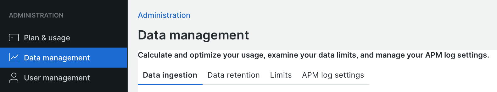

# データ取り込み

New Relicは、効果的な監視と分析を提供するためにリッチデータに依存していますが、大規模なデータセットは、タイムリーな結果、パフォーマンス、コンプライアンスに影響を与える可能性があります。 このトピックでは、データの取り込みを管理し、データを最も効果的に調整する戦略に関するガイダンスを提供します。

New Relicには、計画の使用状況をデータソース別にまとめた _データ管理_ ビューが用意されています。

**取り込んだデータとソースを表示するには**

1. New Relicのユーザーメニューで、「**[!UICONTROL Manage your data]**」をクリックします。
1. _管理_ リストの「**[!UICONTROL Data management]**」をクリックします。

   

   「**[!UICONTROL Data ingestion]**」タブには、その日に取り込まれたデータと、そのデータのソースが表示されます。
データ保持タブには、データが保存される期間を表示および制御します。

1. 「**[!UICONTROL Limits]**」タブを選択し、アカウントの制限を確認します。

Adobe Commerceのデータソースには、次のものが含まれます。

- **APM イベント** - グラフやダッシュボードで使用するイベントデータ
- **インフラストラクチャ**：プロセスおよびホストのメトリック（CPU、ストレージ、ネットワークなど）
- **ログ** - CDN、APM およびアプリケーションサーバーのログ

ログデータは、取り込みの大部分に貢献します。 [&#x200B; ログデータの表示と分析 &#x200B;](log-management.md#view-and-analyze-log-data) 方法を参照し、Adobeの担当者と協力して、データの取り込みと保持のニーズに対する戦略を立てる。 [&#x200B; データ取り込みの管理 &#x200B;](https://docs.newrelic.com/docs/data-apis/manage-data/manage-data-coming-new-relic/) について詳しくは、_New Relic ドキュメント_ を参照してください。
