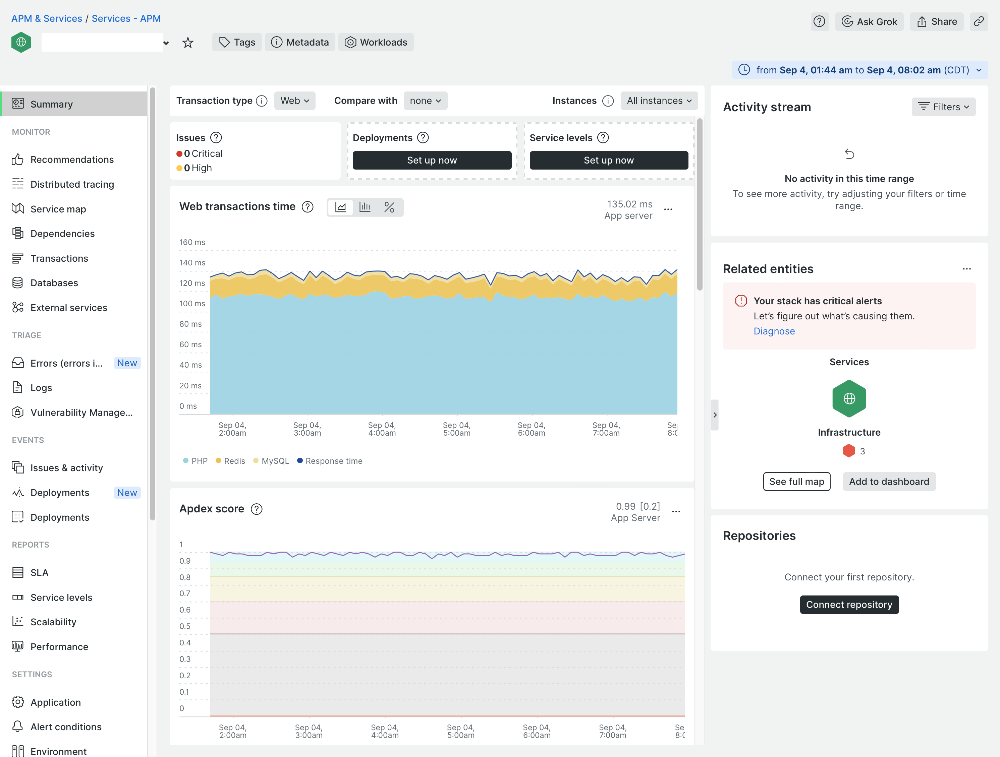
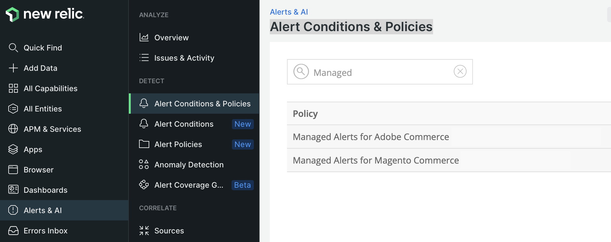
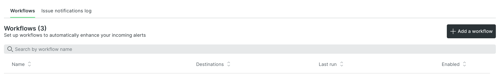

# New Relic monitoring

New Relicは、PHP エージェントを使用して、インフラストラクチャと[!DNL Commerce] アプリケーションを接続および監視します。 Cloud環境がNew Relicに接続すると、New Relic アカウントにログインして、エージェントが収集したデータを確認できます。

_APM &amp; Services_ ページで、**概要**&#x200B;を選択して、アプリケーションに関する取引情報を表示します。 このビューは、潜在的な障害を特定し、アプリケーションとサービスの全体的な健全性を確認するのに役立ちます。

このビューから、応答が遅い、ボトルネック、アプリケーションスループット、web エラーなどが発生したトランザクションを追跡できます。

追跡データの確認：

- **最も時間がかかる** – リクエストを並行して追跡することで、時間の消費を決定します。 例えば、製品ビューとカテゴリービューで最も多くのトランザクション時間を費やした可能性があります。 顧客アカウントページが時間の消費量で突然上位にランクインした場合、アプリケーションは呼び出しやクエリをドラッグするパフォーマンスの影響を受ける可能性があります。

- **最高スループット**：送信されたバイトのサイズと頻度に基づいて、最もヒットしたページを特定します。

収集されたすべてのデータは、データ、クエリ、または&#x200B;_Redis_ データを送信するアクションに費やした時間を詳細に示します。 クエリで問題が発生した場合、New Relicは、それらの問題を追跡および対応するための情報を提供します。

>[!TIP]
>
>このデータを使用してアプリケーションパフォーマンスの問題をトラブルシューティングする方法について詳しくは、_Adobe Commerce ヘルプセンター_&#x200B;の「[New Relicを使用したパフォーマンスのトラブルシューティング」を参照してください。](https://experienceleague.adobe.com/docs/commerce-knowledge-base/kb/troubleshooting/miscellaneous/troubleshoot-performance-using-new-relic-on-magento-commerce.html)

## アラートの管理によるパフォーマンスの監視

Adobeには、パフォーマンス指標を追跡するためのAdobe Commerce _アラートの_&#x200B;管理済みアラート ポリシーが用意されています。 このポリシーには、しきい値を設定するアラートのコレクションと、インフラストラクチャまたはアプリケーションの問題がサイトのパフォーマンスに影響を与える場合のトリガーに関する警告および重大な通知が含まれます。 このポリシーは、実稼動環境で次の指標を追跡します。

| 指標 | データ収集 | 対象 |
|:-------------------|:----------------|:----------------|
| [!DNL Apdex] スコア | APM | ProおよびStarter |
| CPUの利用状況 | NRI | Pro |
| ディスク領域 | NRI | Pro |
| エラー率 | APM | ProおよびStarter |
| メモリ使用量 | NRI | Pro |
| MariaDB クエリのロード | NRI | Pro |
| Redis メモリ | NRI | Pro |

サイト基盤やアプリケーションの状況がアラートのしきい値をトリガーすると、New Relicがアラート通知を送信して、問題に積極的に対処できるようになります。 アラートのしきい値の詳細と、アラートをトリガーした問題を解決するためのトラブルシューティング手順については、_Adobe Commerce ヘルプセンター_&#x200B;の「[Adobe Commerceのアラートの管理](https://experienceleague.adobe.com/docs/commerce-knowledge-base/kb/support-tools/managed-alerts/managed-alerts-for-magento-commerce.html)」を参照してください。

>[!TIP]
>
>Pro ステージング環境と統合環境およびスターター環境の場合は、[ ヘルス通知](../integrations/health-notifications.md)を使用してディスク容量を監視します。

>[!PREREQUISITES]
>
>- **New Relic資格情報**—Cloud プロジェクトのNew Relic アカウントにログインするための資格情報
>- **アクティブなNew Relic統合** – お使いのCloud環境がNew Relicに接続されていることを確認します
>- **ワークフロー通知**：アラート通知を受信するように、少なくとも1つの[ ワークフロー](#set-up-a-workflow-for-notifications)を設定します

**Adobe Commerce ポリシーの管理対象アラートを確認するには**:

1. [New Relic アカウント ](https://login.newrelic.com/login)にログインします。

1. Adobe Commerce _ポリシーの_&#x200B;管理済みアラートを探します。

   - エクスプローラーのナビゲーションメニューで、**[!UICONTROL Alerts & AI]**&#x200B;をクリックします。

   - _Detect_&#x200B;で、**[!UICONTROL Alert Conditions & Policies]**&#x200B;をクリックします。

   - アカウントが&#x200B;_アラート条件とポリシー_ ビューの上部で選択されていることを確認します。

   - _Policy_ リストで、**Managed Alerts for Adobe Commerce** policyを選択します。

     

     >[!NOTE]
     >
     >Adobe Commerce _ポリシーの_&#x200B;管理アラートが使用できない場合は、_Adobe Commerce ヘルプセンター_&#x200B;の[Adobe Commerceの管理アラート ](https://experienceleague.adobe.com/docs/commerce-knowledge-base/kb/support-tools/managed-alerts/managed-alerts-for-magento-commerce.html)を参照してください。

1. 「**[!UICONTROL Alert conditions]**」タブをクリックして、ポリシーで定義されたアラート条件を確認します。

## アラートポリシーの作成

Managed Alerts for Adobe Commerce ポリシーに含まれるアラートは変更しないでください。 Adobeは、このポリシーのアラート条件を時間をかけて更新および改善し、ポリシーに追加したカスタマイズを上書きします。

既存のアラートを変更する代わりに、アラートポリシーを作成できます。 次に、アラート条件を新しいポリシーにコピーします。

>[!TIP]
>
>アラート、アラートポリシーおよびワークフローの詳細については、_New Relic_ ドキュメントの[ アラートの概要](https://docs.newrelic.com/docs/alerts/overview/)を参照してください。

## 通知用ワークフローの設定

_ワークフロー_ （以前は通知チャネルと呼ばれていました）を設定して、アラートポリシーなどのフィルター処理されたデータに基づいてサイトパフォーマンスに関する通知を受信できるようになりました。 アプリケーションまたはインフラストラクチャトリガーの条件にアラートが発生した場合、パフォーマンスの問題に関する通知は、アラートポリシーに関連付けられたすべてのワークフローに送信されます。 また、問題が確認され、閉じられたときに通知が届きます。

New Relicには、電子メール、Slack、PagerDuty、webhookなど、様々な種類のワークフロー通知を設定するためのテンプレートが用意されています。

**ワークフローを設定するには**:

1. [New Relic アカウント ](https://login.newrelic.com/login)にログインします。

1. ワークフローを作成します。

   - エクスプローラーのナビゲーションメニューで、**[!UICONTROL Alerts & AI]**&#x200B;をクリックします。

   - _エンリッチと通知_&#x200B;の下の左側のナビゲーションで、**[!UICONTROL Workflows]**&#x200B;をクリックします。

   - 右側の&#x200B;**[!UICONTROL Add a workflow]**&#x200B;をクリックします。

     

   - ワークフローの設定&#x200B;_ページで、ワークフローの名前を入力します。_

   - 「_データを絞り込む_」セクションで、**[!UICONTROL Policy]** ドロップダウンリストから&#x200B;**[!UICONTROL Managed Alerts for Adobe Commerce]**&#x200B;を選択します。

   - 「_通知_」セクションで、チャネルを選択し、指示に従います。

   - **[!UICONTROL Test workflow]**&#x200B;をクリックして、設定を確認します。

1. **[!UICONTROL Activate workflow]**&#x200B;をクリックします。

[ ワークフロー](https://docs.newrelic.com/docs/alerts-applied-intelligence/applied-intelligence/incident-workflows/incident-workflows/)に関するNew Relicのドキュメントを参照してください。

>[!WARNING]
>
>Adobe Commerce向けManaged Alerts ポリシーのアラートには、クラウドインフラストラクチャ上のAdobe CommerceをサポートするAdobe チームに通知するようにデフォルトのワークフローが設定されています。 これらのデフォルトチャネルの設定を変更しないでください。また、割り当てられたアラートポリシーを削除しないでください。
