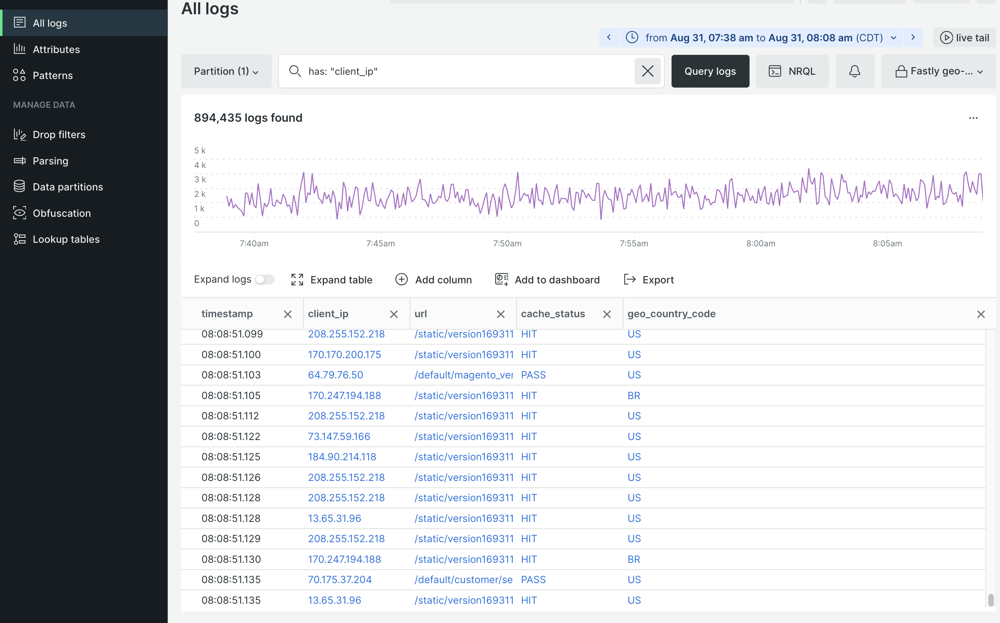

# New Relic log management

すべてのクラウドインフラプロジェクトには、[New Relic ログ管理](https://docs.newrelic.com/docs/logs/get-started/get-started-log-management/)が含まれます。 このサービスは、ステージング環境と実稼動環境のすべてのログデータを集約し、一元化されたログ管理ダッシュボードに表示するように事前設定されています。

集約されたデータには、次のログの情報が含まれます。

- `~/var/log` ディレクトリからのすべての`ece-tools`およびアプリケーションログ
- `var/log/platform/<project-ID>` ディレクトリからのクラウドサービスのログ
- Fastly CDNとWAF

プロジェクトがNew Relicに接続されている場合は、New Relic Logs サービスを使用して、次のようなタスクを実行できます。

- New Relic クエリを使用したログデータの検索
- New Relic Logs アプリケーションを使用したログデータの視覚化
- カスタムチャート、ダッシュボード、アラートの作成
- 単一のダッシュボードからのパフォーマンスの問題のトラブルシューティング

## ログデータの表示と分析

New Relic Logs アプリケーションを使用して、集約されたログデータを検索し、アプリケーション、インフラストラクチャ、CDN、WAFのエラーをトラブルシューティングします。 New Relic APMおよびインフラストラクチャサービスから収集したログデータを使用して、チャート、ダッシュボード、アラートを作成できます。

**New Relic Logs アプリケーションを使用するには**:

1. [New Relic アカウント ](https://login.newrelic.com/login)にログインします。

1. エクスプローラーのナビゲーションメニューから「**ログ**」を選択します。

1. アカウントが&#x200B;_すべてのログ_ ビューの上部で選択されていることを確認します。

1. ログクエリの時間範囲を選択します。

1. クラウドサービスのインフラストラクチャログデータ（`~/var/log/`からのログ）を確認するには、_ログの検索_ フィールドにクエリ文字列`has: "filePath"`を入力します。 次に、**[!UICONTROL Query logs]**&#x200B;をクリックします。

   ログファイルの名前は、`filePath`列に保存され、ログファイルへの完全なパスが表示されます。

   

1. Fastly ログデータを確認するには、_ログの検索_ フィールドにクエリ文字列`has: "client_ip"`を入力します。 次に、**[!UICONTROL Query logs]**&#x200B;をクリックします。

1. Fastlyのログ結果を国コードでフィルタリングするには、**[!UICONTROL Add column]**&#x200B;をクリックし、**[!UICONTROL geo_country_code]**&#x200B;を選択します。

   

>[!TIP]
>
>クエリ ビューは、_保存ビュー_ ドロップダウンから保存できます。 **[!UICONTROL Create new]**&#x200B;をクリックし、名前を入力してオプションを選択し、**[!UICONTROL Save view]**&#x200B;をクリックします。
>
>_New Relic Docs_ サイトの[ ログ管理の基本](https://docs.newrelic.com/docs/logs/get-started/get-started-log-management/)および[New Relic クエリ言語の概要](https://docs.newrelic.com/docs/query-your-data/nrql-new-relic-query-language/get-started/introduction-nrql-new-relics-query-language/)を参照してください。
