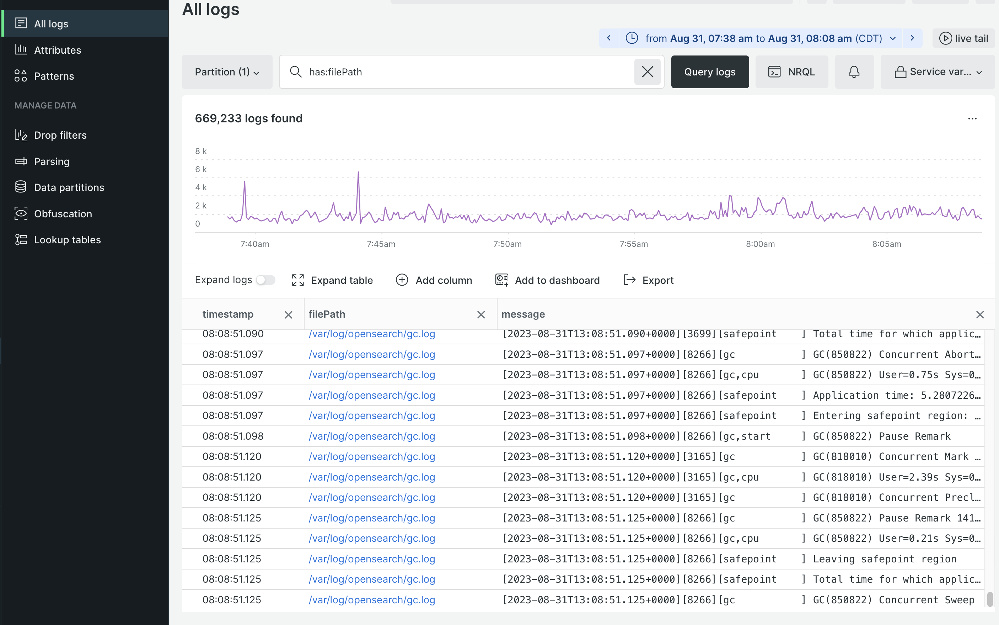

# New Relic ログ管理

すべてのクラウドインフラストラクチャプロジェクトには、[New Relic ログ管理 ](https://docs.newrelic.com/docs/logs/get-started/get-started-log-management/) が含まれます。 このサービスは、ステージング環境と実稼動環境のすべてのログデータを集計して、一元化されたログ管理ダッシュボードに表示するように事前に設定されています。

集計データには、次のログの情報が含まれます。

- `~/var/log` ディレクトリからのすべての `ece-tools` とアプリケーションのログ
- `var/log/platform/<project-ID>` ディレクトリからのクラウドサービスのログ
- Fastly CDN とWAF

プロジェクトがNew Relicに接続されている場合、New Relic ログサービスを使用して、次のようなタスクを実行できます。

- New Relic クエリを使用した集計ログデータの検索
- New Relic Logs アプリケーションを使用したログデータの視覚化
- カスタムグラフ、ダッシュボード、アラートの作成
- 単一ダッシュボードからのパフォーマンスの問題のトラブルシューティング

## ログデータの表示と分析

New Relic ログアプリケーションを使用して、集計ログデータを検索し、アプリケーション、インフラストラクチャ、CDN およびWAFのエラーをトラブルシューティングします。 New Relic APM およびインフラストラクチャサービスから収集されたログデータを使用して、グラフ、ダッシュボード、アラートを作成できます。

**New Relic ログアプリケーションを使用するには**:

1. [New Relic アカウント ](https://login.newrelic.com/login) にログインします。

1. エクスプローラーナビゲーションメニューから **ログ** を選択します。

1. _すべてのログ_ ビューの上部でアカウントが選択されていることを確認します。

1. ログ クエリの時間範囲を選択します。

1. クラウドサービス（`~/var/log/` からのログ）のインフラストラクチャログデータを確認するには、「_ログを検索_ フィールドにクエリ文字列 `has: "filePath"` を入力します。 次に、「**[!UICONTROL Query logs]**」をクリックします。

   ログファイルの名前は、ログファイルのフルパスと共に「`filePath`」列に格納されます。

   

1. Fastly ログデータをレビューするには、_ログを検索_ フィールドにクエリ文字列 `has: "client_ip"` を入力します。 次に、「**[!UICONTROL Query logs]**」をクリックします。

1. 国コードで Fastly ログ結果をフィルタリングするには、「**[!UICONTROL Add column]**」をクリックし、「**[!UICONTROL geo_country_code]**」を選択します。

   

>[!TIP]
>
>_保存済みのビュー_ ドロップダウンからクエリビューを保存できます。 「**[!UICONTROL Create new]**」をクリックし、名前を入力してオプションを選択し、「**[!UICONTROL Save view]**」をクリックします。
>
>[4}New Relic ドキュメント ](https://docs.newrelic.com/docs/logs/get-started/get-started-log-management/) サイトの [ ログ管理の基本を学ぶ ](https://docs.newrelic.com/docs/query-your-data/nrql-new-relic-query-language/get-started/introduction-nrql-new-relics-query-language/) および {New Relic query language の概要 _を参照してください。_
