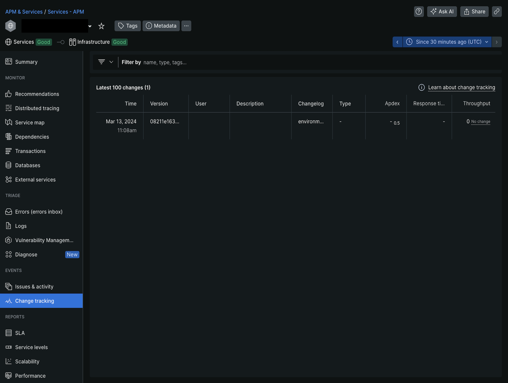

# デプロイメントの追跡

New Relic _変更履歴_&#x200B;機能を有効にして、Commerce on cloud infrastructure プロジェクトのデプロイメントイベントを監視できます。

デプロイメントデータの収集は、デプロイメントの変更がCPU、メモリ、応答時間などの全体的なパフォーマンスに与える影響を分析するのに役立ちます。 _New Relic ドキュメント_&#x200B;の「[NerdGraph](https://docs.newrelic.com/docs/change-tracking/change-tracking-graphql/)を使用した変更履歴の追跡」を参照してください。

>[!PREREQUISITES]
>
>- `NR_API_URL`: New Relic API エンドポイント、この場合はNerdGraph API URL `https://api.newrelic.com/graphql`
>- `NR_API_KEY`: ユーザーキーを作成します。_New Relic_ ドキュメントの[New Relic API Keys](https://docs.newrelic.com/docs/apis/intro-apis/new-relic-api-keys)を参照してください。
>- `NR_APP_GUID`: New Relicにデータをレポートするエンティティに一意のID （GUID）があります。 例えば、ステージング環境で有効にするには、New Relicの&#x200B;_ステージングエンティティ GUID_&#x200B;を使用して、ステージング環境`NR_APP_GUID` クラウド変数を調整します。 [New Relic エンティティについて学ぶ](https://docs.newrelic.com/docs/new-relic-solutions/new-relic-one/core-concepts/what-entity-new-relic/)および[NerdGraph チュートリアル：_New Relic_ ドキュメントのエンティティ データ ](https://docs.newrelic.com/docs/apis/nerdgraph/examples/nerdgraph-entities-api-tutorial/)の表示を参照してください。

## トラックデプロイメントを有効にする

_スクリプト_&#x200B;統合を作成して、New RelicでCommerce プロジェクトのデプロイメントイベントを追跡します。

**トラックのデプロイを有効にするには**:

1. ローカル ワークステーションで、プロジェクト ディレクトリに移動します。
1. `action-integration.js` ファイルを作成します。 次のコードをコピーして`action-integration.js` ファイルに貼り付け、保存します。

   ```javascript
   function trackDeployments() {
     const envName = activity.payload.environment.name;
     let variables;
     activity.payload.deployment.variables.forEach(function(variable) {
       if (variable.name === "env:NR_CONFIG") {
         variables = variable.value;
       }
     });
     const config = JSON.parse(variables.replace(/'/g, '"'));
     const commitSha = activity.payload.commits ? activity.payload.commits[0].sha : activity.payload.environment.head_commit;
     const deploymentType = activity.type;
   
     if (!(envName in config)) {
       throw new Error('There is no configuration for ' + envName);
     }
   
     const configEnv = config[envName];
   
     if (!configEnv.NR_APP_GUID || !configEnv.NR_API_KEY || !configEnv.NR_API_URL) {
       throw new Error('You must define the next configuation in the env variable NR_CONFIG: NR_APP_GUID, NR_API_KEY and NR_API_URL');
     }
   
     const query = `mutation {
       changeTrackingCreateDeployment(
       deployment: {
           version: "${commitSha}",
           entityGuid: "${configEnv.NR_APP_GUID}",
           commit: "${commitSha}",
           changelog: "${deploymentType}"
       }
       ) {
         deploymentId
         entityGuid
       }
     }`;
   
     var resp = fetch(configEnv.NR_API_URL, {
       method: 'POST',
       headers: {
           'Content-Type': 'application/json',
           'API-Key': configEnv.NR_API_KEY
       },
       body: JSON.stringify({
           query
       })
     });
   
     if (!resp.ok) {
       console.log('Sending new relic change tracking failed: ' + resp.text());
     } else {
       console.log(resp.text());
     }
   }
   
   trackDeployments();
   ```

1. `magento-cloud` CLI コマンドを使用して&#x200B;_script_&#x200B;統合を作成し、`action-integration.js` ファイルを参照します。

   ```bash
   magento-cloud integration:add --type script --events='environment.restore, environment.push, environment.branch, environment.activate, environment.synchronize, environment.initialize, environment.merge, environment.redeploy, environment.variable.create, environment.variable.delete, environment.variable.update' --file ./action-integration.js --project=<YOUR_PROJECT_ID> --environments=<YOUR_ENVIRONMENT_ID>
   ```

   回答サンプル：

   ```
   Created integration 767u4hathojjw (type: script)
   +-----------------------+-----------------------------------------------------------------------------------------------------------------------------------------+
   | Property              | Value                                                                                                                                   |
   +-----------------------+-----------------------------------------------------------------------------------------------------------------------------------------+
   | id                    | 767u4hathojjw                                                                                                                           |
   | type                  | script                                                                                                                                  |
   | role                  |                                                                                                                                         |
   | events                | - environment.restore                                                                                                                   |
   |                       | - environment.push                                                                                                                      |
   |                       | - environment.branch                                                                                                                    |
   |                       | - environment.activate                                                                                                                  |
   |                       | - environment.synchronize                                                                                                               |
   |                       | - environment.initialize                                                                                                                |
   |                       | - environment.merge                                                                                                                     |
   |                       | - environment.redeploy                                                                                                                  |
   |                       | - environment.variable.create                                                                                                           |
   |                       | - environment.variable.delete                                                                                                           |
   |                       | - environment.variable.update                                                                                                           |
   | environments          | - staging                                                                                                                               |
   |                       | - production                                                                                                                            |
   | excluded_environments | {  }                                                                                                                                    |
   | states                | - complete                                                                                                                              |
   | result                | *                                                                                                                                       |
   | script                | function variables() {                                                                                                                  |
   |                       |     var vars = {};                                                                                                                      |
   |                       |     activity.payload.deployment.variables.forEach(function(variable) {                                                                  |
   |                       |         vars[variable.name] = variable.value;                                                                                           |
   |                       |     });                                                                                                                                 |
   |                       |     return vars;                                                                                                                        |
   |                       | }                                                                                                                                       |
   |                       |                                                                                                                                         |
   |                       | function trackDeployments() {                                                                                                           |
   |                       |     const envName = activity.payload.environment.name;                                                                                  |
   |                       |                                                                                                                                         |
   |                       |     const config = JSON.parse(variables()['env:NR_CONFIG'].replace(/'/g, '"'));                                                         |
   |                       |     const commitSha = activity.payload.commits ? activity.payload.commits[0].sha : activity.payload.environment.head_commit;            |
   |                       |     const deploymentType = activity.type;                                                                                               |
   |                       |                                                                                                                                         |
   |                       |     if (!(envName in config)) {                                                                                                         |
   |                       |         throw new Error('There is no configuration for ' + envName);                                                                    |
   |                       |     }                                                                                                                                   |
   |                       |                                                                                                                                         |
   |                       |     const configEnv = config[envName];                                                                                                  |
   |                       |                                                                                                                                         |
   |                       |     if (!configEnv.NR_APP_GUID || !configEnv.NR_API_KEY || !configEnv.NR_API_URL) {                                                     |
   |                       |         throw new Error('You must define the next configuation in the env variable NR_CONFIG: NR_APP_GUID, NR_API_KEY and NR_API_URL'); |
   |                       |     }                                                                                                                                   |
   |                       |                                                                                                                                         |
   |                       |     const query = `mutation {                                                                                                           |
   |                       |         changeTrackingCreateDeployment(                                                                                                 |
   |                       |           deployment: {                                                                                                                 |
   |                       |             version: "${commitSha}",                                                                                                    |
   |                       |             entityGuid: "${configEnv.NR_APP_GUID}",                                                                                     |
   |                       |             commit: "${commitSha}",                                                                                                     |
   |                       |             changelog: "${deploymentType}"                                                                                              |
   |                       |           }                                                                                                                             |
   |                       |         ) {                                                                                                                             |
   |                       |           deploymentId                                                                                                                  |
   |                       |           entityGuid                                                                                                                    |
   |                       |         }                                                                                                                               |
   |                       |     }`;                                                                                                                                 |
   |                       |                                                                                                                                         |
   |                       |     var resp = fetch(configEnv.NR_API_URL, {                                                                                            |
   |                       |         method: 'POST',                                                                                                                 |
   |                       |         headers: {                                                                                                                      |
   |                       |             'Content-Type': 'application/json',                                                                                         |
   |                       |             'API-Key': configEnv.NR_API_KEY                                                                                             |
   |                       |         },                                                                                                                              |
   |                       |         body: JSON.stringify({                                                                                                          |
   |                       |             query                                                                                                                       |
   |                       |         })                                                                                                                              |
   |                       |     });                                                                                                                                 |
   |                       |                                                                                                                                         |
   |                       |     if (!resp.ok) {                                                                                                                     |
   |                       |         console.log('Sending new relic change tracking failed: ' + resp.text());                                                        |
   |                       |     } else {                                                                                                                            |
   |                       |         console.log(resp.text());                                                                                                       |
   |                       |     }                                                                                                                                   |
   |                       | }                                                                                                                                       |
   |                       |                                                                                                                                         |
   |                       | trackDeployments();                                                                                                                     |
   |                       |                                                                                                                                         |
   +-----------------------+-----------------------------------------------------------------------------------------------------------------------------------------+
   ```

1. 後で使用するために、統合IDをメモしておきます。 この例では、IDは次のとおりです。

   ```
   Created integration 767u4hathojjw (type: script)
   ```

   必要に応じて、統合を検証し、次の方法で統合IDをメモできます。`magento-cloud integration:list`

1. 前提条件を使用して環境変数を作成します。

   ```bash
   magento-cloud variable:create --level project --name=env:NR_CONFIG --value='{"<YOUR_ENVIRONMENT_ID>":{"NR_API_KEY": "<YOUR_API_KEY>", "NR_API_URL": "https://api.newrelic.com/graphql", "NR_APP_GUID":"<YOUR_APP_GUID>"}}'  -p <YOUR_PROJECT_ID>
   ```

1. 最後のアクティビティログを確認します。

   ```bash
   magento-cloud integration:activity:log <INTEGRATION_ID> -p <YOUR_PROJECT_ID> -e <YOUR_ENVIRONMENT_ID>
   ```

   応答：

   ```
   Integration ID: 767u4hathojjw
   Activity ID: poxqidsfajkmg
   Type: integration.script
   Description: Running activity script
   Created: 2023-08-28T20:32:02+00:00
   State: complete
   Log:
   HTTP request
   HTTP response
   {"data":{"changeTrackingCreateDeployment":{"deploymentId":"some-deployment-id","entityGuid":"SomeGUIDhere"}}}
   ```

1. [New Relic アカウント ](https://login.newrelic.com/login)にログインします。

1. エクスプローラーのナビゲーションメニューで、**[!UICONTROL APM & Services]**&#x200B;をクリックします。 環境[!UICONTROL Name]と[!UICONTROL Account]を選択します。

1. _イベント_&#x200B;で、**[!UICONTROL Change tracking]**&#x200B;をクリックします。

   
