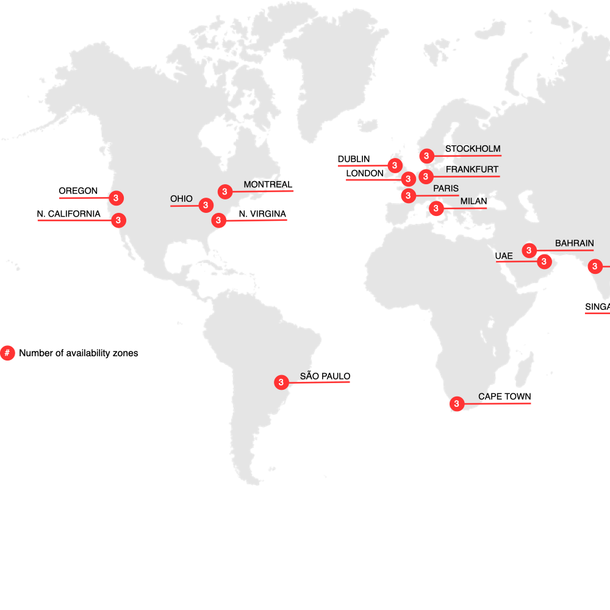
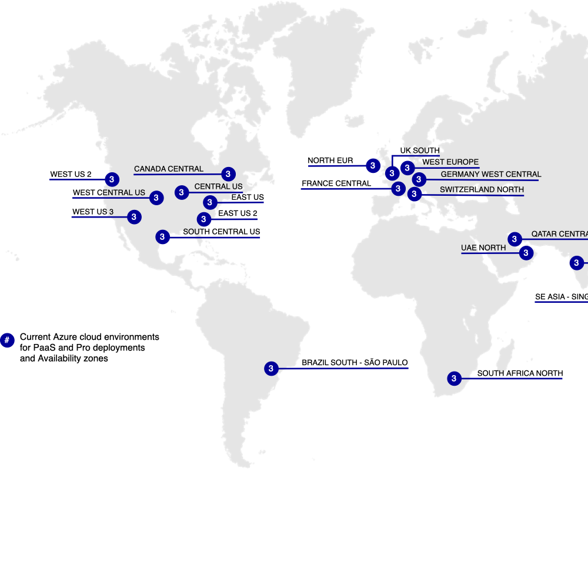

# Commerce on Cloud Infrastructure

Adobe Commerce on cloud infrastructureは、クラウドネイティブ環境で[!DNL Commerce] アプリケーションを構築、デプロイ、管理するための&#x200B;**セルフサービス** アプローチを備えた自動ホスティングプラットフォームです。 Adobe Commerce on cloud infrastructureには、オンプレミスのAdobe CommerceおよびMagento Open Source プラットフォームとは一線を画す追加機能が搭載されています。

- PHP、MySQL （MariaDB）、Redis、メッセージキューサービス（[!DNL RabbitMQ]または[!DNL ActiveMQ]）、サポートされる検索エンジンテクノロジーを含む、事前プロビジョニング済みのインフラストラクチャ。
- Platform as a Service （PaaS）環境でコード変更をプッシュするたびに、効率的な迅速な開発と継続的なデプロイメントを実現する自動ビルドとデプロイを備えたGit ベースのワークフロー。
- 高度にカスタマイズ可能な環境設定ファイルとコマンドラインインターフェイス（CLI）ツールの管理とデプロイ。
- Amazon Web Services（AWS）ホスティングは、オンライン販売と小売業のための拡張性と安全性の高い環境を提供します。

>[!NOTE]
>
>セキュリティについて詳しくは、[&#x200B; セキュリティ起動チェックリスト &#x200B;](https://experienceleague.adobe.com/ja/docs/commerce-on-cloud/user-guide/launch/checklist#security-configuration)を参照してください。

[&#x200B; テクノロジースタック &#x200B;](architecture/tech-stack.md)の詳細を確認するか、[Commerceのクラウドアーキテクチャ &#x200B;](architecture/cloud-architecture.md)の特定の機能とサポート対象の製品について詳しく確認します。

## クラウド地域

以下の節では、Adobe Commerce on cloud infrastructureで使用できるさまざまなAWSおよびAzure リージョンについて詳しく説明します。

## AWS地域

{zoomable="yes"}

>[!NOTE]
>
> 中国とロシアのオンプレミスのみ。

## Azure地域

{zoomable="yes"}

>[!NOTE]
>
> 中国とロシアのオンプレミスのみ。 統合環境を必要とするすべてのマーチャントは、米国の地域を使用する必要があります。

## Adobe Commerce ドキュメント

Commerce on cloud インフラストラクチャガイドでは、Adobe Commerce アプリケーションに関する実務的な知識と理解を有していることを前提としています。 以下の[!DNL Commerce]開発者およびユーザーガイドを参照してください。

- [Adobe Commerce開発者向けドキュメント &#x200B;](https://developer.adobe.com/commerce/docs/) （Adobe Developer サイト）：高度な機能の開発、カスタマイズ、統合、拡張、使用

- [Adobe Commerce ドキュメント &#x200B;](https://experienceleague.adobe.com/docs/commerce.html?lang=ja) （Adobe Experience League） - [!DNL Commerce] プロジェクトの計画、実装、操作、アップグレード、保守

{{$include /help/_includes/templated/whats-new.md}}

<!-- Last updated from includes: 2026-05-13 23:38:24 -->
