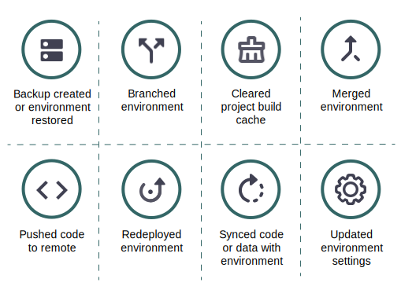
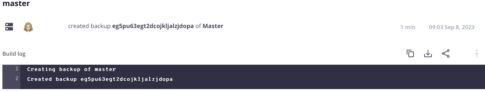
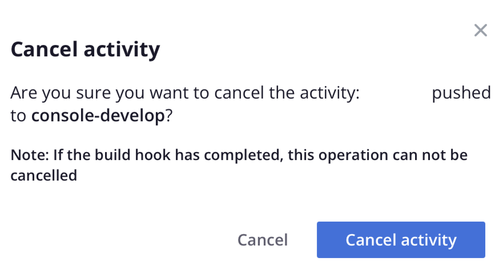

# アクティビティストリーム

各環境のメインビューには、Git ログに似た履歴イベントの&#x200B;**アクティビティ** リストが表示されます。 アクティビティリストは、アクティブな環境の最近のイベントのストリームです。 次に、アクティビティストリームに表示されるアクティビティタイプとそのアイコンのリストを示します。

{width="500" align="center"}

## ログを表示

アクティビティリストで、アクティビティのステータスアイコンをクリックしてログを表示します。 または、{width="32"} （_more_）メニューをクリックして、アクティビティを管理するためのより多くのオプションにアクセスします。 次に、バックアップを作成するためのショートログを示します。 [Cloud CLI](#activity-stream-with-cloud-cli)を使用して、同じログを表示できます。



## アクティビティの管理

一部のアクティビティは、_実行中_&#x200B;または&#x200B;_保留中_&#x200B;の状態です。 実行中のデプロイメントのキャンセルなど、実行中のアクティビティに対してアクションを実行できます。 次のタブには、アクティビティをキャンセルする2つの方法（[!DNL Cloud Console]またはCloud CLI）が表示されます。

>[!BEGINTABS]

>[!TAB  コンソール ]

**[!DNL Cloud Console]**&#x200B;でアクティビティをキャンセルするには：

実行中のアクティビティを操作するには、{width="32"} （_more_）メニューにアクセスし、`Cancel`や`View log`などのアクションを選択します。 この例では、**キャンセル** オプションを選択して、実行中のアクティビティを停止します。

すべてのアクティビティに解約オプションがあるわけではありません。 例えば、アプリケーションのデプロイメントをキャンセルするオプションは、_ビルド_ フェーズでのみ表示されます。 アプリケーションが&#x200B;_デプロイ_ フェーズに移行すると、アクティビティをキャンセルできなくなります。 様々なフェーズについては、[&#x200B; デプロイメントプロセス &#x200B;](../deploy/process.md)を参照してください。

{width="450" align="center"}

デプロイメントアクティビティを実行している端末がある場合、[!DNL Cloud Console]でキャンセルすると、端末でキャンセルが発生します。

{width="300"}

>[!TAB CLI]

**Cloud CLI**&#x200B;でアクティビティをキャンセルするには：

1. 実行中のアクティビティを特定し、アクティビティ IDを選択します。

   ```bash
   magento-cloud activity:list --state=in_progress
   ```

1. アクティビティ IDを使用してアクティビティをキャンセルします。

   ```bash
   magento-cloud activity:cancel wvl5wm7s5vkhy
   ```

>[!ENDTABS]

## フィルターアクティビティストリーム

アクティビティリストをフィルタリングする機能は、バックアップや結合イベントなどの特定の項目を探している場合に便利です。

**[!DNL Cloud Console]**&#x200B;でアクティビティリストをフィルタリングするには：

1. 環境を選択し、アクティビティ **[!UICONTROL All]** ビューを選択して、完全なイベント履歴を含めます。

1. 「{width="32"}」をクリックし、**[!UICONTROL Filter by]** オプションを選択します。

   

1. アクティビティ **[!UICONTROL Recent]** ビューを選択し、リストをリセットします。

## Cloud CLIでのストリームの表示

`magento-cloud` CLIは、[!DNL Cloud Console]と同じ機能のほとんどを提供します。 `activity` コマンドでは、次の操作を実行できます。

- 環境のアクティビティのストリーム `list`
- 特定のアクティビティに関する`get`詳細
- 特定のアクティビティの`log`を表示
- アクティビティ `cancel`

**Cloud CLI**&#x200B;でアクティビティストリームを表示するには：

1. 現在の環境のアクティビティをリストします。

   ```bash
   magento-cloud activity:list
   ```

1. 各アクティビティには一意のIDがあります。 前のリストからIDを選択し、そのアクティビティの詳細を表示します。

   ```bash
   magento-cloud activity:get wvl5wm7s5vkhy
   ```

1. そのアクティビティの完全なログを表示します。

   ```bash
   magento-cloud activity:log wvl5wm7s5vkhy
   ```

   回答サンプル：

   ```bash
   Activity ID: wvl5wm7s5vkhy
   Type: environment.backup
   Description: User created a backup of Master
   Created: 2023-09-08T14:03:33+00:00
   State: complete
   Log:
   Creating backup of master
   Created backup eg5pu63egt2dcojkljalzjdopa
   ```
