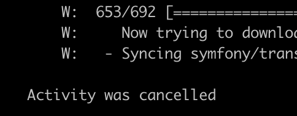

# アクティビティストリーム

各環境のメインビューには、Git ログに類似した履歴イベントの **アクティビティ** リストが表示されます。 アクティビティ リストは、アクティブな環境の最近のイベントのストリームです。 アクティビティタイプと、アクティビティストリームに表示されるアイコンのリストを以下に示します。

{width="500" align="center"}

## ログを表示

アクティビティリストで、アクティビティのステータスアイコンをクリックしてログを表示します。 または、{width="32"} （_その他_） メニューをクリックして、アクティビティを管理するためのその他のオプションにアクセスします。 次に、バックアップを作成する短いログを示します。 [Cloud CLI を使用 &#x200B;](#activity-stream-with-cloud-cli) して、同じログを表示できます。


## アクティビティの管理

一部のアクティビティのステータスが _実行中_ または _保留中_ です。 実行中のデプロイメントのキャンセルなど、実行中のアクティビティに対してアクションを実行できます。 アクティビティをキャンセルする方法は、[!DNL Cloud Console] と Cloud CLI の 2 つのタブで示されます。

>[!BEGINTABS]

>[!TAB  コンソール ]

**[!DNL Cloud Console]** でアクティビティをキャンセルするには：

実行中のアクティビティを操作するには、{width="32"} （_その他_）メニューにアクセスして、`Cancel` や `View log` などのアクションを選択します。 この例では、「**キャンセル**」オプションを選択して、実行中のアクティビティを停止します。

すべてのアクティビティにキャンセルオプションがあるわけではありません。 例えば、アプリケーションのデプロイメントをキャンセルするオプションは、_ビルド_ フェーズでのみ表示されます。 アプリケーションを _デプロイ_ フェーズに移動すると、アクティビティをキャンセルできなくなります。 様々なフェーズについては、[&#x200B; デプロイメントプロセス &#x200B;](../deploy/process.md) を参照してください。

{width="450" align="center"}

デプロイメントアクティビティを実行しているターミナルがある場合、[!DNL Cloud Console] をキャンセルすると、ターミナルでキャンセルが発生します。

{width="300"}

>[!TAB CLI]

**Cloud CLI でアクティビティをキャンセルするには**:

1. 実行中のアクティビティを特定し、アクティビティ ID を選択します。

   ```bash
   magento-cloud activity:list --state=in_progress
   ```

1. アクティビティ ID を使用してアクティビティをキャンセルします。

   ```bash
   magento-cloud activity:cancel wvl5wm7s5vkhy
   ```

>[!ENDTABS]

## フィルターアクティビティストリーム

アクティビティリストのフィルタリング機能は、バックアップや結合イベントなど、特定の項目を検索する場合に役立ちます。

**[!DNL Cloud Console]** でアクティビティリストをフィルタリングするには：

1. 環境を選択し、アクティビティ **[!UICONTROL All]** ビューを選択して、完全なイベント履歴を含めます。

1. {width="32"} をクリックして、**[!UICONTROL Filter by]** のオプションを選択します。

   

1. 表示するアクティビティ **[!UICONTROL Recent]** 選択し、リストをリセットします。

## Cloud CLI でストリームを表示

`magento-cloud` CLI は、[!DNL Cloud Console] と同じ機能のほとんどを提供します。 `activity` のコマンドでは、次の操作を実行できます。

- 環境のアクティビティストリームの `list` 成
- 特定のアクティビティに関する `get` 細
- 特定のアクティビティの `log` を表示する
- `cancel` クティビティの作成

**Cloud CLI でアクティビティストリームを表示するには**:

1. 現在の環境のアクティビティを一覧表示します。

   ```bash
   magento-cloud activity:list
   ```

1. 各アクティビティには一意の ID があります。 以前のリストから ID を選択し、そのアクティビティの詳細を表示します。

   ```bash
   magento-cloud activity:get wvl5wm7s5vkhy
   ```

1. そのアクティビティの完全なログを表示します。

   ```bash
   magento-cloud activity:log wvl5wm7s5vkhy
   ```

   応答の例：

   ```bash
   Activity ID: wvl5wm7s5vkhy
   Type: environment.backup
   Description: User created a backup of Master
   Created: 2023-09-08T14:03:33+00:00
   State: complete
   Log:
   Creating backup of master
   Created backup eg5pu63egt2dcojkljalzjdopa
   ```
