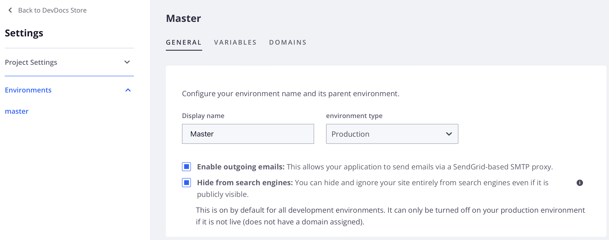

# 送信メールの設定

[!DNL Cloud Console]またはコマンドラインから、統合（およびスターターのみのステージング）環境の送信メールを有効または無効にできます。 送信メールを有効にして、Cloud プロジェクトユーザーに2要素認証を送信したり、パスワードリセットのメールを送信したりできます。

デフォルトでは、送信メールは実稼動環境とステージング環境（Proのみ）で有効になっています。 ただし、[&#x200B; コマンドライン &#x200B;](#enable-emails-in-the-cli)または[Cloud Console](outgoing-emails.md#enable-emails-in-the-cloud-console)を使用して`enable_smtp` プロパティを設定するまで、ステータスに関係なく、**[!UICONTROL Enable outgoing emails]**&#x200B;設定が環境設定で無効に表示される場合があります。

[&#x200B; コマンドライン &#x200B;](#enable-emails-in-the-cli)によって`enable_smtp` プロパティ値を更新すると、Cloud Consoleのこの環境の[!UICONTROL Enable outgoing emails]設定値も変更されます。

>[!NOTE]
>
>**[!UICONTROL Enable outgoing emails]**&#x200B;設定を有効または無効にすると、Pro ステージング環境または実稼動環境でメールが有効または無効になりません。

{{redeploy-warning}}

## Cloud Consoleでメールを有効にする

_環境設定_ ビューの&#x200B;**[!UICONTROL Outgoing emails]** トグルを使用して、電子メールサポートを有効または無効にします。

Pro実稼動環境またはステージング環境で送信メールを無効にするか、再度有効にする必要がある場合は、[Adobe Commerce サポートチケット &#x200B;](https://experienceleague.adobe.com/en/docs/commerce-knowledge-base/kb/help-center-guide/magento-help-center-user-guide)を送信できます。

>[!TIP]
>
>Cloud ConsoleのPro ステージング環境または実稼動環境では、送信メールのステータスが反映されない場合があります。

**[!DNL Cloud Console]**&#x200B;からの電子メールサポートを管理するには：

1. [[!DNL Cloud Console]](https://console.adobecommerce.com)にログインします。
1. _すべてのプロジェクト_ リストからプロジェクトを選択します。
1. プロジェクトダッシュボードで、右上の設定アイコンをクリックします。
1. **[!UICONTROL Environments]**&#x200B;をクリックし、リストから特定の環境を選択します（ステージングと実稼動用Proを除く）。
1. 送信メールを有効または無効にするには、_送信メールを有効にする_ **オン**&#x200B;または&#x200B;**オフ**&#x200B;を切り替えます。

   

設定を変更すると、環境はビルドされ、新しい設定でデプロイされます。

## CLIでメールを有効にする

アクティブな環境のメール設定を変更するには、`magento-cloud` CLI `environment:info` コマンドを使用して`enable_smtp` プロパティを設定します。 SMTPを有効にすると、`MAGENTO_CLOUD_SMTP_HOST`環境変数が、メール送信用のSMTP ホストのIP アドレスで更新されます。

**コマンドラインからメールサポートを管理するには**:

1. ローカル ワークステーションで、プロジェクト ディレクトリに移動します。

1. 環境の送信メール設定を確認します。

   ```bash
   magento-cloud environment:info -e <environment-id> | grep enable_smtp
   ```

1. `enable_smtp`環境変数を`true`または`false`に設定して、電子メールサポートの設定を変更します。

   ```bash
   magento-cloud environment:info --refresh -e <environment-id> enable_smtp true
   ```

   環境がビルドしてデプロイするのを待ちます。

1. SSHを使用してリモート環境にログインします。

1. 電子メールが機能することを確認します。確認できるアドレスにテストメールを送信します。

   ```bash
   php -r 'mail("mail@example.com", "test message", "just testing", "From: tester@example.com");'
   ```

1. メールがSendGridによって受信されていることを確認します。

   ```bash
   grep mail@example.com /var/log/mail.log
   ```
