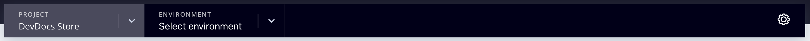

# クラウドインフラストラクチャプロジェクト

クラウドインフラストラクチャー上のAdobe Commerce プロジェクトには、[!DNL Commerce] アプリケーションをデプロイするための Git ブランチ内のすべてのコード、関連付けられた環境およびスクリプトが含まれます。 環境には、データベース、web サーバー、キャッシュサーバーなど、[!DNL Commerce] アプリケーションをサポートするサービスが含まれています。

Adobeには、プロジェクトのあらゆる側面を完全に管理するための [!DNL Cloud Console] ールおよび開発者ツールが用意されています。 アカウント所有者は、すべての環境に対してフルアクセス権を持ちます。

## [!DNL Cloud Console]

[!DNL Cloud Console] には、Commerce コードを簡単に作成、管理、デプロイするためのインタラクティブなメソッドが用意されています。 [&#x200B; にログイン  [!DNL Cloud Console]](https://console.adobecommerce.com) して、プロジェクトのリストを表示します。 管理者として、または特定の環境タイプについてアクセスする権限を持っているプロジェクトのみを表示できます。 Adobe ソリューションパートナーの場合は、サポートしているクライアントに対して複数のプロジェクトが表示される場合があります。

>[!TIP]
>
>プロジェクトが表示されない場合は、プロジェクトに関連付けられている [&#x200B; アカウント所有者またはプロジェクト管理者 &#x200B;](../project/user-access.md) に連絡して、アクセス権をリクエストする必要があります。 初めて利用するユーザーについては、[&#x200B; はじめに &#x200B;](../../get-started/onboarding.md#cloud-console) ガイドの _オンボーディングトピック_ を参照してください。

_すべてのプロジェクト_ ビューには、アクセス権限を持つすべてのプロジェクトが一覧表示されます。 「**[!UICONTROL Show filters]**」をクリックし、タイプ、地域またはプランでプロジェクトリストをフィルタリングできます。


### プロジェクトの概要

_すべてのプロジェクト_ リストからプロジェクトを選択すると、プロジェクトの概要が開きます。 プロジェクトの概要には常に、環境セレクターと設定ボタンを含むプロジェクトのナビゲーションバーが表示されます。



環境が選択されていない限り、プロジェクトの概要のプレビューエリアにプロジェクトの詳細の概要が表示されます。

- プロジェクト名
- 地域、プロジェクト ID
- 計画、割り当てられたストレージ、環境、ユーザー
- 「**[!UICONTROL Set a custom domain]**」ボタン付きストアフロント URL

また、メインプロジェクトの概要でも同様です。

- 環境ビュー：{width="32"} （アクティブ）環境と {width="32"} （非アクティブ）環境のリストまたはツリー表示を表示します。
- [&#x200B; アクティビティストリーム &#x200B;](activity-stream.md) には、プロジェクトの実行中、保留中、最近のアクティビティが表示されます。
<!-- - Apps & Services—Shows a topology of service containers -->

**スターター** プロジェクトの場合は、`master` （実稼動）から始まるブランチの階層があります。 作成したブランチは、`master` ブランチの子として表示されます。 Adobeでは、`staging` ブランチを作成してから、開発用に `integration` ブランチを作成することをお勧めします。 [&#x200B; スターターアーキテクチャ &#x200B;](../architecture/starter-architecture.md) を参照してください。

**Pro** の場合は、`production` から `staging` から `integration` までのブランチの階層があります。 {width="32"} アイコンは、ブランチが専用の環境にデプロイされることを示します。 作成したブランチは、`integration` ブランチの子として表示されます。 [Pro アーキテクチャ &#x200B;](../architecture/pro-architecture.md) を参照してください。


### 環境の概要

プロジェクトナビゲーションバーから環境を選択すると、概要とナビゲーションバーが変更され、選択した環境にフォーカスされます。 ナビゲーションバーには、分岐コントロール（分岐、結合、同期）と設定ボタンが含まれています。


環境の概要では、環境の詳細の概要がプレビュー領域に表示されます。

- 環境名、タイプ
- 地域、プロジェクト ID
- 最後のアクティビティの日時（バックアップを含む）
- HTTP アクセスおよび検索エンジンのステータス
- 環境に割り当てられているマシン名
- 環境ステータス（アクティブまたは非アクティブ）
- 「**[!UICONTROL Set a custom domain]**」ボタン付きストアフロント URL

また、メイン環境の概要でも以下を行います。

- [&#x200B; アクティビティストリーム &#x200B;](activity-stream.md) はメイン環境の概要を構成し、選択した環境の実行中、保留中、最近のアクティビティを表示します。
<!-- - Services tab shows and Apps & Services menu, including overview and configuration tabs for each service. -->
- [[ バックアップ ] タブ &#x200B;](../storage/snapshots.md#create-a-manual-backup) 保存されたバックアップの一覧、バックアップ操作の履歴、[ バックアップ ] ボタンが表示されます。

### ストアフロントにアクセス

アクティブな環境にはそれぞれストアフロントがあります。 上部ナビゲーションから環境を選択し、環境の概要の URL をクリックします。 また、右側のアクティビティ リストは **[!UICONTROL URLs]** クティビティリストの上にあります。

Web アクセス URL には、以下が含まれる場合があります。

```
https://<branch>-<unique-ID>-<project-ID>.<region>.magentosite.cloud/
```

- **一意の ID** = 7 個のランダムな英数字
- **プロジェクト ID** = 13 文字のプロジェクト ID
- **地域** = AWSまたは Azure の地域名。[&#x200B; 地域 IP アドレス &#x200B;](regional-ip-addresses.md) を参照してください。

実稼動環境とステージング環境には、次のリンクを使用してアクセスできる 3 つのノードが含まれています。

- ロードバランサー URL:

   - `http[s]://<your-domain>.c.<project-ID>.ent.magento.cloud`
   - `http[s]://<your-staging-domain>.c.<project-ID>.ent.magento.cloud`

- 3 台の冗長サーバのいずれかに直接アクセス：

   - `http[s]://<your-domain>.{1|2|3}.<project-ID>.ent.magento.cloud`
   - `http[s]://<your-staging-domain>.{1|2|3}.<project-ID>.ent.magento.cloud`

  実稼働用 URL は、コンテンツ配信ネットワーク（CDN）で使用されます。

## 設定

プロジェクトナビゲーションの右側にある _プロジェクトを設定_ アイコン {width="36"} 設定」パネルを開きます。

### プロジェクト設定

プロジェクトレベルのコントロールのメニューを拡張して、ユーザーや変数などを管理で **[!UICONTROL Project Settings]** ます。

| オプション | 説明 |
|--------------|-------------------------------------------------------------------------------------------------------------------------------|
| 一般 | バックアップまたはメンテナンスのスケジュールで使用するタイムゾーンを管理します。 |
| アクセス | プロジェクトおよび環境タイプへの [&#x200B; ユーザーアクセス &#x200B;](user-access.md) を管理します。 |
| 証明書 | プロジェクトに関連付けられている SSL 証明書のリストを表示します。 |
| キーのデプロイ | 公開鍵を追加し、プロジェクトコードリポジトリに表示します。 |
| ドメイン | ドメイン名をプロジェクトに追加します。 [&#x200B; ドメインの管理 &#x200B;](../cdn/fastly-custom-cache-configuration.md#manage-domains) を参照してください。 |
| 統合 | 正常性通知や Webhook など、[&#x200B; 統合 &#x200B;](../integrations/overview.md) を追加および管理します。 |
| 変数 | すべての環境のビルド時および実行時に使用できる [&#x200B; プロジェクトレベルの変数 &#x200B;](../environment/variable-levels.md) を追加します。 |

{style="table-layout:auto"}

### 環境設定

「**[!UICONTROL Environments]**」をクリックし、サイト設定や環境変数などを管理するコントロールのリストから特定の環境を選択します。

| オプション | 説明 |
| --------- | -------------------------------------------------------------------------------------------------------------------------------- |
| 一般 | 表示名、環境タイプ、親環境を設定します。<br> 様々な環境設定を切り替えます。 |
|           | **送信メールを有効にする**:SMTP プロトコルを使用して、環境から [&#x200B; 送信メール &#x200B;](outgoing-emails.md) を送信します。 |
|           | **検索エンジンから非表示**：サイトからの検索エンジンインデクサーとクローラーをブロックします。 |
|           | **HTTP アクセス制御**：ログインと IP アドレスのアクセス制御を使用して、[!DNL Cloud Console] のセキュリティ設定を有効にします。 |
|           | ステータスは `active` または `inactive` です。 ほとんどの作業は、アクティブな環境で行われています。 環境は、非アクティブ化または削除できます。 |
| 変数 | 実行時に使用できる [&#x200B; 環境レベルの変数 &#x200B;](../environment/variable-levels.md) を表示、作成および管理します。 |
| ドメイン | [&#x200B; 設定済みのルート &#x200B;](../routes/routes-yaml.md) のリストを表示します。 |

{style="table-layout:auto"}

>[!WARNING]
>
>**使用しない** Pro ステージング環境と実稼動環境を保護するために、HTTP アクセス制御方式を使用します。 これにより、Fastly のキャッシュが中断されます。 代わりに、Adobe Commerce用 Fastly CDN で利用可能な [&#x200B; ブロッキング &#x200B;](../cdn/fastly-vcl-blocking.md) 機能を使用して、アクセスをブロックしたり、[Fastly Basic Auth](https://github.com/fastly/fastly-magento2/blob/master/Documentation/Guides/BASIC-AUTH.md) を使用してアクセス制御を実装したりできます。

## Fastly とNew Relicの資格情報

プロジェクトには [Fastly](../cdn/fastly.md) と [New Relic](../monitor/new-relic-service.md) が含まれています。 プロジェクトの詳細には、プロジェクトプランの情報と、これらの統合に必要な重要なライセンスとトークンが表示されます。 資格情報とサービスに最初にアクセスできるのはライセンス所有者のみです。 必要に応じて、これらの資格情報を技術リソースおよび開発者リソースに提供します。

- [Fastly](https://www.fastly.com/) は、クラウドインフラストラクチャプロジェクト上のAdobe Commerceに対して、コンテンツ配信（CDN）、画像の最適化、セキュリティサービス（DDoS およびWAF）を提供します。 [Fastly 資格情報の取得 &#x200B;](../cdn/fastly-configuration.md#get-fastly-credentials) を参照してください。

- [New Relic](../monitor/new-relic-service.md) は、ステージング環境と実稼動環境のアプリケーション指標およびパフォーマンス情報を提供します。

[Cloud CLI](../dev-tools/cloud-cli-overview.md) を使用して、統合トークンや ID などを確認します。

```bash
magento-cloud subscription:info services
```
