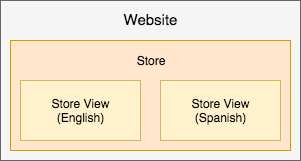
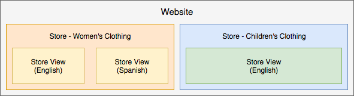
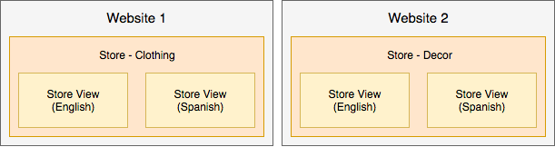

# ストア設定のベストプラクティス

ストア、サイト、およびweb サイトの設定について詳しくは、[Adobe Commerce ユーザーガイド ](https://experienceleague.adobe.com/docs/commerce-admin/user-guides/home.html)を参照してください。 このページでは、ストアやサイトを構成するためのベストプラクティス、役立つ情報、ガイドラインを紹介し、長期的にバージョン間で投稿するための追加コンテンツを提供します。

## マーケティング施策とプロモーション

この情報は、Adobe Commerce on cloud infrastructure 2.1.Xおよび2.2.Xに役立ちます。

キャンペーンとプロモーションを作成するには、[ コンテンツステージング ](https://experienceleague.adobe.com/docs/commerce-admin/content-design/staging/content-staging.html)でオプションと設定を作成します。 この機能を使用すると、顧客販売のためにキャンペーンを公開する前に、キャンペーンを作成およびプレビューできます。 次の情報が役立ちます。 詳しい手順については、リンクされたAdobe Commerce ユーザーガイドの内容を参照してください。

_キャンペーン_&#x200B;は、季節ごとのセールスや新製品ラインなどのマーケティングイベントです。 各キャンペーンには、カスタムテーマ、コンテンツのブロック、コンテンツを制御および表示するウィジェット、価格ルールに関連するプロモーションなどが含まれます。 キャンペーンの広範な性質により、コンテンツのステージングを通じて開始日と終了日を設定してキャンペーンを作成します。

_プロモーション_&#x200B;では、割引、1回限りのオファー、クーポン、初回購入者へのインセンティブなどが提供されます。 これらのプロモーションは、_価格規則_&#x200B;として作成し、顧客に購入を促すための条件、割引、オプションを設定します。 [ ショッピングカート ](https://experienceleague.adobe.com/docs/commerce-admin/marketing/promotions/cart-rules/price-rules-cart.html)または[ カタログ ](https://experienceleague.adobe.com/docs/commerce-admin/marketing/promotions/catalog-rules/price-rules-catalog.html)で価格ルールを作成し、バナーや報酬ポイントなどのオプションを追加できます。 プロモーションの施策をスケジュールし、新製品ラインや季節の売上などの主要イベントに価格ルールを適用することができます。

プロモーションとキャンペーンの作成、更新、管理に役立つヒントを以下に示します。

* プロモーションはキャンペーンの一部として行うことができます。 キャンペーンをプロモーションの一部にすることはできません。 プロモーションのリストを価格規則として作成し、複数のキャンペーンで複数回使用できます。
* プロモーションを作成すると、常に非アクティブな初期キャンペーンが作成されます。 開始日はありますが、終了日はありません。 この初期キャンペーンは無視できます。 正しいキャンペーンスケジュールで新しい更新をスケジュールし、アクティブにすることができます。
* キャンペーンには開始日と終了日があり、プロモーションには設定されません。 プロモーションの作成時に表示されるスケジューラーは、プロモーションの開始日と終了日を設定しません。 これにより、プロモーションの設定ページでキャンペーンをスケジュールできます。
* ステージングされたコンテンツでは直接編集できません。 キャンペーンの設定とオプションを編集する必要がある場合は、オリジナルまたはレプリカを編集し、プッシュしてステージングされたコンテンツで上書きします。 例えば、キャンペーンの終了日を設定しない場合は、元のキャンペーンとプッシュを編集して更新する必要があります。

## 高度な価格設定と段階的なコンテンツ

この情報は、Adobe Commerce on cloud infrastructure 2.1.Xおよび2.2.Xに役立ちます。

通常、製品の[詳細価格](https://experienceleague.adobe.com/docs/commerce-admin/catalog/products/pricing/pricing-advanced.html)は、管理者の&#x200B;**製品** > **カタログ**&#x200B;領域から設定できます。 ステージング済みコンテンツを使用して、プロモーションとキャンペーンに価格を追加するには、いくつかの追加ステップを完了します。

詳細な価格設定を編集し、コンテンツステージングを更新するには：

1. Adminにログインします。
1. **製品** / **カタログ**&#x200B;に移動し、製品を選択して編集します。
1. 「価格」タブで、**詳細な価格**&#x200B;を選択します。 価格を編集し、変更を保存します。
1. ページの上部で、**新しい更新をスケジュール**&#x200B;をクリックします。
1. 製品のプロモーションを作成します。
1. プロモーション情報を入力します。 スケジューラーに、開始と終了の日時を入力します。
1. プロモーションを保存します。 非アクティブな初期キャンペーンが作成されます。
1. キャンペーンの特別価格、プロモーション名、通常価格、予定日付範囲を確認するには、「プレビュー」を使用します。

その他の手順については、「[ カタログ価格ルールの変更をスケジュール ](https://experienceleague.adobe.com/docs/commerce-admin/marketing/promotions/catalog-rules/price-rule-catalog-scheduled-changes.html)」の手順に進むことができます。 「**次へ**」をクリックして、手順を順を追って説明します。

## 価格ルール

プライスルールには、マーケティングの想像力のように、ロジックや条件が無制限に含まれます。 人気のある例には、「Buy One Get One Free」、「Buy One Get One 50% Off」、「100 ドル以上の注文で25 ドル OFF」などがあります。

価格規則を作成するには、[Adobe Commerce ユーザーガイド ](https://experienceleague.adobe.com/docs/commerce-admin/marketing/promotions/catalog-rules/price-rules-catalog-create.html)を参照してください。

次に、初回注文のみ割引の価格ルールを作成する例を示します。 この割引では、次の操作を行う必要があります。

* 条件が[顧客セグメント ](https://experienceleague.adobe.com/en/docs/commerce-admin/customers/segments/customer-segment-price-rule)の価格ルールを作成します。合計注文数が1未満です
* この顧客セグメントを条件として買い物かごルールに追加します
* オプション – 特定のSKUまたはカテゴリーの製品に割引を適用するための条件やルールを追加して、集中的な購入に使用できます

これにより、新規顧客や購入未経験の既存顧客は、最初の注文でのみ割引を受けることができます。 初回購入割引のバナーを作成したり、メールプロモーションを送信したりすることができます。

## ストアビュー

Adobe Commerce on cloud infrastructureを1回実装して、複数のストアを設定および実行できます。 「[複数のweb サイトまたはストアを設定する](multiple-sites.md)」を参照してください。

相互に操作しないストアの場合は、複数の&#x200B;_web サイト_&#x200B;を作成できます。 各web サイトには、Adobe Commerceの他のweb サイトと共有されていない特定の記事、顧客データ、チェックアウト、ショッピングカートがあります。

各web サイトには、異なるカテゴリや記事、共有された顧客データ、チェックアウト、およびショッピングカートを持つ1つ以上の&#x200B;_ストア_&#x200B;を含めることができます。 これらのストアでは、顧客が1回サインアップすれば、1回のチェックアウトで様々な商品カタログをまたいで購入できます。

また、様々な言語、レイアウト、デザインに対して&#x200B;_ストアビュー_&#x200B;を作成することもできます。 記事、顧客データ、チェックアウト、ショッピングカートを共有しながら、各ビューで個別のドメイン、ブランディング、言語を使用できます。

以下は、より適切に説明するための例です。

* 英語とスペイン語のロケール用に1つのストアと2つのビューを持つ単一のweb サイト。 記事データ、顧客、チェックアウト、ショッピングカートはすべて共有されます。

  

* 女性用の衣料品店を持つ単一のweb サイトには、英語とスペイン語の2つのビューがあります。 子供服のお店は、英語で単一のストアビューが含まれています。 記事データ、顧客、チェックアウト、ショッピングカートはすべて共有されます。 ストアには、異なるドメインとテーマがある場合があります。

  

* 衣料品用と家庭用品用のふたつのweb サイト。カタログや別々の記事、顧客データ、ショッピングカートが異なる。 各web サイトには、記事、顧客データ、チェックアウト、ショッピングカートなどを共有する複数の実店舗とビューを持つことができます。

  

>[!WARNING]
>
>web サイトや実店舗の数が増えるにつれて、カタログデータは増加します。 プロジェクトのアーキテクチャによっては、追加のストアを使用すると、インデックス作成プロセスが長くなり、キャッシュされていないカタログページの応答時間が遅くなる可能性があります。 Adobeでは、サイトのパフォーマンスを詳細に監視することをお勧めします。
