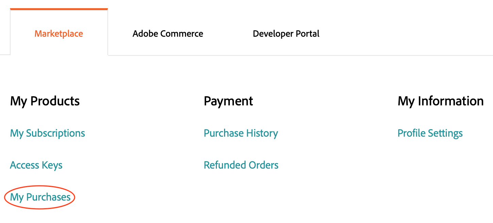

# 拡張機能を管理

Adobe Commerce アプリケーション機能を拡張するには、[Commerce Marketplace](https://marketplace.magento.com)から拡張機能を追加します。 例えば、テーマを追加してストアフロントの外観を変更したり、言語パッケージを追加してストアフロントと管理者をローカライズしたりできます。

>[!NOTE]
>
>インストールの問題を回避するには、すべてのMarketplaceの購入は、クラウドプロジェクトを所有するのと同じアカウント（MAGEID）を使用して完了する必要があります。

## 拡張機能のコンポーザー名

この節では、Commerce Marketplaceから拡張機能のコンポーザー名とバージョンを取得する方法について説明しますが、_any_ モジュールの名前とバージョンは、モジュールのコンポーザーファイルにあります。 `composer.json` ファイルをテキストエディターで開き、`"name"`と`"version"`の値を書き留めます。

**Commerce Marketplace**&#x200B;からモジュールのコンポーザー名を取得するには：

1. コンポーネントの購入に使用したユーザー名とパスワードを使用して、[Commerce Marketplace](https://marketplace.magento.com)にログインします。

1. 右上隅で、ユーザー名をクリックし、**マイプロファイル**&#x200B;を選択します。

   

1. _自分のアカウント_ ページで、**自分の購入履歴**&#x200B;をクリックします。

   

1. _購入履歴_ ページで、購入したモジュールを選択し、**技術情報**&#x200B;をクリックします。

1. 「**コピー**」をクリックして、[!UICONTROL Component name]をクリップボードにコピーします。

1. テキストエディターを開き、コンポーネント名を貼り付け、コロン文字（`:`）を追加します。

1. **技術情報**&#x200B;で、**コピー**&#x200B;をクリックして、[!UICONTROL Component version]をクリップボードにコピーします。

1. テキストエディターで、バージョン番号をコロンの後のコンポーネント名に追加します。 例：

   ```text
   extension-name/magento2:1.0.1
   ```

## 拡張機能のインストール

Adobeでは、拡張機能を実装に追加する際に、開発ブランチで作業することをお勧めします。 拡張機能をインストールすると、拡張機能の名前（`<VendorName>_<ComponentName>`）が[`app/etc/config.php`](https://experienceleague.adobe.com/docs/commerce-operations/configuration-guide/files/deployment-files.html) ファイルに自動的に挿入されます。 ファイルを直接編集する必要はありません。

**拡張機能をインストールするには**:

1. ローカル ワークステーションで、プロジェクト ディレクトリに移動します。

1. 開発ブランチを作成またはチェックアウトします。 [分岐](../development/cli-branches.md)を参照してください。

1. コンポーザーの名前とバージョンを使用して、`composer.json` ファイルの`require` セクションに拡張機能を追加します。

   ```bash
   composer require <extension-name>:<version> --no-update
   ```

1. プロジェクトの依存関係を更新します。

   ```bash
   composer update
   ```

1. コードの変更を追加、コミット、プッシュします。

   ```bash
   git add -A
   ```

   ```bash
   git commit -m "Install <extension-name>"
   ```

   ```bash
   git push origin <branch-name>
   ```

   >[!WARNING]
   >
   >拡張機能をインストールする場合、リモート環境にコードの変更をプッシュする際には、`composer.lock` ファイルを含める必要があります。 `composer install` コマンドは、`composer.lock` ファイルを読み取り、リモート環境で定義された依存関係を有効にします。

1. ビルドとデプロイが完了したら、SSHを使用してリモート環境にログインし、インストールされている拡張機能を確認します。

   ```bash
   bin/magento module:status <extension-name>
   ```

   拡張機能の名前では、次の形式が使用されています：`<VendorName>_<ComponentName>`。

   回答サンプル：

   ```
   Module is enabled
   ```

   デプロイメントエラーが発生した場合は、[拡張機能のデプロイメントエラー](../deploy/recover-failed-deployment.md)を参照してください。

## 拡張機能を管理

Composerを使用して拡張機能を追加すると、デプロイメントプロセスによって拡張機能が自動的に有効になります。 拡張機能が既にインストールされている場合は、CLIを使用して拡張機能を有効または無効にできます。 拡張機能を管理する場合は、次の形式を使用します：`<VendorName>_<ComponentName>`

リモート環境へのログイン時に拡張機能を有効または無効にしない。

**拡張機能を有効または無効にするには**:

1. ローカル ワークステーションで、プロジェクト ディレクトリに移動します。

1. モジュールを有効または無効にします。 `module` コマンドは、モジュールの要求されたステータスで`config.php` ファイルを更新します。

   >モジュールを有効にします。

   ```bash
   bin/magento module:enable <module-name>
   ```

   >モジュールを無効にします。

   ```bash
   bin/magento module:disable <module-name>
   ```

1. モジュールを有効にした場合は、`ece-tools`を使用して設定を更新します。

   ```bash
   ./vendor/bin/ece-tools module:refresh
   ```

1. モジュールのステータスを確認します。

   ```bash
   bin/magento module:status <module-name>
   ```

1. コードの変更を追加、コミット、プッシュします。

   ```bash
   git add -A
   ```

   ```bash
   git commit -m "Disable <extension-name>"
   ```

   ```bash
   git push origin <branch-names>
   ```

## 拡張機能のアップグレード

続行する前に、拡張機能のコンポーザー名とバージョンが必要です。 また、拡張機能がプロジェクトとAdobe Commerceのバージョンと互換性があることを確認します。 特に、[開始する前に、必要なPHP バージョン &#x200B;](https://experienceleague.adobe.com/docs/commerce-operations/installation-guide/system-requirements.html)を確認してください。

**拡張機能を更新するには**:

1. ローカル ワークステーションで、プロジェクト ディレクトリに移動します。

1. 開発ブランチを作成またはチェックアウトします。 [分岐](../development/cli-branches.md)を参照してください。

1. テキストエディターで`composer.json` ファイルを開きます。

1. 拡張機能を見つけて、バージョンを更新します。

1. 変更を保存し、テキストエディターを終了します。

1. プロジェクトの依存関係を更新します。

   ```bash
   composer update
   ```

1. コード変更を追加、コミット、プッシュします。

   ```bash
   git add -A
   ```

   ```bash
   git commit -m "Update <extension-name>"
   ```

   ```bash
   git push origin <branch-names>
   ```

エラーが発生した場合は、[&#x200B; コンポーネントエラーからの回復](../deploy/recover-failed-deployment.md)を参照してください。 Adobe Commerceでの拡張機能の使用について詳しくは、_管理者ガイド_&#x200B;の[拡張機能](https://experienceleague.adobe.com/docs/commerce-admin/start/resources/extensions.html)を参照してください。
