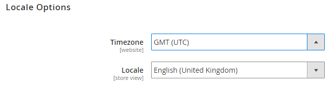
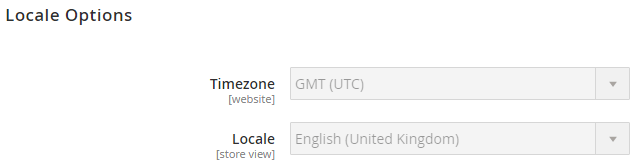

# システム固有の設定の管理の例

この例では、構成管理を使用して、すべての環境でストア設定の一貫性を維持する方法を示します。

この例では、[&#x200B; ストア設定](store-settings.md)で定義されている次の手順を使用します。

1. 統合環境ストア管理者に設定を入力します。
1. `config.php` ファイルを作成し、ローカル ワークステーションに転送します。
1. `config.php`をリモート統合環境にプッシュします。
1. 管理者で設定を編集できないことを確認します。
1. 必要な変更を加えます。

   * 統合環境の設定設定を変更します。
   * 設定を追加するには、コマンドを実行して`config.php`をもう一度作成します。 新しい設定がファイルに追加されます。
   * 既存の設定を削除または編集するには、ファイルを手動で編集します。
   * コミットしてプッシュします。

例えば、次の設定を行うことができます。

* 統合環境でロケールと静的ファイルの最適化設定を無効にする
* ステージング環境と実稼動環境での静的ファイル最適化の有効化
* ステージングおよび本番環境でのFastlyの設定は、それぞれに特定の資格情報を使用します

_静的ファイル最適化_&#x200B;とは、JavaScriptとカスケーディングスタイルシートを結合および縮小し、HTML テンプレートを縮小することです。 [静的コンテンツ展開戦略](../deploy/static-content.md)を参照してください。

## 前提条件

これらの設定管理タスクを完了するには、次の手順を実行する必要があります。

* [環境「管理者」 &#x200B;](../project/user-access.md)権限を持つプロジェクトリーダーの役割
* 統合、ステージング、実稼動環境の管理者URLと資格情報

## Commerce Adminの設定

統合環境では、管理者にログインして、ストア、web サイト、モジュールまたは拡張機能、静的ファイルの最適化、静的コンテンツ展開に関連するシステム値のシステム設定設定を変更できます。 [設定データ &#x200B;](store-settings.md#scd-performance)を参照してください。

**ロケールと静的ファイルの最適化設定を変更するには**:

1. 統合環境の管理者にログインします。 このURLには、[[!DNL Cloud Console]](../project/overview.md)からアクセスできます。
1. **ストア** / 設定/**構成** / 一般/**一般**&#x200B;に移動します。
1. ページナビゲーションで、**ロケールオプション**&#x200B;を展開します。
1. **ロケール** リストから、ロケールを変更します。 後で変更し直すことができます。

   

1. 「**設定を保存**」をクリックします。
1. プロンプトが表示されたら、[&#x200B; キャッシュをフラッシュします](https://experienceleague.adobe.com/ja/docs/commerce-admin/systems/tools/cache-management)。
1. Adminからログアウトします。

## 値をエクスポートし、config.phpをローカルシステムに転送する

この手順では、ローカルマシンで実行するコマンドを使用して、統合環境で`config.php`設定ファイルを作成および転送します。

この手順は、[推奨手順](store-settings.md)の手順2に対応しています。 `config.php`を作成したら、それをローカル システムに転送して、Gitに追加できるようにします。

**`config.php`**&#x200B;を作成して転送するには：

1. ローカル ワークステーションで、プロジェクト ディレクトリに移動します。

1. 統合環境に変更します。

   ```bash
   magento-cloud environment:checkout integration
   ```

1. リモートデータベースのローカルダンプを作成します。

   ```bash
   magento-cloud db:dump
   ```

`config.php`の次のスニペットは、デフォルトロケールを`en_GB`に変更し、静的ファイル最適化設定を変更する例を示しています。

```php?start_inline=1
'general' => [
     'locale' => [
         'code' => 'en_GB',
         'timezone' => 'UTC',
     ],

     ... more ...

 'dev' => [
     'template' => [
         'allow_symlink' => '0',
         'minify_html' => '0',
     ],
     'js' => [
         'merge_files' => '0',
         'enable_js_bundling' => '0',
         'minify_files' => '0',
     ],
     'css' => [
         'merge_css_files' => '0',
         'minify_files' => '0',
     ],

     ... more ...
```

## config.phpを環境にプッシュしてデプロイする

`config.php`を作成してローカルシステムに転送したら、それをGitにコミットし、環境にプッシュします。 この手順は、[推奨手順](store-settings.md)の手順3と4に対応しています。

次のコマンドは、`master` ブランチを追加、コミット、プッシュします。

```bash
git add app/etc/config.php && git commit -m "Add system-specific configuration" && git push origin master
```

ステージングおよび実稼動環境へのコードのデプロイメントを完了します。 スターターの場合は、`staging`および`master`分岐にプッシュします。 デプロイメントコマンドについて詳しくは、[&#x200B; ストアのデプロイ &#x200B;](../deploy/staging-production.md)を参照してください。

すべての環境でデプロイメントが完了するのを待ちます。

## 設定の変更を確認する

環境に`config.php`をプッシュした後、変更した値はすべて管理者で読み取り専用にする必要があります。 この例では、変更されたデフォルトのロケールと静的ファイル最適化設定を管理者で編集することはできません。 これらの設定設定は`config.php`で設定されています。

設定の変更を確認するには：

1. いずれかの環境で管理者からログアウトします。
1. Adminに再度ログインします。
1. **ストア** / 設定/**構成** / 一般/**一般**&#x200B;をクリックします。
1. 右側のペインで、**ロケールオプション**&#x200B;を展開します。

   次の例に示すように、複数のフィールドを編集できません。 これらの構成設定は`config.php`によって管理されています。

   で編集できなくなりました

1. Adminからログアウトします。

## システム固有の設定設定の変更と更新

これらの設定のいずれかを変更する必要がある場合は、テキストエディターを使用して`config.php` ファイルを手動で変更します。 編集または削除が完了したら、前の手順に従ってコミットしてリモート環境にプッシュできます。

設定を追加するには、統合環境を変更し、もう一度コマンドを実行してファイルを生成します。 新しい設定は、ファイル内のコードに追加されます。 前の手順に従ってGitにプッシュします。

この例では、静的ファイルの最適化設定を変更し、JavaScriptの新しい設定を追加します。

### 統合での設定の追加

統合環境Adminで設定値を追加するには、次の手順を実行します。 次の使用例は、JavaScript ファイルを結合します。

1. 統合管理者からログアウトします。
1. 統合管理者に再度ログインします。
1. **ストア** / 設定/**構成** / **詳細** / **開発者**&#x200B;をクリックします。
1. 右側のペインで、**JavaScript Settings**&#x200B;を展開します。
1. **JavaScript ファイルの結合** リストから、**はい**&#x200B;をクリックします。
1. 「**設定を保存**」をクリックします。
1. プロンプトが表示されたら、[&#x200B; キャッシュをフラッシュします](https://experienceleague.adobe.com/ja/docs/commerce-admin/systems/tools/cache-management)。
1. Adminからログアウトします。

dump コマンドを再度実行すると、新しい設定がファイルに追加されます。

```bash
magento-cloud db:dump
```

### 新しい設定でconfig.phpを編集する

ローカルで、テキストエディターを使用して、更新された`app/etc/config.php` ファイルを編集します。 JavaScript、HTML、CSS ファイルの縮小を有効にするには、これらの設定を編集します。

```php?start_inline=1
 'dev' => [
     'template' => [
         'allow_symlink' => '0',
         'minify_html' => '0',
     ],

     ... more ...

     'js' => [
         'merge_files' => '0',
         'enable_js_bundling' => '0',
         'minify_files' => '0',
     ],
     'css' => [
         'merge_css_files' => '0',
         'minify_files' => '0',
     ],
```

最小化を許可するように設定を変更するには、`'minify_html'`と各`'minify_files'` オプションの`'0'`から`'1'`を編集します。

```php?start_inline=1
 'dev' => [
     'template' => [
         'allow_symlink' => '0',
         'minify_html' => '1',
     ],

     ... more ...

     'js' => [
         'merge_files' => '0',
         'enable_js_bundling' => '0',
         'minify_files' => '1',
     ],
     'css' => [
         'merge_css_files' => '0',
         'minify_files' => '1',
     ],
```

ファイルに変更を保存します。

### 変更をGitにプッシュ

変更をプッシュするには、次のように入力します。

```bash
git add app/etc/config.php
```

```bash
git commit -m "Add system-specific configuration and edit settings"
```

```bash
git push origin master
```

デプロイメントが完了するのを待ちます。

すべての環境にコードをプッシュするデプロイメントプロセスを繰り返します。
