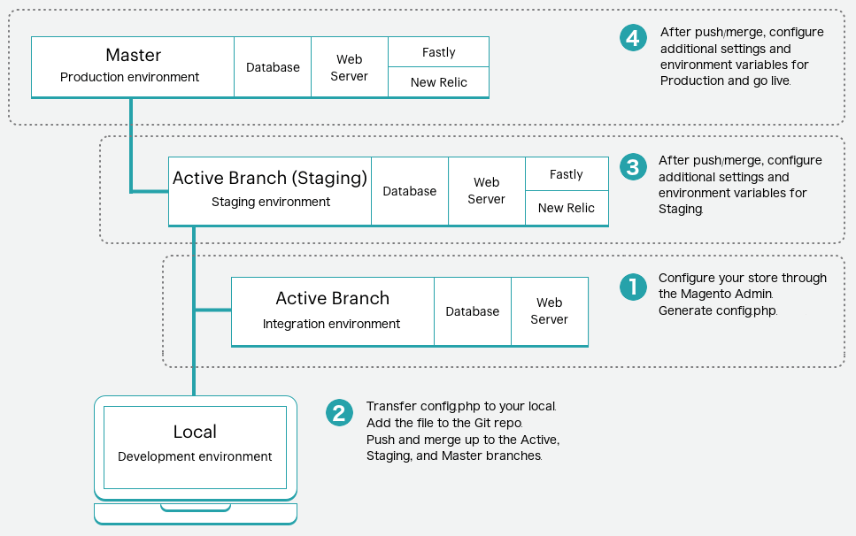

# ストア設定管理

ストアのデフォルト設定は、適切なモジュールの`config.xml`に保存されます。 Commerce AdminまたはCLI `bin/magento config:set` コマンドで設定を変更すると、その変更はコアデータベース、特に`core_config_data` テーブルに反映されます。 これらの設定は、`config.xml` ファイルに保存されている既定の設定を上書きします。

管理者&#x200B;**ストア** > **設定** > **設定** セクションの設定を参照するストア設定は、設定のタイプに基づいてデプロイメント設定ファイルに保存されます。

- `app/etc/config.php` – 静的コンテンツのデプロイメントに関連するストア、web サイト、モジュールまたは拡張機能、静的ファイルの最適化、およびシステム値の設定。 _設定ガイド_&#x200B;の[config.php リファレンス &#x200B;](https://experienceleague.adobe.com/docs/commerce-operations/configuration-guide/files/config-reference-configphp.html?lang=ja)を参照してください。
- `app/etc/env.php` - システム固有のオーバーライドの値と、_NOT_&#x200B;をソース コントロールに保存する必要がある機密設定。 _設定ガイド_&#x200B;の[env.php リファレンス &#x200B;](https://experienceleague.adobe.com/docs/commerce-operations/configuration-guide/files/config-reference-envphp.html?lang=ja)を参照してください。

>[!NOTE]
>
>Adobe Commerce on cloud infrastructureは実稼動モードとメンテナンスモードのみをサポートするため、管理者は&#x200B;**Advanced** > **Developer** セクションにアクセスできません。 構成管理タスクを完了するには、[環境管理者権限](../project/user-access.md)が必要です。 [環境変数](../environment/configure-env-yaml.md)を使用して追加の設定を行うことができます。

設定管理を使用すると、パイプラインのデプロイメントを使用して、ダウンタイムを最小限に抑えながら、環境全体で一貫したストア設定をデプロイできます。 Adobe Commerce on cloud infrastructure プロジェクトには、[&#x200B; パイプラインのデプロイメント戦略](https://experienceleague.adobe.com/docs/commerce-operations/configuration-guide/deployment/technical-details.html?lang=ja)を念頭に置いて設計されたビルドサーバー、ビルドおよびデプロイ環境が含まれます。

## 設定の上書きスキーム

すべてのシステム設定は、次のオーバーライドスキームに従って、ビルドおよびデプロイのフェーズ中に設定されます。

1. 環境変数が存在する場合は、カスタム設定を使用し、デフォルト設定を無視します。
1. 環境変数が存在しない場合は、[`.magento.app.yaml` ファイル &#x200B;](../application/configure-app-yaml.md)の`MAGENTO_CLOUD_RELATIONSHIPS`の名前と値のペアの設定を使用します。 デフォルト設定を無視します。
1. 環境変数が存在せず、`MAGENTO_CLOUD_RELATIONSHIPS`に名前と値のペアが含まれていない場合は、カスタマイズされた設定をすべて削除し、デフォルト設定の値を使用します。

要約すると、環境変数は他のすべての値を上書きします。

>[!TIP]
>
>パイプラインのデプロイメントのオーバーライドスキームについて詳しくは、_設定ガイド_&#x200B;の[設定管理](https://experienceleague.adobe.com/docs/commerce-operations/configuration-guide/deployment/technical-details.html?lang=ja)を参照してください。

同じ設定が複数の場所で設定されている場合、アプリケーションは次の設定階層に依存して、環境に適用する値を決定します。

| 優先度 | 設定<br> メソッド | 説明 |
| -------- | ------------------------ | ----------- |
| 1 | [!DNL Cloud Console]<br>環境変数 | [!DNL Cloud Console]の環境設定の「_変数_」タブから追加された値。 ここでは、機密性の高い設定や環境固有の設定の値を指定します。 ここで指定した設定は、管理者から編集できません。 [環境設定変数](../project/overview.md#configure-environment)を参照してください。 |
| 2 | `.magento.app.yaml` | `.magento.app.yaml` ファイルの`variables` セクションに追加された値。 ここで値を指定すると、すべての環境で一貫した設定が行われます。 **`.magento.app.yaml` ファイルで機密値を指定しないでください。** [&#x200B; アプリケーション設定](../application/configure-app-yaml.md)を参照してください。 |
| 3 | `app/etc/env.php` | ここに保存されている環境固有の設定値は、`app:config:dump` コマンドを使用して追加されます。 環境変数またはCLIを使用して、システム固有の値と機密性の高い値を設定します。 [機密データ &#x200B;](#sensitive-data)を参照してください。 `env.php` ファイルは&#x200B;**not**&#x200B;でソース コントロールに含まれています。 |
| 4 | `app/etc/config.php` | ここに保存されている値は、`app:config:dump` コマンドを使用して追加されます。 共有設定値が`config.php`に追加されます。 管理者またはCLIを使用して、共有設定を設定します。 `config.php` ファイルはソース管理に含まれています。 |
| 5 | データベース | ここに保存されている値は、管理者で設定を設定することによって追加されます。 上記のいずれかの方法を使用して設定した設定はロック（グレー表示）され、管理者から編集することはできません。 |
| 6 | `config.xml` | 多くの設定では、モジュールの`config.xml` ファイルにデフォルト値が設定されています。 Adobe Commerceで上記のメソッドで設定された値が見つからない場合は、設定されている場合はデフォルト値にフォールバックします。 |

{style="table-layout:auto"}

## 設定ダンプ

次の`ece-tools` コマンドを使用して、現在のすべてのストア設定を含む`config.php` ファイルを生成できます。

```bash
./vendor/bin/ece-tools config:dump
```

`app/etc/config.php` ファイルに「ダンプされた」データは&#x200B;_ロック_&#x200B;になります。つまり、Commerce管理画面の対応するフィールドは&#x200B;**読み取り専用**&#x200B;になります。 `config.php` ファイルには、設定した設定のみが含まれます。 デフォルト値はロックされません。 更新した値のみをロックすることで、ステージング環境と実稼動環境で使用されているすべての拡張機能が、特にFastlyなどの読み取り専用の設定によって破損しないようにします。

>[!WARNING]
>
>`ece-tools config:dump` コマンドは、B2Bなどのモジュールの詳細な設定を取得しません。 包括的な設定ダンプが必要な場合は、`app:config:dump` コマンドを使用しますが、このコマンドは設定値を読み取り専用の状態でロックします。

### 機密データ

`bin/magento app:config:dump` コマンドを使用すると、機密性の高い設定はすべて`app/etc/env.php` ファイルに書き出されます。 CLI コマンド `bin/magento config:sensitive:set`を使用して、機密値を設定できます。 _Commerce PHP Extensions_ ガイドの[機密性の高い環境固有の設定](https://developer.adobe.com/commerce/php/development/configuration/sensitive-environment-settings/)を参照して、機密性の高い設定またはシステム固有の設定を指定する方法について説明します。

_設定ガイド_&#x200B;の[機密設定またはシステム固有の設定](https://experienceleague.adobe.com/docs/commerce-operations/configuration-guide/paths/config-reference-sens.html?lang=ja)の一覧を参照してください。

### SCD パフォーマンス

ストアのサイズによっては、デプロイする静的コンテンツファイルが多数ある場合があります。 通常、静的コンテンツは、アプリケーションがメンテナンスモードのデプロイフェーズでデプロイされます。 最も最適な設定は、ビルドフェーズで静的コンテンツを生成することです。 [&#x200B; デプロイ戦略の選択](../deploy/static-content.md)を参照してください。

設定をダンプした後に構成管理を有効にした場合は、SCD_*変数をデプロイ ステージからビルド ステージに移動して、ビルド フェーズで静的コンテンツ生成を適切に有効にする必要があります。 [環境変数](../environment/configure-env-yaml.md#environment-variables)を参照してください。

**構成管理**&#x200B;前：

```yaml
  deploy:
    CRON_CONSUMERS_RUNNER:
      cron_run: true
      consumers: []
    SCD_STRATEGY: compact
    SCD_MATRIX:
      ...
    REDIS_USE_SLAVE_CONNECTION: 1
```

**構成管理を有効にした後**:

SCD_*変数をビルドステージに移動します。

```yaml
  deploy:
    CRON_CONSUMERS_RUNNER:
      cron_run: true
      consumers: []
    REDIS_USE_SLAVE_CONNECTION: 1
  build:
    SCD_STRATEGY: compact
    SCD_MATRIX:
      ...
```

>[!NOTE]
>
>静的ファイルをデプロイする前に、ビルドとデプロイのフェーズでは、GZIPを使用して静的コンテンツを圧縮します。 静的ファイルを圧縮することで、サーバーの負荷を軽減し、サイトパフォーマンスを向上できます。 ファイル圧縮のカスタマイズまたは無効化について詳しくは、[&#x200B; ビルドオプション &#x200B;](../environment/variables-build.md)を参照してください。

## 設定を管理する手順

このプロセスの概要を次に示します。



**ストアを設定して設定ファイルを生成するには**:

1. いずれかの環境の管理者で、ストアのすべての設定を完了します。

   - Starter: アクティブな開発ブランチ
   - Pro：統合環境のアクティブなブランチ

   これらの設定には、データベースをこの環境からステージング環境および実稼動環境にダンプする予定がない限り、実際の製品は含まれません。 通常、開発データベースにはストア全体のデータは含まれません。

1. ローカル ワークステーションで、プロジェクト ディレクトリに移動します。

1. リモートデータベースのローカルダンプを作成します。

   ```bash
   magento-cloud db:dump
   ```

1. コード変更を追加、コミット、プッシュして、リモート環境を更新します。

   ```bash
   git add app/etc/config.php
   ```

   ```bash
   git commit -m "Add system-specific configuration"
   ```

   ```bash
   git push origin <branch-name>
   ```

デプロイメントが完了したら、更新された環境の管理者にログインして設定を確認します。 必要に応じて、追加の設定を引き続きステージング環境と実稼動環境に結合します。

### 設定の更新

管理者を使用して環境を変更し、コマンドを再度実行すると、新しい設定が`config.php` ファイルのコードに追加されます。

>[!WARNING]
>
>ステージング環境および実稼動環境で`config.php` ファイルを手動で編集することはできますが、**は**&#x200B;をお勧めします。 このファイルは、すべての環境ですべての設定の一貫性を維持するのに役立ちます。 再構築用の`config.php` ファイルは絶対に削除しないでください。 ファイルを削除すると、ビルドおよびデプロイプロセスに必要な特定の設定や設定を削除できます。

### 設定ファイルの復元

元の`app/etc/env.php`および`app/etc/config.php` ファイルのコピーは、デプロイメントプロセス中に作成され、同じフォルダーに保存されました。 同じ`app/etc` フォルダー内のBAK （バックアップファイル）とPHP （元のファイル）を次に示します。

```
...
config.php.bak
di.xml
env.php.bak
vendor_path.php
config.php
db_schema.xml
env.php
...
```

以前の設定では、`app/etc/config.local.php` ファイルが使用されていました。 [古い設定の移行](#migrate-older-configurations)を参照してください。

**設定ファイルを復元するには**:

1. ローカルワークステーションで、SSHを使用してリモートプロジェクトと環境にログインします。

   ```bash
   magento-cloud ssh
   ```

1. バックアップファイルの場所と可用性を確認します。

   ```bash
   ./vendor/bin/ece-tools backup:list
   ```

   回答サンプル：

   ```
   The list of backup files:
   app/etc/env.php
   app/etc/config.php
   ```

1. バックアップファイルを復元します。

   ```bash
   ./vendor/bin/ece-tools backup:restore
   ```

### 古い設定の移行

Cloud Infrastructure 2.2以降のAdobe Commerceにアップグレードする場合は、`config.local.php` ファイルから新しい`config.php` ファイルに設定を移行する必要がある場合があります。 管理者の設定設定がファイルの内容と一致する場合は、手順に従って`config.php` ファイルを生成して追加します。

異なる場合は、`config.local.php` ファイルから新しい`config.php` ファイルにコンテンツを追加できます。

1. 手順に従って、`config.php` ファイルを生成します。

1. `config.php` ファイルを開き、最終行を削除します。

1. `config.local.php` ファイルを開き、内容をコピーします。

1. 内容を`config.php` ファイルに貼り付けて保存し、Gitへの追加を完了します。

1. 環境全体に展開。

この移行は1回のみ完了します。 移行後、`config.php` ファイルを使用します。

### ロケールを変更

複雑な設定の読み込みおよび書き出しプロセスに従うことなく、ストアのロケールを変更できます。_if_[SCD_ON_DEMAND](../environment/variables-global.md#scd_on_demand)が有効になっています。 管理者を使用してロケールを更新できます。

統合ブランチで`SCD_ON_DEMAND`を有効にし、新しいロケール情報を使用して更新された`config.php` ファイルを生成し、設定ファイルをターゲット環境にコピーすることで、ステージング環境または実稼動環境に別のロケールを追加できます。

>[!WARNING]
>
>このプロセスは&#x200B;**ストア設定を上書きします**。環境に同じストアが含まれている場合にのみ、次の操作を行います。

1. 統合環境で、[`.magento.env.yaml` ファイル &#x200B;](../environment/configure-env-yaml.md)を使用して`SCD_ON_DEMAND`変数を有効にします。

1. 管理者を使用して必要なロケールを追加します。

1. SSHを使用してリモート環境にログインし、すべてのロケールを含む`/app/etc/config.php` ファイルを生成します。

   ```bash
   ssh <SSH-URL> "./vendor/bin/ece-tools config:dump"
   ```

1. 新しい設定ファイルをリモート統合環境からローカル環境ディレクトリにコピーします。

   ```bash
   rsync <SSH-URL>:app/etc/config.php ./app/etc/config.php
   ```

1. コード変更を追加、コミット、プッシュして、リモート環境を更新します。
