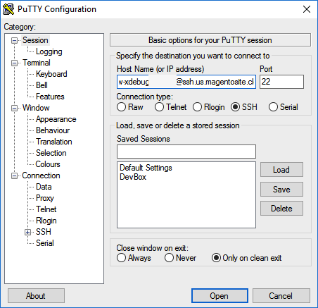
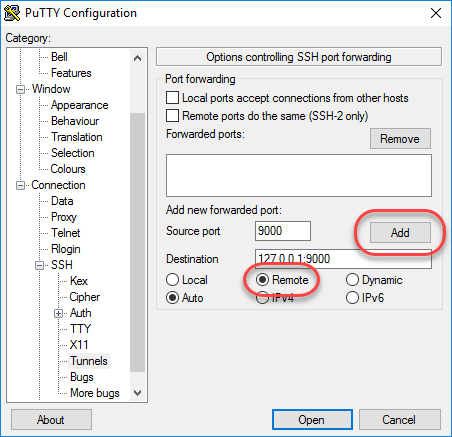
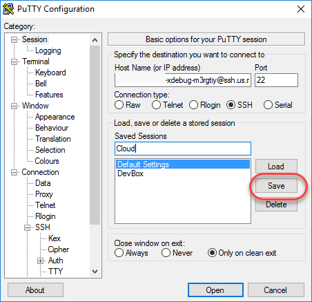
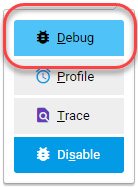
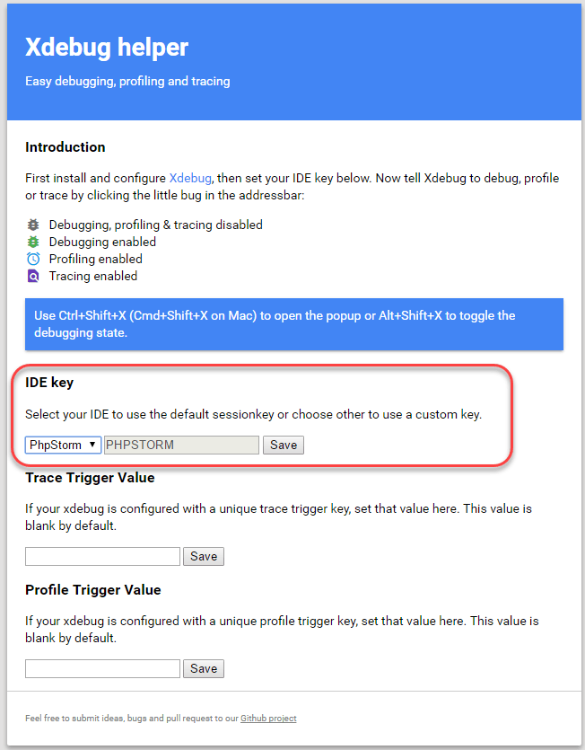

# Xdebugの設定

[!DNL Xdebug]は、PHPをデバッグするための拡張機能です。 お好みのIDEを使用できますが、次に、ローカル環境でデバッグするように[!DNL Xdebug]と[!DNL PhpStorm]を設定する方法について説明します。

>[!NOTE]
>
>Adobe Commerce on cloud インフラストラクチャプロジェクトの設定を変更せずに、ローカルデバッグ用にCloud Docker環境で実行するように[!DNL Xdebug]を設定できます。 「[Docker用Xdebugの設定](https://developer.adobe.com/commerce/cloud-tools/docker/test/configure-xdebug)」を参照してください。

[!DNL Xdebug]を有効にするには、Git リポジトリでファイルを設定し、IDEを設定し、ポート転送を設定する必要があります。 `magento.app.yaml` ファイルで設定を行うことができます。 編集後、すべてのStarter環境とPro統合環境でGitの変更をプッシュして、[!DNL Xdebug]を有効にします。 [!DNL Xdebug]は既にPro ステージングおよび実稼動環境で使用できます。

設定が完了したら、CLI コマンド、web リクエスト、およびコードをデバッグできます。 すべてのクラウドインフラストラクチャ環境は読み取り専用です。 コードをローカル開発環境に複製して、デバッグを実行します。 Pro ステージング環境と実稼動環境については、[!DNL Xdebug]の[追加の手順](#debug-for-pro-staging-and-production)を参照してください。

## 要件定義

[!DNL Xdebug]を実行して使用するには、環境のSSH URLが必要です。 [[!DNL Cloud Console]](../project/overview.md)または[!DNL Cloud Onboarding UI]を通じて情報を見つけることができます。

## Xdebugの設定

[!DNL Xdebug]を設定するには、次の手順に従います。

- [ファイル更新をプッシュするためのブランチでの作業](#get-started-with-a-branch)
- [環境の [!DNL Xdebug] を有効にする](#enable-xdebug-in-your-environment)
- [PHPStorm サーバーの設定](#configure-phpstorm-server)
- [ポート転送の設定](#set-up-port-forwarding)

### ブランチの基本を学ぶ

[!DNL Xdebug]を追加するには、[開発用ブランチ ](../dev-tools/cloud-cli-overview.md#create-an-environment-branch)で作業することをお勧めします。Adobeでは、を追加します。

### 環境でXdebugを有効にする

[!DNL Xdebug]は、すべてのStarter環境およびPro統合環境に対して直接有効にできます。 この設定手順は、Pro実稼動環境およびステージング環境では必要ありません。 プロステージングおよび実稼動用の[ デバッグ ](#debug-for-pro-staging-and-production)を参照してください。

>[!VIDEO](https://video.tv.adobe.com/v/3437407?learn=on)

プロジェクトで[!DNL Xdebug]を有効にするには、`.magento.app.yaml` ファイルの`runtime:extensions` セクションに`xdebug`を追加します。

**Xdebug**&#x200B;を有効にするには：

1. ローカル端末で、テキストエディターで`.magento.app.yaml` ファイルを開きます。

1. `runtime` セクションの`extensions`の下に`xdebug`を追加します。 例：

   ```yaml
   runtime:
       extensions:
           - redis
           - xsl
           - newrelic
           - sodium
           - xdebug
   ```

1. `.magento.app.yaml` ファイルに変更を保存し、テキストエディターを終了します。

1. 変更を追加、コミット、およびプッシュして、環境を再デプロイします。

   ```bash
   git add .magento.app.yaml
   ```

   ```bash
   git commit -m "add xdebug"
   ```

   ```bash
   git push origin <environment-ID>
   ```

スターター環境およびPro統合環境にデプロイすると、[!DNL Xdebug]が使用できるようになりました。 IDEの設定を続行します。 PhpStormについては、[PhpStormの設定](#configure-phpstorm)を参照してください。

### PhpStorm サーバーの設定

>[!VIDEO](https://video.tv.adobe.com/v/3437409?learn=on)

[PhpStorm](https://www.jetbrains.com/phpstorm/) IDEは、[!DNL Xdebug]で正しく動作するように設定する必要があります。

**Xdebug**&#x200B;で動作するようにPhpStormを設定するには：

1. PhpStorm プロジェクトで、**設定** パネルを開きます。

   - _macOS_ - **PhpStorm** > **Settings**&#x200B;を選択します。
   - _Windows/Linux_ - **ファイル** > **設定**&#x200B;を選択します。

1. _設定_ パネルで、**PHP** セクションを展開し、**サーバー**&#x200B;をクリックします。

1. **+**&#x200B;をクリックして、サーバー設定を追加します。 プロジェクト名は上部がグレーで表示されています。

1. [ オプション ]新しいサーバー設定に対して次の設定を行います。 _PHPStorm_ ドキュメントの「[ デバッグサーバーが構成されていません](https://www.jetbrains.com/help/phpstorm/troubleshooting-php-debugging.html#no-debug-server-is-configured)」を参照してください。

   - **名前** - ホスト名と同じ名前を入力します。 デバッグにCLIを使用するには、この値が[ デバッグ CLI コマンド ](#debug-cli-commands)の`PHP_IDE_CONFIG`変数の値と一致する必要があります。
   - **ホスト** - ホスト名を入力します。
   - **Port** - `443`と入力します。
   - **Debugger**- `Xdebug`を選択します。

1. **パスマッピングを使用**&#x200B;を選択します。 _ファイル/ディレクトリ_ ペインに、`serverName`のプロジェクトのルートが表示されます。

1. サーバー&#x200B;**列の**&#x200B;絶対パスで、**編集** アイコンをクリックし、環境に基づいて設定を追加します。

   - すべてのスターター環境とPro統合環境のリモートパスは`/app`です。
   - プロステージング環境および実稼動環境の場合：

      - 実稼動：`/app/<project_code>/`
      - ステージング：`/app/<project_code>_stg/`

1. [!DNL Xdebug] ポートを`9000,9003`に変更するか、**PHP** > **デバッグ** > **Xdebug** > **デバッグポート** パネルで`9000`に制限できます。

1. 「**適用**」をクリックします。

### PHPStorm実行/デバッグ設定の作成

これにより、Adobe Commerce アプリケーションからのリクエストを処理するための正しいデバッグ設定がアプリケーションで有効になります。

>[!VIDEO](https://video.tv.adobe.com/v/3437426?learn=on)

1. PHPStorm アプリケーションを開き、画面の右上にある&#x200B;**[!UICONTROL Add Configuration]**&#x200B;をクリックします。

1. **[!UICONTROL Add new run configuration]**&#x200B;をクリックします。

1. 「**[!UICONTROL PHP Remote Debug]**」オプションを選択します。

   - 一意だが認識可能な名前を入力してください。
   - 「[!UICONTROL Filter debug connection by IDE key]**」チェックボックスをオンにします。
   - [前のセクション ](#configure-phpstorm-server)で作成したサーバーを選択します。 まだ作成していない場合は、今すぐ作成できますが、セットアップガイドのその部分を参照してください。
   - **[!UICONTROL IDE key(session id)]** テキストフィールドに、`PHPSTORM`を大文字で入力します。 設定の他の部分でも使用するため、同じことを維持することが重要です。 別の文字列を選択した場合は、設定および設定プロセスの別の場所で使用することを忘れないでください。

1. **[!UICONTROL Apply]** > **[!UICONTROL OK]**&#x200B;をクリックします。

### ポート転送の設定

>[!VIDEO](https://video.tv.adobe.com/v/3437410?learn=on)

サーバーからの`XDEBUG`接続をローカルシステムにマッピングします。 あらゆる種類のデバッグを行うには、Adobe Commerce on cloud infrastructure サーバーからローカルマシンにポート 9000を転送する必要があります。 次のいずれかのセクションを参照してください。

- [MacまたはUNIXでのポート転送®](#port-forwarding-on-mac-or-unix)
- [Windowsでのポート転送](#port-forwarding-on-windows)

#### MacまたはUNIXでのポート転送®

**MacまたはUNIX®環境でポート転送を設定するには**:

1. ターミナルを開きます。

1. SSHを使用して接続を確立します。

   ```bash
   ssh -R 9000:localhost:9000 <ssh url>
   ```

   ソケットが転送中のポートに接続されるたびにターミナルに表示されるように、`-v` （詳細）オプションを使用します。

   「接続できません」または「リモートでポートをリッスンできませんでした」というエラーが表示された場合は、ポート 9000を占有しているサーバーに別のアクティブなSSH セッションが残っている可能性があります。 その接続が使用されていない場合は、終了できます。

**接続をトラブルシューティングするには**:

1. SSHを使用して、リモート統合環境、ステージング環境または実稼動環境にログインします。

1. SSH セッションのリストを表示：`who`

1. ユーザー別の既存のSSH セッションを表示します。 自分以外のユーザーに影響を与えないように注意してください。

   - 統合：ユーザー名は`dd2q5ct7mhgus`と似ています
   - ステージング：ユーザー名は`dd2q5ct7mhgus_stg`に似ています
   - 実稼動：ユーザー名は`dd2q5ct7mhgus`に似ています

1. 自分より古いユーザーセッションの場合は、`pts/0`などの擬似端末（PTS）値を見つけます。

1. PTS値に対応するプロセス ID （PID）をキルします。

   ```bash
   ps aux | grep ssh
   kill <PID>
   ```

   回答サンプル：

   ```
   dd2q5ct7mhgus        5504  0.0  0.0  82612  3664 ?      S    18:45   0:00 sshd: dd2q5ct7mhgus@pts/0
   ```

   接続を終了するには、プロセス ID （PID）でkill コマンドを入力します。

   ```bash
   kill 3664
   ```

#### Windowsでのポート転送

Windowsでポート転送（SSH トンネリング）を設定するには、Windows ターミナル アプリケーションを設定する必要があります。 この例では、[Putty](https://www.chiark.greenend.org.uk/~sgtatham/putty/latest.html)を使用してSSH トンネルを作成する手順を説明します。 Cygwinなどの他のアプリケーションを使用できます。 他のアプリケーションについて詳しくは、それらのアプリケーションに付属のベンダードキュメントを参照してください。

**Putty**&#x200B;を使用してWindowsでSSH トンネルを設定するには：

1. まだダウンロードしていない場合は、[Putty](https://www.chiark.greenend.org.uk/~sgtatham/putty/latest.html)をダウンロードしてください。

1. Puttyを開始します。

1. カテゴリ ウィンドウで、**セッション**&#x200B;をクリックします。

1. 次の情報を入力します。

   - **ホスト名（またはIP アドレス）** フィールド：Cloud サーバーの[SSH URL](../development/secure-connections.md#connect-to-a-remote-environment)を入力します
   - **Port** フィールド：`22`と入力します

   

1. _カテゴリ_ ペインで、**接続** > **SSH** > **トンネル**&#x200B;をクリックします。

1. 次の情報を入力します。

   - **Source port** フィールド：`9000`と入力します
   - **宛先** フィールド：`127.0.0.1:9000`と入力します
   - 「**リモート**」をクリック

1. 「**追加**」をクリックします。

   

1. _カテゴリー_ ペインで、**セッション**&#x200B;をクリックします。

1. 「**保存済みセッション**」フィールドに、このSSH トンネルの名前を入力します。

1. **保存**&#x200B;をクリックします。

   

1. SSH トンネルをテストするには、**Load**&#x200B;をクリックし、**Open**&#x200B;をクリックします。

   「接続できません」というエラーが表示された場合は、次の点を確認します。

   - Puttyの設定はすべて正しい
   - クラウド インフラストラクチャ上のプライベート Adobe CommerceのSSH キーが配置されているコンピューターでPuttyを実行しています

## Xdebug環境へのSSH アクセス

デバッグを開始したり、設定を実行したりするには、環境にアクセスするためのSSH コマンドが必要です。 この情報は、[[!DNL Cloud Console]](../development/secure-connections.md#use-an-ssh-command)とプロジェクト スプレッドシートから入手できます。

スターター環境とPro統合環境では、次の`magento-cloud` CLI コマンドを使用して、これらの環境にSSHで接続できます。

```bash
magento-cloud environment:ssh --pipe -e <environment-ID>
```

[!DNL Xdebug]を使用するには、次のように環境にSSHで接続します。

```bash
ssh -R <xdebug listen port>:<host>:<xdebug listen port> <SSH-URL>
```

以下に例を挙げます。

```bash
ssh -R 9000:localhost:9000 pwga8A0bhuk7o-mybranch@ssh.us.magentosite.cloud
```

## Pro ステージングおよび実稼動用のデバッグ

>[!NOTE]
>
>Pro ステージングおよび実稼動環境では、[!DNL Xdebug]は常に使用できます。これらの環境には[!DNL Xdebug]の特別な設定が設定されているからです。 通常のweb リクエストはすべて、[!DNL Xdebug]を持たない専用のPHP プロセスにルーティングされます。 したがって、これらの要求は正常に処理され、[!DNL Xdebug]が読み込まれたときにパフォーマンスの低下の影響を受けません。 [!DNL Xdebug] キーを持つweb リクエストが送信されると、[!DNL Xdebug]が読み込まれた別のPHP プロセスにルーティングされます。

プロプランのステージング環境と実稼動環境で[!DNL Xdebug]を使用するには、アクセス権を持つユーザーのみがアクセスできる個別のSSH トンネルとweb セッションを作成します。 この使用方法は、一般的なアクセスとは異なり、すべてのユーザーではなく、ユーザーにアクセス権を提供するだけです。

次のものが必要です。

- 環境にアクセスするためのSSH コマンド。 この情報は、[[!DNL Cloud Console]](../project/overview.md)または[!DNL Cloud Onboarding UI]から入手できます。
- ステージング環境とPro環境の設定時に設定された`xdebug_key`値。

  `xdebug_key`は、SSHを使用してプライマリノードにログインし、次を実行することで見つけることができます。

  ```bash
  cat /etc/platform/*/nginx.conf | grep xdebug.sock | head -n1
  ```

**ステージング環境または実稼動環境へのSSH トンネルを設定するには**:

1. ターミナルを開きます。

1. クラスターの各web ノードのすべてのSSH セッションをクリーンアップします。

   ```bash
   ssh USERNAME@CLUSTER.ent.magento.cloud 'rm /run/platform/USERNAME/xdebug.sock'
   ```

1. クラスターの各web ノードに対して、Xdebug用のSSH トンネルを設定します。

   ```bash
   ssh -R /run/platform/USERNAME/xdebug.sock:localhost:9000 -N USERNAME@CLUSTER.ent.magento.cloud
   ```

>[!NOTE]
>
>`USERNAME@CLUSTER.ent.magento.cloud`の正しい値を取得するには：
>- 方法1: magento-cloud CLI: `magento-cloud ssh --all`
>- 方法2: Commerce コンソール：https://CONSOLE-URL/ENVIRONMENTで、「`SSH v`」ドロップダウンをクリックします

**環境URL**&#x200B;を使用してデバッグを開始するには：

これは、使用される設定のデモと、リモートデバッグセッションを開始するためのGET パラメーターのデモです。

>[!VIDEO](https://video.tv.adobe.com/v/3437417?learn=on)

1. リモートデバッグを有効にします。ブラウザーでサイトにアクセスし、`KEY`が`xdebug_key`の値であるURLに次を追加します。

   ```http
   ?XDEBUG_SESSION_START=KEY
   ```

   この手順では、ブラウザーのリクエストをトリガー [!DNL Xdebug]に送信するCookieを設定します。

1. [!DNL Xdebug]でデバッグを完了してください。

1. セッションを終了する準備ができたら、次のコマンドを使用してCookieを削除し、`KEY`が`xdebug_key`の値であるブラウザーを介してデバッグを終了します。

   ```http
   ?XDEBUG_SESSION_STOP=KEY
   ```

   >[!NOTE]
   >
   >`POST`要求によって渡された`XDEBUG_SESSION_START`はサポートされていません。

## Debug CLI コマンド

この節では、CLI コマンドのデバッグについて説明します。

CLI コマンドをデバッグするには：

1. CLI コマンドを使用して、デバッグするサーバーにSSHで接続します。

1. 次の環境変数を作成します。

   ```bash
   export XDEBUG_CONFIG='PHPSTORM'
   ```

   ```bash
   export PHP_IDE_CONFIG="serverName=<name of the server that is configured in PHPSTORM>"
   ```

   これらの変数は、SSH セッションの終了時に削除されます。

1. デバッグを開始

   スターター環境とPro統合環境では、CLI コマンドを実行してデバッグします。
ランタイムオプションを追加できます。例：

   ```bash
   php -d xdebug.profiler_enable=On -d xdebug.max_nesting_level=9999 bin/magento cache:clean
   ```

   Pro ステージング環境および実稼動環境では、CLI コマンドをデバッグする際に、[!DNL Xdebug] PHP設定ファイルへのパスを指定する必要があります。例：

   ```bash
   php -c /etc/platform/USERNAME/php.xdebug.ini bin/magento cache:clean
   ```

## Web リクエストのデバッグ

次の手順は、web リクエストのデバッグに役立ちます。

1. _拡張機能_ メニューで、**デバッグ**&#x200B;をクリックして有効にします。

1. 右クリックしてオプションメニューを選択し、IDE キーを&#x200B;**PHPSTORM**&#x200B;に設定します。

1. ブラウザーに[!DNL Xdebug] クライアントをインストールします。 設定して有効にします。

### 例：Chromeの設定

この節では、[!DNL Xdebug] Helper拡張機能を使用してChromeで[!DNL Xdebug]を使用する方法について説明します。 他のブラウザーの[!DNL Xdebug] ツールについて詳しくは、ブラウザーのドキュメントを参照してください。

**ChromeでXdebug Helperを使用するには**:

1. クラウド サーバーに[SSH トンネル ](#ssh-access-to-xdebug-environments)を作成します。

1. Chrome ストアから[Xdebug Helper拡張機能](https://chromewebstore.google.com/detail/eadndfjplgieldjbigjakmdgkmoaaaoc)をインストールします。

1. 次の図に示すように、Chromeで拡張機能を有効にします。

   

1. Chromeで、Chrome ツールバーの緑色のヘルパーアイコンを右クリックします。

1. ポップアップメニューから、**オプション**&#x200B;をクリックします。

1. _IDE キー_ リストから、**PhpStorm**&#x200B;をクリックします。

1. **保存**&#x200B;をクリックします。

   

1. PhpStorm プロジェクトを開きます。

1. 上部のナビゲーションバーで、**リスニングを開始** アイコンをクリックします。

   ナビゲーションバーが表示されない場合は、**表示**/**ナビゲーションバー**&#x200B;をクリックします。

1. PhpStorm ナビゲーションパネルで、テストするPHP ファイルをダブルクリックします。

## ローカルコードのデバッグ

読み取り専用環境のため、デバッグを実行するには、環境または特定のGit ブランチからローカル ワークステーションにコードをプルする必要があります。

選ぶ方法はあなた次第です。 次のオプションがあります。

- Gitからコードをチェックアウトして、`composer install`を実行します

  このメソッドは、`composer.json`さんがアクセス権のないプライベートリポジトリ内のパッケージを参照しない限り機能します。 このメソッドは、Adobe Commerce コードベース全体を取得します。

- `vendor`、`app`、`pub`、`lib`、および`setup` ディレクトリをコピーします

  この方法では、テスト可能なすべてのコードが得られます。 静的なアセットの数によっては、大量のファイルを含む転送が長くなる可能性があります。

- `vendor` ディレクトリのみをコピー

  ほとんどのコードは`vendor` ディレクトリにあるので、このメソッドはコードベース全体をテストしているわけではありませんが、適切なテストを行う可能性が高くなります。

**ファイルを圧縮してローカル コンピューターにコピーするには**:

1. SSHを使用してリモート環境にログインします。

1. ファイルを圧縮します。

   ```bash
   tar -czf /tmp/<file-name>.tgz <directory list>
   ```

   例えば、`vendor` ディレクトリのみを圧縮するには、次の手順を実行します。

   ```bash
   tar -czf /tmp/vendor.tgz vendor
   ```

1. ローカル環境で、PhpStormを使用してファイルを圧縮します。

   ```bash
   cd <phpstorm project root dir>
   ```

   ```bash
   rsync <SSH-URL>:/tmp/<file-name>.tgz .
   ```

   ```bash
   tar xzf <file-name>.tgz
   ```
