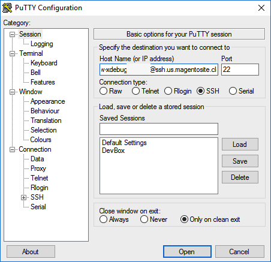

# Xdebug の設定

[!DNL Xdebug] は PHP をデバッグするための拡張モジュールです。 任意の IDE を使用できますが、ローカル環境で [!DNL Xdebug] を設定してデバッグを行う方法につ [!DNL PhpStorm] ては、以下で説明します。

>[!NOTE]
>
>ローカルデバッグ用に [!DNL Xdebug] を Cloud Docker 環境で実行するように設定できます。その際、クラウドインフラストラクチャプロジェクト設定のAdobe Commerceを変更する必要はありません。 [Docker の Xdebug の設定 &#x200B;](https://developer.adobe.com/commerce/cloud-tools/docker/test/configure-xdebug/) を参照してください。

[!DNL Xdebug] を有効にするには、Git リポジトリにファイルを設定し、IDE を設定し、ポート転送を設定する必要があります。 一部の設定は `magento.app.yaml` ファイルで指定できます。 編集後、すべてのスターター環境と Pro 統合環境にわたって Git の変更をプッシュして、[!DNL Xdebug] を有効にします。 [!DNL Xdebug] は、既にステージング環境および実稼動環境で使用できます。

設定が完了すると、CLI コマンド、Web リクエストおよびコードをデバッグできるようになります。 すべてのクラウドインフラストラクチャ環境は読み取り専用であることに注意してください。 デバッグを実行するために、ローカル開発環境にコードを複製します。 ステージング環境および実稼動環境については、[!DNL Xdebug] しくは [&#x200B; 追加手順 &#x200B;](#debug-for-pro-staging-and-production) を参照してください。

## 要件

[!DNL Xdebug] を実行して使用するには、環境用の SSH URL が必要です。 [[!DNL Cloud Console]](../project/overview.md) または [!DNL Cloud Onboarding UI] を通じて情報を見つけることができます。

## Xdebug の設定

[!DNL Xdebug] を設定するには、次の手順に従います。

- [ブランチでの作業によるファイル更新のプッシュ](#get-started-with-a-branch)
- [環境  [!DNL Xdebug]  有効化](#enable-xdebug-in-your-environment)
- [PHPStorm サーバーの構成](#configure-phpstorm-server)
- [ポート転送の設定](#set-up-port-forwarding)

### ブランチの基本を学ぶ

さらに [!DNL Xdebug] しくは、Adobeでは [&#x200B; 開発ブランチ &#x200B;](../dev-tools/cloud-cli-overview.md#create-an-environment-branch) で作業することをお勧めします。

### お使いの環境で Xdebug を有効にする

[!DNL Xdebug] を有効にすると、すべてのスターター環境と Pro 統合環境に直接適用できます。 この設定手順は、実稼動環境とステージング環境には必要ありません。 [&#x200B; ステージング環境および実稼動環境でのデバッグ &#x200B;](#debug-for-pro-staging-and-production) を参照してください。

>[!VIDEO](https://video.tv.adobe.com/v/3437407?learn=on)

プロジェクトで [!DNL Xdebug] を有効にするには、`.magento.app.yaml` ファイルの `runtime:extensions` セクションに `xdebug` を追加します。

**Xdebug を有効にするには**:

1. ローカルターミナルで、`.magento.app.yaml` ファイルをテキストエディターで開きます。

1. `runtime` セクションの `extensions` で、`xdebug` を追加します。 例：

   ```yaml
   runtime:
       extensions:
           - redis
           - xsl
           - newrelic
           - sodium
           - xdebug
   ```

1. 変更内容を `.magento.app.yaml` ファイルに保存し、テキストエディターを終了します。

1. 変更を追加、コミットおよびプッシュして、環境を再デプロイします。

   ```bash
   git add .magento.app.yaml
   ```

   ```bash
   git commit -m "add xdebug"
   ```

   ```bash
   git push origin <environment-ID>
   ```

スターター環境と Pro 統合環境にデプロイすると、[!DNL Xdebug] が使用できるようになりました。 IDE の設定を続行します。 PhpStorm については、[PhpStorm の設定 &#x200B;](#configure-phpstorm) を参照してください。

### PhpStorm サーバーの設定

>[!VIDEO](https://video.tv.adobe.com/v/3437409?learn=on)

[PhpStorm](https://www.jetbrains.com/phpstorm/) IDE は、[!DNL Xdebug] で正しく動作するように設定する必要があります。

**Xdebug と連携するように PhpStorm を設定するには**:

1. PhpStorm プロジェクトで、**設定** パネルを開きます。

   - _macOS_ - **PhpStorm**/**設定** を選択します。
   - _Windows/Linux_ - **ファイル**/**設定** を選択します。

1. _設定_ パネルで「**PHP**」セクションを展開し、「**サーバー**」をクリックします。

1. **+** をクリックして、サーバー設定を追加します。 プロジェクト名は、上部がグレーで表示されます。

1. [ オプション ] 新しいサーバー設定に対して次の設定を行います。 _PHPStorm_ ドキュメントの [&#x200B; デバッグサーバーが設定されていません &#x200B;](https://www.jetbrains.com/help/phpstorm/troubleshooting-php-debugging.html#no-debug-server-is-configured) を参照してください。

   - **名前** - ホスト名と同じ名前を入力します。 デバッグに CLI を使用するには、この値が [Debug CLI コマンド &#x200B;](#debug-cli-commands) の `PHP_IDE_CONFIG` 変数の値と一致する必要があります。
   - **ホスト** - ホスト名を入力します。
   - **ポート** - `443` と入力します。
   - **デバッガー** - 「`Xdebug`」を選択します。

1. **パスマッピングを使用** を選択します。 _ファイル/ディレクトリ_ ペインに、`serverName` のプロジェクトのルートが表示されます。

1. **サーバー上の絶対パス** 列で **編集** アイコンをクリックし、環境に基づいて設定を追加します。

   - すべてのスターター環境および Pro 統合環境では、リモートパスは `/app` です。
   - ステージング環境および実稼動環境の場合：

      - 実稼動：`/app/<project_code>/`
      - ステージング：`/app/<project_code>_stg/`

1. [!DNL Xdebug] ポートを `9000,9003` に変更するか、**PHP**/**Debug**/**Xdebug**/**Debug Port** パネルでポートを `9000` のみに制限できます。

1. **適用** をクリックします。

### PHPStorm Run/Debug 設定の作成

これにより、Adobe Commerce アプリケーションからのリクエストを処理するための適切なデバッグ設定をアプリケーションに指定できます。

>[!VIDEO](https://video.tv.adobe.com/v/3437426?learn=on)

1. PHPStorm アプリケーションを開き、画面の右上にある **[!UICONTROL Add Configuration]** をクリックします。

1. 「**[!UICONTROL Add new run configuration]**」をクリックします。

1. **[!UICONTROL PHP Remote Debug]** オプションを選択します。

   - 識別できる一意の名前を入力してください。
   - 「[!UICONTROL Filter debug connection by IDE key]**」チェックボックスをオンにします。
   - [&#x200B; 前の節 &#x200B;](#configure-phpstorm-server) で作成したサーバーを選択します。 まだ作成していない場合は、ここで作成できますが、設定ガイドのその部分を参照してください。
   - 「**[!UICONTROL IDE key(session id)]**」テキストフィールドに、大文字で `PHPSTORM` と入力します。 これは設定の他の部分で使用するので、同じにしておくことが重要です。 別の文字列を選択する場合は、設定および設定プロセスの他の場所でも使用する必要があります。

1. **[!UICONTROL Apply]**/**[!UICONTROL OK]** をクリックします。

### ポート転送の設定

>[!VIDEO](https://video.tv.adobe.com/v/3437410?learn=on)

サーバーの `XDEBUG` 接続をローカルシステムにマッピングします。 あらゆる種類のデバッグを行うには、Cloud Infrastructure Server 上のAdobe Commerceからローカルマシンにポート 9000 を転送する必要があります。 以下のセクションの 1 つを参照してください。

- [Macまたは UNIX のポート転送](#port-forwarding-on-mac-or-unix)
- [Windows でのポート転送](#port-forwarding-on-windows)

#### Macまたは UNIX のポート転送®

**Macまたは UNIX® 環境でポート転送を設定するには**:

1. ターミナルを開きます。

1. SSH を使用して接続を確立します。

   ```bash
   ssh -R 9000:localhost:9000 <ssh url>
   ```

   `-v` （verbose） オプションを使用すると、転送中のポートにソケットが接続されるたびに、端末に表示されるようになります。

   「接続できません」または「リモートのポートをリッスンできませんでした」というエラーが表示される場合は、ポート 9000 を占有しているサーバー上に、別のアクティブな SSH セッションが存在している可能性があります。 その接続が使用されていない場合は、終了できます。

**接続のトラブルシューティングをおこなうには**:

1. SSH を使用して、リモート統合、ステージング、または実稼動環境にログインします。

1. SSH セッションのリストを表示します：`who`

1. ユーザー別の既存の SSH セッションを表示します。 自分以外のユーザーに影響を与えないように注意してください。

   - 統合：ユーザー名は `dd2q5ct7mhgus` に似ています
   - ステージング：ユーザー名は `dd2q5ct7mhgus_stg` に似ています
   - 実稼働：ユーザー名は `dd2q5ct7mhgus` に似ています

1. ユーザーセッションが古い場合、`pts/0` などの擬似端末（PTS）値を見つけます。

1. PTS 値に対応するプロセス ID （PID）を強制終了します。

   ```bash
   ps aux | grep ssh
   kill <PID>
   ```

   応答の例：

   ```
   dd2q5ct7mhgus        5504  0.0  0.0  82612  3664 ?      S    18:45   0:00 sshd: dd2q5ct7mhgus@pts/0
   ```

   接続を終了するには、プロセス ID （PID）を指定して kill コマンドを入力します。

   ```bash
   kill 3664
   ```

#### Windows でのポート転送

Windows にポート転送（SSH トンネリング）をセットアップするには、Windows ターミナル アプリケーションを構成する必要があります。 この例では、[Putty](https://www.chiark.greenend.org.uk/~sgtatham/putty/latest.html) を使用して SSH トンネルを作成する手順を説明します。 Cygwin などの他のアプリケーションを使用できます。 その他のアプリケーションについて詳しくは、それらのアプリケーションに付属するベンダードキュメントを参照してください。

**Putty を使用して Windows に SSH トンネルをセットアップするには**:

1. まだ行っていない場合は、[Putty](https://www.chiark.greenend.org.uk/~sgtatham/putty/latest.html) をダウンロードしてください。

1. パテを起動します。

1. カテゴリ ウィンドウで、[**セッション**] をクリックします。

1. 次の情報を入力します。

   - **ホスト名（または IP アドレス）** フィールド：クラウドサーバーの [SSH URL](../development/secure-connections.md#connect-to-a-remote-environment) を入力します
   - **ポート** フィールド：`22` を入力します

   

1. _カテゴリ_ パネルで、**接続**/**SSH**/**トンネル** をクリックします。

1. 次の情報を入力します。

   - **Source ポート** フィールド：`9000` を入力
   - **宛先** フィールド：`127.0.0.1:9000` を入力します
   - **リモート** をクリックします

1. **追加** をクリックします。

   

1. _カテゴリ_ ウィンドウで、「**セッション**」をクリックします。

1. 「**Saved Sessions**」フィールドに、この SSH トンネルの名前を入力します。

1. **保存** をクリックします。

   

1. SSH トンネルをテストするには、**Load** をクリックし、**Open** をクリックします。

   「接続できません」というエラーが表示される場合は、次の点を確認してください。

   - Putty の設定はすべて正しい
   - クラウドインフラストラクチャ上のプライベートAdobe Commerceの SSH キーがあるマシンで Putty を実行しています

## Xdebug 環境への SSH アクセス

デバッグの開始やセットアップの実行などを行うには、環境にアクセスするための SSH コマンドが必要です。 この情報は、[[!DNL Cloud Console]](../development/secure-connections.md#use-an-ssh-command) とプロジェクトのスプレッドシートから取得できます。

スターター環境と Pro 統合環境の場合は、次の `magento-cloud` CLI コマンドを使用して、これらの環境に SSH で接続できます。

```bash
magento-cloud environment:ssh --pipe -e <environment-ID>
```

[!DNL Xdebug] を使用するには、次のように環境に SSH で接続します。

```bash
ssh -R <xdebug listen port>:<host>:<xdebug listen port> <SSH-URL>
```

以下に例を挙げます。

```bash
ssh -R 9000:localhost:9000 pwga8A0bhuk7o-mybranch@ssh.us.magentosite.cloud
```

## ステージング環境および実稼動環境用のデバッグ

>[!NOTE]
>
>プロのステージング環境および実稼動環境では、[!DNL Xdebug] れらの環境には [!DNL Xdebug] 用の特別な設定があるので、いつでも使用できます。 通常の Web リクエストはすべて、[!DNL Xdebug] を持たない専用の PHP プロセスにルーティングされます。 したがって、これらのリクエストは正常に処理され、[!DNL Xdebug] ータの読み込み時にパフォーマンス低下の影響を受けません。 [!DNL Xdebug] キーを持つ Web リクエストが送信されると、別の読み込まれた PHP プロセスにルーティングさ [!DNL Xdebug] ます。

特に Pro プランのステージング環境および実稼動環境で [!DNL Xdebug] を使用するには、自身だけがアクセスできる個別の SSH トンネルと Web セッションを作成します。 この使用方法は、通常のアクセス方法とは異なり、すべてのユーザーではなく、ユーザーにアクセス権を提供するだけです。

以下が必要です。

- 環境にアクセスするための SSH コマンド。 この情報は、[[!DNL Cloud Console]](../project/overview.md) または [!DNL Cloud Onboarding UI] から取得できます。
- ステージング環境と Pro 環境を設定する際に設定される `xdebug_key` 値。

  `xdebug_key` は、SSH を使用してプライマリノードにログインし、次のコマンドを実行することで確認できます。

  ```bash
  cat /etc/platform/*/nginx.conf | grep xdebug.sock | head -n1
  ```

**ステージング環境または実稼動環境への SSH トンネルを設定するには**:

1. ターミナルを開きます。

1. クラスターの各 web ノードに対するすべての SSH セッションをクリーンアップします。

   ```bash
   ssh USERNAME@CLUSTER.ent.magento.cloud 'rm /run/platform/USERNAME/xdebug.sock'
   ```

1. クラスターの各 web ノードに対して、Xdebug 用の SSH トンネルを設定します。

   ```bash
   ssh -R /run/platform/USERNAME/xdebug.sock:localhost:9000 -N USERNAME@CLUSTER.ent.magento.cloud
   ```

>[!NOTE]
>
>`USERNAME@CLUSTER.ent.magento.cloud` の正しい値を取得するには：
>- 方法 1:magento-cloud CLI:`magento-cloud ssh --all`
>- 方法 2:Commerce コンソール：https://CONSOLE-URL/ENVIRONMENTで、「`SSH v`」ドロップダウンをクリックします。

**環境 URL を使用したデバッグを開始するには**:

これは、使用される設定のデモであり、リモートデバッグセッションを開始するためのGETパラメーターのデモです。

>[!VIDEO](https://video.tv.adobe.com/v/3437417?learn=on)

1. リモートデバッグを有効にします。ブラウザーでサイトにアクセスし、URL に次の `KEY` を追加します（`xdebug_key` の値）。

   ```http
   ?XDEBUG_SESSION_START=KEY
   ```

   この手順では、ブラウザーリクエストをトリガー[!DNL Xdebug] に送信する Cookie を設定します。

1. [!DNL Xdebug] を使用してデバッグを完了します。

1. セッションを終了する準備が整ったら、次のコマンドを使用して cookie を削除し、ブラウザーでのデバッグを終了します。`KEY` は `xdebug_key` の値です。

   ```http
   ?XDEBUG_SESSION_STOP=KEY
   ```

   >[!NOTE]
   >
   >`POST` 要求によって渡された `XDEBUG_SESSION_START` はサポートされていません。

## Debug CLI コマンド

このセクションでは、CLI コマンドのデバッグについて説明します。

CLI コマンドをデバッグするには：

1. CLI コマンドを使用して、デバッグ対象のサーバに SSH で接続します。

1. 次の環境変数を作成します。

   ```bash
   export XDEBUG_CONFIG='PHPSTORM'
   ```

   ```bash
   export PHP_IDE_CONFIG="serverName=<name of the server that is configured in PHPSTORM>"
   ```

   これらの変数は、SSH セッションが終了すると削除されます。

1. デバッグの開始

   スターター環境と Pro 統合環境では、CLI コマンドを実行してデバッグします。
次のような実行時オプションを追加できます。

   ```bash
   php -d xdebug.profiler_enable=On -d xdebug.max_nesting_level=9999 bin/magento cache:clean
   ```

   ステージング環境および実稼動環境では、CLI コマンドのデバッグ時に [!DNL Xdebug] PHP 設定ファイルへのパスを指定する必要があります。次に例を示します。

   ```bash
   php -c /etc/platform/USERNAME/php.xdebug.ini bin/magento cache:clean
   ```

## Web リクエストのデバッグ

次の手順は、web リクエストのデバッグに役立ちます。

1. _拡張機能_ メニューで **デバッグ** をクリックして有効にします。

1. 右クリックしてオプションメニューを選択し、IDE キーを **PHPSTORM** に設定します。

1. ブラウザーに [!DNL Xdebug] クライアントをインストールします。 を設定して有効にします。

### 例：Chromeの設定

この節では、[!DNL Xdebug] Helper 拡張機能を使用してChromeで [!DNL Xdebug] を使用する方法について説明します。 他のブラウザー用の [!DNL Xdebug] ツールについて詳しくは、ブラウザーのドキュメントを参照してください。

**Chromeで Xdebug Helper を使用するには**:

1. クラウドサーバーへの [SSH トンネル &#x200B;](#ssh-access-to-xdebug-environments) を作成します。

1. Chrome ストアから [Xdebug Helper 拡張機能 &#x200B;](https://chromewebstore.google.com/detail/eadndfjplgieldjbigjakmdgkmoaaaoc) をインストールします。

1. 次の図に示すように、Chromeで拡張機能を有効にします。

   

1. Chromeで、Chrome ツールバーの緑のヘルパーアイコンを右クリックします。

1. ポップアップメニューで、「**オプション**」をクリックします。

1. _IDE キー_ リストから、「**PhpStorm**」をクリックします。

1. **保存** をクリックします。

   

1. PhpStorm プロジェクトを開きます。

1. 上部のナビゲーションバーで、「**リスニングを開始** アイコンをクリックします。

   ナビゲーションバーが表示されない場合は、**表示** > **ナビゲーションバー** をクリックします。

1. PhpStorm のナビゲーションペインで、テストする PHP ファイルをダブルクリックします。

## ローカルコードをデバッグ

読み取り専用環境なので、デバッグを実行するには、環境または特定の Git ブランチからローカルワークステーションにコードをプルする必要があります。

その方法は君次第だ。 以下のオプションがあります。

- Git からコードをチェックアウトして実行 `composer install`

  この方法は、アクセス権 `composer.json` ないプライベートリポジトリ内のパッケージを参照しない限り、機能しません。 このメソッドは、Adobe Commerce コードベース全体を取得します。

- `vendor`、`app`、`pub`、`lib` および `setup` ディレクトリをコピーします

  この方法を使用すると、テスト可能なすべてのコードを入手できます。 保有する静的アセットの数に応じて、大量のファイルを含む長い転送が必要になる場合があります。

- `vendor` ディレクトリのみをコピーします

  コードのほとんどは `vendor` ディレクトリにあるので、このメソッドはコードベース全体をテストしているわけではありませんが、適切なテストを行う可能性が高くなります。

**ファイルを圧縮してローカルマシンにコピーするには**:

1. SSH を使用してリモート環境にログインします。

1. ファイルを圧縮します。

   ```bash
   tar -czf /tmp/<file-name>.tgz <directory list>
   ```

   例えば、`vendor` ディレクトリのみを圧縮するには、次のようにします。

   ```bash
   tar -czf /tmp/vendor.tgz vendor
   ```

1. ローカル環境では、PhpStorm を使用してファイルを圧縮します。

   ```bash
   cd <phpstorm project root dir>
   ```

   ```bash
   rsync <SSH-URL>:/tmp/<file-name>.tgz .
   ```

   ```bash
   tar xzf <file-name>.tgz
   ```
